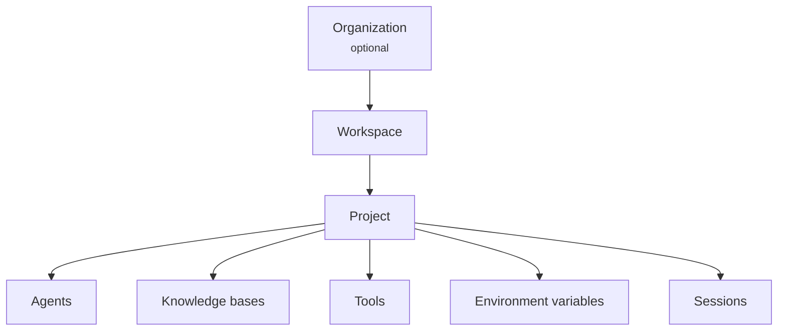

# Workspace & Team Management

Your workspace is the central hub for managing agents, team members, AI models, and billing within the Agent Platform 2.0. Every resource you create lives inside a workspace, and every team member you invite joins through one. This page covers workspace structure, team management, and multi-workspace organizations.

## Workspace Overview

### Resource hierarchy

The Agent Platform 2.0 organizes resources in a three-level hierarchy:

**Workspace** is the primary unit of tenancy. It contains your team, AI model configurations, secrets, connectors, guardrails, and analytics data. Think of it as your team's dedicated environment within the platform.

Key characteristics:

- **Isolated by default** -- Data in one workspace is never accessible from another workspace.
- **Owns LLM policies** -- Token budgets, allowed providers, and rate limits are set at the workspace level.
- **Manages team access** -- Members are invited to and managed within a workspace.
- **Controls feature availability** -- Your workspace's plan tier determines which features are accessible.

**Project** groups related agents and their supporting resources (knowledge bases, tools, environment variables) for a specific use case. A workspace can contain many projects.

- Each project inherits the workspace's AI model configuration but can override model tier assignments.
- Project members are a subset of workspace members, with project-specific roles.
- Environment variables and secrets can be scoped to individual projects and environments (development, staging, production).

### Role hierarchy

The Agent Platform 2.0 uses a hierarchical role-based access control (RBAC) system. Each role inherits all permissions from the roles below it.

Canonical engineering detail for role behavior lives in `docs/features/workspace-sharing.md` (workspace roles) and `docs/features/custom-project-roles.md` (project and custom roles). The tables below summarize the current product behavior.

#### Workspace roles

| Role         | Description                                               | Key permissions                                                                         |
| ------------ | --------------------------------------------------------- | --------------------------------------------------------------------------------------- |
| **Owner**    | Full control over the workspace. One owner per workspace. | Transfer ownership, delete workspace, manage billing, all admin operations              |
| **Admin**    | Manages team members, models, and workspace settings.     | Invite/remove members, configure models, manage secrets and connectors, view audit logs |
| **Operator** | Manages agent deployments and monitors production.        | Deploy agents, view analytics, manage environment variables, view sessions              |
| **Member**   | Builds and tests agents within assigned projects.         | Create/edit agents, run tests, manage project-level resources                           |
| **Viewer**   | Read-only access to workspace resources.                  | View agents, view project configurations, view analytics dashboards                     |

#### Project roles

Projects have their own role assignments that further restrict or specialize access within the project:

| Role          | Description                                                              |
| ------------- | ------------------------------------------------------------------------ |
| **Admin**     | Full control over the project's resources and settings                   |
| **Developer** | Create and modify agents, tools, workflows, and other project assets     |
| **Tester**    | Read project resources, run simulations/evaluations, and verify behavior |
| **Viewer**    | Read-only access to the project                                          |

> **Note:** Workspace Owners and Admins have workspace-wide authority and do not need explicit project membership to administer all projects. Non-admin workspace members need explicit project membership for project-scoped access.

> **Project ownership:** When a workspace member creates a project, they become that project's owner. Project owners can add existing workspace members to the project from **Settings > Members** even if they are not workspace admins.

#### Custom roles

Workspace Owners and Admins can define tenant-scoped custom role definitions with specific permission sets. Manage them from **Settings > Team > Custom Roles**. These definitions feed the project-level custom role model described in `docs/features/custom-project-roles.md`.

### Feature gating and plan tiers

Not all workspace features are available on every plan. The Agent Platform 2.0 offers tiered plans that unlock progressively more capabilities:

| Feature                  | Starter | Professional  | Enterprise    |
| ------------------------ | ------- | ------------- | ------------- |
| Core agent builder       | Yes     | Yes           | Yes           |
| Team members             | Up to 5 | Up to 25      | Unlimited     |
| Projects                 | Up to 3 | Up to 20      | Unlimited     |
| LLM providers            | 2       | All supported | All supported |
| Environment variables    | Yes     | Yes           | Yes           |
| Connectors               | --      | Yes           | Yes           |
| Advanced analytics       | --      | Yes           | Yes           |
| KMS (Bring Your Own Key) | --      | --            | Yes           |
| SSO (SAML/OIDC)          | --      | --            | Yes           |
| Audit log export         | --      | Yes           | Yes           |
| Workspace guardrails     | --      | Yes           | Yes           |

Features not available on your current plan appear greyed out in the Studio sidebar with an "Upgrade to unlock" tooltip. Contact your account team or visit **Settings > Billing** to explore plan options.

### Navigating workspace settings

Access workspace administration through the **Settings** icon in the Studio sidebar. The admin panel is organized into four sections:

- **Team** -- Members, security, KMS, environment variables
- **AI configuration** -- LLM providers, Architect settings, voice services, guardrails
- **Analytics** -- Agent performance, session explorer, trace viewer
- **Account** -- Secrets, billing and usage, connectors

> **Tip:** Bookmark the admin panel pages you visit frequently. Each admin page has a stable URL you can share with other admins on your team.

> **Access note:** Only workspace Owners and Admins see workspace administration pages in Studio. Operators, Members, and Viewers collaborate through project-level settings instead.

## Team Management

Manage who has access to your workspace by inviting team members, assigning roles, and controlling permissions. Only workspace Owners and Admins can manage team membership.

### Viewing current members

Navigate to **Settings > Team > Members** to see all current workspace members. The members list shows:

- **Name and email** -- The member's display name and login email
- **Role** -- Their current workspace role (Owner, Admin, Operator, Member, or Viewer)
- **Status** -- Whether the member is active, suspended, locked, or deactivated
- **Joined date** -- When the member accepted their invitation

Use the search bar to filter members by name or email.

### Inviting members

To invite a new team member:

1. Go to **Settings > Team > Members**.
2. Click **Invite member**.
3. Enter the invitee's email address.
4. Select a role from the dropdown (Admin, Operator, Member, or Viewer).
5. Click **Send invitation**.

The invitee receives an email with a unique invitation link. The invitation includes the workspace name, assigned role, and a link to accept and join.

#### Invitation expiry

Invitations expire automatically after 7 days. If an invitation expires before the recipient accepts it:

- The expired invitation is cleaned up automatically.
- You can resend a new invitation from the pending invitations list.

#### Pending invitations

The members page shows a separate section for pending invitations. From here you can:

- **Resend** -- Send a fresh invitation email (generates a new token and resets the expiry).
- **Revoke** -- Cancel a pending invitation so the link can no longer be used.

> **Tip:** If a team member reports they did not receive the invitation email, check the pending invitations list first. You can resend it without revoking the original.

### Managing roles and permissions

#### Changing a member's role

1. Find the member in the members list.
2. Click the role dropdown next to their name.
3. Select the new role.
4. Confirm the change.

Role changes take effect immediately. The member's permissions update on their next page load or API call.

#### Role hierarchy enforcement

The platform enforces strict role hierarchy rules:

- You cannot assign a role higher than your own. An Admin cannot promote another member to Owner.
- Only the workspace Owner can promote a member to Admin.
- Only the workspace Owner can transfer ownership (see below).
- You cannot demote yourself. To step down, ask another Owner or Admin to change your role.

#### Creating custom roles

For fine-grained access control, create tenant-scoped custom role definitions:

1. Go to **Settings > Team > Custom Roles**.
2. Click **Create role**.
3. Enter a role name and description.
4. Toggle the permissions you want to grant.
5. Click **Save**.

These custom roles are tenant-scoped definitions. Built-in workspace role assignment still happens on the Members page, while project-level custom-role assignment is governed by the Custom Project Roles flow.

Permission strings follow the format `resource:action` (for example, `agent:read`, `workflow:*`, `secret:read`). The full registry lives in `packages/shared-auth/src/rbac/role-permissions.ts`.

### Removing members

To remove a member from the workspace:

1. Find the member in the members list.
2. Click the three-dot menu next to their row.
3. Select **Remove member**.
4. Confirm the removal.

When a member is removed:

- They lose access to all workspace resources immediately.
- Their project memberships within this workspace are also removed.
- Resources they created (agents, knowledge bases) remain in the workspace.
- Active sessions they initiated continue running but they cannot start new ones.

> **Important:** Removing a member does not delete their Agent Platform 2.0 account. They can still access other workspaces they belong to.

### Transferring workspace ownership

Only the current workspace Owner can transfer ownership:

1. Go to **Settings > Team > Members**.
2. Click the three-dot menu next to the target member.
3. Select **Transfer ownership**.
4. Confirm the transfer by typing the workspace name.

After transfer:

- The previous Owner is demoted to Admin.
- The new Owner gains full control including the ability to delete the workspace.

### Bulk operations

Bulk CSV invite/export is not part of the current workspace-sharing feature set. Invite, role-change, and removal flows are currently handled one member at a time from the Members page.

## Organization Setup

An organization groups one or more workspaces under a single billing and governance entity. Set up an organization when your company needs centralized billing, shared credit pools, or multi-workspace administration.

**Required role:** Workspace Owner (to create an organization and link a workspace)

### When to use an organization

Organizations are optional. You need one when:

- **Multiple teams need separate workspaces** but share a billing account.
- **Centralized IT governance** requires a single point of control for plan tiers, credit allocation, and security policies.
- **Budget allocation** needs to flow from a shared credit pool to individual workspaces with per-workspace quotas.

If you operate a single workspace, an organization is not required.

### Creating an organization

1. Go to **Settings > Organization** (accessible from the profile menu or the settings sidebar).
2. Enter the organization details:
   - **Organization name** -- Your company or team name (minimum 2 characters)
   - **Billing email** -- The email address for invoices and billing notifications
3. Optionally, link your current workspace to the organization by selecting **Link current workspace**.
4. Click **Create organization**.

After creation, you are redirected to the workspace home page. The organization now appears in your account settings.

### Organization roles

Organizations have their own role hierarchy, separate from workspace roles:

| Role            | Description                                      | Key permissions                                                                          |
| --------------- | ------------------------------------------------ | ---------------------------------------------------------------------------------------- |
| **ORG_OWNER**   | Full control over the organization               | Manage billing, add/remove workspaces, manage org members, delete organization           |
| **ORG_ADMIN**   | Manages organization settings and members        | Invite org members, manage workspace links, view billing                                 |
| **ORG_MEMBER**  | Standard member with access to linked workspaces | View organization details, access workspaces they are members of                         |
| **ORG_BILLING** | Billing-focused role for finance teams           | View and manage billing, invoices, and credit allocation. No access to workspace content |

#### Adding organization members

1. Go to **Organization settings > Members**.
2. Click **Invite member**.
3. Enter the email address and select an organization role.
4. Click **Send invitation**.

Organization membership is separate from workspace membership. Being an ORG_MEMBER does not automatically grant access to any workspace -- workspace invitations are handled separately through [Team Management](#team-management).

### Linking workspaces

Link existing workspaces to your organization to bring them under centralized billing and governance:

1. Go to **Organization settings > Workspaces**.
2. Click **Link workspace**.
3. Select the workspace from your available workspaces (you must be the Owner of the workspace to link it).
4. Click **Confirm link**.

Once linked:

- The workspace's billing is handled through the organization's subscription.
- Organization Admins can view the workspace's usage metrics.
- The workspace's plan tier is governed by the organization's subscription.

#### Unlinking a workspace

1. Go to **Organization settings > Workspaces**.
2. Find the workspace and click **Unlink**.
3. Confirm the action.

Unlinking a workspace returns it to standalone billing. The workspace retains all its data and configuration.

### Billing and credit allocation

Organizations centralize billing across all linked workspaces.

#### Subscription management

The organization's subscription determines:

- **Plan tier** for all linked workspaces
- **Total credit pool** available across workspaces
- **Feature entitlements** (which features are unlocked)
- **Billing cycle** (monthly or annual)

#### Credit allocation

Distribute credits from the organization's pool to individual workspaces:

1. Go to **Organization settings > Billing > Credit allocation**.
2. For each workspace, set:
   - **Allocated credits** -- Maximum credits this workspace can consume per billing period
   - **Burst allowed** -- Whether the workspace can exceed its allocation temporarily (drawing from the shared pool)
   - **Overage behavior** -- What happens when the workspace exhausts its allocation (throttle, block, or allow with overage charges)

#### Project quotas

For finer-grained control, allocate credits down to the project level within a workspace:

1. Expand a workspace in the credit allocation view.
2. Click **Add project quota**.
3. Select the project and set its allocated credits and overage behavior.

### Organization account settings

#### Organization profile

Configure basic organization details:

1. Go to **Organization settings > Profile**.
2. Update:
   - **Organization name**
   - **Billing email** -- Where invoices and billing alerts are sent
   - **Support contact** -- Primary contact for account-related communications
3. Click **Save**.

The billing email receives monthly invoices, credit low alerts, plan renewal reminders, and usage threshold notifications. To change the billing email, update the field and click the verification link sent to the new address.

### Proxy configuration

Organizations that route outbound traffic through a corporate proxy can configure proxy settings at the organization level:

1. Go to **Organization settings > Network**.
2. Click **Add proxy configuration**.
3. Enter:
   - **Name** -- A descriptive name (for example, "Corporate HTTP Proxy")
   - **Proxy URL** -- The proxy server address
   - **Authentication** -- Select the auth type (none, basic, bearer token, or certificate)
   - **URL patterns** -- Which outbound URLs should go through this proxy (for example, `*.openai.com`, `*.anthropic.com`)
   - **Bypass patterns** -- URLs that should bypass the proxy (for example, internal services)
   - **Environment** -- Which environments this proxy applies to (development, staging, production)
4. Click **Save**.

Proxy configurations are encrypted at rest. Multiple proxy configurations can coexist with priority ordering.

### Deleting an organization

To delete an organization:

1. Unlink all workspaces first.
2. Go to **Organization settings > Profile**.
3. Click **Delete organization**.
4. Type the organization name to confirm.

Deleting an organization does not delete linked workspaces -- they revert to standalone billing. Ensure all workspaces are unlinked before deletion.

> **Warning:** Organization deletion is irreversible. All organization-level settings, member assignments, and billing history are permanently removed.
