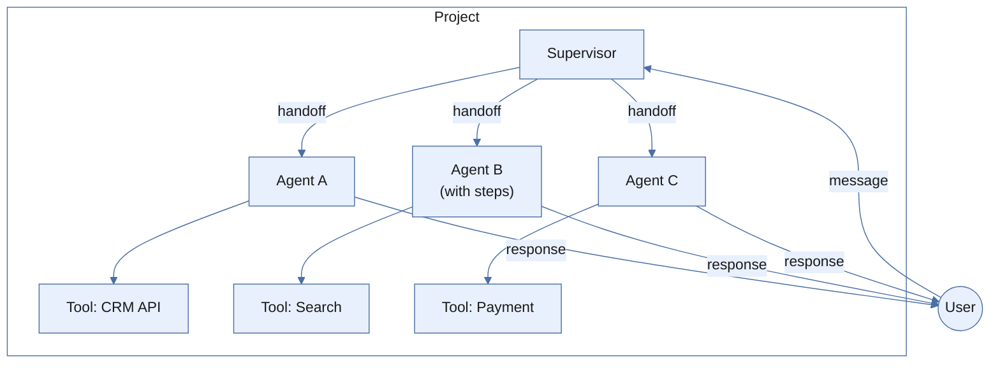
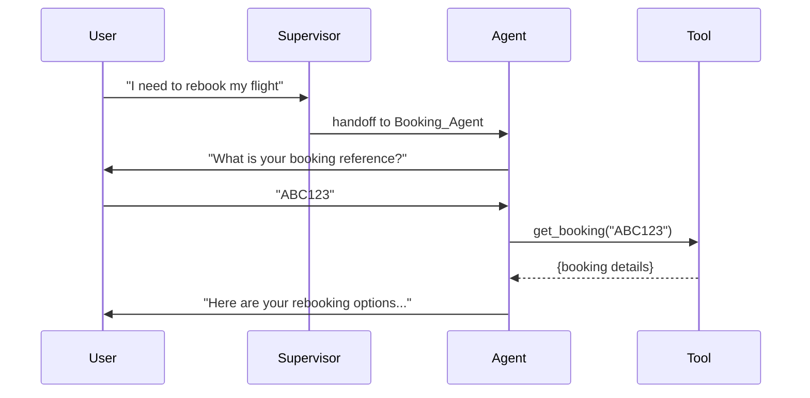
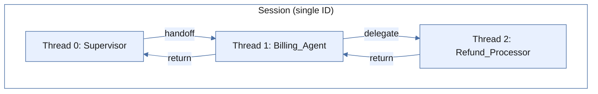
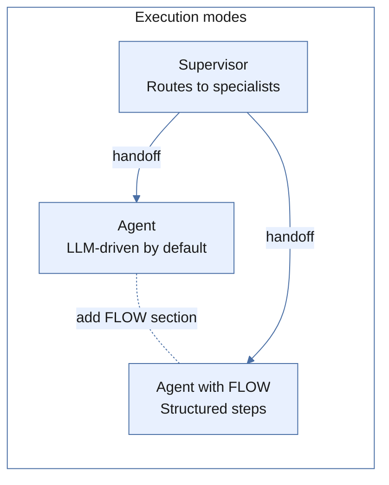
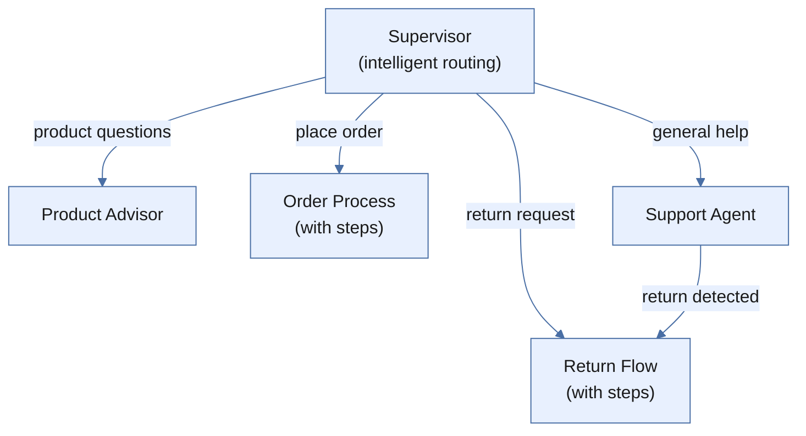
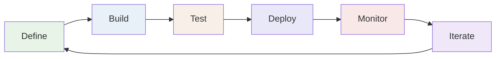
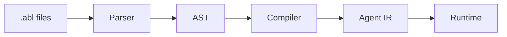
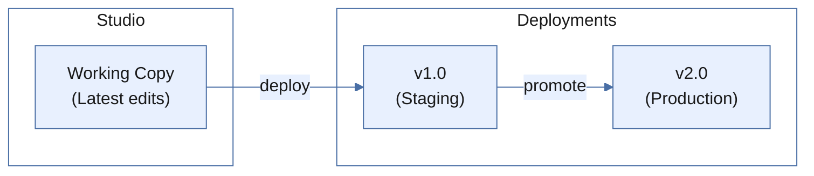

Agent Platform 2.0 is built on four interconnected concepts: **Agents**, **Supervisors**, **Tools**, and **Sessions**. Understanding how they relate gives you a foundation for everything else in the platform.



| Concept    | Analogy                   | Responsibility                              |
| ---------- | ------------------------- | ------------------------------------------- |
| Supervisor | Reception desk            | Routes conversations to the right team.     |
| Agent      | Domain specialist         | Handles a specific task with deep knowledge. |
| Tool       | Phone, computer, database | Gives agents real-world capabilities.       |
| Session    | Conversation thread       | Tracks state across messages.               |
| Flow       | Step-by-step checklist    | Guides agents through a structured process. |

Here is how a message flows through the system:

1. The user sends a message to your project endpoint.
2. The supervisor evaluates the message against its handoff rules.
3. The right agent activates and takes over the conversation.
4. The agent processes the message using its goal, persona, tools, and constraints.
5. Tools execute API calls, database queries, or other actions.
6. The agent responds back to the user through the session.
7. The session persists all state for the next message.

## Agents

An agent is a self-contained unit that handles a specific domain. It has a goal, a persona, tools it can use, and rules it must follow. Think of an agent like a specialist on a support team — one handles billing, another handles shipping, and each brings their own expertise.

Every agent is defined in ABL (Agent Blueprint Language), a schema-driven language purpose-built for multi-agent orchestration. You declare _what_ the agent should do; the platform figures out _how_ to execute it. ABL definitions compile into immutable intermediate representations (IRs) — every version is auditable, every deployment is reproducible.

```yaml
AGENT: Billing_Support
GOAL: "Help customers resolve billing inquiries"

PERSONA: |
  Friendly billing specialist who explains charges clearly.
  Always shows itemized breakdowns before totals.

TOOLS:
  get_invoice(customer_id: string) -> {invoice: object}
  process_refund(invoice_id: string, amount: number) -> {success: boolean}

GATHER:
  customer_id:
    prompt: "What is your customer ID?"
    type: string
    required: true
```

### ABL Design Philosophy

ABL favors **declaration over implementation**. Describing the agent's goal, persona, tools, and constraints — rather than writing execution logic — gives you several advantages:

- **Portability**: The same agent definition runs on different runtimes (voice, digital, workflow).
- **Testability**: Evaluate agent behavior without deploying infrastructure.
- **Composability**: Agents, supervisors, and tools combine like building blocks.
- **Evolvability**: Change one piece without rewriting the system.

## Supervisors

A supervisor routes conversations to the right specialist agent. It evaluates user intent against a set of handoff rules and transfers control to the matching agent. Supervisors do not handle domain tasks directly.

```yaml
SUPERVISOR: Support_Hub

GOAL: "Route customers to the right specialist"

HANDOFF:
  - TO: Billing_Support
    WHEN: user asks about invoices, charges, or refunds

  - TO: Shipping_Agent
    WHEN: user asks about delivery, tracking, or shipments

  - TO: Live_Agent
    WHEN: user requests human assistance
```

The supervisor uses an LLM to evaluate `WHEN` conditions — routing is intelligent. "Where's my package?" routes to the shipping agent even though the user never said "delivery" or "shipment."

This separation matters. The supervisor holds the map of your organization's capabilities; each agent holds deep domain knowledge. Add a new specialist by adding a new `HANDOFF` rule — no changes to existing agents.

<Tip>A supervisor can route to other supervisors, enabling hierarchical orchestration for complex organizations.</Tip>

**When to use a supervisor:**

- Your system has multiple specialist agents.
- Different user intents should route to different capabilities.
- You need centralized routing logic with priority-based fallbacks.
- You want to add or remove agents without modifying existing agents.

## Tools

Tools give agents the ability to do things in the real world — call APIs, query databases, process files. Without tools, an agent can only converse. With tools, it can take action.

```yaml
TOOLS:
  search_flights(origin: string, destination: string, date: date) -> {flights: array}
    description: "Search available flights by route and date"

  create_booking(flight_id: string, passenger: object) -> {booking_id: string}
    description: "Book a flight for a passenger"
```

ABL declares tool _signatures_ — the name, inputs, and outputs. The actual implementation lives in your backend services. The platform connects the two at deployment time through **tool bindings**. The same agent definition can connect to different backends in staging vs. production.

### Tool Execution

When a tool executes, the platform:

1. **Resolves the tool binding** from the deployment configuration.
2. **Validates inputs** against declared parameter types before the call.
3. **Makes the external call** with the appropriate authentication.
4. **Processes the result** and makes it available to the agent — in the conversation context for reasoning agents, or as session variables for agents with steps.
5. **Handles errors** using `ON_ERROR` handlers for retry logic, fallback responses, or escalation triggers.

Tool execution includes timeout enforcement, error categorization, and automatic retry for transient failures.

## Sessions

A session represents a single conversation between a user and your agent system. When a user connects — through a web widget, SDK integration, voice channel, or API call — the platform creates a session and binds it to your project's deployed agent configuration.

Sessions persist across messages. When the user returns after a pause, the session remembers where they left off. If the supervisor hands off to a specialist, the session maintains the full history so the specialist has context.



### Session State

Sessions manage three categories of state:

| State type | What it holds |
| --- | --- |
| **Session variables** | Data collected during the conversation: GATHER field values, tool results, and SET values. Reference any variable as `{{variable_name}}` in any subsequent step, tool call, or response template. |
| **Conversation history** | The ordered sequence of messages between user and agent, including tool call results. Long conversations are automatically compacted to preserve essential information within the LLM's context window. |
| **Flow state** | The current flow step and which fields have been gathered (for agents with steps). Supports backtracking when the user wants to change a previous answer. |

### Persistent Memory

Agents can store and retrieve information that persists across sessions using `MEMORY` declarations:

```yaml
MEMORY:
  session:
    - selected_booking
    - action_type
  persistent:
    - user.booking_history
    - user.preferences
  remember:
    - WHEN action_completed == true
      STORE: {booking_id: selected_booking, action: action_type} -> user.booking_history
  recall:
    - ON: session:start
      ACTION: inject_context
      PATHS: [user.booking_history, user.preferences]
```

- **Session memory**: tracks values within the current conversation.
- **Persistent memory**: stores facts scoped to the individual user, surviving across sessions.
- **REMEMBER rules**: define when to write to persistent memory.
- **RECALL rules**: define when to load persistent memory into context.

A returning customer's preferences, past interactions, and relevant history are available to the agent without the user repeating themselves.

### Session Hierarchy In Multi-Agent Systems

When a supervisor hands off to a specialist, the platform creates a **thread** within the existing session — not a new session. The user has one continuous conversation regardless of how many agents participate.



Threads form a stack: handoffs push new threads, completions pop back to the parent. Each thread maintains its own conversation history and gathered data but can access data from parent threads.

**Handoff** transfers the conversation — the user interacts directly with the target agent. When the target completes, it returns data to the parent.

```yaml
HANDOFF:
  - TO: Billing_Support
    WHEN: user asks about billing
    PASS: customer_id
    RETURN: true
```

**Delegate** runs a sub-task in the background — the parent agent seamlessly incorporates the result into its own response.

```yaml
DELEGATE:
  - AGENT: Fee_Calculator
    WHEN: action_type == "modify"
    PURPOSE: "Calculate total fees for the requested changes"
    INPUT:
      booking_id: selected_booking
      change_type: action_type
    RETURNS:
      total_fee: quoted_fee
```

### Session Lifecycle States

| State     | Description                                            |
| --------- | ------------------------------------------------------ |
| Active    | The session is processing messages normally.           |
| Waiting   | The session is waiting for user input.                 |
| Suspended | The session is paused, waiting for an async callback.  |
| Completed | The agent has fulfilled its goal; the session is done. |
| Escalated | The session has been transferred to a human operator.  |
| Expired   | The session timed out due to inactivity.               |

<Info>Sessions are scoped to a single user within a single project. Data from one session never leaks to another. Session data is cleaned up automatically according to your tenant's retention policy.</Info>

### Concurrency

The platform handles concurrent messages within a session using configurable strategies:

- **Serial** (default): Messages are queued and processed one at a time, in order. Use this for most conversational agents to ensure full context from the previous message.
- **Preemptive**: A new message cancels in-progress execution and starts fresh. Use this for real-time interfaces where the user might correct themselves mid-response.
- **Parallel**: Multiple messages process simultaneously. Use this for batch operations.

## Execution Modes

Every agent in ABL reasons by default using an LLM. You can modify this behavior by adding a `FLOW` section (structured steps) or using the `SUPERVISOR` declaration (routing-only). The platform derives the execution mode from your definition — there is no explicit `MODE` keyword.



How the platform determines execution mode:

- **No `FLOW` section**: The agent reasons using the LLM agentic loop.
- **Has `FLOW` section**: The agent follows its defined steps sequentially.
- **Has `SUPERVISOR` declaration**: The agent runs as a router with handoff evaluation.
- **`REASONING: true` on a flow step**: That individual step uses the LLM reasoning loop within an otherwise step-based flow.
- **`REASONING: false` on a flow step**: That step runs deterministically without LLM involvement.

### Agents (Reasoning Mode)

An agent in reasoning mode runs an **agentic loop** — iterative LLM calls and tool executions until it has enough information to respond. It can handle ambiguous requests, ask clarifying questions, and chain multiple tool calls without explicit instructions for every scenario.

In addition to the tools you define, agents in reasoning mode have access to system tools:

| System tool | What it does |
| --- | --- |
| `handoff` | Transfers the conversation to another agent. |
| `delegate` | Runs a sub-task with another agent and incorporates the result. |
| `complete` | Marks the task as done. |
| `escalate` | Transfers to a human operator with context. |
| `fan_out` | Executes multiple sub-tasks in parallel. |

**When to use reasoning mode:**

- The task requires interpreting ambiguous or complex natural language.
- Multiple valid conversation paths exist for the same goal.
- The agent needs to make judgment calls about which tools to use and when.
- You want the agent to handle edge cases without explicit rules for each one.

### Agents With Steps (Flow Mode)

Add a `FLOW` section when you need a defined sequence — data collection, tool calls, and responses in a specific order. Each step has a specific action (`GATHER`, `CALL`, `RESPOND`) and an explicit transition (`THEN`) to the next step.

```yaml
AGENT: Hotel_Booking
GOAL: "Guide users through a complete hotel booking process"

FLOW:
  steps:
    - get_destination
    - get_dates
    - search_hotels
    - select_hotel
    - collect_guest_info
    - confirm_booking

  get_destination:
    REASONING: false
    GATHER:
      - destination: required
    THEN: get_dates

  get_dates:
    REASONING: false
    GATHER:
      - checkin_date: required
        type: date
      - checkout_date: required
        type: date
    THEN: search_hotels

  search_hotels:
    REASONING: false
    CALL: search_hotels(destination, checkin_date, checkout_date)
    THEN: select_hotel

  select_hotel:
    REASONING: false
    GATHER:
      - hotel_selection: required
    THEN: collect_guest_info

  collect_guest_info:
    REASONING: false
    GATHER:
      - guest_name: required
      - guest_email: required
        type: email
    THEN: confirm_booking

  confirm_booking:
    REASONING: false
    CALL: create_booking(selected_hotel_id, guest_name, guest_email)
    RESPOND: "Booking confirmed! Confirmation: {{booking_id}}"
    THEN: COMPLETE
```

**When to use flow mode:**

- The process has a defined sequence that must be followed.
- Regulatory or compliance requirements dictate the conversation structure.
- You need deterministic, auditable behavior.
- The task involves structured data collection with validation rules.

### Per-Step Reasoning Control

Within a `FLOW`, each step has a `REASONING` toggle that controls whether that step uses LLM reasoning. This lets you mix deterministic and LLM-driven behavior within a single agent:

```yaml
AGENT: Insurance_Claim
GOAL: "Process insurance claims with data collection and intelligent assessment"

FLOW:
  steps:
    - collect_policy_info
    - collect_incident_details
    - assess_claim
    - present_decision

  collect_policy_info:
    REASONING: false
    GATHER:
      - policy_number: required
      - incident_date: required
        type: date
    THEN: collect_incident_details

  collect_incident_details:
    REASONING: false
    GATHER:
      - description: required
      - damage_estimate: required
        type: number
    THEN: assess_claim

  assess_claim:
    REASONING: true
    INSTRUCTIONS: |
      Review the claim details and assess coverage eligibility.
      Check policy terms, evaluate the incident description,
      and determine the recommended payout amount.
    THEN: present_decision

  present_decision:
    REASONING: false
    RESPOND: "Based on my assessment: {{assessment_result}}"
    THEN: COMPLETE
```

The first two steps use deterministic data collection. The `assess_claim` step switches to `REASONING: true`, giving the LLM full autonomy to evaluate the claim using all available context. The final step returns to deterministic mode to present the result.

<Tip>Start with steps for predictable processes and add `REASONING: true` to individual steps that need flexibility. This keeps token costs low while leveraging LLM intelligence where it matters.</Tip>

### Choosing the Right Mode

| Factor                      | Agent (Reasoning)       | Agent with Steps       | Supervisor      |
| --------------------------- | ----------------------- | ---------------------- | --------------- |
| **Conversation path**       | Unpredictable           | Defined sequence       | N/A (routing)   |
| **Decision complexity**     | High (judgment needed)  | Low (rules suffice)    | Medium (intent) |
| **Compliance requirements** | Flexible                | Strict, auditable      | N/A             |
| **Data collection**         | Organic, conversational | Structured, sequential | None            |
| **Tool usage**              | Agent decides when      | Explicit in each step  | None            |
| **Predictability**          | Lower                   | Higher                 | Medium          |
| **Token cost**              | Higher (LLM per turn)   | Lower (LLM optional)   | Low             |
| **Best for**                | Support, advisory       | Forms, workflows       | Multi-agent     |

### Combining Agents in a System

Real-world systems combine agents with different execution modes:



The supervisor handles routing. Agents without steps handle open-ended conversations (product recommendations, general support). Agents with steps handle structured processes (checkout, returns). Any agent can hand off to another when it detects a task that requires a different approach.

## Agent Lifecycle

Every agent follows a lifecycle from initial definition to production monitoring. The lifecycle is a loop — insights from monitoring drive the next round of changes.



| Lifecycle Stage | What Happens | Studio Feature |
| --------------- | ------------ | -------------- |
| **Define** | Write the agent in ABL: declare goal, persona, tools, constraints, and completion criteria. | Visual editor, ABL code editor, flow canvas |
| **Build** | The ABL compiler validates syntax, checks cross-agent references, and produces the IR. | Real-time compilation, error highlighting, IR preview |
| **Test** | Validate behavior with conversation testing, evaluation sets, and tool mocking. | Built-in chat, tool mocking, evaluation sets |
| **Deploy** | Pin specific agent versions so in-progress sessions are not disrupted by future changes. | Deployment management, version pinning, environment tags |
| **Monitor** | Review session traces, aggregate metrics, and escalation patterns. | Session traces, execution metrics, escalation dashboard |
| **Iterate** | Use monitoring insights to refine ABL definitions and redeploy. | Version history, diff view, quick redeploy |

### Define

At this stage you decide the agent's scope, data requirements, tool dependencies, business rules, and completion criteria. Studio provides a visual editor for agents with and without steps, and a canvas-based flow builder for agents with steps.

```yaml
AGENT: Refund_Processor
GOAL: "Process customer refund requests with policy validation"

PERSONA: |
  Empathetic customer service specialist.
  Always explains refund timelines before asking for confirmation.

TOOLS:
  lookup_order(order_id: string) -> {order: object, eligible: boolean}
  process_refund(order_id: string, reason: string) -> {refund_id: string, amount: number}

GATHER:
  order_id:
    prompt: "What is your order number?"
    type: string
    required: true
  reason:
    prompt: "Could you share the reason for the refund?"
    type: string
    required: true

CONSTRAINTS:
  pre_refund:
    - REQUIRE lookup_order.eligible == true
      ON_FAIL: "This order is not eligible for a refund. {{lookup_order.reason}}"

COMPLETE:
  - WHEN: refund_processed == true
    RESPOND: "Refund {{refund_id}} processed for {{amount}}. Allow 5-7 business days."
```

### Build

The ABL compiler transforms your `.abl` files into an executable IR:



The compiler catches errors early: syntax errors, type mismatches between tool parameters and GATHER field types, invalid cross-agent handoff references, and conflicting constraints. The IR is framework-agnostic — the same definition runs on digital, voice, and workflow runtimes.

<Tip>Studio compiles automatically as you edit, flagging errors in real time.</Tip>

### Test

Testing happens at multiple levels:

- **Syntax validation**: The compiler checks required sections, valid references, and type consistency.
- **Conversation testing**: Interact with your agent in Studio's built-in chat. Observe responses, tool calls, and state transitions.
- **Evaluation sets**: Define personas (simulated users), scenarios (conversation scripts), and evaluators (quality criteria). The platform runs automated conversations and scores agent performance.
- **Tool mocking**: Configure mock responses for tools to verify the agent's decision-making logic without calling real APIs.

### Deploy

A deployment pins specific versions of your agents, tools, and configuration:



- **Version pinning**: In-progress sessions continue with the same agent behavior; new sessions pick up the latest deployment.
- **Environment separation**: Deploy to staging for final testing before promoting to production.
- **Rollback**: Revert to a previous deployment. The platform keeps full deployment history.
- **Zero-downtime**: Deployments do not interrupt active sessions.

### Monitor

Once deployed, monitoring surfaces how agents perform in production:

- **Session traces**: The full execution path for every conversation — which agent handled each message, what tools were called, what data was gathered, and how long each step took.
- **Metrics**: Aggregate performance data — completion rates, average session duration, tool error rates, and LLM token usage.
- **Escalation tracking**: When and why agents hand off to human operators. High escalation rates signal that an agent's capabilities or constraints need refinement.

### Iterate

ABL's declarative nature makes iteration fast. Changing agent behavior is a matter of editing a few lines of ABL, not refactoring application code. Common iteration patterns:

- Agent mishandles a common edge case → add a constraint or refine instructions.
- Users drop off at a specific flow step → simplify GATHER prompts or improve error messages.
- A tool fails frequently → add retry logic in `ON_ERROR` or improve error responses.
- Escalation rates are high for a topic → create a new specialist agent and add a handoff rule.

<Info>Every change creates a new version in the deployment system, giving you a full audit trail of how your agents evolved over time.</Info>

## Constraints And Guardrails

Constraints enforce business rules throughout agent execution. They are evaluated at specific checkpoints — before tool calls, after data collection, and at task completion.

```yaml
CONSTRAINTS:
  pre_refund:
    - REQUIRE order.eligible == true
      ON_FAIL: "This order is not eligible for a refund."
    - REQUIRE refund_amount <= 1000
      ON_FAIL: ESCALATE "Refund exceeds automatic approval limit"
```

When a constraint fails, the configured `ON_FAIL` action executes: a message to the user, a handoff to another agent, or an escalation to a human operator.

**Guardrails** provide additional safety checks on agent output — content moderation, PII detection, topic boundaries, and format validation. These run after the LLM generates a response but before it reaches the user.

## Tracing

Every execution emits trace events that capture the full decision path. Traces let you answer questions like: why did the agent route this way, which tools were called, and how long did each step take?

| Event                 | What It Captures                            |
| --------------------- | ------------------------------------------- |
| `execution.queued`    | Message received, position in queue.        |
| `execution.started`   | Processing begins, agent identified.        |
| `handoff_match`       | Supervisor routing decision and target.     |
| `tool_call`           | Tool name, parameters, timing.              |
| `tool_result`         | Tool response, success/failure, duration.   |
| `gather_extraction`   | Fields extracted from user message.         |
| `constraint_check`    | Constraint evaluation, pass/fail.           |
| `flow_transition`     | Flow step change with reason.               |
| `thread_return`       | Child agent returning to parent.            |
| `execution.completed` | Final response, total duration, token usage. |

Traces are available in Studio's session detail view. For programmatic access, traces are available through the platform API.

<Tip>Set trace verbosity to `verbose` during development to see detailed decision reasoning — why the LLM chose a specific tool, why a constraint passed or failed, and how entity extraction matched values to fields.</Tip>

---
