# Core Concepts

## The ABL Mental Model

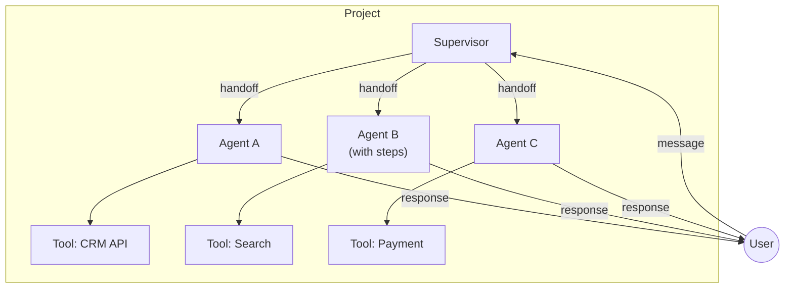

The Agent Platform 2.0 is built on four interconnected concepts: **agents**, **supervisors**, **tools**, and **sessions**. Understanding how they relate gives you a foundation for everything else in the platform.

### Agents are the unit of intelligence

An agent is a self-contained unit that knows how to handle a specific domain. It has a goal, a persona, tools it can use, and rules it must follow. Think of an agent like a specialist on a support team — one person handles billing, another handles shipping, and each brings their own expertise.

```abl
AGENT: Billing_Support
GOAL: "Help customers resolve billing inquiries"

PERSONA: |
  Friendly billing specialist who explains charges clearly.
  Always shows itemized breakdowns before totals.

TOOLS:
  get_invoice(customer_id: string) -> {invoice: object}
  process_refund(invoice_id: string, amount: number) -> {success: boolean}

GATHER:
  customer_id:
    prompt: "What is your customer ID?"
    type: string
    required: true
```

Every agent is defined in <Tooltip headline="ABL" tip="The enterprise control plane for agentic AI — a schema-driven language purpose-built for multi-agent orchestration where deterministic governance meets autonomous reasoning. ABL spans the full control spectrum: delegate autonomously, supervise selectively, or lock down as a deterministic state machine. Agent definitions compile into immutable artifacts — every version is auditable, every deployment is reproducible, every change is governed. ABL is both human-writable and designed as a code-generation target for AI-authored blueprints.">API</Tooltip> (Agent Blueprint Language), a schema-driven language purpose-built for multi-agent orchestration. You declare _what_ the agent should do, not _how_ the runtime should execute it. The platform compiles your ABL into an immutable intermediate representation (IR) and the Runtime handles execution.

### Supervisors are orchestrators

A supervisor is a special agent that routes conversations to the right specialist. It does not handle domain tasks directly. Instead, it listens to the user's intent and decides which agent should take over.

```abl
SUPERVISOR: Support_Hub

GOAL: "Route customers to the right specialist"

HANDOFF:
  - TO: Billing_Support
    WHEN: user asks about invoices, charges, or refunds

  - TO: Shipping_Agent
    WHEN: user asks about delivery, tracking, or shipments

  - TO: Live_Agent
    WHEN: user requests human assistance
```

This separation matters. The supervisor holds the "map" of your organization's capabilities while each agent holds deep domain knowledge. You can add new specialists without changing the supervisor's core logic — you add a new `HANDOFF` rule and the system adapts.

> **Tip:** A supervisor can also route to other supervisors, enabling hierarchical orchestration for complex organizations.

### Tools are capabilities

Tools give agents the ability to _do_ things in the real world — call APIs, query databases, process files. Without tools, an agent can only converse. With tools, it can take action.

```abl
TOOLS:
  search_flights(origin: string, destination: string, date: date) -> {flights: array}
    description: "Search available flights by route and date"

  create_booking(flight_id: string, passenger: object) -> {booking_id: string}
    description: "Book a flight for a passenger"
```

ABL declares tool _signatures_ — the name, inputs, and outputs. The actual implementation lives in your backend services. The platform connects the two at deployment time through tool bindings. This means the same agent definition can connect to different backends in staging vs. production.

### Sessions are conversations

A session represents a single conversation between a user and your agent system. When a user sends a message, the platform creates a session that tracks the full conversation state: messages exchanged, data gathered, which agent is active, and where the flow has progressed to.

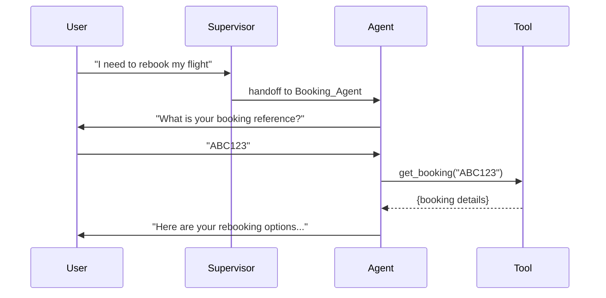

Sessions persist across messages. When the user returns after a pause, the session remembers where they left off. If the supervisor hands off to a specialist, the session maintains the full history so the specialist has context.

> **Important:** Sessions are scoped to a single user within a single project. Data from one session never leaks to another, even within the same tenant.

### How the pieces fit together

Here is the full picture of how a message flows through the system:

1. **User sends a message** to your project endpoint
2. **The supervisor evaluates** the message against its handoff rules
3. **The right agent activates** and takes over the conversation
4. **The agent processes** the message using its goal, persona, tools, and constraints
5. **Tools execute** API calls, database queries, or other actions
6. **The agent responds** back to the user through the session
7. **The session persists** all state for the next message

This architecture means you can build complex multi-agent systems from simple, composable pieces. Each piece does one thing well, and the platform handles the wiring.

| Concept    | Analogy                   | Responsibility                              |
| ---------- | ------------------------- | ------------------------------------------- |
| Supervisor | Reception desk            | Routes conversations to the right team      |
| Agent      | Domain specialist         | Handles a specific task with deep knowledge |
| Tool       | Phone, computer, database | Gives agents real-world capabilities        |
| Session    | Conversation thread       | Tracks state across messages                |
| Flow       | Step-by-step checklist    | Guides agents through a structured process  |

### Design philosophy

ABL favors **declaration over implementation**. You describe the agent's goal, persona, tools, and constraints. The platform figures out _how_ to execute it. This separation gives you several advantages:

- **Portability**: The same agent definition runs on different runtimes (voice, digital, workflow)
- **Testability**: You can evaluate agent behavior without deploying infrastructure
- **Composability**: Agents, supervisors, and tools combine like building blocks
- **Evolvability**: Change one piece without rewriting the system

This differs from code-first frameworks where agent logic is tangled with infrastructure concerns. In ABL, the "what" lives in your `.abl` files and the "how" lives in the platform.

## Agents and Execution Modes

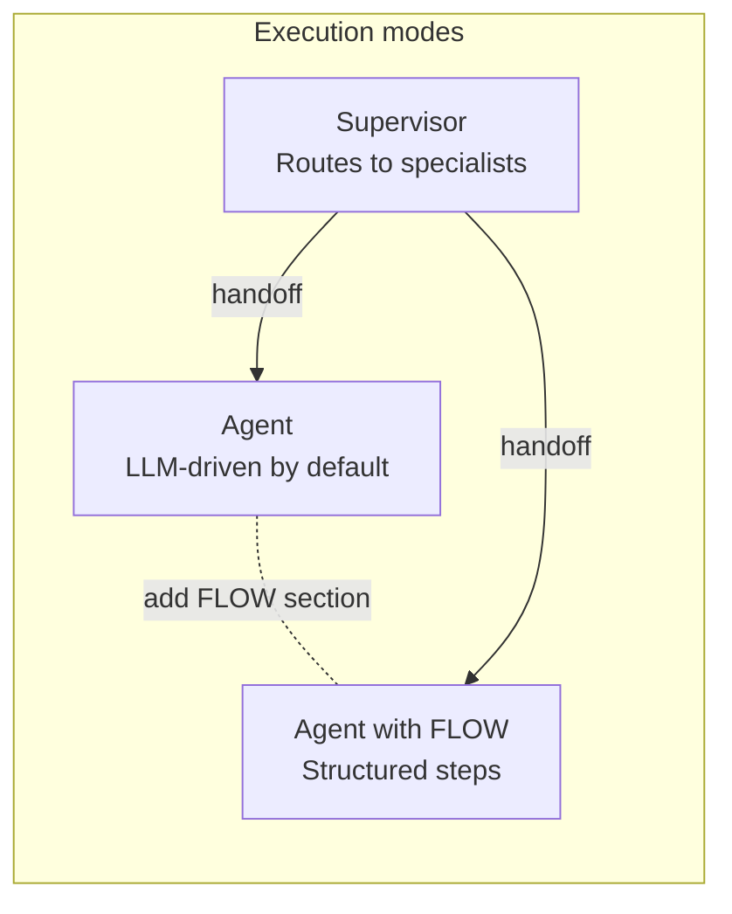

There is one type of agent in ABL. Every agent reasons by default — it uses an LLM to interpret messages, make decisions, and call tools autonomously. When you need structured, step-by-step execution, you add a `FLOW` section to the agent definition. This does not create a different type of agent; it gives the same agent a defined sequence of steps to follow. Supervisors are a separate concept — they route conversations to specialist agents rather than handling domain tasks directly.

### Agents reason by default

An agent uses an LLM to make decisions autonomously. You give it a goal, tools, and constraints, and it figures out the best path to accomplish the task. It can handle ambiguous requests, follow up with clarifying questions, and chain multiple tool calls together without explicit instructions for every scenario.

```abl
AGENT: Flight_Search
GOAL: |
  Help users find flights by translating queries into structured
  metadata filters. Resolve airline terms (cabin class, route type)
  via vocabulary before searching.

TOOLS:
  search_flights(origin: string, destination: string, date: date) -> {flights: array}
  check_availability(flight_id: string) -> {seats: number, price: number}

INSTRUCTIONS: |
  1. Identify filterable terms (cabin class, route type, etc.)
  2. Execute search with resolved filters
  3. Present matching flights clearly with route, class, and fare info
```

Agents excel at open-ended conversations where the path is unpredictable. A customer might ask "I need a cheap flight to Tokyo next week but I'm flexible on dates" — the agent needs to interpret "cheap," decide whether to search multiple dates, and present options intelligently. No predefined flow can anticipate every variation.

**When an agent without steps is the right fit:**

- The task requires interpreting ambiguous or complex natural language
- Multiple valid conversation paths exist for the same goal
- The agent needs to make judgment calls about which tools to use and when
- You want the agent to handle edge cases without explicit rules for each one

### Adding structured steps with FLOW

When you need a defined sequence of steps — data collection, tool calls, and responses in a specific order — you add a `FLOW` section to your agent. Each step gathers data, calls tools, or sends messages, and you specify exactly what happens next. The conversation progresses predictably from start to finish.

```abl
AGENT: Hotel_Booking
GOAL: "Guide users through a complete hotel booking process"

FLOW:
  steps:
    - get_destination
    - get_dates
    - search_hotels
    - select_hotel
    - collect_guest_info
    - confirm_booking

  get_destination:
    REASONING: false
    GATHER:
      - destination: required
    THEN: get_dates

  get_dates:
    REASONING: false
    GATHER:
      - checkin_date: required
        type: date
      - checkout_date: required
        type: date
    THEN: search_hotels

  search_hotels:
    REASONING: false
    CALL: search_hotels(destination, checkin_date, checkout_date)
    THEN: select_hotel

  select_hotel:
    REASONING: false
    GATHER:
      - hotel_selection: required
    THEN: collect_guest_info

  collect_guest_info:
    REASONING: false
    GATHER:
      - guest_name: required
      - guest_email: required
        type: email
    THEN: confirm_booking

  confirm_booking:
    REASONING: false
    CALL: create_booking(selected_hotel_id, guest_name, guest_email)
    RESPOND: "Booking confirmed! Confirmation: {{booking_id}}"
    THEN: COMPLETE
```

Agents with steps are ideal for regulated processes, compliance workflows, and any scenario where the business requires a specific sequence. An insurance claim intake, a loan application, or a medical triage questionnaire — these need to happen in order, every time.

**When to add steps to your agent:**

- The process has a defined sequence that must be followed
- Regulatory or compliance requirements dictate the conversation structure
- You need deterministic, auditable behavior
- The task involves structured data collection with validation rules

### Per-step reasoning control

Within a FLOW, each step has a `REASONING` toggle that controls whether that step uses LLM reasoning. Setting `REASONING: false` means the step runs deterministically — the Runtime handles GATHER, CALL, and RESPOND directly without involving the LLM for step logic. Setting `REASONING: true` gives the LLM full autonomy for that step.

This lets you mix deterministic and LLM-driven behavior within a single agent:

```abl
AGENT: Insurance_Claim
GOAL: "Process insurance claims with data collection and intelligent assessment"

FLOW:
  steps:
    - collect_policy_info
    - collect_incident_details
    - assess_claim
    - present_decision

  collect_policy_info:
    REASONING: false
    GATHER:
      - policy_number: required
      - incident_date: required
        type: date
    THEN: collect_incident_details

  collect_incident_details:
    REASONING: false
    GATHER:
      - description: required
      - damage_estimate: required
        type: number
    THEN: assess_claim

  assess_claim:
    REASONING: true
    INSTRUCTIONS: |
      Review the claim details and assess coverage eligibility.
      Check policy terms, evaluate the incident description,
      and determine the recommended payout amount.
    THEN: present_decision

  present_decision:
    REASONING: false
    RESPOND: "Based on my assessment: {{assessment_result}}"
    THEN: COMPLETE
```

In this example, the first two steps use deterministic data collection. The `assess_claim` step switches to `REASONING: true`, giving the LLM full autonomy to evaluate the claim using all available context. The final step returns to deterministic mode to present the result.

This approach gives you deterministic structure where you need predictability and LLM intelligence where you need judgment — all within the same agent.

### Supervisors

A supervisor routes conversations to the right specialist agent. It evaluates the user's intent against a set of handoff rules and transfers control to the matching agent. Supervisors do not handle domain tasks directly.

```abl
SUPERVISOR: Retail_Supervisor
GOAL: "Route customers to the right specialist"

HANDOFF:
  - TO: Order_Tracking
    WHEN: user asks about delivery, shipping, or order status

  - TO: Returns_And_Refunds
    WHEN: user asks about returns, refunds, or exchanges

  - TO: Product_Advisor
    WHEN: user asks about products, recommendations, or comparisons

  - TO: Live_Agent
    WHEN: user requests human assistance or shows frustration
```

The supervisor uses the LLM to evaluate `WHEN` conditions against the user's message. This means routing is intelligent — "where's my package?" routes to `Order_Tracking` even though the user never said "order" or "delivery."

Supervisors can also define escalation triggers, priority routing, and error handling. They act as the control plane for your multi-agent system.

**When to use a supervisor:**

- Your system has multiple specialist agents
- Different user intents should route to different capabilities
- You need centralized routing logic with priority-based fallbacks
- You want to add or remove agents without changing each individual agent

### How execution mode is determined

ABL does not have an explicit `MODE` keyword. The platform derives the execution mode from your agent definition:

- **No `FLOW` section**: The agent reasons by default, using the LLM agentic loop
- **Has `FLOW` section**: The agent follows its defined steps sequentially
- **Has `SUPERVISOR` declaration**: The agent runs as a router with handoff evaluation
- **`REASONING: true` on a flow step**: That individual step uses the LLM reasoning loop within an otherwise step-based flow
- **`REASONING: false` on a flow step**: That step runs deterministically without LLM involvement

This design means you never have to declare a mode explicitly — the platform infers it from the structure of your definition.

### Decision matrix

Use this table to choose the right approach for each part of your system:

| Factor                      | Agent (default)         | Agent with steps       | Supervisor      |
| --------------------------- | ----------------------- | ---------------------- | --------------- |
| **Conversation path**       | Unpredictable           | Defined sequence       | N/A (routing)   |
| **Decision complexity**     | High (judgment needed)  | Low (rules suffice)    | Medium (intent) |
| **Compliance requirements** | Flexible                | Strict, auditable      | N/A             |
| **Data collection**         | Organic, conversational | Structured, sequential | None            |
| **Tool usage**              | Agent decides when      | Explicit in each step  | None            |
| **Predictability**          | Lower                   | Higher                 | Medium          |
| **Token cost**              | Higher (LLM per turn)   | Lower (LLM optional)   | Low             |
| **Best for**                | Support, advisory       | Forms, workflows       | Multi-agent     |

> **Tip:** Start with steps for predictable processes and add `REASONING: true` to individual steps that need flexibility. This keeps your token costs low while still leveraging LLM intelligence where it matters.

### Combining agents in a system

Real-world systems combine agents with different execution modes. Here is a common pattern:

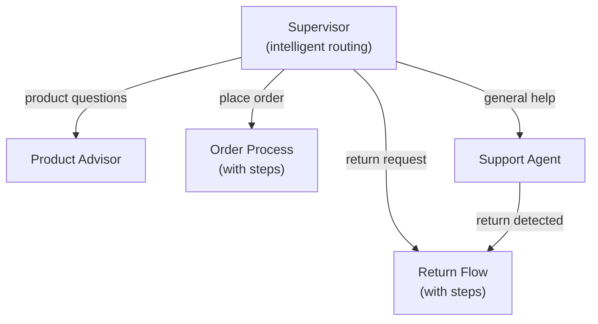

The supervisor handles routing. Agents without steps handle open-ended conversations (product recommendations, general support). Agents with steps handle structured processes (checkout, returns). Any agent can hand off to another agent when it detects a task that requires a different approach.

## The Agent Lifecycle

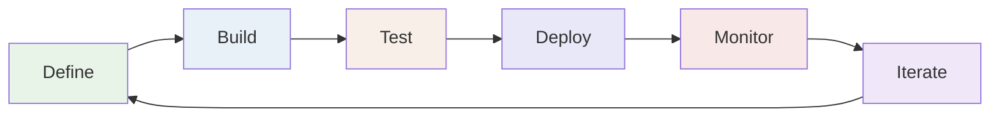

Every agent follows a lifecycle from initial definition to production monitoring. Understanding each stage helps you build agents that are not only functional but also maintainable, testable, and observable.

### Define

The lifecycle starts with writing your agent in ABL. This is where you declare what the agent does, not how the platform should run it.

```abl
AGENT: Refund_Processor
GOAL: "Process customer refund requests with policy validation"

PERSONA: |
  Empathetic customer service specialist.
  Always explains refund timelines before asking for confirmation.

TOOLS:
  lookup_order(order_id: string) -> {order: object, eligible: boolean}
  process_refund(order_id: string, reason: string) -> {refund_id: string, amount: number}

GATHER:
  order_id:
    prompt: "What is your order number?"
    type: string
    required: true
  reason:
    prompt: "Could you share the reason for the refund?"
    type: string
    required: true

CONSTRAINTS:
  pre_refund:
    - REQUIRE lookup_order.eligible == true
      ON_FAIL: "This order is not eligible for a refund. {{lookup_order.reason}}"

COMPLETE:
  - WHEN: refund_processed == true
    RESPOND: "Refund {{refund_id}} processed for {{amount}}. Allow 5-7 business days."
```

At this stage, you are making decisions about:

- **Agent scope**: What domain does this agent own? Keep agents focused on a single responsibility.
- **Data requirements**: What information does the agent need from the user?
- **Tool dependencies**: Which external services does the agent interact with?
- **Business rules**: What constraints must be enforced?
- **Completion criteria**: How does the agent know when the task is done?

Studio provides a visual editor for agents with and without steps. You can write ABL directly or use the canvas-based flow builder for agents with steps.

### Build

Building transforms your ABL definitions into executable artifacts. The ABL compiler parses your `.abl` files, validates the syntax, checks cross-agent references, and produces an intermediate representation (IR).

The compilation process catches errors early:

- **Syntax errors**: Missing required sections, invalid YAML structure
- **Type mismatches**: Tool parameter types that do not match GATHER field types
- **Cross-agent validation**: Handoff targets that reference agents not in the project
- **Constraint conflicts**: Rules that contradict each other or reference undefined fields

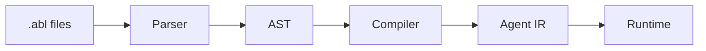

The IR is a framework-agnostic JSON structure that any runtime can consume. This separation means the same agent definition can run on digital channels (chat, web), voice channels (phone, smart speakers), or workflow engines — all from a single ABL source.

> **Tip:** Studio compiles automatically as you edit, flagging errors in real time.

### Test

Testing happens at multiple levels, from unit-style checks to full conversation simulations.

- **Syntax validation** catches structural issues in your ABL definition. The parser and compiler run validation rules that check for required sections, valid references, and type consistency.
- **Conversation testing** lets you interact with your agent in Studio's built-in chat. You send messages and observe how the agent responds, which tools it calls, and how it transitions between states.
- **Evaluation sets** provide structured, repeatable testing. You define personas (simulated user types), scenarios (conversation scripts), and evaluators (quality criteria). The platform runs automated conversations and scores agent performance across dimensions like task completion, response quality, and policy adherence.
- **Tool mocking** lets you test agent behavior without calling real APIs. You configure mock responses for tools so you can verify the agent's decision-making logic in isolation.

Testing reveals issues that compilation cannot catch: an agent that technically compiles but asks confusing questions, or one that calls tools in an unexpected order. Invest time here — catching behavioral issues before deployment saves debugging in production.

### Deploy

Deployment makes your agents available to users. A deployment pins specific versions of your agents, tools, and configuration so that running sessions are not disrupted when you make changes.

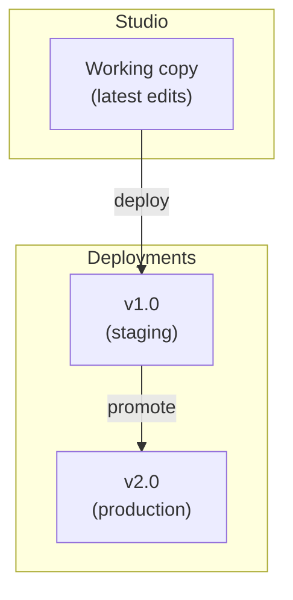

Key deployment concepts:

- **Version pinning**: Each deployment locks agent versions so that in-progress sessions continue with the same agent behavior. New sessions pick up the latest deployment.
- **Environment separation**: Deploy to staging for final testing before promoting to production.
- **Rollback**: Revert to a previous deployment if issues arise. The platform keeps deployment history.
- **Zero-downtime**: Deployments do not interrupt active sessions. New sessions start with the updated version while existing sessions complete on the old one.

Tool bindings are resolved at deployment time. This is where ABL tool declarations connect to actual API endpoints, so the same agent definition can point to staging APIs in one environment and production APIs in another.

### Monitor

Once deployed, monitoring tells you how your agents perform in the real world.

- **Session traces** show the full execution path for every conversation: which agent handled each message, what tools were called, what data was gathered, and how long each step took. Traces are the primary debugging tool for production issues.
- **Metrics** track aggregate performance: conversation completion rates, average session duration, tool error rates, and LLM token usage.
- **Escalation tracking** shows when and why agents hand off to human operators. High escalation rates signal that an agent's capabilities or constraints need refinement.

Monitoring feeds directly back into the iteration phase. When you see patterns in traces — users getting stuck at a particular step, a tool failing under certain conditions, or an agent misinterpreting a common phrase — those observations become your next improvement.

### Iterate

The lifecycle is a loop, not a line. Insights from monitoring drive your next round of changes:

- An agent mishandles a common edge case? Add a constraint or refine the instructions.
- Users drop off at a specific flow step? Simplify the GATHER prompts or add better error messages.
- A tool fails frequently? Add retry logic in ON_ERROR or improve the tool's error responses.
- Escalation rates are high for a topic? Create a new specialist agent and add a handoff rule.

ABL's declarative nature makes iteration fast. Changing an agent's behavior is a matter of editing a few lines of ABL, not refactoring application code. You can deploy a refined agent in minutes rather than hours.

> **Important:** The platform tracks agent versions through the deployment system. Every change creates a new version, giving you a full audit trail of how your agents evolved over time.

### Lifecycle stages mapped to Studio

| Lifecycle stage | Studio feature                                           |
| --------------- | -------------------------------------------------------- |
| Define          | Visual editor, ABL code editor, flow canvas              |
| Build           | Real-time compilation, error highlighting, IR preview    |
| Test            | Built-in chat, tool mocking, evaluation sets             |
| Deploy          | Deployment management, version pinning, environment tags |
| Monitor         | Session traces, execution metrics, escalation dashboard  |
| Iterate         | Version history, diff view, quick redeploy               |

## Sessions and Conversations

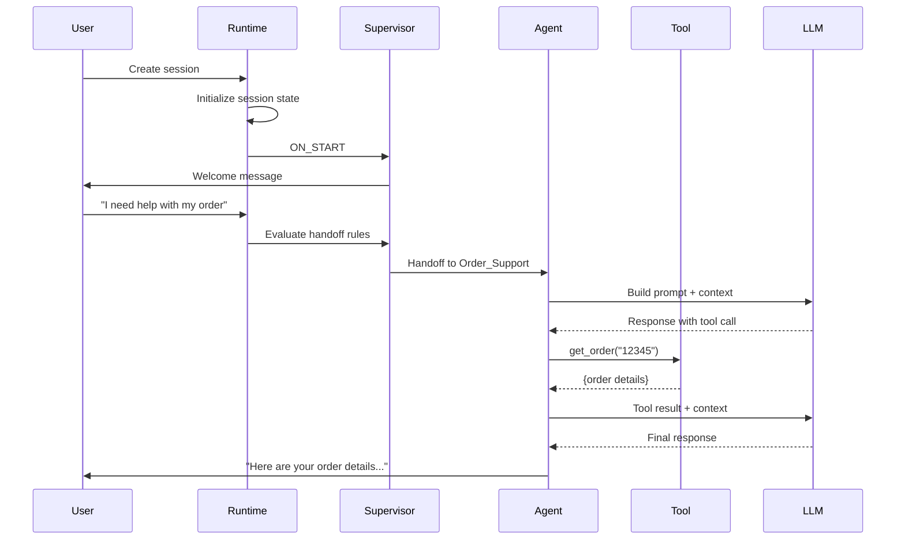

Sessions are the connective tissue of the Agent Platform 2.0. They carry conversation state, track which agent is active, manage data collected from users, and maintain the full history of a conversation across multiple messages and agent handoffs.

### Session creation and initialization

A session begins when a user connects to your project — through a web widget, an SDK integration, a voice channel, or an API call. The platform creates a session and binds it to your project's deployed agent configuration.

At creation time, the session establishes:

- **The entry agent**: Usually a supervisor, this is the first agent to handle the conversation
- **Session identity**: A unique session ID that persists for the conversation's lifetime
- **Tenant and project scope**: The session is locked to a specific tenant and project
- **Channel type**: The communication channel (web, voice, SDK) influences how agents format responses

If the entry agent has an `ON_START` block, it executes before the user sends their first message. This is where supervisors typically send a welcome message or agents set initial context.

```abl
ON_START:
  RESPOND: TEMPLATE(welcome)
```

### Message flow

Every message follows a consistent processing path, regardless of execution mode. Let's trace what happens when a user sends "I want to cancel my subscription."

**1. The Runtime receives the message** and loads the active session from its store. The session knows which agent is currently handling the conversation.

**2. The active agent processes the message.** What happens next depends on the execution mode:

- **Supervisor**: Evaluates HANDOFF rules against the message. If "cancel subscription" matches a routing rule, the supervisor hands off to the appropriate agent.
- **Agent (reasoning)**: Sends the message to the LLM along with the conversation history, system prompt, and available tools. The LLM decides how to respond.
- **Agent with steps**: Evaluates the message against the current flow step. If the step is a GATHER, the platform extracts field values from the message.

**3. Tools execute** if the agent (or the LLM, for agents in reasoning mode) decides to call one. Tool results flow back into the agent's context for the next decision.

**4. The agent produces a response** that flows back to the user. The session records both the user's message and the agent's response in the conversation history.

**5. The session state persists.** Updated values, flow position, and conversation history are saved so the next message picks up where this one left off.

### State management

Sessions manage three categories of state:

**Session variables** hold data collected during the conversation. GATHER fields, tool results, and explicitly SET values all live in the session's data store.

```abl
GATHER:
  customer_id:
    prompt: "What is your customer ID?"
    type: string
    required: true

  issue_type:
    prompt: "What kind of issue are you experiencing?"
    type: string
    required: true
```

When the user provides their customer ID, the platform stores it as a session variable. Any subsequent step, tool call, or response template can reference `{{customer_id}}`. Variables persist for the entire session lifetime.

**Conversation history** is the ordered sequence of messages between the user and the agent. It includes user messages, agent responses, and tool call results. The LLM receives this history as context for each new response, which is what enables multi-turn conversations. The platform manages conversation history size automatically. Long conversations trigger compaction — older parts of the history are summarized to stay within the LLM's context window while preserving essential information.

**Flow state** tracks the current flow step and which fields have been gathered (for agents with steps). If the user completes step 3 of a 6-step flow and comes back later, the session remembers the position and collected data.

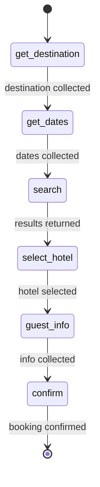

Flow state also includes backtracking. If the user says "wait, I want to change the destination," the platform can navigate back to the appropriate step while preserving data from other steps that do not need to change.

### Persistent memory

Beyond session-scoped variables, agents can store and retrieve information that persists across sessions using MEMORY declarations.

```abl
MEMORY:
  session:
    - selected_booking
    - action_type
  persistent:
    - user.booking_history
    - user.preferences
  remember:
    - WHEN action_completed == true
      STORE: {booking_id: selected_booking, action: action_type} -> user.booking_history
  recall:
    - ON: session:start
      ACTION: inject_context
      PATHS: [user.booking_history, user.preferences]
```

- **Session memory** tracks values within the current conversation
- **Persistent memory** stores facts that survive beyond the current session, scoped to the individual user
- **REMEMBER** rules define when to write to persistent memory
- **RECALL** rules define when to load persistent memory back into context

This means a returning customer's preferences, past interactions, and relevant history are available to the agent without the user repeating themselves.

### Session hierarchy in multi-agent systems

When a supervisor hands off to a specialist agent, the platform does not create a new session. Instead, it creates a new **thread** within the existing session.

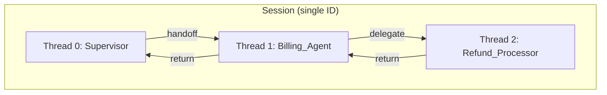

Threads provide several benefits:

- **Single session ID**: The user has one continuous conversation, regardless of how many agents participate
- **Context preservation**: Each thread maintains its own conversation history and gathered data, but can access data from parent threads
- **Return semantics**: When a child agent completes, it can return data back to the parent. The parent's ON_RETURN mapping controls which values propagate upward.
- **Stack-based navigation**: Threads form a stack. Handoffs push new threads; completions pop back to the parent.

**Handoff** transfers the conversation. The user interacts directly with the target agent. When the target completes, it can return data to the parent.

```abl
HANDOFF:
  - TO: Billing_Support
    WHEN: user asks about billing
    PASS: customer_id
    RETURN: true
```

**Delegate** runs a sub-task in the background. The parent agent asks another agent to perform a specific job, waits for the result, and continues.

```abl
DELEGATE:
  - AGENT: Fee_Calculator
    WHEN: action_type == "modify"
    PURPOSE: "Calculate total fees for the requested changes"
    INPUT:
      booking_id: selected_booking
      change_type: action_type
    RETURNS:
      total_fee: quoted_fee
```

The distinction matters for user experience. With handoff, the user knows they are talking to a different specialist. With delegate, the parent agent seamlessly incorporates the sub-agent's work into its own response.

### Session lifecycle

Sessions move through a defined set of states:

| State     | Description                                           |
| --------- | ----------------------------------------------------- |
| Active    | The session is processing messages normally           |
| Waiting   | The session is waiting for user input                 |
| Suspended | The session is paused, waiting for an async callback  |
| Completed | The agent has fulfilled its goal; the session is done |
| Escalated | The session has been transferred to a human operator  |
| Expired   | The session timed out due to inactivity               |

The platform applies idle timeouts and maximum session age limits. When a session expires, its state can be restored from cold storage if the user returns. Active sessions are kept in fast storage for low-latency access.

> **Important:** Session data is automatically cleaned up according to your tenant's retention policy. After the retention period, session data is permanently deleted in compliance with data protection requirements.

### Concurrency

The platform handles concurrent messages within a session using configurable strategies:

- **Serial** (default): Messages are queued and processed one at a time, in order
- **Preemptive**: A new message cancels the in-progress execution and starts fresh
- **Parallel**: Multiple messages process simultaneously (useful for batch operations)

For most conversational agents, serial processing is the right choice. It ensures the agent processes each message with full context from the previous one. Preemptive mode suits real-time interfaces where the user might correct themselves mid-response.

## How Agents Execute

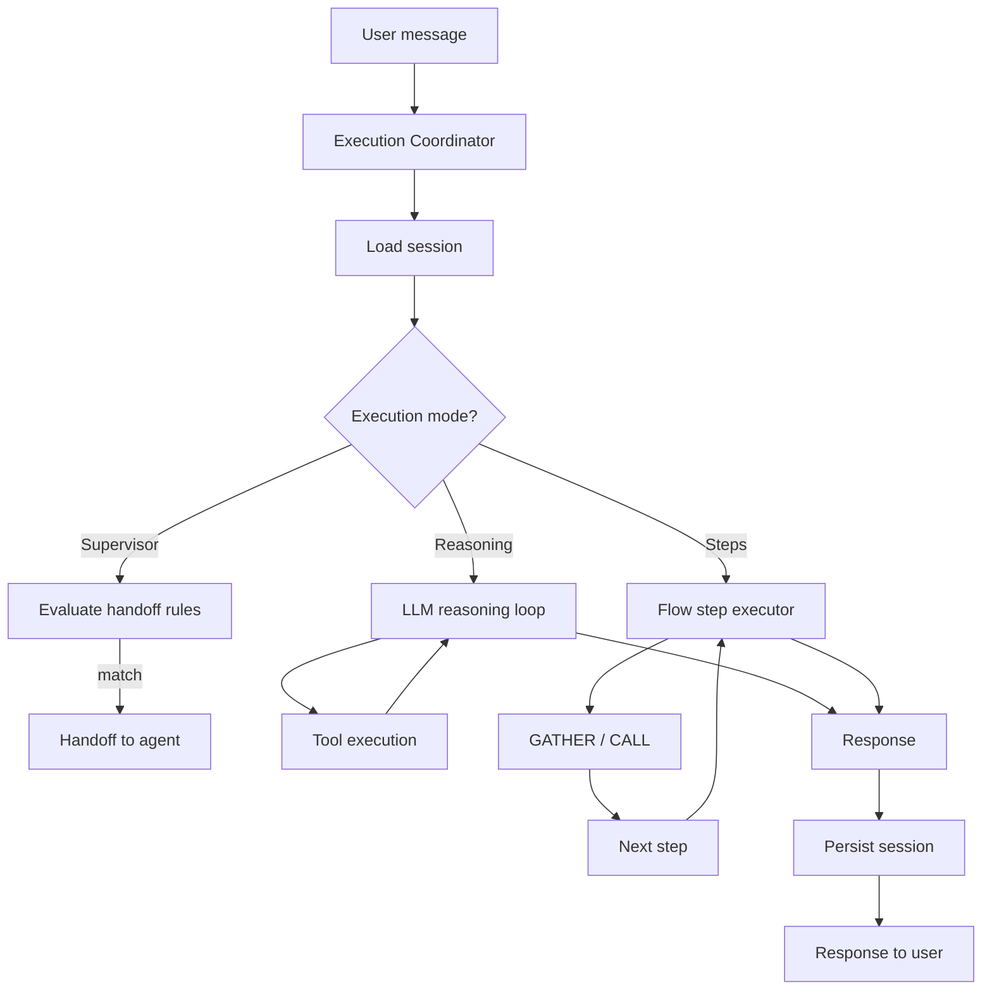

When a user sends a message, it triggers a chain of processing that spans session management, agent logic, LLM calls, tool execution, and state persistence. This section walks through that chain so you understand what happens behind the scenes and how to observe it.

### The message processing loop

Every message enters through the execution coordinator, which is the single entry point for all message processing. The coordinator handles concurrency — it ensures messages for the same session are processed in the right order based on the session's concurrency strategy. The coordinator also provides deduplication: if the same message arrives twice (common with network retries), the second submission returns the result of the first rather than processing the message again.

The coordinator loads the session from the session store. The session contains the full conversation state: which agent is active, what data has been gathered, the conversation history, and the current flow position (for agents with steps). What happens next depends on the execution mode of the agent currently active in the session.

### Supervisor execution

When a supervisor receives a message, it evaluates the message against its HANDOFF rules.

```abl
HANDOFF:
  - TO: Cancellation_Agent
    WHEN: user asks about cancellation, refund, or flight changes

  - TO: Booking_Agent
    WHEN: user asks about booking, reservations, or seat selection
```

The supervisor uses the LLM to evaluate these `WHEN` conditions. It sends the user's message along with the handoff rule descriptions and asks the LLM which rule matches. The LLM considers the full context — "I want to cancel my flight" matches the cancellation rule.

Once a match is found, the supervisor creates a new thread in the session and hands off to the target agent. The session now has two threads: the supervisor thread (paused) and the target agent thread (active). The target agent processes the original message.

If no handoff rule matches, the supervisor can respond directly or escalate to a human operator, depending on its configuration.

### Agent execution (reasoning mode)

An agent without steps runs an **agentic loop** — an iterative cycle of LLM calls and tool executions until the agent has enough information to respond.

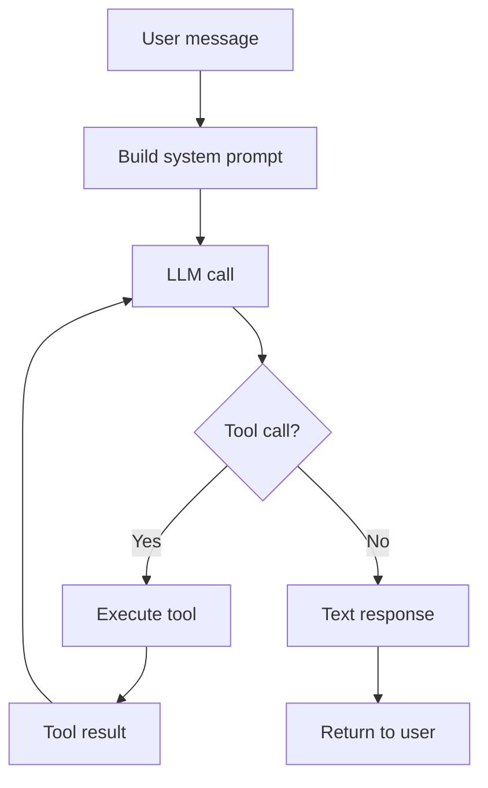

Here is what happens in the loop:

**1. Build the system prompt.** The platform constructs a system prompt from the agent's GOAL, PERSONA, INSTRUCTIONS, and current conversation context. It includes the available tools as structured function definitions and any gathered data or session variables.

**2. Call the LLM.** The system prompt, conversation history, and user message go to the configured LLM. The model returns either a text response or one or more tool calls.

**3. Execute tools (if requested).** When the LLM requests a tool call, the platform executes the tool against the configured backend. Tool results are added to the conversation and the loop returns to step 2. The LLM sees the tool result and decides whether it needs to call another tool or can respond to the user.

**4. Return the response.** When the LLM produces a text response (no more tool calls), the response is sent back to the user.

The loop has configurable iteration limits to prevent runaway execution. If the agent exceeds the maximum number of tool-call iterations, the platform intervenes with a fallback response.

#### System tools

In addition to the tools you define, agents in reasoning mode have access to system tools that control the conversation flow:

- **handoff**: Transfer to another agent in the project
- **delegate**: Run a sub-task with another agent and incorporate the result
- **complete**: Mark the task as done
- **escalate**: Transfer to a human operator with context
- **fan_out**: Execute multiple sub-tasks in parallel

The LLM decides when to invoke these based on the agent's completion conditions, handoff rules, and the conversation context. You do not call system tools directly in ABL — the platform makes them available to the LLM automatically based on your agent configuration.

### Agent execution (step mode)

An agent with a FLOW section follows its step definitions sequentially. Each step has a specific action (GATHER, CALL, RESPOND) and an explicit transition (THEN) to the next step.

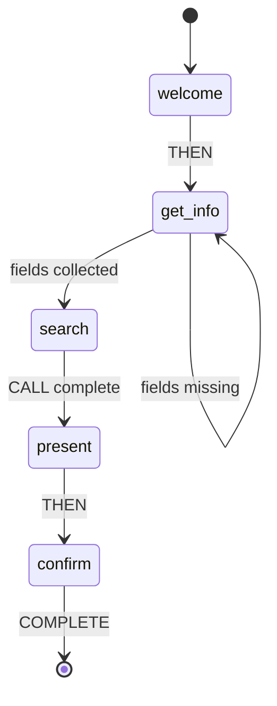

**1. Identify the current step.** The session tracks which flow step is active. When a message arrives, the platform knows exactly which step to execute.

**2. Execute the step action.**

- **GATHER**: The platform extracts field values from the user's message. It uses entity extraction (either LLM-based or rule-based) to pull structured data from natural language. "My name is Sarah and my email is sarah@example.com" can populate both `name` and `email` fields in a single message.
- **CALL**: The platform executes a tool with the specified parameters, populated from session variables.
- **RESPOND**: The platform sends a message to the user, interpolating session variables into the template.

**3. Check transition conditions.** If the step has a `THEN` clause, the platform evaluates whether the transition can fire. For GATHER steps, this means checking whether all required fields have been collected. If fields are missing, the platform stays on the current step and prompts for the missing values.

**4. Advance to the next step.** When the transition condition is met, the flow moves to the next step and executes its action. Some transitions happen automatically (RESPOND followed by THEN), while others wait for user input (GATHER waits until fields are collected).

#### Reasoning steps within a flow

When a flow step has `REASONING: true`, the step exits the deterministic flow engine and enters the agent's reasoning loop. The step provides an instruction set, and the LLM handles the interaction until the step's goal is achieved.

This is powerful for steps that need judgment — an "assess claim" step in an insurance flow, a "negotiate price" step in a sales flow, or a "diagnose issue" step in a technical support flow. The surrounding deterministic steps ensure the process stays on track.

### Tool execution

Tools are the bridge between agents and external systems. When a tool executes, the platform:

1. **Resolves the tool binding.** The deployment configuration maps tool names to actual endpoints.
2. **Validates inputs.** Tool parameters are checked against their declared types before the call is made.
3. **Makes the external call.** The platform sends the request to the configured endpoint with the appropriate authentication.
4. **Processes the result.** The response is validated and made available to the agent (in the conversation context for agents in reasoning mode, or as session variables for agents with steps).
5. **Handles errors.** If the tool call fails, the platform checks ON_ERROR handlers for retry logic, fallback responses, or escalation triggers.

Tool execution includes timeout enforcement, error categorization, and automatic retry for transient failures. Large tool results are compressed to stay within context window limits.

### Constraints and guardrails

Throughout execution, the platform enforces constraints defined in your agent:

```abl
CONSTRAINTS:
  pre_refund:
    - REQUIRE order.eligible == true
      ON_FAIL: "This order is not eligible for a refund."
    - REQUIRE refund_amount <= 1000
      ON_FAIL: ESCALATE "Refund exceeds automatic approval limit"
```

Constraints are evaluated at specific checkpoints:

- **Before tool calls**: Pre-conditions are checked before executing a tool
- **After data collection**: Gathered values are validated against constraint rules
- **At completion**: Final conditions are verified before the agent marks the task as done

When a constraint fails, the configured ON_FAIL action executes. This might be a message to the user, a handoff to another agent, or an escalation to a human operator.

Guardrails provide additional safety checks on agent output — content moderation, PII detection, topic boundaries, and format validation. These run after the LLM generates a response but before the response reaches the user.

### Tracing and observability

Every execution emits trace events that capture the full decision path. Traces let you answer questions like:

- Why did the agent hand off to this specific agent?
- Which tool calls were made, and what did they return?
- How long did each step take?
- What data was gathered at each point in the conversation?

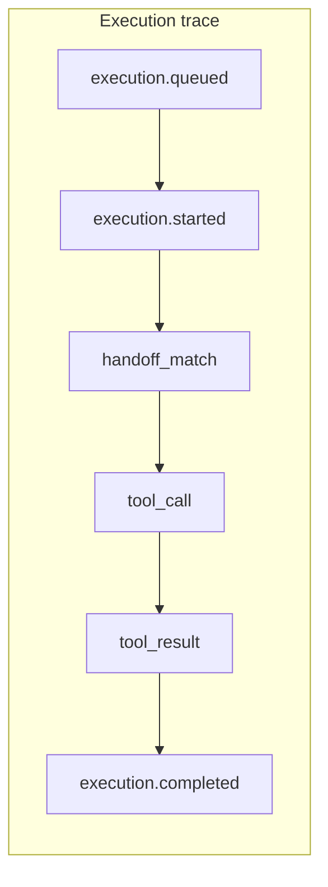

Key trace events include:

| Event                 | What it captures                            |
| --------------------- | ------------------------------------------- |
| `execution.queued`    | Message received, position in queue         |
| `execution.started`   | Processing begins, agent identified         |
| `handoff_match`       | Supervisor routing decision and target      |
| `tool_call`           | Tool name, parameters, timing               |
| `tool_result`         | Tool response, success/failure, duration    |
| `gather_extraction`   | Fields extracted from user message          |
| `constraint_check`    | Constraint evaluation, pass/fail            |
| `flow_transition`     | Flow step change with reason                |
| `thread_return`       | Child agent returning to parent             |
| `execution.completed` | Final response, total duration, token usage |

Traces are available in Studio's session detail view, where you can step through each event chronologically. For programmatic access, traces are available through the platform API.

> **Tip:** Set the trace verbosity to "verbose" during development to see detailed decision reasoning — why the LLM chose a specific tool, why a constraint passed or failed, and how entity extraction matched values to fields.

### Putting it all together

Here is the complete picture for a multi-agent message:

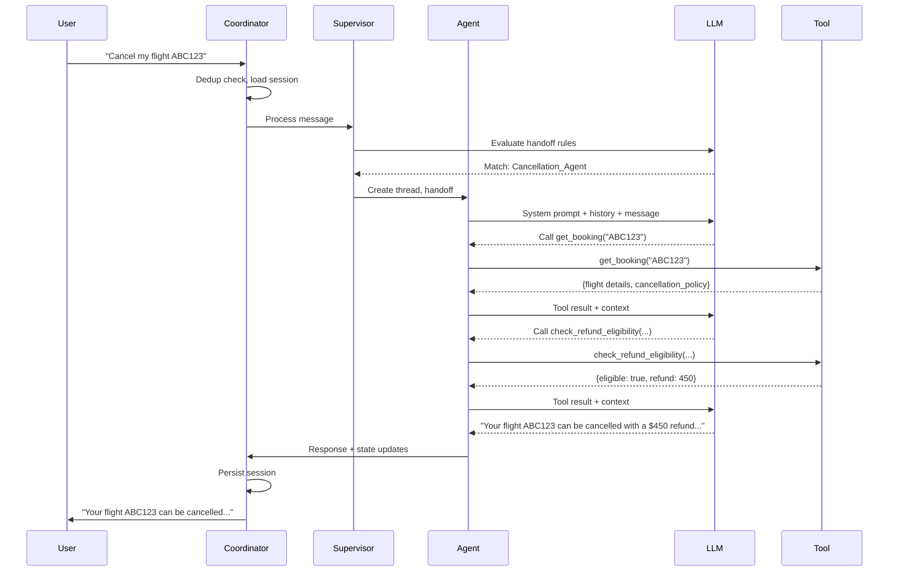

The execution coordinator manages concurrency and deduplication. The supervisor handles routing. The agent runs the reasoning loop with the LLM and tools. The session persists all state. And trace events capture every decision for observability.
