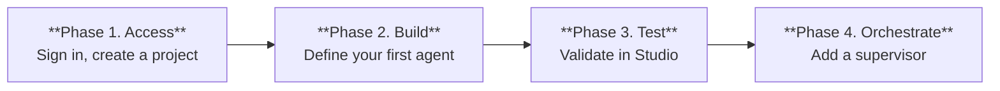

Build and deploy your first AI agent without installing anything. All you need is a browser and an account.

## Prerequisites

- A web browser (Chrome, Firefox, Safari, or Edge).
- An Agent Platform 2.0 account - [sign up free at ablplatform.com](https://ablplatform.com).

## Key Terms

| Term | Description |
| --- | --- |
| **Project** | Top-level container for agents, knowledge bases, tools, and settings. Everything in ABL is project-scoped. |
| **Agent** | An AI-powered entity that converses with users, uses tools, and coordinates with other agents. Agents reason by default and optionally include a `FLOW` section with structured steps. |
| **ABL (Agent Blueprint Language)** | Schema-driven DSL for multi-agent orchestration. Spans the full control spectrum from autonomous delegation to deterministic state machines. Compiles into immutable, auditable artifacts. |
| **IR (Intermediate Representation)** | Compiled output of ABL definitions. The Runtime executes the IR — you do not interact with it directly. |
| **Session** | A conversation between an end user and an agent. Tracks conversation history, collected data, and execution state. |
| **Tenant** | Organizational boundary. All resources — projects, agents, knowledge bases, and credentials — are isolated within a tenant. |


## Setup Guide

Set up your first multi-agent system in four phases:



### Phase 1: Access Studio

**Sign up and log in**

Go to [ablplatform.com](https://ablplatform.com) and create your account. After verifying your email, you land in **Studio** — the browser-based IDE where you build, test, and manage your agents.

**Create your first project**

Click **New Project** from the Studio dashboard. Give it a name like "My First Agents" and select a workspace. Projects organize your agents, supervisors, tools, and knowledge sources in one place.

### Phase 2: Build your First Agent

Inside your project, click **New Agent**. Open the ABL editor and paste this definition:

```abl
AGENT: Support_Assistant

EXECUTION:
  model: claude-sonnet-4-5-20250929

GOAL: |
  Help customers with product questions. Be concise
  and friendly. If you do not know the answer, say so.

PERSONA: |
  Helpful product support assistant. Answers questions
  clearly and concisely.

LIMITATIONS:
  - "Cannot process payments or refunds"
  - "Cannot access customer account information"

TOOLS:
  search_knowledge(query: string) -> {results: object[], totalCount: number}
    description: "Search the product knowledge base"

INSTRUCTIONS: |
  1. Understand the customer's question
  2. Search the knowledge base for relevant information
  3. Provide a clear, sourced answer
  4. If unsure, offer to connect with a human agent
```

This definition creates an agent that:

- Uses an LLM to understand customer questions.
- Searches a knowledge base for answers.
- Responds with sourced information.
- Has clear boundaries on what it can and cannot do.

Click **Save** to validate your definition. Studio parses ABL in real time and flags syntax issues inline.

### Phase 3: Test your Agent

Open the **Test** panel on the right side of Studio and send a message:

```
What is your return policy?
```

Your agent processes the message, searches for relevant knowledge, and responds. The trace viewer below the chat shows the full execution — LLM calls, tool invocations, and reasoning steps.

Send a few more messages to see the agent handle different questions, maintain context across turns, and respect its defined limitations.

### Phase 4: Add a Supervisor

Create a new **Supervisor** in your project and paste this definition:

```abl
SUPERVISOR: Product_Supervisor

EXECUTION:
  model: claude-sonnet-4-5-20250929

GOAL: |
  Route customer queries to the right specialist agent.

HANDOFF:
  - TO: Support_Assistant
    WHEN: user asks about products, features, or general help
    PASS: query

  - TO: Billing_Agent
    WHEN: user asks about invoices, payments, or subscriptions
    PASS: query
```

The supervisor evaluates each incoming message and routes it to the right agent, passing conversation context along. Test it the same way — open the **Test** panel and send messages that should route to different agents.

## What Have You Built

In a few minutes, you created:

- An **agent** that understands natural language, retrieves knowledge, and enforces boundaries.
- A **supervisor** that routes messages to the right specialist.
- **Observable traces** for every execution step, visible right in Studio.

## Next Steps

- [Your first agent tutorial](/agent-platform-v2/tutorials/build-your-first-agent) — Build a complete agent with tools, knowledge, and guardrails.
- [Multi-agent orchestration](/agent-platform-v2/tutorials/multi-agent-and-knowledge) — Design supervisor routing with handoff, delegation, and escalation.
- [Platform overview](/agent-platform-v2/platform-overview) — Understand what makes ABL different from other frameworks.
- [ABL language reference](/agent-platform-v2/abl-reference/language-overview) — Full language specification for all ABL constructs.

<Tip>Check out the **Template Gallery** in Studio for ready-made agent definitions across industries — airlines, retail, banking, telecom, travel, and more.</Tip>

---
