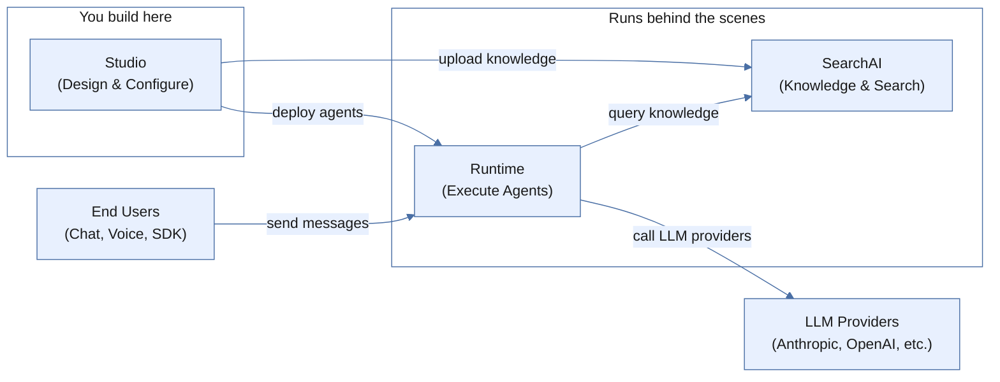
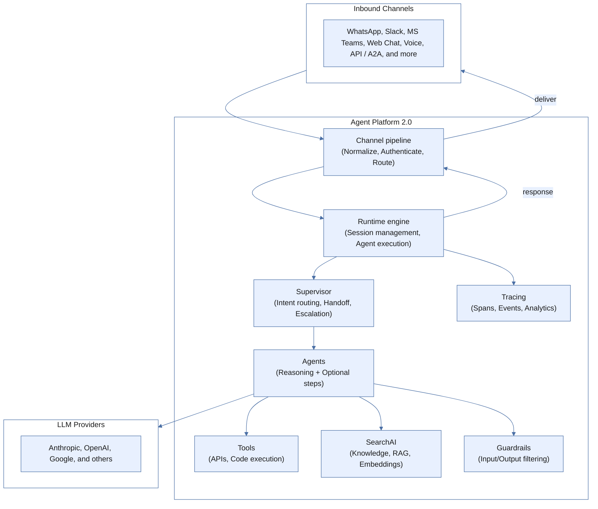
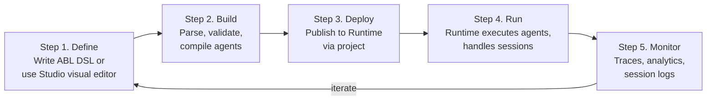

The all-new Agent Platform 2.0 is an enterprise agent platform for defining, orchestrating, and deploying AI agents using a purpose-built domain-specific language (DSL). Describe _what_ your agents should do in a structured, human-readable format — the platform handles execution, routing, channels, and observability.

- **DSL-driven development** — Define agents in ABL, a declarative language designed for agent behavior. No framework boilerplate.
- **Multi-agent orchestration** — Supervisors route conversations to specialist agents with handoff, delegation, escalation, and fan-out patterns built in.
- **Enterprise-grade by default** — Multi-tenant isolation, encryption at rest and in transit, audit logging, and guardrails are platform primitives, not afterthoughts.


## Platform Components

Three services cooperate to build and run agents. You interact primarily with Studio; Runtime and SearchAI operate behind the scenes.



| Component | Description |
| --- | --- |
| [Studio](/agent-platform-v2/studio) | Browser-based development environment. Design agents with ABL DSL or the visual editor, configure tools and guardrails, upload knowledge, and deploy to production. |
| [Runtime](/agent-platform-v2/runtime) | Agent execution engine. Receives messages, executes agent logic, calls LLM providers, invokes tools, enforces guardrails, and manages sessions. |
| [SearchAI](/agent-platform-v2/search-ai) | Knowledge base and RAG pipeline. Handles document ingestion, chunking, embedding, indexing, and hybrid retrieval. |
| [Tools](/agent-platform-v2/features) | Bridge between agents and external systems. Includes built-in search tools, custom API-backed tools, and sandboxed code execution. |
| [Channels](/agent-platform-v2/features) | Connects agents to users across 20+ messaging, voice, web, and enterprise platforms. Agent logic stays the same regardless of channel. |


## Platform Architecture

The following diagram shows how inbound messages flow through the platform — from channel ingestion through the runtime engine, agent execution, and back to the user.



## Key Capabilities

| Capability | Description |
| --- | --- |
| [Declarative Agent Definition](#declarative-agent-definition) | Define agents in ABL DSL — declare goals, tools, and behavior without framework boilerplate. |
| [Per-Step Reasoning Control](#per-step-reasoning-control) | Control LLM usage at the step level to balance cost, latency, and predictability. |
| [Multi-Agent Orchestration](#multi-agent-orchestration) | Route conversations across specialist agents using handoff, delegation, escalation, and fan-out patterns. |
| [Communication Channels](#communication-channels) | Deploy agents across 20+ messaging, voice, web, and enterprise channels without changing agent logic. |
| [Knowledge Base with RAG](#knowledge-base-with-rag) | Ingest documents and retrieve them using semantic, structured, or hybrid search — no custom retrieval code. |
| [Built-In Evaluation Framework](#built-in-evaluation-framework) | Test agents with synthetic personas, multi-turn scenarios, and LLM-based evaluators before production. |
| [Enterprise Security](#enterprise-security) | Multi-tenant isolation, encryption, audit logging, and guardrails built into the platform. |

### Declarative Agent Definition

ABL agents are defined in a purpose-built DSL, not imperative code. You declare the agent's goal, tools, and behavior — the runtime handles execution.

```yaml
AGENT: Policy_Advisor

EXECUTION:
  model: claude-sonnet-4-5-20250929

GOAL: |
  Answer airline policy questions using semantic search
  over policy documents.

TOOLS:
  search_hybrid(index_id: string, query: string, top_k: number) -> {results: object[]}

INSTRUCTIONS: |
  1. Analyze query for airline-specific terms
  2. Execute search_hybrid with query and filters
  3. Synthesize a clear policy answer with source attribution
```

This 15-line definition replaces several hundred lines of framework setup code. The DSL is version-controlled, diffable, and readable by non-engineers.

### Per-Step Reasoning Control

ABL lets you control LLM reasoning at the step level within a single agent. Deterministic steps (data gathering, API calls, template responses) run without LLM calls. Reasoning steps use the LLM to make intelligent decisions. You control cost, latency, and predictability per step.

### Multi-Agent Orchestration

A Supervisor routes conversations to specialist agents based on intent, context, and priority. Orchestration patterns supported out of the box:

| Pattern | Description |
| --- | --- |
| **Handoff** | Route a conversation to a specialist agent. |
| **Delegation** | Send a sub-task to an agent and get results back. |
| **Escalation** | Transfer to a human agent with full context. |
| **Fan-out** | Run multiple agents in parallel and merge results. |
| **Return routing** | Agent completes its task and returns control to the supervisor. |

### Communication Channels

Deploy agents to any channel without changing agent logic. The platform adapts responses to each channel's native format.

| Category | Channels |
| --- | --- |
| **Messaging** | WhatsApp, Slack, Microsoft Teams, Telegram, Messenger, Instagram, LINE, Twilio SMS |
| **Voice** | VXML, Kore Voice Gateway, AudioCodes, Twilio Voice, LiveKit, Pipeline Voice |
| **Web** | Web Chat, SDK WebSocket, AG-UI |
| **Enterprise** | Zendesk, Genesys, Email |
| **API** | HTTP, HTTP Async, Agent-to-Agent (A2A) |

### Knowledge Base with RAG

SearchAI provides a full retrieval-augmented generation pipeline. Upload documents and the platform handles chunking, embedding, indexing, and retrieval. No custom retrieval code required.

- **Semantic search** — Vector-based similarity search.
- **Structured search** — Metadata-filtered queries with vocabulary resolution.
- **Hybrid search** — Combines semantic and structured approaches.

### Built-In Evaluation Framework

Test agents systematically before deploying to production.

- **Personas** — Define synthetic user profiles with demographics, behavior patterns, and communication styles.
- **Scenarios** — Create multi-turn conversation scripts that exercise specific agent behaviors.
- **Evaluators** — Configure LLM-based judges that score responses on custom criteria.
- **Eval runs** — Execute evaluation sets at scale and compare results across agent versions.

### Enterprise Security

| Capability | Implementation |
| --- | --- |
| **Multi-tenant isolation** | Every query is scoped to a tenant. Cross-tenant access is architecturally prevented. |
| **Encryption** | Data encrypted at rest and in transit. |
| **Audit logging** | Every agent action, tool call, and administrative change is logged. |
| **Guardrails** | Input and output guardrails filter content before and after LLM processing. Defined in ABL DSL. |

## Developer Workflow

Building an agent follows a natural progression from design to deployment.



1. **Define** — Create a project and write agent definitions in ABL or Studio's visual editor. A project contains your agents, tools, knowledge bases, and configuration.
2. **Build** — The parser validates ABL syntax and compiles it into an Intermediate Representation (IR) the Runtime executes.
3. **Deploy** — Publish agents to Runtime and connect them to channels (web widget, voice, API, or channel integrations).
4. **Run** — End users send messages; Runtime executes agent logic, retrieves knowledge, and applies guardrails.
5. **Monitor** — Review traces, session analytics, and evaluation results. Refine agent definitions based on real usage.


## Deployment Options

| Option | Description |
| --- | --- |
| **Cloud (SaaS)** | Default experience. Sign up, open Studio in your browser, and start building — nothing to install or manage. |
| **Self-hosted (Enterprise)** | For organizations requiring on-premises deployment. Same platform capabilities, available for enterprise customers with data-residency or compliance requirements. |

---
