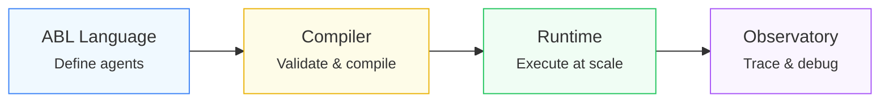

> **You can build an agent in a day. We spent years building the platform so that agent still works on day 1,000.**

## The Problem

Every enterprise building AI agents follows the same path: prototype in a week, then spend quarters on guardrails, observability, tool management, versioning, compliance, and multi-team support. Each layer of production readiness is a quarter of engineering time nobody planned for.

AI coding tools (Claude Code, Cursor, Copilot) are extraordinary — but they solve the _coding_ problem. The agent platform problem isn't coding. It's **the thousand design decisions that determine whether your agents are flexible enough for tomorrow's use case or locked into today's assumptions.**

---

## 1. The Representation Problem

Before you write a single line of agent logic, you face a foundational question: **how do you represent an agent?**

The landscape today is fragmented by philosophy:

- **LangGraph, CrewAI** — flow-driven. You draw a graph. Agents follow it. Works great until your use case doesn't fit a graph.
- **AutoGen** — reasoning-loop-driven. Agents think in loops. Powerful for open-ended tasks. Terrible when you need deterministic, auditable steps.
- **Raw code** — maximum flexibility, zero standardization. Every agent is a snowflake.

What's actually needed is a representation that covers the _entire spectrum_ — from rigid step-by-step flows to open-ended reasoning to hybrid patterns. One representation. One compilation target. One deployment model.

**This is a language design problem, not a coding problem.** AI can generate code in any framework. It cannot design an abstraction that unifies flow-driven and reasoning-driven paradigms while remaining compilable, versionable, and debuggable.

That's why we created ABL (Agent Blueprint Language) — a purpose-built DSL that compiles to an intermediate representation executed by a production runtime.

---

## 2. The Governance Ceiling

You can build guardrails. You can call a PII detection API. But when do you hit the ceiling?

- Can your guardrails **cascade across tiers** — fast regex first, then a classification model, then an LLM judge?
- Can different **agents in the same project** have different guardrail policies?
- When a guardrail fires, can it **reask**, **redact**, **escalate**, or **block** — and can this vary per rule?
- Can you add a **new guardrail provider** without modifying the orchestration layer?
- Do your guardrails work **in streaming** — not after the full response, _during_ token emission?

Each is buildable in isolation. Together, they form a **governance engine** — and the design decisions between them are the hard part.

---

## 3. The Tool Ecosystem

Tool calling looks solved. The LLM returns a function call, you execute it, done. Now consider:

| Challenge                | What It Actually Requires                                                              |
| ------------------------ | -------------------------------------------------------------------------------------- |
| **Auth diversity**       | OAuth2 refresh tokens, API keys, mTLS, VPN tunneling — credential lifecycle management |
| **Protocol maintenance** | REST today, MCP tomorrow, GraphQL next month — protocol abstraction layer              |
| **Discovery & schema**   | Dynamic tool registration, versioning, permission scoping, deprecation                 |
| **Execution guarantees** | Exactly-once for payments, retry-freely for reads — per-tool execution policies        |

You can build tool calling. You cannot build a tool _platform_ — because the complexity isn't in making the call, it's in everything around the call.

---

## 4. The Interface Trap

| Approach                    | Promise             | Reality                                                                              |
| --------------------------- | ------------------- | ------------------------------------------------------------------------------------ |
| **Code-only** (SDKs)        | Maximum power       | Only your best engineers can build agents. Maintenance grows linearly.               |
| **UI-only** (drag-and-drop) | Democratized access | You hit the wall in a week. Every requirement becomes "the UI doesn't support that." |
| **AI-generated code**       | Best of both worlds | Works today. In 6 months, nobody understands it.                                     |

**The fourth option**: AI programs _abstractions_, not implementations. An agent defined in ABL compiles to a runtime that handles orchestration, governance, and deployment — the same definition works when you switch LLM providers, add guardrails, or change targets.

---

## 5. The Invisible Problems

These don't feel urgent until they're existential:

- **Observability**: Not logging — _tracing_. Walk backwards through the exact reasoning chain, see which guardrail fired, which tool timed out, which handoff failed. This requires instrumentation designed into the platform, not bolted on.
- **Scale**: Not "more requests" — **more agents, more teams, more diverse use cases**. Can team A deploy a change without breaking team B's agent that depends on the same tool?

---

## Why Agent Platform 2.0

Agent Platform exists because every enterprise that builds their own agent infrastructure follows the same path: prototype → guardrails → observability → tool management → versioning → compliance → multi-team support. Each step is a quarter of engineering time they didn't plan for.

**We've already walked that path.** The platform provides:

- **ABL** — A language designed for agents, not Python glue code
- **Compiler** — Validates, optimizes, and produces deployable IR
- **Runtime** — Stateless execution with session management, tool orchestration, guardrails, multi-agent handoffs
- **Studio** — Browser IDE with visual editing, testing, and deployment
- **SearchAI** — Full RAG pipeline for knowledge-powered agents
- **Observatory** — Distributed tracing, diagnostics, and debugging

> Build on top of where we are, not from where we were.
