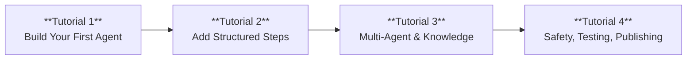

Step-by-step tutorials, from creating your first agent to deploying a production-ready system. Each tutorial builds on the previous one.

The tutorials use three example projects that introduce distinct capabilities:

| Project | Tutorials | Capabilities Covered |
| --- | --- | --- |
| Bean & Brew Greeter / Travel Assistant | Tutorial 1 | Agent definition, tools, tool types, tracing |
| Hotel Booking Agent | Tutorial 2 | Flows, data collection, branching, tool results |
| Retail Support System | Tutorial 3 | Supervisor routing, multi-agent context, knowledge bases, RAG |
| Safe Assistant | Tutorial 4 | Guardrails, constraints, evaluations, channels, monitoring |

The tutorials follow a progressive learning path. Start with **Build Your First Agent** and work through them sequentially for the best experience.

---

<CardGroup cols={2}>
  <Card title="1. Build Your First Agent" icon="robot" href="/agent-platform-v2/tutorials/build-your-first-agent">
    Create a coffee shop greeter agent, then extend it into a travel assistant that calls external APIs.

    **You'll learn:**
    - Define agents using `AGENT`, `GOAL`, `PERSONA`, `INSTRUCTIONS`, and `LIMITATIONS` blocks
    - Add inline, HTTP, MCP, and sandbox tool contracts
    - Import shared tools from `.tools.abl` files
    - Test agents and read trace output in Studio

    **Prerequisites:** An Agent Platform 2.0 account with at least one project.
  </Card>

  <Card title="2. Add Structured Steps to an Agent" icon="list-ol" href="/agent-platform-v2/tutorials/build-a-scripted-flow">
    Add a `FLOW` section to a hotel booking agent that guides users step-by-step through a reservation.

    **You'll learn:**
    - Structure a conversation with named steps and `THEN` transitions
    - Collect typed user input with `GATHER`
    - Branch on user responses with `ON_INPUT`
    - Handle tool call results with `ON_SUCCESS` and `ON_FAIL`

    **Prerequisites:** Completed [Build Your First Agent](/agent-platform-v2/tutorials/build-your-first-agent).
  </Card>

  <Card title="3. Multi-Agent and Knowledge" icon="network-wired" href="/agent-platform-v2/tutorials/multi-agent-and-knowledge">
    Build a retail support system with a supervisor that routes to specialist agents, then add a knowledge base for RAG-powered answers.

    **You'll learn:**
    - Create a `SUPERVISOR` with `HANDOFF` routing rules
    - Pass context between agents with `CONTEXT` and `RETURN`
    - Ingest documents into a knowledge base
    - Connect knowledge base search tools to agents

    **Prerequisites:** Completed [Add Structured Steps to an Agent](/agent-platform-v2/tutorials/build-a-scripted-flow).
  </Card>

  <Card title="4. Safety, Testing and Publishing" icon="shield-check" href="/agent-platform-v2/tutorials/safety-testing-publishing">
    Add guardrails, run automated evaluations, and publish your agent to a Web channel with production monitoring.

    **You'll learn:**
    - Configure input and output `GUARDRAILS` for PII and toxicity
    - Enforce business logic with `CONSTRAINTS`
    - Create test personas, scenarios, and evaluators
    - Publish to a channel and monitor sessions and errors in production

    **Prerequisites:** Completed [Build Your First Agent](/agent-platform-v2/tutorials/build-your-first-agent).
  </Card>
</CardGroup>

---
