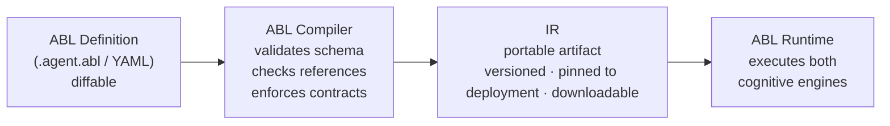

Agent Blueprint Language (ABL&trade;) is the typed, schema-driven language used to define agents on the platform. Every agent — its identity, tools, memory, routing, constraints, and guardrails — is expressed in a single ABL definition. The compiler validates it. The runtime executes it across both cognitive engines.

ABL definitions are YAML artifacts. The same blueprint compiles to the same abstract syntax tree (AST) and intermediate representation (IR), whether authored directly in ABL syntax or generated by Arch&trade; AI.

## What ABL defines

A single ABL definition covers the full specification of an agent. Each construct maps to a runtime capability enforced by the compiler.

| Construct       | What It Specifies                                                                                                                  |
|-----------------|------------------------------------------------------------------------------------------------------------------------------------|
| **Identity**    | Agent name, type, persona, and goals.                                                                                              |
| **Execution**   | LLM model, temperature, iteration limits, and timeout.                                                                             |
| **Tools**       | Typed function signatures the agent can call, with input/output contracts.                                                         |
| **Memory**      | Short-term session state and long-term persistent state.                                                                           |
| **Handoffs**    | Typed routing to specialist agents, including context grants and return expectations.                                              |
| **Delegates**   | Inline sub-agent calls that answer a sub-question without transferring thread ownership.                                           |
| **Constraints** | `REQUIRE` / `ON_FAIL` business rules enforced at runtime.                                                                          |
| **Guardrails**  | Input and output policy checks — PII redaction, topic scope, hallucination guards — compiled into the agent, not added externally. |
| **Flow**        | Optional step-by-step orchestration for interactions where the execution path is completely deterministic.                         |

## Compilation pipeline

ABL definitions move through three stages before they execute. The ABL source is the diffable artifact stored in version control. The compiler produces a portable IR that is versioned and pinned to a deployment, and can be downloaded. The runtime executes the IR — not the raw ABL source.



| Stage | What Happens |
| --- | --- |
| **ABL Compiler** | Validates the full definition. Catches missing tool references, broken handoffs, contract mismatches, and guardrail gaps before deployment. |
| **IR** | The compiled artifact. Environment-agnostic — the same IR runs in dev, staging, pilot, and production without modification. |
| **ABL Runtime** | Executes the IR. Runs the Agentic Brain for reasoning steps and the Deterministic Brain for constraint-enforced paths. Both share the same runtime. |

Compile-time validation runs on every commit. Broken definitions never reach a downstream environment.

## ABL compared to framework code

On framework-based stacks, building a production agent means stitching together prompts, code, and connectors across multiple languages and SDKs. The orchestration logic seems like glued code that's difficult to review, difficult to test, and brittle at scale.

ABL replaces glued code with a single declarative definition. Constructs like `HANDOFF`, `DELEGATE`, `FAN_OUT`, and `GUARDRAILS` are first-class primitives that the compiler enforces and the runtime executes, rather than patterns re-implemented per project.

| Capability                    | Framework Code                                                        | ABL                                                                                                |
|-------------------------------|-----------------------------------------------------------------------|----------------------------------------------------------------------------------------------------|
| **Compile-time validation**   | Not available — errors surface at runtime.                            | Built in — Detect missing tools, broken references, and contract violations before deployment.     |
| **Version control and diff**  | Mixed across code, prompt files, and configuration — diffs are noisy. | Clean YAML diffs — agent changes review like application code.                                     |
| **Cross-runtime portability** | Locked into the framework's runtime.                                  | IR-based — the same definition runs anywhere the runtime is deployed.                              |
| **AI authoring**              | Fragile — AI-generated framework code breaks at scale.                | Reliable — ABL has a strict schema that AI can generate, validate, and modify consistently.        |
| **Governance**                | Per-project — each team reinvents guardrails.                         | Uniform — one policy layer across every agent, regardless of who authored it.                      |

## Author ABL

You can author ABL in three ways and all produce the same compiled output.

| Method             | How It Works                                                                                                                                        |
|--------------------|-----------------------------------------------------------------------------------------------------------------------------------------------------------------------------------------------------------------------|
| **Arch AI**        | The default experience. Arch AI interviews stakeholders, proposes agent topology, generates ABL, and validates the output against the compiler before presenting it for human review. No manual ABL writing required. |
| **Studio IDE**     | The Monaco-based code editor in Agent Studio. Provides syntax highlighting, inline diagnostics, and an outline view for navigating large definitions.                                                                 |
| **External tools** | Claude Code, Cursor, and Codex connect to the platform through MCP. Agents can be authored from a CLI or IDE using the same MCP interface as the Studio.                                                              |

## ABL example

The example below shows a funds-transfer agent. It illustrates the key constructs — identity, execution parameters, typed tools, memory scope, handoffs, constraints, guardrails, and flow steps. The `REASONING: true` flag on a flow step activates the Agentic Brain for that step; `REASONING: false` runs the Deterministic Brain.

```yaml expandable
AGENT: Funds_Transfer_Agent
VERSION: "3.1.0"
DESCRIPTION: "Orchestrates domestic and international funds transfers with fraud
  screening, compliance checks, FX conversion, and full audit trail."

GOAL: |
  Guide the customer through a secure funds transfer end-to-end.
  Verify identity, check limits, screen for fraud, apply FX if needed,
  get explicit confirmation, execute, and notify all parties.
  Escalate to a human advisor for high-value or flagged transfers.

EXECUTION:
  model: claude-opus-4-7
  temperature: 0.1   // low temperature — financial precision required
  max_turns: 12
  timeout_seconds: 180

TOOLS:
  verify_customer(customer_id: string, mfa_token?: string)
    → { verified: bool, tier: string, daily_limit: number }
  screen_fraud(customer_id: string, transfer: object)
    → { risk_score: number, flags: array, decision: string }
    confirm: never   // always runs silently
  execute_transfer(customer_id: string, from_account: string,
    to_account: string, amount: number, currency: string)
    → { transfer_id: string, status: string, eta: string }
    confirm: always   // always prompts customer before executing

MEMORY:
  session:
    - customer_id
    - from_account
    - to_account
    - amount
    - currency
    - fraud_result
    - transfer_result

HANDOFF:
  - TO: Senior_Advisor_Agent
    WHEN: amount > 50000 OR fraud_result.decision == "REVIEW"
    CONTEXT: { pass: [customer_id, transfer_details, fraud_result] }
    RETURN: true

CONSTRAINTS:
  always:
    - REQUIRE customer.verified == true
      ON_FAIL: HANDOFF Authentication_Agent
    - REQUIRE fraud_result.decision != "BLOCK"
      ON_FAIL: RESPOND "This transfer has been flagged and cannot proceed."
               THEN: COMPLETE

GUARDRAILS:
  input:
    topic_scope:
      allowed: [funds_transfer, account_balance, fx_query, dispute]
      on_out_of_scope: RESPOND "I can only assist with funds transfers and related queries."
  output:
    mask_account_numbers:
      pattern: account_number_pattern
      action: show_last_4_only

FLOW:
  entry_point: verify_identity
  steps: [verify_identity, collect_transfer_details, screen, confirm, execute]

  verify_identity:
    REASONING: false
    CALL: verify_customer(customer_id)
    ON_SUCCESS: THEN collect_transfer_details
    ON_FAIL: HANDOFF Authentication_Agent

  collect_transfer_details:
    REASONING: true
    GOAL: "Collect from_account, to_account, amount, currency, optional reference."
    EXIT_WHEN: from_account IS SET AND to_account IS SET AND amount IS SET
    MAX_TURNS: 4
    THEN: screen
```

## Key properties

ABL is designed so that agents are software artifacts, not configuration. Four properties follow from that design:

- **AI-writable** — The strict schema allows Arch AI to generate, validate, and modify ABL reliably. Authoring through Arch AI is the default experience.
- **Versioned** — Every change to an agent definition produces a reviewable diff in version control, like a change to application code.
- **Diffable** — Agent behavior changes are visible in pull requests. The prompt is not the artifact; the ABL is.
- **Auditable** — The compiled IR is the immutable record of what was deployed. Compiler validation runs on every commit, so the IR in production always matches the reviewed definition.

---

{{related}}

- [ABL Language Overview](/agent-platform/abl-reference/language-overview)
