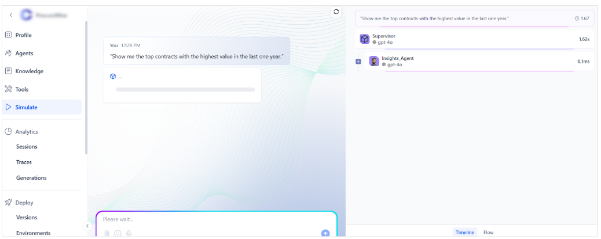
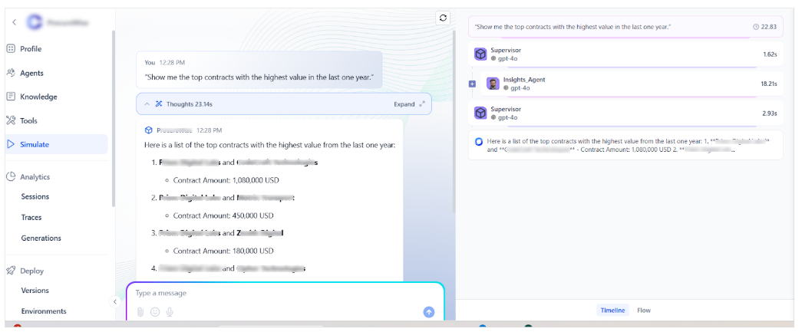
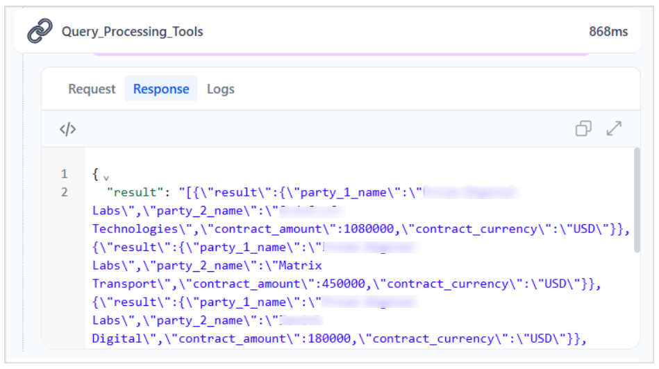
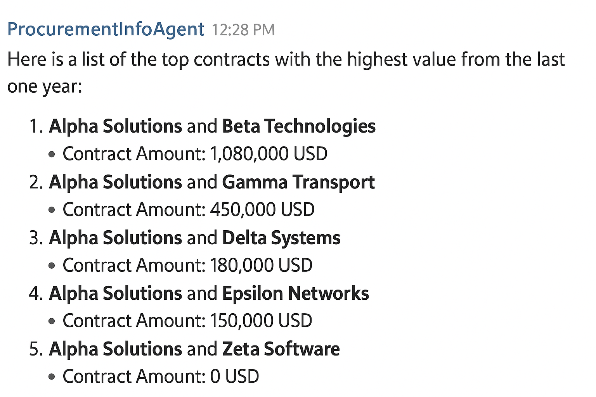

# AI Agent Example: ProcurementInfoAgent

This example walks you through the complete process of configuring a new agent-based AI application.

## Purpose

Design an AI application to analyze deals with suppliers, provide critical insights, and answer any questions related to the agreements. The application consists of two main agents:

1. **Research Agent** - Extracts and processes information from contracts.
2. **Insights Agent** - Answers user queries based on structured contract data in the database.

---

## Sample Configuration

**Name**: ProcurementInfoAgent
**Description**: An AI application to analyze deals with suppliers, provide critical insights, and answer any questions related to the agreements.

Next, define the agents for the application. The app would require the following agents. 

1. Insights Agent: This agent assists in answering questions that require accessing structured databases to provide information about listing contracts, filtering contracts based on specific criteria, and performing aggregate functions. (for example, questions involving calculations, sums, counts, averages, calculations based on some conditions, etc.). This agent won't have access to complete contract information.
2. Research Agent: Extracts all the key details from the contracts and processes the information. This agent can't respond to the user’s questions but can only act as a facilitator to process information from a document and update it in the database.

---

### Agent Configuration - Insights Agent 

**Name**- Insights Agent

**Description**- The description of the agent can be as follows:

!!!abstract "Example"
    This agent helps in answering questions that require accessing structured databases to provide information about listing of contracts, filtering of contracts based on specific criteria, and aggregate functions. (for example, questions involving calculations, sums, counts, averages, calculations based on some conditions, etc.). This agent won't have access to full contract information.

**Scope**- Define the scope as shown below:

!!!abstract "Example"
    You are an expert analyst in performing the following tasks:

    1. Analyzing user input 
    2. Rewriting the user input to include all the relevant context so that 
        2.a. Query Generator Tool can correctly create a query to get the relevant answers
        2.b. Query Processing Tool can execute the generated query  and return the relevant results.

**Instructions:** Provide instructions as listed below.

!!!abstract "Examples"
    * Always Start with the Query Generator Tool:
        - Ensure the Query Generator Tool is invoked first in every interaction. This tool is critical for analyzing the user’s input and generating an accurate, structured query.
        - Validate the generated query for completeness and relevance. If the query seems incomplete or inaccurate, refine the input and retry.

    * Handle Query Generator Tool Failures Gracefully:
        - If the Query Generator Tool fails to return a query, log the failure with detailed information about the input and tool response.
        - Provide meaningful feedback to the user, such as requesting clarification or simplifying their input.

    * Sequence of Tool Invocation:
        Only proceed to the Query Processing Tool after receiving a valid query from the Query Generator Tool. Pass the generated query directly to the Query Processing Tool as input.

    * Consistency in Using Tools:
        Never bypass or skip the execution of the Query Generator Tool. All user inputs must go through this step first to maintain a consistent process flow.


**Tools**

1. **Prism Query Generator (Workflow Tool)** - Analyzes user input and generates a SQL-like query structure. For instance, if the user query is "Show contracts signed with vendors in 2023 above $500,000. ," the output would be “SELECT * FROM contracts WHERE vendor_signed_year = 2023 AND value > 500000;.”  Prism Query Generator can be a standard workflow tool designed as shown below. 
2. **Query Processing Tool(Code Tool)** - Executes the generated query using Supabase APIs and returns results. For the above query, this tool finds the high-value contracts as requested by the user. The Query Processing Tool can be a code tool that takes the query as input and invokes an API call with the query as its input. The following code can be used to invoke the API and find the relevant contracts. 
    ```json
    const fetch = require('node-fetch');

    async function executeSQL(query) {
        const url = 'https://bldrhpiodbmcvhywchhd.supabase.co/rest/v1/rpc/execute_dynamic_query'; 
        
        const headers = {
            'Content-Type': 'application/json',
            'apikey': 'eyJ*********************8Q'
        };

        const body = JSON.stringify({ query });

        try {
            const response = await fetch(url, {
                method: 'POST',
                headers: headers,
                body: body
            });

            const responseData = await response.json();
            return JSON.stringify(responseData);

        } catch (error) {
            console.error('Error:', error.message);
            return JSON.stringify({ error: 'Error in using API' });
        }
    }

    // Execute with query parameter
    const query = $query;
    return executeSQL(query);
    ```

### Sample User Interaction

**User Prompt:** Show me the top contract with the highest value in the last one year.



**Agent Flow:**



**Prism Query Generator** is triggered and generates the query.


**Query Processing Tool** executes the query and returns structured results.



**Response:**



---

### **Summary**

With this configuration, ProcurementInfoAgent demonstrates a clean separation of responsibilities:

* The **Research Agent** is responsible for ingesting and structuring data.
* The **Insights Agent** delivers user-facing analytics based on structured inputs.
