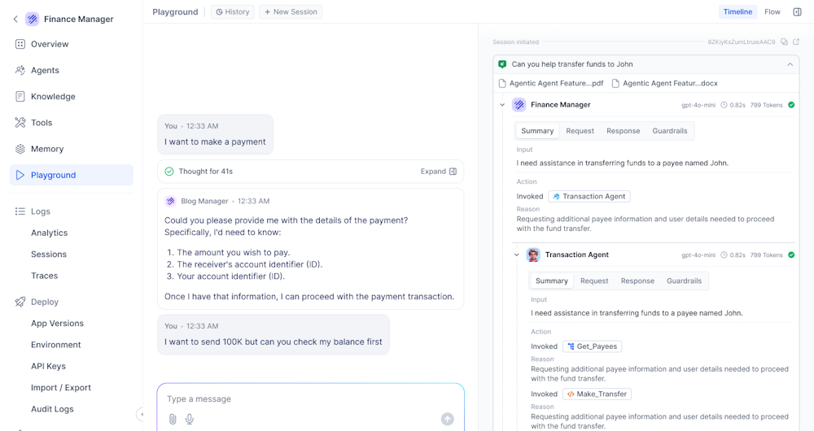
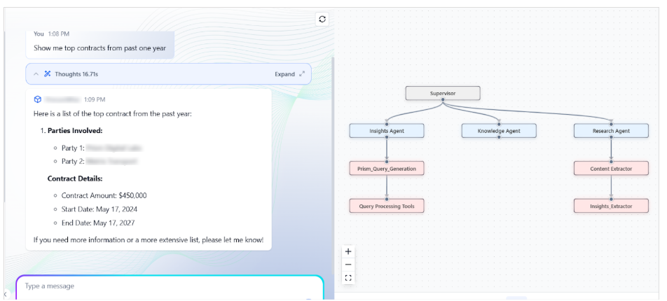
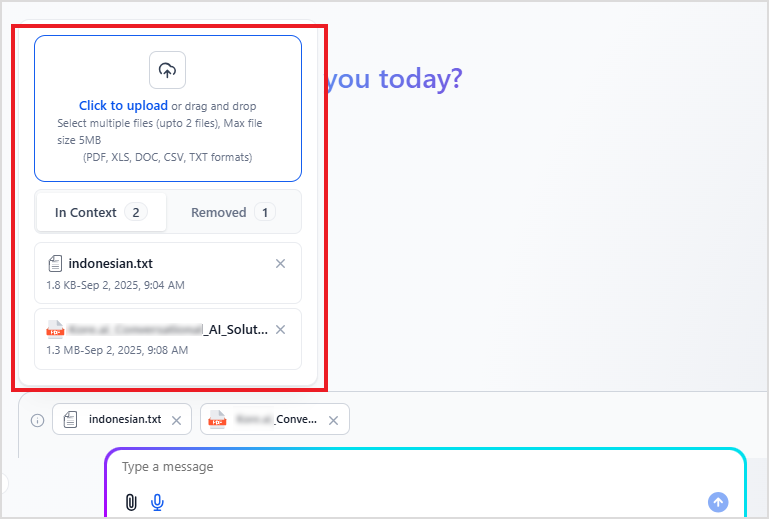
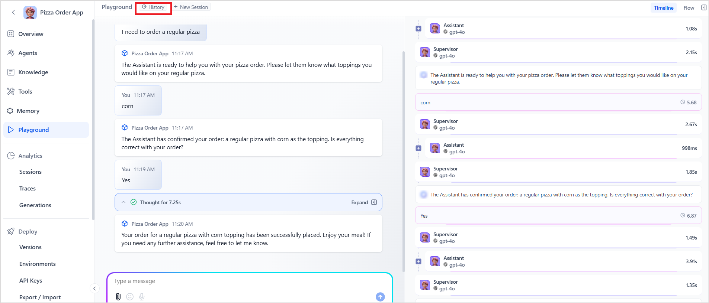
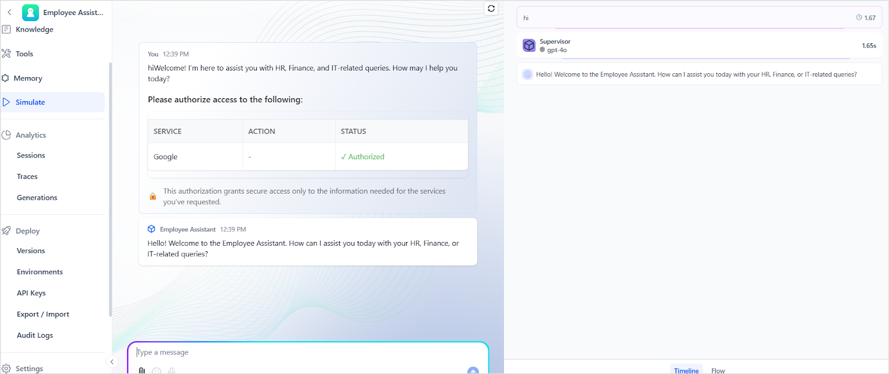

# Playground

The **Playground** provides an interactive environment to test, evaluate, and fine-tune Agentic applications in real time. It allows users to simulate conversations, experiment with configurations, and observe the behavior of the Agentic app before deploying to production. Simulating and verifying the behavior of an Agentic application before real-world deployment helps assess the accuracy and reliability of responses across various scenarios. This reduces the risk of errors, enhances the user experience, and ensures the agent performs effectively in production environments.

The **Playground** interface allows users to submit queries and view the corresponding responses generated by the agent.

## Starting a New Session

Whenever a user clicks on the Playground option, by default, a new user session is automatically created. Alternatively, use the **New Session** option at the top of the Playground interface to manually start a new session. This action:

* Clears the current conversation from the chat window.
* Initiates a new session with a blank slate.
* Does **not delete** previous conversation history (you can still access it via the **History** option).

## Playground Interface Components

**Query Input**: Enter your query in the designated input field to initiate the simulation. In addition to typing, users can also provide **voice input** using their browser’s built-in speech recognition capabilities. The Playground uses browser-based Automatic Speech Recognition (ASR) functionality. Click the microphone icon next to the input field, provide speech input, which is automatically converted to text. The recognized text is then populated in the input field, ready to be submitted as a query.

!!!note
    * Voice output isn't supported. The application only provides text-based responses. 
    * For voice input, the application uses the built-in voice capabilities of the browser, which is supported by default on most of the commonly used browsers like Chrome, Firefox, Safari, and Edge.

**Response Display**: The agent's response is displayed, providing immediate feedback on the input provided.

**Timeline(Right Panel)**: It displays a chronological timeline that shows a detailed, step-by-step timeline of how the agent processes a query. It helps trace the flow of execution and understand the contribution of each component involved in generating a response. The highlights of the timeline:

* Displays the query execution in chronological order, starting from the user's input to the final output.
* Each step in the timeline represents a distinct agent or tool(example: Supervisor, Insights_Agent) and includes the time taken to complete its task.
* Clicking on a step reveals detailed information, including:
    * Messages: The specific question or command sent to the component or received from the component, along with the reasoning or explanation of the logic used to process the request. 
    * Request: The request prompt to the component.
    * Response: Response received from the component. 
    * Debug Logs: Provides detailed, actionable status messages across agents, tools, and supervisors, with Guardrails execution logging, auto expanded current traces, and session and trace IDs for clearer visibility into execution flow.

**Flow Diagram(Right Panel):** Offers a visual representation of the overall execution flow. The flow diagram makes it easier to understand the sequence of operations. 

This detailed layout enables users to understand the sequence of operations and interactions between components quickly.

**Attachment Support**: Users can also pass contextual information to the agent through attachments. Users can upload files to the conversation using the attach icon in the query input box. 

!!!note
    * Attachments are only allowed if the Document Upload option is enabled under Playground Settings on the Configurations page.
    * The maximum number of files and file size limits are controlled by the Attachment Configurations under General Settings. [Learn More](settings/app-configurations.md).
    * When a file is uploaded in the Playground, a preview icon is automatically displayed next to the file name. This allows users to quickly identify the uploaded file before continuing the conversation.  

**Document Context Management**

The document management interface presents an enhanced experience for managing uploaded documents, organized into two distinct sections:

* ***In Context***: Lists documents currently being used as context for the ongoing conversation.
* ***Removed*:** Lists documents that have been uploaded but aren't part of the context currently. These documents can be re-added to the context at any time.

When a document is deleted from the In Context section, it's automatically moved to the Removed section. 

To restore a document from the Removed section, click the plus (+) icon. To permanently delete the attachment, click the delete icon on the file in the Removed section.

## Conversation History

The Playground automatically stores the conversation history of all user interactions with the app. Users can view and resume previous conversations using the **History** option at the top of the interface. This feature helps revisit past interactions to test continuity, debug flows, or refine prompts.

* Click the **History** button at the top of the Playground interface. 
* A list of past conversations is displayed, showing the first user message and response. Users can use the time filters to view selected conversations in the list. 
* Select the desired conversation that opens the corresponding session in the playground. 
* The user can now **review** or **continue** the conversation from where it was left off.

Points to Note:

* Each user can only view their **conversation history** with the application.
* Only the **most recent 50 messages** (including user inputs and agent responses) from a conversation are stored and restored when resuming a session. If a chat had more than 50 messages, only the last 50 will be available in the history. 
* When a past chat is resumed, the **current configuration settings** are applied to continue the interaction.
* When a session is resumed, any **attachments** from the previous session **remain accessible**. However, to use these attachments as contextual information for the current conversation, the user must **manually select them from the attachment list**.
* When resuming a session, thoughts **aren't available** for messages from the earlier session. They're only shown for messages in the **current active conversation**.

## Authorization Process for Agent Tools

If the **Auth Profiles** configured for the agent’s tools require user authorization, the request is shown at the **start of the session**.

The system evaluates whether the authorization has already been completed. 

* **If already authorized:** The status is shown as **"Authorized"** (as displayed in the image), and the agent proceeds with responding to the user's query.
* **If not authorized:** The user is prompted to **authorize access** before the agent can proceed further. A secure redirect URL will be presented for the user to complete the authorization process.

!!!note
    The agent can't execute the required actions until you complete authorization because it lacks access to protected services. In this situation, the tool fails and returns errors. If it needs more than one authorization, the interface lists all required authorizations in the table at the beginning of the interaction.

**Example**

In the following example, the agent requires access to Google services, and the status indicates that the user has already completed the auth process. 

