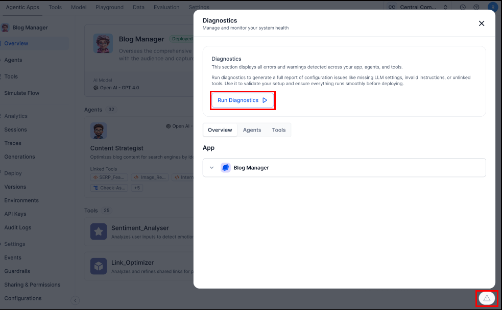
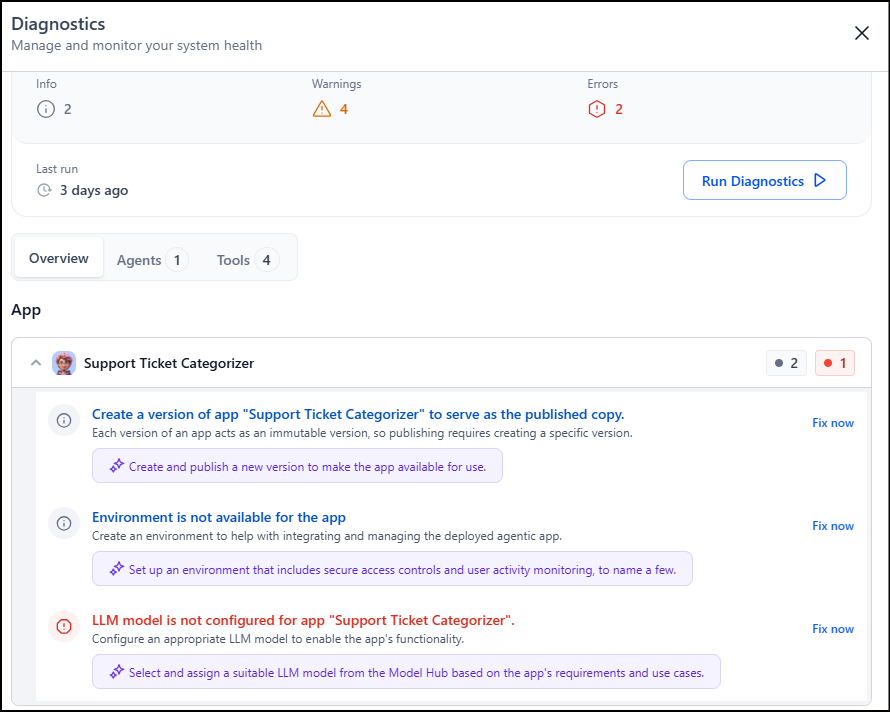

# Agentic App Diagnostics

The Agent Diagnostics feature helps you validate the health and readiness of an Agentic App. It performs a comprehensive check across all the components, including agents, tools, events, memory, and orchestration logic. Diagnostics supports all types of orchestration patterns including  Supervisor Orchestration and the Adaptive Agent Network.

When you run Diagnostics from the Agentic App Overview page, the platform scans the entire app configuration and identifies issues that may affect functionality, stability, or deployment readiness.

!!!note
    Diagnostics performs static and logical validation. It evaluates configuration health and doesn't test conversational outcomes.

**Key Highlights**

* Automatically detects and categorizes missing or misconfigured elements, prioritizing errors and warnings for efficient remediation.
* Produces detailed and actionable reports with clear recommendations tailored to each identified issue.
* Provides an overview of total errors, warnings, and passed checks for quick, at-a-glance health assessment.
* Offers guidance for every issue, facilitating prompt and effective resolution.
* Employs a consistent, repeatable validation process applying uniform standards across all deployments to ensure scalable, reliable, and proactive detection of issues, helping apps meet defined quality and operational readiness benchmarks before production.

## Steps to Run Diagnostics

1. From the Agentic App Overview page, go to *Run Diagnostics* to start the validation scan. 
2. After the scan completes, the platform generates a structured report that categorizes findings as informational messages, warnings, or errors. 
3. Review the *Diagnostic Summary*, which displays informational messages, warnings, errors, and the timestamp of the latest run.
3. Navigate through the component-level views *Overview, Agents, and Tools* to understand issues in each part of the app.
1. Use *Fix now* on any issue to open the corresponding configuration screen and resolve it immediately.
1. Re-run Diagnostics at any time to generate an updated report and confirm that all issues have been addressed.

## Components of the Diagnostics Report

| Section       | Description                                                                                     |
|---------------|-------------------------------------------------------------------------------------------------|
| **Summary**   | Displays timestamp of last run, components evaluated, and count of errors/warnings triaged or ignored. |
| **Agents**    | Lists all agents (including Supervisor if present), highlighting configuration gaps, missing tool links, or deprecated bindings. |
| **Tools**     | Includes workflow, knowledge, MCP, and code tools; flags misconfigurations, missing parameters, or logic issues. |
| **Events**    | Validates event triggers, workflows, and bindings for correctness and reliability.              |
| **Memory**    | Assesses memory references and state management readiness.                                      |
| **System Checks** | Covers platform-level validations such as graph compilation, LLM configuration, environment setup, and logical orchestration. |
