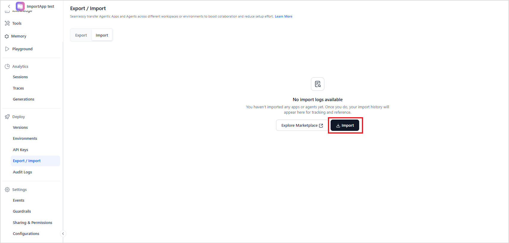
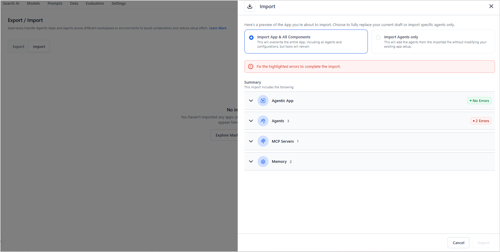
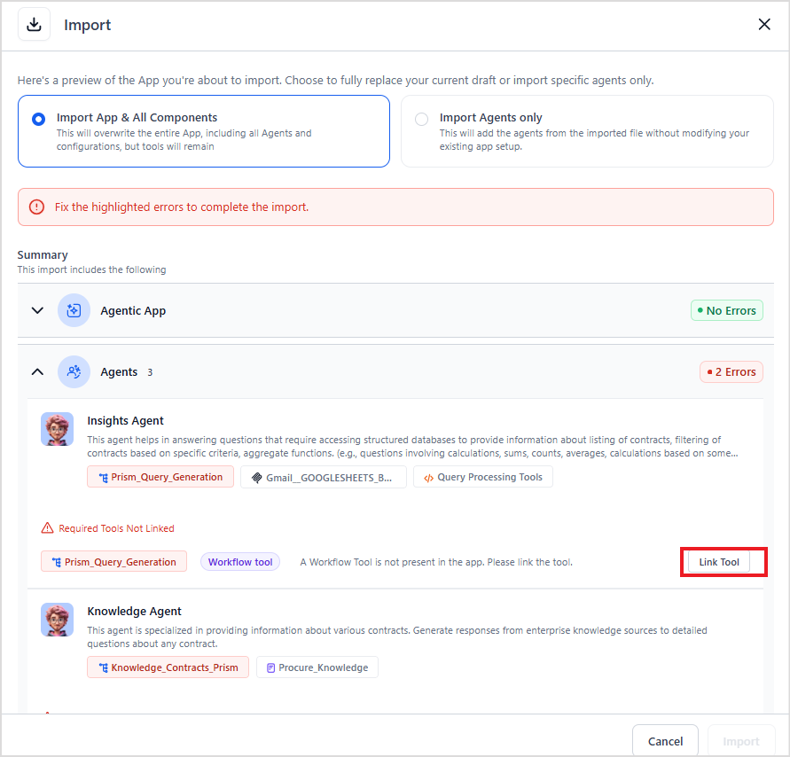

# Import Agentic Apps

The Agentic app import feature enables users to transfer complete application configurations between environments. This feature facilitates reuse, sharing, and [version management](deployment/app-deployment.md#app-versioning) of Agentic applications.

## Prerequisites

* You can import the apps and agents from the JSON files. 
* The user must have import permissions. 
* You can import configurations only into an existing application. To import an app, first create a new app, then use the import option to overwrite that app’s configuration.
 

## Steps to Import Apps and Agents

To import apps or agents into an Agentic app, follow these steps. 

* Go to the *Export/Import* page under the Deploy section of the newly created app. 
* Go to the *Import* tab. 
* Click the *Import* button and upload the JSON file you want to import. Note that the file size can't exceed 5 MB.

* Upload the config file to use for importing and click Proceed. 

* Review the app components before importing. Upon uploading the file, the page shows a summary of all the Agentic app components in the JSON file:
    * Agentic App Summary - Name and Description of the app. 
    * Agents - A list of agents, along with their descriptions and the tools associated with each agent. External agents are clearly marked for easy identification. Visual cues on this page help differentiate between the three types of tools. Note that the workflow tools aren't exported with the app exports. You must export the workflow tools individually. Workflow tools must be explicitly linked to the corresponding tools after they're imported.
    * Tools - List of tools not associated with any of the agents. 
    * Knowledge tools associated with an app.
    * MCP servers: Servers configured in the app. 
    * Events configured in the app.
    * User-defined Memory store configurations. 
    * Environment variables and namespaces.
    * Content Variables

* If the file format is correct and there are no errors, the platform configures the application using the JSON file. Note that importing a configuration overwrites all existing settings in the target application.
* You can view the status of the import under the Import tab. 
* Review and validate the imported apps and their components.
* If the system detects missing configurations in the uploaded file, it highlights them in red. Correct these errors before importing the application. 

* If there are any linked workflow tools, you need to manually import them to the new app first. Then, during the app import process, link the workflow tools in the app to the already imported tools. 

## Key Considerations for Import

* Ensure that the target application exists before performing an import.
* Any existing app configuration is overwritten during the import process.
* The system attempts to import components in the following order: tools, agents, and then application configuration.
* The config file can't exceed 5MB in size.
* If valid, the platform creates the application with all components.
* If invalid, the platform displays appropriate error messages. Resolve the errors to continue the import.
* Partial imports aren't supported.
