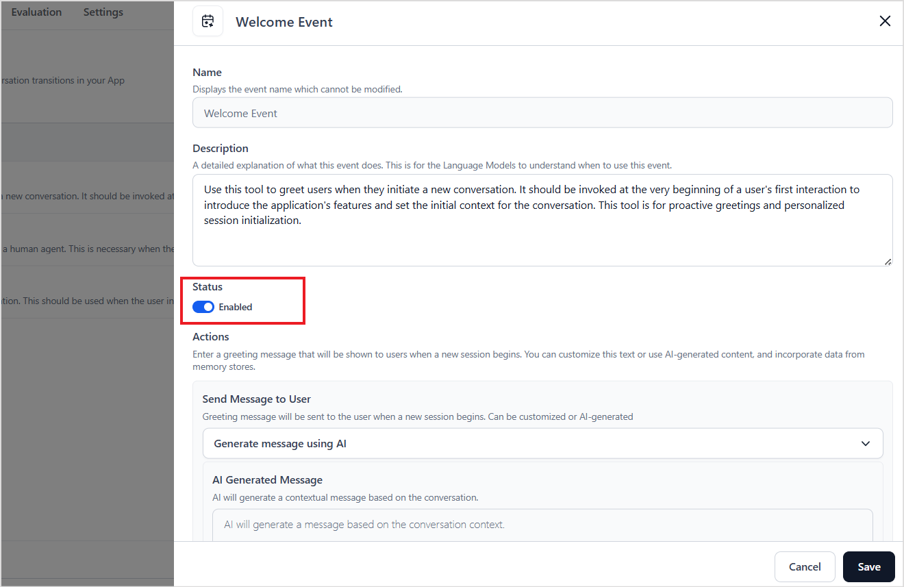
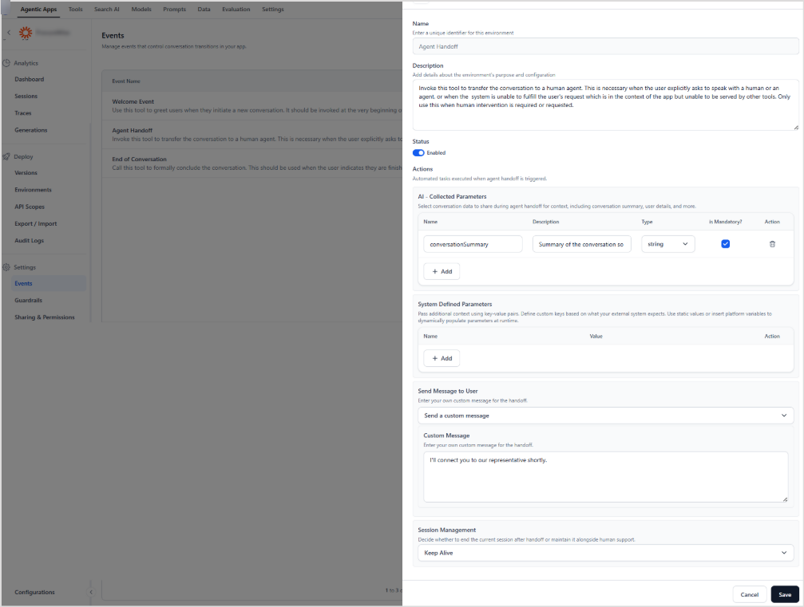
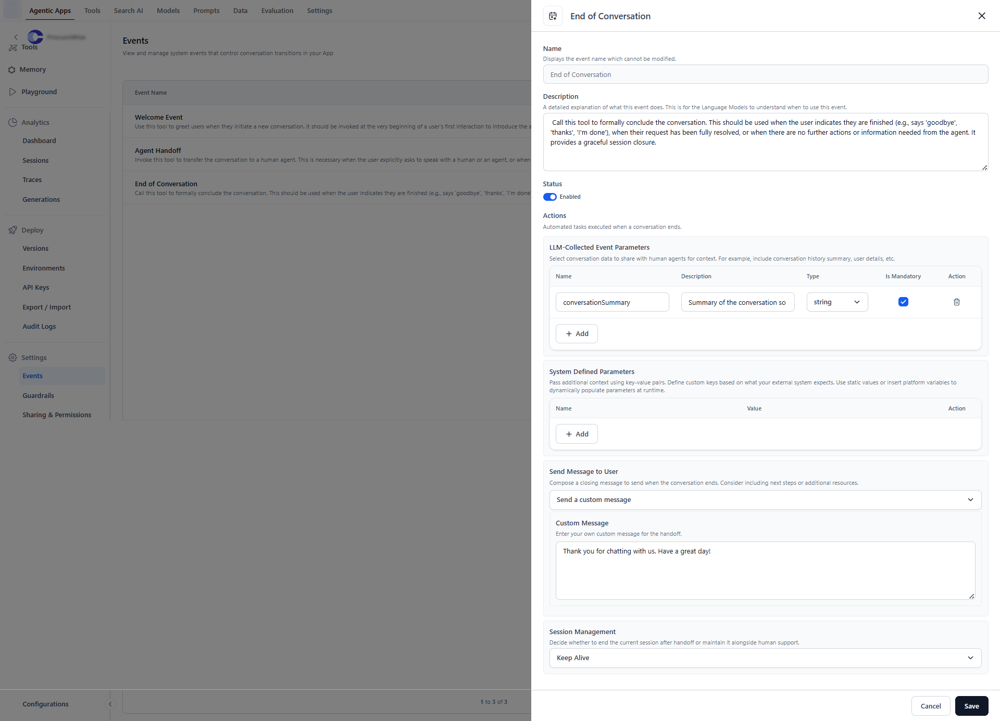

# System Events

Events in the Agentic App signify critical moments within a user's conversation journey. These events are essential for managing important transitions, including the initiation and conclusion of conversations, as well as the handoff to human agents. By capturing these natural dialogue transitions, these system events aim to enhance clarity, consistency, and control over the conversational flow. By standardizing how conversations begin, evolve, and conclude, the app facilitates a seamless user experience.

Events are automatically triggered by the application at specific points in the conversation, based on the conditions described in each event’s **description** field. These descriptions define the conversational context or user action that causes the event to fire.
The Platform enables developers to configure and customize the app’s behavior in response to these events, allowing tailored responses, workflows, or actions that align with the intent and flow of the conversation.

The Platform supports the following three system events. By default, all the events are disabled. Go to the *Events* page under Settings, click on the *edit* icon to enable and configure them.

## Welcome Event

By default, the Welcome Event is triggered automatically when a new session begins with the application. It's used to deliver personalized greetings and establish the initial context, helping users understand the app's capabilities. This event is triggered only once per session, at the start of the interaction. 

By default, the event is in the Disabled state.

To enable and configure the Welcome event, follow these steps:

* Click on the edit icon and enable the event status.  
* Under Actions, configure the greeting message using the **Send Message to User** option that users see when a new session starts. You can either use AI to generate the message or provide a custom message. You can also include data from the memory stores as part of the custom messages. 

## Agent Handoff Event

By default, this event is triggered when an agent handoff is requested in a conversation. Use the Description field of the event to configure the detection of this event. The default description initiates hand-off if the user explicitly asks for it or the system is unable to fulfil the user's request. Use the following properties to configure the event. 

The Platform supports agent handoff only via the AI for Service Platform. When the handoff event is triggered, the Platform sends session information via the variables listed below to the specified automation node within the AI for Service Platform's flows. The automation node subsequently processes the agent transfer request according to the connection rules established for the transfer in the node.

* **Status** - Enable this to allow the agent to trigger this event. 
<!--* **Invoke Human Agent** - Currently, Agent Handoff can be handled only through the Automation Node in the AI for Service Platform. When the event is triggered, the Platform sends session information via the variables listed below to the specified automation node within the AI for Service Platform's flows. The automation node subsequently processes the agent transfer request according to the connection rules established for the transfer in the node.-->
* **LLM Collected Event Parameters**: Define one or more fields to capture key details from the conversation when this event is triggered. This feature leverages the LLM to extract relevant information from the conversation context and populate the defined fields. These fields can then be passed to an agent during handoff. For example, you might configure a field to capture an interaction summary, which the agent can use for context during live support. To configure these parameters, specify the parameter name and describe the expected content in the field. The application uses the LLM to infer and fill in these fields based on the ongoing conversation.
* **System Defined Parameters**: Use this option to define fields that capture specific details from the conversation, which must be passed to an external system. Unlike LLM-collected parameters, these don't rely on the LLM. Instead, they're directly retrieved from the existing context or memory.
These fields are useful for passing data, such as user IDs, user choices, etc, that's already available during the conversation. To  configure system-defined parameters, provide the key (field name), which identifies the parameter in the external system and set the value, which can be:
  * A static string, or
  * A dynamic reference using memory or context variables, such as `{{user.country}}`. The application resolves these values at runtime and sends them to the external system. 
* **Send Message to User**: Use this field to set the message that the users see when a session ends. You can either use AI to generate the message or provide a custom message. 
* **Session Management**: Specify how the session should be handled after the event occurs, during a human handoff.
    * **Keep Alive**: Maintain the current session even after this event.
    * **Terminate Session**: End the session once the event is triggered. 

## End of Conversation Event

By default, this event is triggered when a session ends. It can be used to deliver personalized messages or concluding comments at the end of the interaction. Use the description field to update the conditions on which the event is triggered 
    
This event is *Disabled* by default. 
    
To enable and configure the event,
    
* Click on the edit icon and enable the event status.  
* The Description field indicates how to identify the end of conversation and trigger this event. 
* Under Actions, configure the event using the following fields. 
    * **LLM Collected Event Parameters**: Define one or more fields to capture key details from the conversation when this event is triggered. This feature leverages the LLM to extract relevant information from the conversation context and populate the defined fields. These fields can then be passed to an agent during handoff. For example, you might configure a field to capture an interaction summary, which the agent can use for context during live support. To configure these parameters, specify the parameter name and describe the expected content in the field. The application uses the LLM to infer and fill in these fields based on the ongoing conversation.
    * **System Defined Parameters**: Use this option to define fields that capture specific details from the conversation, which must be passed to an external system. Unlike LLM-collected parameters, these don't rely on the LLM. Instead, they're directly retrieved from the existing context or memory. These fields are useful for passing structured values, such as user IDs, user choices, etc, that are already available during the conversation. To  configure system-defined parameters, provide the key (field name), which identifies the parameter in the external system and set the value, which can be:
         * A static string, or
         * A dynamic reference using memory or context variables, such as `{{user.country}}`. The application resolves these values at runtime and sends them to the external system. 
    * **Send Message to User**: Use this field to set the message that the users see when a session ends. You can either use AI to generate the message or provide a custom message. You can also use memory store data as part of your custom messages. 
    * **Session Management**: Specify how the session should be handled after the event occurs.
        * **Keep Alive**: Maintain the current session even after this event.
        * **Terminate Session**: End the session once the event is triggered.

