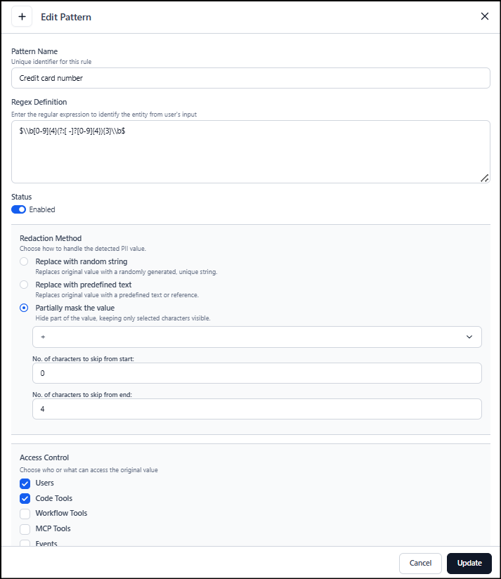

# PII Detection

The Platform provides comprehensive PII protection through automated detection, custom pattern recognition, and configurable masking strategies to ensure compliant data handling across all agentic applications. The PII section allows you to define rules to detect and protect personally identifiable information in user inputs. You can create custom patterns using regular expressions and configure how detected values are handled by the agent.

## Creating a PII Detection Pattern

To create a new PII rule, click *+ New Pattern* on the PII page and configure the following fields. 

* Pattern Name: Unique name to identify the rule.
* Regex Definition: Define custom regular expression to detect the PII entity in user input. This pattern determines which values are identified as sensitive data. For example, to identify all the email ids from the content, use a regex as shown below. 
`[a-zA-Z0-9._%+-]+@[a-zA-Z0-9.-]+\.[a-zA-Z]{2,}`
* Status: Enable or disable the pattern. If a pattern is disabled, it's ignored during processing.  
* Redaction Method: Choose the action to be taken on the identified PII data. 
    * Replace with random string: Replaces original value with a randomly system generated, unique string.
    * Replace with predefined text: Replaces original value with a predefined text. Provide the text with which PII is to be replaced.
    * Partially mask the value: Masks the PII partially. 
        * Mask Character: Specifies the character used to mask the hidden portion of the value. 
        * Number of Characters to Skip from Start: Defines how many characters at the beginning of the value remain visible and aren't masked. 
        * Number of Characters to Skip from End: Defines how many characters at the end of the value remain visible and are not masked.

    For example, if the mask character is * and the end characters are set to 12, the original email id, `john.doe@example.com` is masked and shown as `****.***@example.com`.
    * Access Control: Defines who or what can access the original (not redacted/masked/replaced) PII value. Based on the selections here, the read.
    * Test Pattern: Use this to test and validate if the regex pattern detects PII data as expected.

## PII Handling in Voice interactions

**Direct voice calls to the Platform**

  * When users interact with agents through real‑time voice, PII handling and guardrails are not applied to the audio stream. 
  * For these types of interactions, the Platform does not enforce PII handling or guardrails on the input or output. The user inputs are sent directly to the model. Any PII information shared by the user in this mode can be present in model processing and associated logs.
    
**Voice via AI for Service using ASR/TTS**

 * When the Platform is integrated with AI for Service and uses its ASR (speech‑to‑text) and TTS (text‑to‑speech), PII handling occurs on the text transcript generated by ASR.

 * The existing text‑based PII detection policies and safety guardrails are applied to that transcript before it's processed by the agent or stored, so identified PIIs are masked, redacted, or anonymized according to the configuration.

 * Voice output in this case is also generated from the filtered text response, so guarded PIIs aren't reintroduced by TTS.

