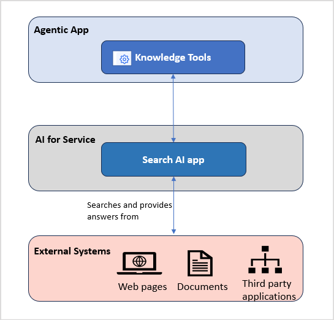

# About Knowledge 

Knowledge is a fundamental pillar of the intelligence of Agentic apps. Agents rely on relevant and contextual information to work effectively. Consider a customer service app whose ability to resolve queries effectively depends on its knowledge base for information about products, services, policies, and common issues. Knowledge provides the context, facts, and understanding necessary for agents to operate intelligently. 

Agentic Apps manage knowledge through the **Knowledge Tools**. Knowledge Tools are intelligent components that use the capabilities of Search AI applications to provide accurate and contextually relevant answers to user queries. Search AI uses an advanced Retrieval-Augmented Generation (RAG) architecture along with LLM capabilities for intelligent content retrieval and answer generation. 

By leveraging Search AI capabilities, Knowledge Tools can access information from a wide range of sources, including internal knowledge bases, document repositories, FAQs, and third-party systems, ensuring that responses aren't only accurate but also aligned with enterprise knowledge. 

Integrated seamlessly through the **AI for Service** platform, these tools enable autonomous agents to understand user intent in natural language, retrieve relevant content, and generate meaningful and business-aware responses in real time. 

[Learn More about Search AI.](overview.md)
