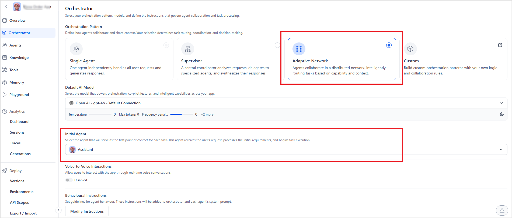

# Implementing the Adaptive Network Orchestration Pattern

[Learn about what's Adaptive Network pattern and how it works.](adaptive-network.md)

Implementing the Network Pattern in an Agentic app requires:

1. Orchestration Setup in the Agentic App.
2. Configuring Delegation & Fallback Rules for the Agents.

### 1. Selecting the Orchestration Pattern for the Agentic App

1. Navigate to the Orchestrator page of the app.  
2. Then, select an *Initial Agent*. The Initial Agent is the entry point for all queries and tasks. Every request is first routed to this agent, which evaluates the input before handing it off to the appropriate specialized agent. 

### 2. Configuring Delegation and Fallback Rules for the Agents 

In an Agentic app that uses the Network orchestration pattern, each agent has a dedicated Delegation Section to define routing rules for smooth handoffs and uninterrupted workflows.

Configure the delegation rules for all the agents in the app: 

1. **Direct Responses**: Toggle Direct Responses to control how the current agent interacts with users
    * Enabled: The agent can send responses directly to the user.
    * Disabled: The agent passes responses to another agent for analysis and reply.
2. **Task Delegation**: Configure rules for handing off tasks to specialized agents
    * Click *Add Delegation*. 
    * From the *Delegate To* list, select the agent you want to route tasks to.
    * Define the condition under which the handoff should occur. 
    
    Add all the delegation rules in this section that the given agent can use for routing. 
    
    For example, the following agent can delegate tasks to three specialized agents—Finance Assistant, HR Assistant, and IT Assistant, depending on the nature of the task.  

    **Note**: When an event is selected as the delegation rule, subsequent request handling depends on the event configuration. For example, if an agent handoff event is set up to escalate to a human agent through AI for Service, the delegation will trigger that specific behavior.

<!--
Fallback Behavior: Select an agent or event to take over the conversation when this agent can't complete a task itself and can't identify any other agent that can complete the task. You can configure another agent or event to automatically take over the conversation. This ensures that unresolved tasks are always routed to the correct fallback, and no task or conversation remains unresolved.

Click on Add Fallback Delegation.
Select the fallback agent or event from the list.
Set the condition under which it should be triggered.
-->

## Passing Information Between Agents

When the control passes from one agent to another, the application saves the data, including the context info, summary, and pending tasks, to the `sessionMeta` memory under the `delegationContext` field. The next agent can use this field to get the required information. 

Additionally, the agents can also use custom memory stores to save information as required. This ensures that task-specific data is easily shared during handoffs.
