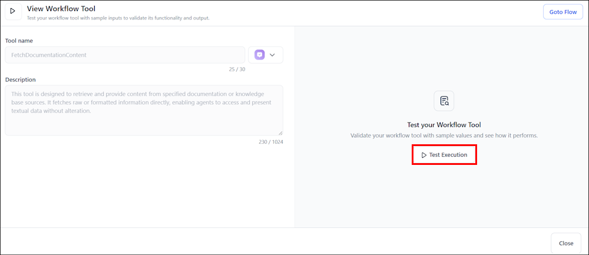

# Test a Workflow Tool

The test interface enables users to test a workflow tool with sample inputs to validate its functionality and output. It allows you to simulate workflow tool execution using sample inputs, monitor tool behavior and review results, streamlining testing and execution. This interface provides a consistent way to test workflow tools within the app.

**To test a workflow tool**

1. Select the workflow tool from the tools page to open its test panel.
2. Review the tool name, description, and input parameters. These parameter fields are read-only and shown here for reference.
3. Click Test Query, enter sample values in the input fields, and select Run Query to execute the workflow tool with sample values.

4. Select Test Results to view the output in JSON. 
5. The Logs tab under Test Results presents the execution logs from the tool.
6. To edit or update the workflow, click Go to Flow.
