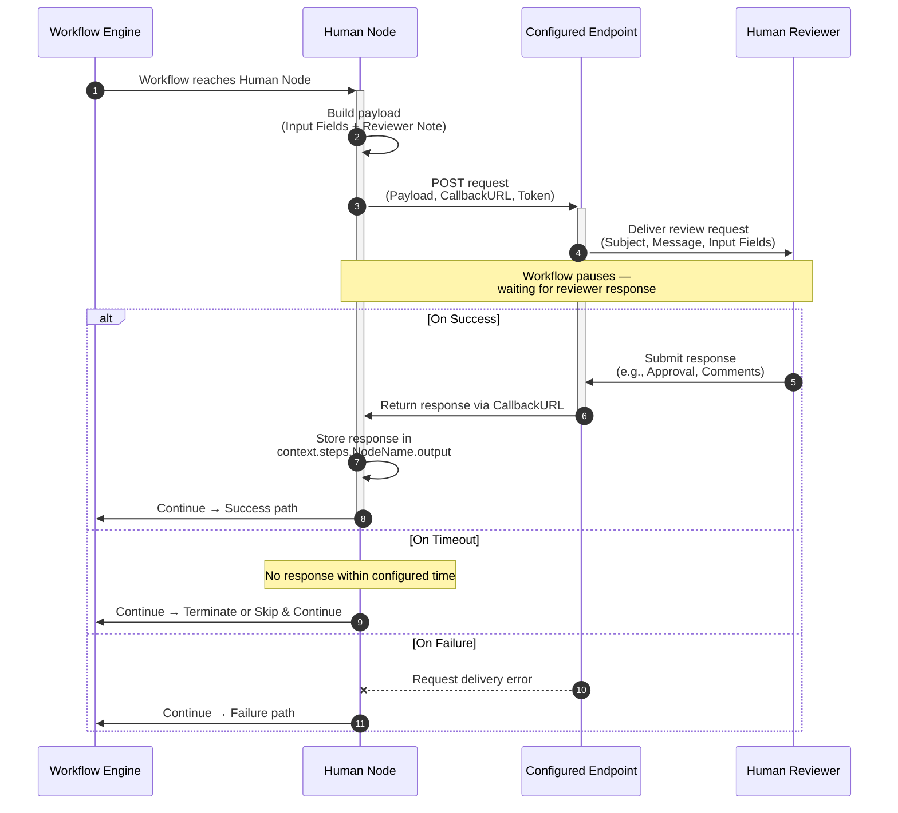

# Human Node – Pause for Review and Approval

The Human Node introduces a human-in-the-loop capability within automation workflows. It allows workflows to pause and incorporate human judgment into automated processes. Designated users can review, approve, or provide input before the workflow continues, ensuring critical steps are validated, decisions are accurate, and compliance requirements are met. This capability is especially useful when certain decisions cannot be automated and require manual validation, oversight, or confirmation.

## Key Capabilities

* **Customizable Input Requests** – Send a request with fields tailored to collect the information or decision needed.
* **Timeout Handling** – Define how the workflow behaves if no response is received (e.g., Terminate, Skip & Continue).
* **Error Handling** – Configure the outcome if the request fails or cannot be delivered.
* **Sync or Async Modes (Tool level)** – Execution runs synchronously or asynchronously based on the tool’s endpoint configuration.

## Common Use Cases

* **Approval Workflows** – Route requests for manager approval (e.g., expenses, leave, procurement).
* **Quality Assurance** – Insert a human checkpoint to validate AI-generated or automated outputs before publishing.
* **Compliance Checks** – Require manual review for sensitive or regulated steps.
* **Exception Handling** – Escalate unusual or edge cases to a reviewer for decision-making.

## How it Works

The Human Node serves as a flexible pause point within an automated workflow, enabling seamless integration of human decisions. When the workflow reaches this node, it sends a custom request payload to the configured endpoint.

The execution behavior depends on the tool’s endpoint configuration:

* In Sync mode, the workflow starts, sends the request to the human, waits for the human’s input, and generates the output — all within the timeout set at the endpoint.
* In Async mode, the workflow sends an immediate acknowledgement and continues execution. The Human node notifies the pre-configured callback URL when the request is sent to the human, when the human’s input is received, and when the final tool output is generated and delivered.

Built-in mechanisms handle timeouts, duplicate or late responses, and delivery failures to ensure the workflow progresses as configured. This provides visibility and traceability into decisions through the Debug Panel without disrupting the overall flow.

<hr>



<hr>

In this document, you’ll learn how to add a Human node to your canvas, configure custom input requests, define reviewer fields, and customize timeout and error-handling behavior.

## Add and Configure a Human Node

The Human node introduces a manual review checkpoint within a workflow. When the workflow reaches this node, it sends a custom request and then resumes based on the response/timeout/failure condition.

The node lets you:

* Define the custom input fields required from the reviewer.
* Configure the request details (endpoint, headers, body).
* Specify behavior for timeouts or errors.

Steps to add and configure a Human node:

### Step 1: Open Flow Builder

* Log into the the Platform and select **Tools** under modules.
* Select your tool and select **Go to Flow**.

### Step 2: Add the Human Node

You can insert a Human node on the canvas using any of the following methods:

* Assets Panel: Drag the Human node from the tray to the canvas.
* Bottom Tray: Click the Human node from the quick access section below the canvas.
* Plus Icon: Click the plus (+) icon when hovering between nodes and select the Human node from the insert menu.

### Step 3: Configure the Node

Click the added node to open its properties dialog box. The General Settings for the node are displayed.  
 
You can rename the node (e.g., ManagerApproval, QualityCheck) or add a description to provide context.

**1. View Request Destination**

In the **Send & wait for response** field, the currently supported option is *Custom Request*. This specifies where the request will be sent for human review.


**2. Define Request details**

Select Request Definition to configure how the Human node sends requests and fetches data.

1. Click **Define Request** to open the Edit Request dialog.
2. Provide the following details:
    1. **Request Type**: Only POST is supported for Human nodes.
    2. **API Endpoint URL**: Enter the endpoint or paste a cURL command.
3. **Auth profiles:** Choose an existing profile or provide authorization details:
    * Pre-authorize the integration: Use pre-configured credentials (e.g., system token, client credentials).
    * Allow users to authorize the integration: Require each end user to authenticate dynamically.
4. **Headers**: Add key-value pairs as needed. Automatically included headers are: CallbackURL and Token (read-only, applied in all debug and test requests).
5. **Body (Payload)**: At runtime, the Human node automatically generates the request body by combining: Input fields defined in Step 4 and the Reviewer note defined in Step 5.
You can add extra keys for testing purposes, but these additional keys are ignored at runtime.
6. Click **Test** to validate the request and view the response.
7. Click **Save** to apply the configuration.


**3. Add Input Fields**

In the **Input Fields** section, define the fields required from the reviewer. Supported field types include: Text, Number, Boolean, Date.

1. For each field, you can:
    * Set a default value.
    * Mark it as required or optional.
    * Map it to context variables (e.g., pre-fill text with `{{context.user.name}}`).
2. Click **Payload preview** to see how the full payload will be sent to the downstream configured in the request URL.

For example, you can create two fields for an approval flow:

* Approval (dropdown: Approved / Rejected)
* Comments (text field for reviewer notes)


**4. Configure the Review Note**

* Define how the request will appear to the reviewer:
    * **Subject line** - Email subject or message title.
    * **Message body** - Instructions or context for the reviewer. The context is resolved at run-time.
    * **Assign to** - Reviewer’s email address.


**5. Configure Timeout Behavior**

* Choose how long the node should wait for a response:
    * **No timeout** – Workflow waits indefinitely until the reviewer responds.
    * **Set timeout** – Default 120 seconds (You can customize value and unit: seconds, minutes, hours, days).

**6. Define Node Outcomes**

In the Add Connection tab, specify how the workflow proceeds once the review step ends. Three outcome paths are available:

* **On Success** – When all the mandatory input fields in the Human node receive a response from the human reviewer.
    * Workflow continues with the reviewer’s response values.
    * Select the next node in the flow.
    * Supports parallel branching.
* **On Timeout** – No response received from the reviewer within the configured time.
    * **Terminate** (default): Flow ends via the attached End node. No parallel branching allowed.  
Note: If the End/Terminate node is deleted, the flow automatically switches to Skip.
    * **Skip**: Continue with `null/NA` output and move to the next configured node.
* **On Failure** – An error occurred while sending the request or connecting to the request URL.
    * Select a fallback node to continue execution.
    * Supports parallel branching.

## Testing the Flow

Once you have configured the Human node and connected it to the workflow, you can test how it behaves at runtime. Testing validates both the flow logic and the Human node’s interaction with reviewers. When you click Run Flow, the Debug Panel opens and shows how the node executes.

### Step 1: Send Request to Reviewer

* The workflow generates and sends the request via POST to the configured endpoint.
* Includes necessary headers (CallbackURL, Token) and body (JSON, XML, or URL-encoded key/value pairs).
* The request is sent to the configured endpoint using a Custom Request.

### Step 2: Running the Flow

Depending on the Tool endpoint configuration, the Human node can run in two modes: Sync (Synchronous) or Async (Asynchronous).

#### **Running in Sync Mode**

In Sync mode, the workflow pauses at the Human node and waits for a reviewer’s response before moving forward. 

For example, approval flows or mandatory checkpoints where execution cannot continue until human input is received.

Here is a step-by-step execution of the Human node in Sync mode:

1. **Workflow reaches the Human node**: The workflow reaches the Human node and sends a request payload to the configured endpoint.
2. **Request forwarded**: The Human node forwards the payload downstream (e.g., to a channel, platform, or custom system).
3. **Reviewer input collected**: The downstream service collects the reviewer’s input and sends it back via the callback URL. The callback URL remains active until the configured wait time (Late or duplicate responses are ignored).
4. **Workflow pauses while waiting/ Outcome handling**:
    * A reviewer responds within time → continues along the Success path.
    * A timeout occurs → follows the selected Timeout option (Terminate or Skip & Continue).
    * A failure occurs → follows the Failure path.
5. **Final output**: The tool’s final output - including the reviewer’s response (or error/timeout details) - is returned as the sync response and displayed in the Debug Panel.

<table>
  <tr>
   <td>
<strong>Scenarios in sync mode</strong>
   </td>
   <td><strong>What Happens</strong>
   </td>
   <td><strong>Debug Panel Output</strong>
   </td>
   <td><strong>Flow Outcome</strong>
   </td>
  </tr>
  <tr>
   <td>1. Reviewer responds successfully
   </td>
   <td>Downstream sends the reviewer’s input back before the timeout
   </td>
   <td>Response JSON with key–value pairs
   </td>
   <td>Workflow continues along the Success path
   </td>
  </tr>
  <tr>
   <td>2. Channel/platform failure
   </td>
   <td>Communication issue prevents response delivery
   </td>
   <td>Error message in the Response section
   </td>
   <td>Workflow continues along the Failure path
   </td>
  </tr>
  <tr>
   <td>3. Timeout – Terminate flow option
   </td>
   <td>No response before timeout; flow set to Terminate
   </td>
   <td>Response JSON with null values
   </td>
   <td>Workflow ends along the End/Terminate path
   </td>
  </tr>
  <tr>
   <td>4. Timeout – Skip & Continue option
   </td>
   <td>No response before timeout; flow set to Skip
   </td>
   <td>Response JSON with null values
   </td>
   <td>Workflow skips the Human node and continues to the next configured node
   </td>
  </tr>
  <tr>
   <td>5. Sync endpoint timeout (before reviewer response)
   </td>
   <td>The endpoint itself times out before the human replies
   </td>
   <td>Timeout error JSON
   </td>
   <td>Workflow stops with a Timeout error
   </td>
  </tr>
  <tr>
   <td>6. Sync endpoint timeout (after reviewer response)
   </td>
   <td>The reviewer responded, but the endpoint timed out before the tool could finally end execution
   </td>
   <td>Timeout error JSON
   </td>
   <td>Workflow stops with Timeout error
   </td>
  </tr>
</table>


#### **Running in Async Mode**

In Async mode, the workflow does not pause at the Human node. Instead, the workflow sends an immediate acknowledgement and continues execution. The Human node notifies the pre-configured callback URL when the request is sent to the human, when the human’s input is received, and when the final tool output is generated and delivered.the workflow continues immediately, while the reviewer’s input is processed in the background.

For example, when you don’t want the workflow to block waiting for a human, which is critical for efficiency in large or automated workflows.

Here is the execution of the Human node in Async mode:

1. **Request received**: As soon as the tool gets a request, it sends an acknowledgement back to the requestor system.
2. **Workflow execution**: The workflow then starts execution, reaches the Human node, and sends a request payload to the configured endpoint.
3. **Callback generation**: The Human node generates and shares a callback URL and request ID, which the downstream service uses to return the reviewer’s response. The callback URL remains valid only for the configured wait time.
4. **Waiting status update**: When the tool reaches the Human node and is waiting for input, a status update is sent to the pre-configured URL (URL set when configuring the tool’s async endpoint).
5. **Reviewer receives and responds**: The downstream service delivers the request to the reviewer. Once the reviewer provides input, the response is sent back to the callback URL. Late or duplicate responses are ignored.
6. **Continuing execution status update**: After receiving data from the human, the tool continues execution from the Human node. A status update for the tool output is sent to the pre-configured URL (URL set when configuring the tool’s async endpoint]).
7. **Outcome handling**:
    * Reviewer responds in time **→** Workflow resumes at the configured Success path.
    * No response before timeout **→** Workflow follows the configured timeout option (Terminate or Skip & Continue).
    * Failure in delivery **→** Workflow follows the Failure path.
8. **Final output**: The tool’s final output - including the reviewer’s response, or error/timeout details - is sent to the pre-configured callback URL and logged in the Debug Panel.


<table>
  <tr>
   <td>
<strong>Scenario</strong>
   </td>
   <td><strong>What Happens</strong>
   </td>
   <td><strong>Debug Panel Output</strong>
   </td>
   <td><strong>Flow Outcome</strong>
   </td>
  </tr>
  <tr>
   <td>1. Reviewer responds successfully
   </td>
   <td>Downstream sends the reviewer’s input back before the timeout
   </td>
   <td>Response JSON with key–value pairs
   </td>
   <td>Workflow continues along the Success path
   </td>
  </tr>
  <tr>
   <td>2. Channel/platform failure
   </td>
   <td>Communication issue prevents response delivery
   </td>
   <td>Error message in the Response section
   </td>
   <td>Workflow continues along the Failure path
   </td>
  </tr>
  <tr>
   <td>3. Timeout – Terminate option
   </td>
   <td>No response before timeout; flow set to Terminate
   </td>
   <td>Response JSON with null values
   </td>
   <td>Workflow ends along the Terminate path
   </td>
  </tr>
  <tr>
   <td>4. Timeout – Skip & Continue option
   </td>
   <td>No response before timeout; flow set to Skip
   </td>
   <td>Response JSON with null values
   </td>
   <td>Workflow skips the Human node and continues to the next configured node
   </td>
  </tr>
  <tr>
   <td>5. Async endpoint timeout (before reviewer input)
   </td>
   <td>The endpoint itself times out before the human replies
   </td>
   <td>Timeout error JSON
   </td>
   <td>Workflow stops with a Timeout error
   </td>
  </tr>
  <tr>
   <td>6. Async endpoint timeout (after reviewer input)
   </td>
   <td>The reviewer responded, but the endpoint timed out after
   </td>
   <td>Timeout error JSON
   </td>
   <td>Workflow stops with a Timeout error
   </td>
  </tr>
</table>

### Step 3: Capturing and Using Reviewer Responses in the Workflow

Once the reviewer responds, the Human node captures the input and makes it available for downstream workflow nodes:

* **Capture Response:** Reviewer input is collected as JSON key–value pairs.
* **Workflow Branching:** Execution continues along the configured Success, Timeout, or Failure path. Branching can be based on the input values.
* **Accessing Input**: Responses are accessible in downstream nodes via context variables:
    * Full payload: `{{context.steps.&lt;Nodename>.output}}`
    * Specific fields: `{{context.steps.&lt;Nodename>.output.Approval}}` or `{{context.steps.&lt;Nodename>.output.Comments}}`


## Use Case – Content Publishing Workflow

**Scenario:** A blog post requires manager review before publishing.

This example shows how the Human node captures reviewer input and determines the next steps in a content publishing workflow.

**Reviewer fields:**

You defined the following input fields:


* `Approval` (Approved / Rejected)
* `Comments` (text field for reviewer notes)

**Sample response from reviewer:**


```
{ 
  "Approval": "Rejected",  
  "Comments": "I am not ok with the quality of the blog"  
}
```

**Using the response in the workflow:**

You can access these values in subsequent nodes using context variables:

* Full JSON: `{{context.steps.Review0001.output}}`
* Specific fields:
    * `{{context.steps.Review0001.output.Approval}}` → `Rejected`
    * `{{context.steps.Review0001.output.Comments}}` → `I am not ok with the quality of the blog`

**Workflow behavior based on reviewer decision:**

* If `Approval = Approved`, the workflow continues to the *Publish Content* node and the blog goes live.
* If `Approval = Rejected`, the workflow routes back to the *Draft* node, assigning the editor to revise the content with the reviewer’s comments.

Note: This routing occurs only when conditional logic is configured based on the reviewer’s response. Without such logic, the workflow does not automatically branch.

### Notes

* **Inside Loops** – If the Human node is inside a loop, the loop will not move to the next iteration until a human response is received. This ensures each cycle gets explicit approval/input.
* **In Parallel Branches** – When used in parallel branches, the branch merge will wait for the Human node to complete. This prevents the workflow from merging prematurely.
