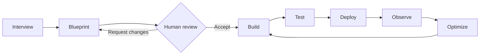

Arch AI is a multi-agent system that drives every phase of the agent lifecycle — from initial design to continuous production optimization. It is not a copilot or a suggestion engine. Arch AI interviews stakeholders, proposes agent topology, generates ABL, runs tests, monitors production traces, and surfaces improvement proposals — each phase end-to-end, with human review at the decision points.

Arch AI connects directly to the ABL compiler and the platform runtime. It exchanges compiled IR, traces, and topology data through MCP, so it operates on the same artifacts the platform executes.

## Lifecycle Phases

Arch AI operates across six phases. Each phase is driven by a specialized sub-agent. There is no separate manual step to author ABL, run tests, or promote between environments.

| Phase | What Arch AI Does |
| --- | --- |
| **Design** | Interprets user intent and generates a complete agent blueprint — goals, flows, tools, memory, and guardrails — ready to compile. |
| **Build** | Authors ABL, validates cross-references, resolves tool bindings, and confirms deployment readiness before a human reviews. |
| **Test** | Runs Persona × Scenario × Evaluator matrices autonomously, surfacing failures, edge cases, and policy violations without manual test authoring. |
| **Deploy** | Manages environment promotion, versioning, and rollout. Compiler validation ensures no broken agent reaches production. |
| **Observe** | Monitors trace events, session health, and runtime anomalies in real time, surfacing what matters rather than raw logs. |
| **Optimize** | Continuously analyzes performance, cost, and quality signals. Proposes ABL patches as pull requests. Engineers review and approve every change. |

## The Authoring Flow

The authoring flow runs in four stages, from requirements to a deployed, diffable agent artifact. Human review happens at two points: after Blueprint and before Optimize applies changes.

### Design and Blueprint

Arch AI begins by capturing requirements through a structured conversation — accepting a natural-language brief, an SOP document, or a prompt. Stakeholders are the source of truth. Arch AI produces structured requirements and then proposes a full agent topology: which specialists to create, how handoffs are routed, which tools each agent binds to, and what guardrails apply.

You can review and refine the blueprint before any ABL is generated.

*Blueprint artifact with agent details:*

*Agent topology proposed by Arch AI:*

### Build

The build sub-agent generates the ABL artifact from the approved blueprint. The ABL compiler validates contracts and references on every generation step. Tests are auto-generated. The output is a deployable, diffable, code-reviewable agent — not a sketch or a configuration dialog.

*ABL definitions generated by Arch AI:*

### Observe and Optimize

After deployment, Arch AI's observability sub-agent reads typed trace events, surfaces session health metrics, and flags anomalies — across every agent in the project. When it detects a degradation, a gap in coverage, or a routing inefficiency, it proposes ABL changes as pull requests. The compiler validates the shape of each proposal before engineers review the diff.

The optimization loop closes itself: production signal feeds back into ABL improvements, which compile, deploy, and generate new signal.

*Project health monitoring and continuous improvement by Arch AI:*

## Arch AI as a Multi-Agent System

Arch AI is itself built on the same multi-agent architecture it creates. Each specialist sub-agent has a typed role and scoped responsibility.

| Specialist | Role |
| --- | --- |
| **Multi-agent architect** | Designs agent topology and handoff routing. |
| **ABL construct expert** | Writes valid ABL grammar, types, and contracts. |
| **Channel and voice expert** | Handles channel-specific authoring requirements for voice, web, and messaging. |
| **Integration methodologist** | Designs tool connectors and data source bindings. |
| **Testing and eval expert** | Generates regression suites and evaluation matrices. |
| **Diagnostician and analyst** | Monitors production traces and drives optimization proposals. |

Each specialist operates with the same discipline applied to every customer agent: typed inputs, scoped memory, explicit handoffs, and compiler-validated outputs.

## Accessing Arch AI

Arch AI is available from three surfaces. All three use the same MCP interface and produce the same compiled output.

| Surface | How It Works |
| --- | --- |
| **Agent Studio** | The built-in Arch AI assistant in Studio. Available throughout the authoring, test, and deployment workflow. Accessible from the sidebar of any agent project. |
| **External coding tools** | Claude Code, Cursor, and Codex connect to Arch AI through MCP. Agents can be designed and iterated from a CLI or IDE without opening Studio. |
| **Platform runtime** | Arch AI reads live trace data from the runtime directly. The observability and optimize phases do not require a separate session — Arch AI works continuously in the background. |
