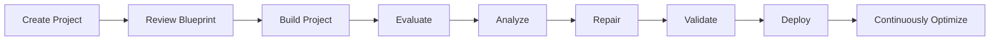

# Arch AI Development Lifecycle

Arch AI supports the complete agent development lifecycle, from capturing requirements and building your project to evaluating, deploying, and continuously improving your agents.

Unlike regular development workflows where design, testing, and optimization are performed separately, Arch integrates these activities into a continuous lifecycle. Each stage builds on the previous one, helping you validate your agents early, identify issues, and improve their performance over time.

| Stage | Description |
|--------|-------------|
| **Create Project** | Create a project with **Arch** by describing your use case through an interactive interview or by uploading supporting documents, such as an SOP or requirements document. |
| **Review Blueprint** | Arch generates a proposed project architecture, including agents, workflows, orchestration, tools, and integrations. Review the blueprint and request changes before continuing. |
| **Build Project** | After you approve the blueprint, Arch generates the project, including the agents, workflows, prompts, and supporting artifacts. |
| **Evaluate** | Arch automatically generates an evaluation suite and executes it to measure your agent's performance across multiple scenarios and personas. |
| **Analyze** | Review evaluation scores, conversations, traces, and execution details to identify issues and opportunities for improvement. |
| **Repair** | Apply improvements manually or use **Ask Arch to Auto Tune** to automatically apply safe recommendations. |
| **Validate** | Re-run the evaluation suite to verify that the applied changes improve the evaluation results. |
| **Deploy** | Deploy the validated project to production. |
| **Continuously Optimize** | After deployment, Arch analyzes production traces, identifies improvement opportunities, recommends changes, and validates future optimizations through the reinforcement loop. |

## Related Topics

- **Evaluations** – Learn how evaluation suites are generated, executed, and analyzed.
- **Optimize with Arch AI** – Learn about the reinforcement loop and continuous optimization after deployment.
