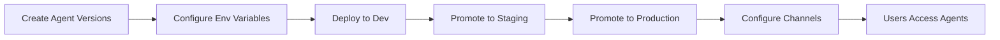

To make an Agentic project live and available to users, you must correctly configure deployments, environments, channels, API keys, and channel authentication. Before users can interact with your agents, the following must exist:

- An active deployment in the target environment (dev, staging, or production).
- Environment variables configured for all `{{env.KEY}}` references used in ABL.
- A channel bound to that environment and an API key to authorize.

| Concept      | Description                                                   |
| ------------ | ------------------------------------------------------------- |
| Version      | A frozen snapshot of a compiled agent                         |
| Deployment   | A manifest mapping agents to versions for an environment      |
| Environment  | A named deployment slot (dev, staging, production)            |
| Channel      | A user-facing communication surface connected to a deployment |
| SDK Key      | A public client-side key used by SDK-based applications       |
| Platform Key | A scoped backend API key for server-to-server integrations    |

## Deployment Lifecycle

- A deployment is always scoped to a single environment.
- Only one deployment per environment can be active at a time.
- When a new deployment becomes active:
  - The previous deployment automatically moves to draining.
  - Existing sessions continue naturally.
  - New sessions route to the latest deployment.

## Step 1: Set Environment Variables

Before deployment, configure all environment variables referenced in agents. Navigate to **Deployments** -> **Environments**.

**Base Variables** : The Base variables defines fallback values shared across environments. Use base variables for:

- Shared defaults across deployments.
- Product names.
- Common timeouts.

Override them per environment when needed.

Example:

| Scope               | Value                                          |
|---------------------|------------------------------------------------|
| Base                | `SUPPORT_EMAIL=support@example.com`            |
| Production Override | `SUPPORT_EMAIL=enterprise-support@example.com` |

<Note>
- Variable changes only affect new sessions. If you update a variable, existing in-progress sessions keep the old value until they end. Runtime execution fails when unresolved variables are accessed.
- You can also set global variables via **Admin Settings** ->**Env variables**. Environment-specific variables with the same key take priority.
</Note>

To add a new env variable:

- Select the target environment tab (dev, staging, or production).
- Click **Add Variable**.
- Enter the key, value, and optional description.
- Toggle Secret if the value is sensitive (secrets are write-only after saving).
- Click Save.
- You can also copy variables from other environments.

## Step 2: Deploy

Go to **Deployments** → **Environments** and click **New Deploy** (upper-right). Configure:

- Environment: Select environment. Always start with `dev`.
- Entry agent: The agent that receives the first message, usually the supervisor.
- Agent version manifest: map each agent to a version, or use the latest active version. You can also auto-create a version from the working copy.
- Label: Human-readable identifier for the deployment like `v1.0 - initial build`.

Click **Deploy**. The platform validates your agent ABLs, resolves configuration placeholders, and activates the deployment. If there was a previous dev deployment, it moves to draining — existing sessions finish naturally, new ones go to the new deployment.

## Step 3: Promote to Staging

Don't manually recreate staging deployments. Instead, Promote your dev deployment. This pushes the exact same agent version manifest to staging, so you're testing what you actually built rather than manually re-specifying versions.

## Step 4: Promote Staging to Production

Once staging is validated, promote it to production the same way, by clicking Promote on the staging deployment.

## Step 5: Configure Access

An active deployment isn't automatically reachable. You must configure:

- API keys
- Channels
- Authentication methods, if required

### Configure API Keys

For external application access, create API Keys.

| Key Type     | Description                                                                                                                                                                                                                                                                                                        |
| ------------ | ------------------------------------------------------------------------------------------------------------------------------------------------------------------------------------------------------------------------------------------------------------------------------------------------------------------ |
| SDK Key      | Used by client apps to talk to the agent chat/runtime surface. Intended for embedding the widget or calling chat/session APIs. It bootstraps an SDK session, then requests are constrained by that session/token model.   Think: end-user/app-facing chat access.                                        |
| Platform Key | Used for broader server-to-server platform API access. Has explicitly selectable scopes such as Execute Chat, Read Analytics, Read Workspace, and Write Document Permissions. Intended for integrations, workflows, and backend automation.   Think: integration/backend access with scoped permissions. |

[Learn More](/agent-platform/administration/general-settings#api-keys)

### Channels

To connect a channel from the **Deployments** -> **Channels** workspace, see [Set up Channels from the UI](/agent-platform/channels), which links each documented channel to its setup steps.

| Channel | Description |
| ------- | ----------- |
| **Slack** | Deploy agents as Slack bots for team collaboration. See the [channel setup guide](/agent-platform/channels#set-up-slack). |
| **Microsoft Teams** | Integrate agents into Teams channels and chats. See the [channel setup guide](/agent-platform/channels#set-up-microsoft-teams). |
| **WhatsApp** | Connect agents to WhatsApp Business for customer messaging. See the [channel setup guide](/agent-platform/channels#set-up-whatsapp). |
| **Telegram** | Connect agents to Telegram bots for messaging and group conversations. See the [channel setup guide](/agent-platform/channels#set-up-telegram). |
| **Web SDK** | Embed a chat widget in your website with a single script tag. See the [channel setup guide](/agent-platform/channels#set-up-web-sdk). |
| **Email** | Process inbound emails and send agent responses by email. See the [channel setup guide](/agent-platform/channels#set-up-email). |
| **Realtime LLM Voice** | Live voice conversations using realtime LLM models, such as OpenAI Realtime and Gemini Live, through the Kore.ai Voice Gateway. See the [channel setup guide](/agent-platform/channels#set-up-realtime-llm-voice). |
| **Genesys** | Connect agents to Genesys Cloud as a Bot Connector for contact-center automation. See the [channel setup guide](/agent-platform/channels#set-up-genesys). |
| **AIforWork** | Connect agents to Kore.ai's Employee Experience (EX) platform for bidirectional messaging. See the [channel setup guide](/agent-platform/channels#set-up-aiforwork). |

## Step 6: Rollback if Something Goes Wrong

If a production deployment causes issues, go to **Deployments** → **Environments**, find the active deployment, and click **Rollback**. This retires the current deployment and reactivates the previous one in that environment. Users on the bad deployment finish their sessions naturally; new sessions immediately go to the restored version.

## Deployment Status Reference

| Status   | What it Means                                                                       |
| -------- | ----------------------------------------------------------------------------------- |
| active   | Receiving new sessions, serving live requests.                                      |
| draining | No new sessions accepted; existing sessions complete naturally.                     |
| retired  | Fully decommissioned, no new requests to this deployment. Active sessions continue. |
