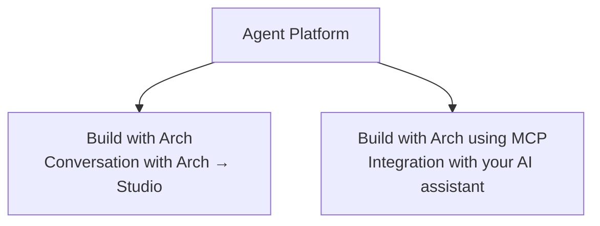
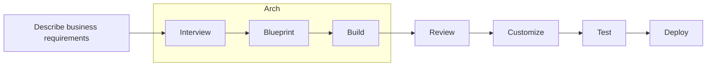

Get started with Agent Platform by choosing the authoring experience that best fits your workflow. Whether you prefer AI-assisted development, visual authoring, or a code-first approach, Agent Platform provides multiple ways to build, test, and deploy AI agent systems.


## Ways to build on the platform

Choose the authoring experience that best fits your development workflow.



| **Approach** | **What it is** | **Best for** |
|--------------|----------------|--------------|
| [**Build with Arch**](#get-started-with-arch) | Describe your business requirements in natural language or upload supporting documents. Arch interviews you, generates a blueprint, creates the required project artifacts, and opens the project in Studio for review and customization. | Teams that want to accelerate development through AI-assisted authoring. |
| [**Build with Arch using MCP**](/agent-platform/mcp-server) | Use supported AI assistants and development tools through the Model Context Protocol (MCP) to build and manage projects from your development environment. | Developers who prefer working from their IDE or AI-assisted coding tools. See [MCP Server](/agent-platform/mcp-server). |


<Card title="Prefer a different starting point?">

- Build your project manually in Studio using the visual editor and ABL. See [**Get started with Studio**](/agent-platform/getting-started#setup-guide).
- Start from a ready-made project in the **Template Gallery**, which includes sample projects for banking, retail, healthcare, telecom, travel, and more.

</Card>

---

## Before you begin

| Prerequisite | Description |
|--------------|-------------|
| Agent Platform Account | Sign up for free using your region-specific URL. See [Platform access and allowlist of IPs](#region-specific-urls-and-allowlist-of-ips). |
| LLM Provider and Model | Register provider credentials and configure at least one supported model. See [Configure LLM](/agent-platform/administration/ai-configuration#llm-providers). |
| Arch AI | Configure the model and credentials that Arch uses to generate agent specifications and drive chat-based orchestration. See [Configure Arch](/agent-platform/administration/ai-configuration#arch).|

---

## Get Started with Arch

Arch automatically designs, builds, evaluates, and optimizes AI projects from your business requirements. Describe your requirements in natural language or upload supporting documents, and Arch generates the project architecture, creates project artifacts such as agents, workflows, and prompts, runs an initial evaluation, and provides a working foundation that you can customize and deploy. 





**Learn more**: For an overview of Arch, its capabilities, the authoring flow, and how it assists throughout the AI application lifecycle, see [Arch AI](/agent-platform/arch-ai).

---

### Create a project with Arch

Sign in to Agent Platform and, on the **Projects** page, select **Start with Arch**.

Arch creates your project in three phases:

<Steps>
  <Step title="Interview">
    Describe your business requirements, upload supporting documents if available, and answer follow-up questions so Arch can understand your project.
  </Step>

  <Step title="Blueprint">
    Review the proposed project architecture, request changes if needed, and approve the blueprint when it meets your requirements.
  </Step>

  <Step title="Build">
    Arch generates the project artifacts, creates the project scaffold, runs an initial evaluation, and opens the project in Studio for review and customization.
  </Step>
</Steps>


#### Interview

Describe the project you want to build. 

* Describe your requirements in natural language.
* Upload a Standard Operating Procedure (SOP).
* Upload design documents or reference documents.

Arch analyzes your input and asks follow-up questions until it has enough information to generate a complete project blueprint. Depending on your requirements, it may ask about your business processes, communication channels, integrations, and other implementation details.

<Tip>
You can upload an SOP, design document, or requirements specification instead of describing your project from scratch. Arch uses the uploaded content to generate more accurate project requirements.
</Tip>

**Example**

Suppose you want to build a customer support agent for an online retailer. You might describe your requirements as:

```text
Create a customer support agent that helps customers track orders, initiate returns, answer product questions, and escalate complex issues to a human agent.
```

Arch analyzes your request and interviews you to refine the requirements before generating the project blueprint. Arch may ask follow-up questions such as:

| **Arch asks** | **You respond** |
|----------------|-----------------|
| What channels should the agent support? | Web chat and WhatsApp. |
| Which business systems should the agent integrate with? | Our order management system and CRM. |
| Should the agent escalate certain requests? | Yes. Escalate refund approvals over $500 to a human agent. |
| Does the agent require access to a knowledge base? | Yes. Use our product catalogue and return policy documents. |


#### Blueprint

After gathering your requirements, Arch generates a blueprint that represents the proposed project architecture.

Review the blueprint and either accept it or request changes. Arch updates the blueprint based on your feedback until it accurately reflects your requirements.

**Example**

Based on the customer support requirements, Arch generates a blueprint containing a Customer Support Agent, an Order Management workflow, the required integrations, and relationships between the customer-facing and escalation agents.


<Tip>
Spend time reviewing the blueprint before proceeding. Changes made at this stage are incorporated into the generated project, reducing the need for manual updates later.
</Tip>


#### Build

After you approve the blueprint, Arch assembles the generated artifacts into a working project scaffold and opens the project in Studio. 

Depending on your requirements, Arch generates the necessary project artifacts, which can include:

* Agents
* Workflows
* Tools
* Prompts
* Knowledge configuration

**Example**

For the customer support project, Arch creates the customer support agent, the required workflows, prompts, tools, and knowledge configuration, and assembles them into a working project in Studio.


---

### Review project setup

After Arch generates your project, it opens the project in Studio and displays the **Project setup** panel. Review the project status and resolve any issues before customizing your project.


The panel includes the following sections:

| **Section** | **Description** |
|--------------|-----------------|
| **Lifecycle** | Shows the current stage of the project setup and continuous improvement lifecycle. |
| **Build and validation details** | Displays the status of each stage, including project scaffold creation, compile repair, draft review, runtime evaluation, and promotion readiness. |
| **Recommended next step** | Highlights validation issues and recommends the next actions before continuing. |

---

### Review the initial evaluation

Arch automatically generates an evaluation suite and runs an initial evaluation of the generated project. The evaluation uses generated scenarios and personas to simulate conversations and identify potential issues. 

* Review the identified issues and recommendations.
* Update your agents, workflows, prompts, or tools as needed.
* Rerun the evaluation to verify the improvements.
* Repeat this process until the project meets your quality requirements.

**Example**

The initial evaluation may identify that the agent correctly answers product questions but does not escalate high-value refund requests as specified. Update the workflow or prompts, then rerun the evaluation to verify the improvement.

<Note>
For more information about evaluation suites and results, see [Evaluations](/agent-platform/evals). For more information about iterative optimization, see [Optimize with Arch AI ](/agent-platform/optimize). 
</Note>

---

### Customize your project

After reviewing the validation and evaluation results, customize the generated project to meet your business requirements.

Depending on your project, you can:

* Use **Auto Tune** to apply recommended improvements to your project.
* Review and update the generated agents, workflows, tools, and prompts. 
* Replace placeholder or mock tools with production integrations.
* Configure authentication and connection settings.
* Configure knowledge sources and other project settings.
* Test the project and verify that it meets your business requirements before deployment.

<Note>
Depending on your project requirements, Arch may generate placeholder tools or sample configurations. Replace these with your production systems before deploying your project.
</Note>

---

## Platform access and allowlist of IPs

Agent Platform sends requests to a fixed set of IP addresses. If your organization applies IP restrictions, then add the following IPs to your allowlist to permit the platform traffic. The platform is available in the following regions at the listed URLs.

| Region               | Region-specific URL                               | Allowlist IPs                          |
|:---------------------|:--------------------------------------------------|:---------------------------------------|
| USA                  | [agents.kore.ai](https://agents.kore.ai/)         | • 172.173.109.141 <br /> • 172.212.188.206 <br /> • 172.202.57.107 <br /> • 20.9.69.249 <br /> • 20.12.238.143 <br /> • 52.173.108.174 <br /> • 104.43.208.181 <br /> • 130.131.217.68 <br /> • 135.119.76.33 |
| Germany              | [de-agents.kore.ai](https://de-agents.kore.ai/)   | • 3.65.5.141                           |
| Japan                | [jp-agents.kore.ai](https://jp-agents.kore.ai/)   | • 18.180.133.211                       |
| EU (London)          | [uk-agents.kore.ai](https://uk-agents.kore.ai/)   | • 3.9.151.173                          |
| United Arab Emirates | [uae-agents.kore.ai](https://uae-agents.kore.ai/) | • 20.74.153.122 <br /> • 20.74.173.252 |
| India                | [ind-agents.kore.ai](https://ind-agents.kore.ai/) | • 135.235.170.165                      |
| Singapore            | [sg-agents.kore.ai](https://sg-agents.kore.ai/)   | • 4.194.44.63                          |

---

## Next Steps

Learn how to customize and deploy your project:

* [Agents](/agent-platform/create-agents)– Review and customize the generated agents.
* [Workflows](/agent-platform/workflows)– Modify the generated workflows and orchestration logic.
* [Tools ](/agent-platform/tools-overview)– Configure production tools and integrations.
* [Knowledge ](/agent-platform/knowledge)– Configure and manage knowledge sources.
* [Evaluations ](/agent-platform/evals)– Run additional evaluations to validate project quality.
* [Optimize with Arch AI ](/agent-platform/optimize)– Improve your project using recommendations based on evaluation results.
* [Deployment](/agent-platform/deployment)– Deploy your project to the target environment.

