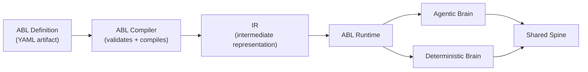

The Agent Platform runtime executes every interaction using two cognitive engines in parallel: the **Agentic Brain** and the **Deterministic Brain**. A shared memory layer called the Shared Spine coordinates state between them. Both engines are defined in a single Agent Blueprint Language (ABL) definition, compiled to the same intermediate representation (IR), and executed by the same runtime.

This split-brain model lets a single agent definition combine autonomous reasoning with deterministic, auditable execution — without maintaining two separate runtimes or frameworks.

## The Agentic Brain

The Agentic Brain **reasons, explores, and decides**. It handles the open-ended parts of an interaction where the correct path is not known in advance.

The Agentic Brain runs:

- A **multi-intent orchestrator** that decomposes compound user requests into separate intents.
- **Specialist agents** scoped to domains such as billing, network operations, or compliance.
- **Remote agents** reached via the A2A protocol, including agents hosted outside the platform.
- **Tool calls** against CRM systems, BSS platforms, knowledge bases, and payment systems.
- An **LLM reasoning engine** that holds context across turns.

The Agentic Brain produces reasoning traces — structured records of every agent step, LLM call, and tool result — that are captured by the runtime for observability.

## The Deterministic Brain

The Deterministic Brain **validates, enforces, and executes**. It handles the parts of an interaction where the path must be predictable, auditable, and policy-compliant.

The Deterministic Brain runs:

- **Entity collection** with deep validation rules.
- **Authorization profile checks** against the requesting user.
- A **routing engine** that combines intent, customer segment, and entitlement.
- **Constraint and guardrail enforcement** on both inputs and outputs.
- **BSS, OSS, and billing integrations** with known inputs and auditable outputs.
- A **flow-and-escalation engine** for human handoff and supervisor queues.

The Deterministic Brain produces decision records — structured records of every routing choice, constraint check, and guardrail evaluation — that are captured by the runtime for compliance and audit.

## The Shared Spine

The Shared Spine is the runtime coordination layer. Neither brain owns it. Both brains read from and write to it, and neither can act without going through it.

The Shared Spine holds:

- Session memory.
- Threaded conversation context.
- The entity store.
- Authentication state.
- Active guardrails.

Every read and write to the Shared Spine is recorded as part of the **Context Audit Trail** — a structured record of what each brain was working with at the moment of every decision.

## Compilation and execution

Agent definitions move through three stages before they execute. Both brains share the same compiler, the same IR format, and the same runtime.

| Stage | What Happens |
| --- | --- |
| **ABL Compiler** | Validates the agent definition. Catches missing tool references, broken handoffs, and contract violations before deployment. Output is a portable IR artifact. |
| **IR** | The compiled artifact. It is versioned and pinned to a deployment, and you can download it. |
| **ABL Runtime** | Executes the IR. Handles reasoning, flow control, multi-agent orchestration, and guardrail enforcement. Runs both execution paths defined in the ABL definition. |

Because both brains compile from the same ABL definition to the same IR, there is no drift between the authored agent intent and the deployed behavior. Compile-time validation catches errors before they reach any downstream environment.

## Observability outputs

The runtime emits three categories of structured trace data. Together, they make every agent decision reconstructable after the fact.

| Trace Category | Produced By | What It Captures |
| --- | --- | --- |
| **Reasoning Traces** | Agentic Brain | Every agent step, LLM call, and tool result. |
| **Context Audit Trail** | Shared Spine | Every read and write to shared memory — what each brain was working with at the moment of every decision. |
| **Decision Records** | Deterministic Brain | Every routing choice, constraint check, and guardrail evaluation. |

These trace categories are complementary. Reasoning Traces answer *what the agent did*. Decision Records answer *what rules were applied*. The Context Audit Trail answers *what data each brain had access to*. All three are required for full session reconstruction.

## Why the split matters

A single-engine design forces a trade-off: either the agent reasons flexibly and sacrifices auditability, or it follows a fixed deterministic path and loses the ability to handle open-ended input.

The dual-brain model avoids this trade-off by separating the concerns while keeping both engines under one governance layer.

| Property | Agentic Brain | Deterministic Brain |
| --- | --- | --- |
| **Execution style** | LLM-driven reasoning | Rule-based, constraint-enforced |
| **Handles** | Open-ended input, multi-intent, tool calls | Entity validation, routing, policy enforcement |
| **Output** | Reasoning traces | Decision records |
| **Auditability** | Step-level reasoning chain | Deterministic, replay-exact decisions |
| **Shared resource** | Shared Spine | Shared Spine |

Because both brains are defined in ABL and compiled to the same IR, the runtime can enforce guardrails uniformly across both execution paths. There is no policy gap between the agentic and deterministic sides of an interaction.

---
