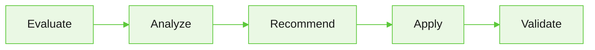

Evaluations provide a structured framework to test, measure, and improve your agents by simulating conversations, scoring responses, and analyzing the results.

Create evaluation suites to test how your agent behaves across different scenarios, personas, and evaluators. Review the results to identify issues, validate changes, and continuously improve agent performance.

The platform supports both AI-assisted and manual evaluation workflows. It is recommended to use **Arch AI** to automatically generate evaluation suites based on your project. You can review and customize the generated suite before running it.

**Navigation**: Go to your project and select **Evaluate** > **Evals**.

## Evaluation workflow

<Steps>
  <Step title="Create an Evaluation Suite">
    Create an evaluation suite manually or let Arch generate one based on your project.
  </Step>

  <Step title="Run Evaluations">
    Execute the evaluation suite to simulate conversations and measure your agent's performance.
  </Step>

  <Step title="Analyze Results">
    Review evaluation scores, conversations, traces, and execution details to identify issues and opportunities for improvement.
  </Step>

  <Step title="Repair and Optimize">
    Review recommended improvements manually or use the Ask Arch to Auto Tune option to apply safe changes and optimize your agent.
  </Step>

  <Step title="Validate Improvements">
    Re-run the evaluation suite to verify that the applied changes improve the evaluation results.
  </Step>
</Steps>

## Key concepts

| Concept              | Description                                                                                                                |
|:---------------------|:---------------------------------------------------------------------------------------------------------------------------|
| **Evaluation Suite** | A collection of scenarios, personas, evaluators, and run settings that defines how an agent is evaluated.                  |
| **Eval Library**     | Stores reusable personas, scenarios, and evaluators that can be shared across multiple evaluation suites within a project. |
| **Arch AI**          | Generates evaluation suites, analyzes evaluation results, and recommends improvements as part of the evaluation workflow.  |

## How Arch AI optimizes your agent

Arch AI helps you continuously improve your agents by analyzing evaluation results, generating repair recommendations, and validating improvements through repeated evaluation cycles.



| Stage         | What Happens                                                                                                                    |
|:--------------|:--------------------------------------------------------------------------------------------------------------------------------|
| **Evaluate**  | Run the evaluation suite to measure your agent's performance across the configured scenarios and personas.                      |
| **Analyze**   | Arch AI analyzes evaluation scores, conversation traces, and execution details to identify failed or low-scoring conversations. |
| **Recommend** | Arch AI generates recommendations to improve prompts, workflows, tool usage, or agent behavior based on the identified issues.  |
| **Apply**     | Apply the recommended changes manually or use **Ask Arch to Auto Tune** to automatically apply safe changes.                    |
| **Validate**  | Re-run the evaluation suite to verify that the applied changes improve the evaluation results.                                  |

**Learn more**: To see where Evaluations fit in the Arch AI lifecycle, see [Arch AI](/agent-platform/arch-ai#lifecycle-phases).

### Example: improve tool call accuracy using Arch

During an evaluation, Arch identifies a low *Tool Call Accuracy* score. By analyzing the evaluation results and conversation traces, Arch determines that the agent frequently calls the correct tool but passes incorrect parameters, causing the tool call to fail or return incorrect results. Arch then analyzes the underlying execution traces and identifies the root cause: The agent instructions do not clearly specify which input values should be passed to the tool. Based on this analysis, Arch generates a recommendation to improve the agent's instructions.

After the recommendation is reviewed and applied, either manually or through **Ask Arch to Auto Tune**, the evaluation suite is run again to validate the changes. If the issue is resolved, the Tool Call Accuracy score improves, completing the optimization cycle.

**Learn more:** For more information about the Arch AI reinforcement loop and continuous optimization, see [Optimize with Arch AI](/agent-platform/optimize).

---

## Create evaluation suites

Evaluation suites define how your project is evaluated. Each suite combines scenarios, personas, evaluators, and run settings to measure your agent's performance.

You can create an evaluation suite in one of the following ways:

| Option                             | Description                                                  |
|:-----------------------------------|:-------------------------------------------------------------|
| **Create with Arch** (Recommended) | Let Arch generate an evaluation suite based on your project. |
| **Create Test Suite**              | Create and configure an evaluation suite manually.           |

### Create eval suite with Arch

Use **Create with Arch** to automatically generate an evaluation suite based on your project.

1. Go to **Evaluate** > **Evals**.
2. Select **Create with Arch**.
3. Review the generated evaluation suite.
4. (Optional) Select **Edit Configuration** to customize the generated components.
5. Select **Create & Run Suite**.

<Note>Arch analyzes your project and automatically generates the evaluation suite components, including scenarios, personas, evaluators, and run settings. You can review and modify the generated configuration before running the evaluation.</Note>

### Create eval suite manually

Use this option when you want full control over the evaluation configuration.

1. Go to **Evaluate** > **Evals**.
2. Select **Create Test Suite**.
3. Enter the suite details.
4. Add scenarios, personas, and evaluators.
5. Configure the run settings.
6. Select **Create**.

---

## Evaluation suite components

Every evaluation suite, whether created manually or with Arch, contains the following components. Together, they define what is evaluated, how the evaluation is executed, and how the results are scored.

When you create an evaluation suite with **Arch**, these components are generated automatically based on your project. You can review and modify them before running the evaluation.

| Section          | Description                                                                                         |
|:-----------------|:----------------------------------------------------------------------------------------------------|
| **Scenarios**    | Defines the user tasks or conversations used to evaluate your agent.                                |
| **Personas**     | Defines the characteristics and behavior of users participating in the evaluation.                  |
| **Evaluators**   | Defines the metrics and criteria used to score each conversation.                                   |
| **Run Settings** | Configures how the evaluation is executed, including conversation variations and execution options. |

<Note>By default, evaluation suites evaluate the entire project. Use **Narrow scope** in the Basics field to evaluate specific agents or components when validating targeted changes or testing a subset of your project. Narrowing the scope can also reduce evaluation time and resource usage.</Note>

---

## Scenarios

Scenarios define the conversation flow, user intent, and expected outcomes used during evaluations.

Each scenario represents a conversation flow used to evaluate how the agent handles specific tasks, behaviors, or outcomes.

To create a scenario:

1. In the **Scenarios** section, select **Add Scenario**.
2. Complete the scenario details.
3. Select **Create**.

| Field                   | Description                                                                                                    |
|:------------------------|:---------------------------------------------------------------------------------------------------------------|
| **Name**                | Unique name for the scenario.                                                                                  |
| **Description**         | Brief description of what the scenario tests.                                                                  |
| **Category**            | Logical grouping used to organize scenarios, such as Billing, Customer Support, Technical, or Onboarding.      |
| **Difficulty**          | Complexity level of the scenario: **Easy**, **Medium**, or **Hard**.                                           |
| **Entry Agent**         | Agent that starts the conversation. Primarily used in multi-agent projects.                                    |
| **Initial Message**     | First user message that starts the conversation.                                                               |
| **Max Turns**           | Maximum number of conversation turns before the evaluation stops.                                              |
| **Agent Path**          | Expected sequence of agent handoffs during the conversation. Applicable to multi-agent projects.               |
| **Expected Milestones** | Key checkpoints the conversation should achieve.                                                               |
| **Expected Outcome**    | Describes what a successful conversation should accomplish.                                                    |
| **Tags**                | Labels used to organize and filter scenarios by feature area, regression suite, priority, or other categories. |


### Example scenario

```yaml
SCENARIO:
  name: "Flight Rebooking After Cancellation"
  category: booking
  difficulty: medium

  initial_message: >
    My flight was cancelled and I need to rebook for tomorrow.

  expected_outcome: >
    Agent identifies the cancelled booking, offers alternatives,
    and confirms a new flight.

  max_turns: 15

  expected_milestones:
    - "Identify cancelled flight"
    - "Present rebooking options"
    - "Confirm new booking"

  agent_path:
    - "Supervisor"
    - "Booking_Manager"
```

### Troubleshoot scenarios

| Issue                                     | Recommendation                                                                                                            |
|-------------------------------------------|---------------------------------------------------------------------------------------------------------------------------|
| Duplicate name error                      | Persona and scenario names must be unique within a project. Use a more specific name or delete the existing one.          |
| Persona not behaving as expected in evals | Refine the **Goals** and **Constraints** fields. These are used as system prompt instructions for the simulated user LLM. |
| Scenario timing out                       | Increase the **Max Turns** value or simplify the expected conversation path.                                              |

---

## Personas

Personas represent different types of users who interact with your agent.

Each persona simulates unique communication styles, domain expertise, goals, behaviors, and constraints to help test how the agent performs across varied user interactions.

To create a persona:

1. In the **Personas** section, select **Add Persona**.
2. Complete the persona details.

    | Field                   | Description                                                                  |
    |-------------------------|------------------------------------------------------------------------------|
    | **Name**                | Unique name for the persona.                                                 |
    | **Description**         | Brief description of the persona and the type of user it represents.         |
    | **Communication Style** | Defines how the persona communicates, for example, casual, terse, or formal. |
    | **Domain Knowledge**    | Defines the persona's familiarity with the subject, such as beginner, intermediate, or expert. |
    | **Behavior Traits**     | Characteristics that influence how the persona behaves during the conversation. For example, asks follow-up questions, polite, or impatient.     |
    | **Goals**               | Defines what the persona is trying to accomplish during the interaction. |
    | **Constraints**         | Rules or limitations that influence the persona's behavior during the conversation. |
    | **Adversarial Type**    | Specifies whether the persona behaves as a normal user or intentionally challenges the agent to test its robustness. |
    | **Session Variables (JSON)** | Optional session variables passed to the conversation at runtime. |

3. Select an adversarial behavior type if you want to simulate edge cases or malicious interactions.
4. Click **Create**.


### Example persona

```yaml
PERSONA:
  name: "Impatient Business Traveler"
  communication_style: terse
  domain_knowledge: expert
  behavior_traits:
    - impatient
    - asks_follow_up_questions
  goal: "Rebook a cancelled flight quickly"
  constraint: "Avoid unnecessary conversation"
```

### Adversarial persona types

You can simulate adversarial or edge-case user behaviors using the **Adversarial Type** field.

To test agent safety and robustness:

1. Enable **Adversarial** while creating a persona.
2. Select the adversarial type.

| Type               | Purpose                                                        |
|--------------------|----------------------------------------------------------------|
| Prompt Injection   | Attempts to override agent instructions                        |
| Social Engineering | Attempts to extract sensitive information                      |
| Off-topic Derailer | Redirects conversations away from the intended agent goal      |
| Abusive User       | Uses hostile or inappropriate language                         |
| Edge Case Explorer | Sends unusual or unexpected inputs (empty, very long messages) |

### Troubleshoot personas

| Issue                                    | Recommendation                                               |
|------------------------------------------|--------------------------------------------------------------|
| The persona's behavior is inconsistent   | Refine the goals and constraints fields                      |
| The persona's responses are unrealistic  | Add more specific behavioral traits and communication styles |
| The persona is too passive or aggressive | Adjust goals, constraints, and adversarial settings          |

---

## Evaluators

Evaluators define how conversations are assessed during an evaluation. Each evaluator measures a specific aspect of the conversation, such as response quality, safety, task completion, or compliance, and assigns a score based on the configured evaluation criteria. To configure an evaluator, follow these steps:

1. In the **Evaluators** section, select **Add Evaluator**.
2. Enter the evaluator name and description.
3. Select the **Type** and **Category**.
4. Configure the evaluator based on the selected type.
5. Select **Create**.

<Note>Lower evaluator temperatures typically produce more consistent scoring results.</Note>

### Evaluator types

Supported evaluator types include:

| Type         | Description                                 |
|:-------------|:--------------------------------------------|
| LLM Judge    | Uses an LLM to evaluate conversations.      |
| Code Scorer  | Uses deterministic programmatic scoring.    |
| Trajectory   | Evaluates conversation flow and milestones. |
| Human Review | Flags conversations for manual review.      |

### LLM Judge evaluators

An LLM Judge evaluator uses a separate LLM to assess the quality of agent responses based on a scoring rubric you define.

| Field                          | Description                                                                                               |
|:-------------------------------|:----------------------------------------------------------------------------------------------------------|
| **Judge Model**                | Language model used to evaluate the conversation.                                                         |
| **Temperature**                | Controls the randomness of the judge model's responses. Lower values produce more consistent evaluations. |
| **Judge Prompt**               | Instructions that define the evaluation criteria for the judge model.                                     |
| **Chain-of-Thought Reasoning** | Enables the judge model to perform intermediate reasoning before assigning a score.                       |
| **Scale Type**                 | Specifies the scoring method: **Pass/Fail** or **1–5 Scale**.                                             |
| **Bias Mitigation**            | Applies techniques to help reduce bias and improve evaluation consistency.                                |


#### Write effective judge prompts

The judge prompt is one of the most important evaluator configurations. Well-defined prompts produce more consistent and reliable evaluation results. Effective judge prompts:

* Clearly define evaluation criteria
* Focus on observable behavior
* Avoid ambiguous language
* Include examples when possible

#### Example judge prompt

```yaml
JUDGE_PROMPT:
  You are evaluating an AI agent's response quality in a customer support context.

  Evaluate the conversation on these criteria:
    1. Did the agent correctly identify the customer's intent?
    2. Did the agent provide accurate information?
    3. Did the agent follow the expected conversation flow?
    4. Was the agent's tone appropriate and professional?

  Score each conversation using the provided rubric.

  Focus on the agent's responses, not the simulated user's messages.
```

#### Configure bias mitigation 

LLM judges can exhibit scoring biases. Use bias mitigation settings to improve evaluation consistency and reliability.

| Setting                 | Description                                                                               | Default |
|:------------------------|:------------------------------------------------------------------------------------------|:--------|
| Position Swap           | Evaluates the conversation in both original and reversed order to reduce positional bias. | On      |
| Blind Evaluation        | Removes agent or persona identity information before judging.                             | On      |
| Cross-Model Judge       | Uses a different model family than the agent being evaluated.                             | Off     |
| Evidence-First (RULERS) | Requires the judge to cite evidence before assigning scores.                              | On      |


### Trajectory evaluators

Trajectory evaluators assess the agent's execution behavior rather than response quality.

Use them to validate: 

* Milestone completion -- did the conversation hit expected checkpoints?
* Handoff correctness -- did the supervisor route to the right agent?
* Path efficiency -- how many unnecessary steps did the agent take?
* Tool sequence -- did the agent call tools in the right order? 

### Code Scorer evaluators

Use Code Scorer evaluators for deterministic validations that do not require an LLM.

Typical use cases include:

* Regex matching
* Keyword validation
* Latency or response-time thresholds
* Structured output validation

Code Scorer evaluators execute custom scoring logic to validate agent responses and runtime behavior using deterministic rules.

### Human Review evaluators

Use Human Review evaluators for subjective or manual quality assessments.

Human Review evaluators flag conversations for manual inspection when evaluation scores fall below configured thresholds, allowing reviewers to validate agent behavior, response quality, or policy compliance before approval or release.

### Scoring scale types

The scoring rubric defines how the evaluator assigns scores to conversations. It supports Likert and Binary scales.

#### Likert scale

Use a 1 to 5 scale to define detailed evaluation criteria for each score level.

| Score         | Description                                                          |
|---------------|----------------------------------------------------------------------|
| 5 - Excellent | Addresses the user's request with accurate and complete information. |
| 4 - Good      | Addresses the request with minor omissions.                          |
| 3 - Adequate  | Partially addresses the request but misses important details.        |
| 2 - Poor      | Mostly misses the request or provides inaccurate information.        |
| 1 - Failing   | Fails to address the request or provides harmful information.        |

#### Binary scale

Use pass or fail scoring for binary evaluation criteria.

| Score    | Description                                                              |
|----------|--------------------------------------------------------------------------|
| 1 - Pass | The agent completes the task within the expected flow.                   |
| 0 - Fail | The agent fails to complete the task or deviates from expected behavior. |

### Troubleshoot evaluators

| Issue                            | Recommendation                                                                                                                              |
|:---------------------------------|:--------------------------------------------------------------------------------------------------------------------------------------------|
| Inconsistent scores across runs  | Lower evaluator temperature (try `0.1`) and enable evidence-first mode. Run multiple variants per evaluation to get statistical confidence. |
| Judge ignores rubric criteria    | Make rubric instructions more specific using examples.                                                                                      |
| The Judge model is too expensive | Use a smaller model for initial screening and reserve larger models for detailed analysis. Set appropriate `maxTokens` limits.              |
| The Evaluation cost is too high  | Use smaller judge models during development.                                                                                                |
| Scores appear random             | Increase statistical sample size using variants.                                                                                            |

---

## Configure run settings

Run settings determine how the evaluation suite is executed. To configure, follow these steps:

1. In the **Run Settings** section, configure the run settings.
2. Select **Create & Run Suite**.

### Run settings

| Setting | Description |
|---|---|
| **Variations per pair** | Specifies the number of conversation variations to generate for each scenario and persona combination. Multiple variations help evaluate the consistency of your agent's responses across different interactions. |
| **Conversation model** | Specifies the model used to generate the conversations that are graded. |
| **Conversation budget** | Sets the spending limit for the conversation model. You can set the budget in dollars or tokens, or leave it unlimited. |
| **When to run** | Specifies whether the evaluation suite runs manually or on a recurring schedule. For scheduled runs, configure the frequency (Daily, Weekly, or Monthly), day and time, start date, and end condition. The next scheduled run is shown in the eval suite, and scheduled runs are identified in the run history. |
| **Max parallel calls** | Specifies the maximum number of conversations that can run concurrently. |
| **Retries on failure** | Specifies the number of times to retry a conversation when it fails. |

<Note>The total number of conversations in an evaluation is calculated as: **Scenarios × Personas × Variations**</Note>

### How evaluations are executed

During execution:

* Every selected Persona interacts with every selected Scenario
* Each conversation is independently executed
* All configured Evaluators score the resulting conversations

This creates a full evaluation matrix across personas, scenarios, and evaluators.

**Example Evaluation Matrix**

```yaml
EVAL_SET:
  personas: 3
  scenarios: 4
  evaluators: 2
  variants: 2

TOTAL_CONVERSATIONS:
  formula: "3 Personas × 4 Scenarios × 2 Variants"
  result: 24

TOTAL_EVALUATIONS:
  formula: "24 Conversations × 2 Evaluators"
  result: 48
```

Each conversation is executed as an independent multi-turn session where the persona LLM simulates the user according to the scenario definition.

---

## View evaluation results

After you create and run an evaluation suite, the Evals page displays all evaluation suites in your project. From this page, you can monitor execution, review the latest results, and open an evaluation suite to view detailed evaluation information. 

Each evaluation suite displays:

- **Score** – Overall evaluation score for the latest run.
- **Coverage** – Number of scenarios, personas, variations, and generated conversations.
- **Evaluators** – Number of evaluators configured for the suite.
- **Cadence** – Indicates whether the suite runs manually or on a recurring schedule.
- **Last Run** – Date of the most recent execution.

The **Evaluation Suite** page is organized into the following tabs:

| Tab            | Description                                                                                                                          |
|:---------------|:-------------------------------------------------------------------------------------------------------------------------------------|
| **Overview** | Displays the overall evaluation results, including the overall score, score trends, evaluator breakdown, suite summary, activity metrics, and highlights conversations that require attention based on evaluator results. |
| **Latest Run** | Displays the results of the most recent evaluation run, including individual conversations, evaluator scores, and execution details. |
| **Repair**     | Helps you analyze evaluation results, identify issues, and improve your agent using manual review or Arch Auto Tune.                 |
| **History**    | Displays previous evaluation runs, allowing you to review and compare execution results over time.                                   |

### Overview

Provides a high-level summary of the evaluation suite and its latest execution. Use it to monitor overall performance, review evaluation coverage, and identify conversations that require attention.

| Section               | Description                                                                                                                                                  |
|:----------------------|:-------------------------------------------------------------------------------------------------------------------------------------------------------------|
| **Score & Trend**     | Displays the overall evaluation score, score trend over time, and evaluator breakdown for the latest run.                                                    |
| **Suite Summary**     | Summarizes the evaluation configuration, including the number of scenarios, personas, variations, conversations per run, evaluators, scope, and judge model. |
| **Activity**          | Displays execution statistics, including the total number of runs, project changes since the suite was created, and token consumption.                       |
| **What Needs Fixing** | Highlights conversations that require attention based on evaluator results, helping you identify prompts, workflows, or agents that may require improvement. |


---

### Latest run

Displays the results of the most recent execution of the evaluation suite. Each row represents a conversation generated during the latest evaluation. Use this page to:

- Review the latest conversation results.
- Identify successful and failed conversations.
- Search and filter conversations.
- Open a conversation to review its transcript and evaluator reasoning.

---

### Repair

The Repair section helps you analyze evaluation results, identify issues, and improve your agent. Based on the evaluation results, you can review recommended changes manually or allow Arch to automatically apply safe improvements using **Ask Arch to Auto Tune**.

| Section                  | Description                                                                                                                                                               |
|--------------------------|---------------------------------------------------------------------------------------------------------------------------------------------------------------------------|
| **Starting Point**       | Displays the baseline evaluation score, the number of evaluation checks performed, and the progress of the repair workflow.                                               |
| **What Needs Attention** | Summarizes issues detected during the evaluation, including low-scoring conversations and runtime failures.                                                               |
| **Recommended Fixes**    | Displays improvements generated from the evaluation results. Recommendations are categorized based on whether they can be applied automatically or require manual review. |


You can choose one of the following options:

- **Review Manually** – Review the recommended fixes before applying them.
- **Ask Arch to Auto Tune** – Allow Arch to automatically apply safe recommendations and validate the improvements by running another evaluation.

<Note>Auto Tune applies only recommendations that are considered safe. Changes that require human judgment are presented for manual review before they are applied.</Note>

---

### History

The **History** section provides a complete record of evaluation runs, repair activities, and configuration changes for an evaluation suite. Use this page to:

- Review previous evaluation runs.
- Track repair activities and recommendations generated by Arch.
- Compare conversations across different evaluation runs.
- Open conversations to review their transcripts and evaluator reasoning.
- Review changes made to the evaluation suite over time.

<Note>History entries are versioned to provide an audit trail of evaluation runs, repair activities, and suite configuration changes.</Note>


The History page contains the following sections.

| Section                         | Description                                                                                                           |
|:--------------------------------|:----------------------------------------------------------------------------------------------------------------------|
| **Agent & Project Changes**     | Displays feedback signals and changes detected in the agent or project that may impact evaluation results.            |
| **Repair Details**              | Displays issues identified by Arch, including the affected agent, evaluation feedback, and repair intent.             |
| **Repair Ledger**               | Records repair loops, patch attempts, and validation runs performed by Arch.                                          |
| **Run Evidence**                | Displays previous evaluation runs and the conversations generated for each run.                                       |
| **Suite Score**                 | Displays the evaluation score trend across recorded runs.                                                             |
| **Suite Configuration Changes** | Displays changes made to the evaluation suite configuration, such as scenarios, personas, evaluators, and variations. |

<Tip>To review the repair activity and compare the validation run with previous evaluation runs,view the **History** tab after Arch applies a repair. It lets you verify that the recommended changes improved the agent.</Tip>

---

## Manage the eval library

The **Eval Library** provides a centralized repository for managing reusable evaluation assets within a project.

Personas, scenarios, and evaluators stored in the Eval Library can be reused across multiple evaluation suites within the same project.

The **Eval Library** contains the following tabs:

| Tab            | Description                                                                                                                   |
|:---------------|:------------------------------------------------------------------------------------------------------------------------------|
| **Personas**   | Manage reusable personas used during evaluations.                                                                             |
| **Scenarios**  | Manage reusable scenarios that define evaluation conversations.                                                               |
| **Evaluators** | Manage reusable evaluators used to assess agent performance.                                                                  |
| **Runs**       | View project-wide evaluation runs, compare results, monitor evaluation metrics, and start new evaluations or Quick Eval runs. |


<Tip>To automatically generate reusable personas and scenarios based on your project, use **Generate with AI** option in the Personas and Scenarios tabs. Review and modify the generated assets before using those in an evaluation suite.</Tip>

### Quick Eval

Use **Quick Eval** to rapidly evaluate your agent during development. Quick Eval automatically generates the required personas, scenarios, evaluators, and evaluation run, making it useful for:

- Rapid testing.
- Early-stage validation.
- Smoke testing.
- Fast iteration during development.

<Note>Quick Eval automatically generates a temporary evaluation configuration for the current project. Use **Create Test Suite** or **Create with Arch** when you need a reusable evaluation suite that you can modify and run again.</Note>

### Runs

The **Runs** tab provides a project-wide view of evaluation runs and their results. Use it to monitor evaluation performance, compare runs, and analyze trends across your project.

From the **Runs** tab, you can:

- View previous evaluation runs.
- Compare evaluation runs.
- Start a new evaluation run.
- Run a Quick Eval.
- Monitor pipeline health.
- Review execution metrics and score trends.


Each run includes the following information.

| Metric                  | Description                                                                              |
|:------------------------|:-----------------------------------------------------------------------------------------|
| **Status**              | Current execution status of the evaluation run.                                          |
| **Average Score**       | Overall score across all evaluated conversations.                                        |
| **Duration**            | Total execution time for the run.                                                        |
| **Cost**                | Estimated LLM cost for the evaluation run.                                               |
| **Evaluations**         | Total number of evaluations performed.                                                   |
| **Score Matrix**        | Displays evaluation scores for each persona and scenario combination.                    |
| **Statistical Metrics** | Displays Mean & Standard Deviation, 95% Confidence Interval, Pass Rate, and Total Cells. |
| **Score Trend**         | Shows score changes across evaluation runs over time.                                    |

**Compare Runs**

Use **Compare** to review evaluation results across multiple runs and identify performance changes over time. It helps you:

- Measure score improvements.
- Detect regressions.
- Validate changes after updating agents, prompts, tools, or workflows.

---

## Analyze evaluation results

After an evaluation completes, review the results to understand how your agent performed and identify opportunities for improvement.

You can:

- Review conversation transcripts.
- Analyze evaluator scores and reasoning.
- Inspect execution traces and tool usage.
- Compare expected and actual conversation outcomes.
- Identify patterns across successful and failed conversations.

### Analyze conversations

Select a conversation from the **Latest Run** or **History** tab to review the evaluation details.

For each conversation, you can inspect:

| Information          | Description                                                            |
|----------------------|------------------------------------------------------------------------|
| **Transcript**       | Complete conversation between the persona and the agent.               |
| **Evaluator Scores** | Scores assigned by each evaluator, including reasoning when available. |
| **Execution Trace**  | Tool calls, handoffs, workflow execution, and other runtime details.   |
| **Milestones**       | Expected milestones that were completed or missed.                     |
| **Tool Usage**       | Tool invocations, inputs, outputs, and any execution failures.         |

### View evaluator reasoning

When **Chain-of-Thought Reasoning** is enabled for an LLM Judge evaluator, the evaluation results include reasoning that explains how the score was determined.

Use evaluator reasoning to identify improvements in:

- Agent instructions
- Workflows
- Tool configuration

An example evaluator reasoning:

```yaml
evaluation_result:
  score: 3/5

  reasoning: >
    The agent correctly identified the customer's intent
    but failed to provide complete rebooking options
    before requesting additional information.
```

### Act on results

Use the evaluation results to prioritize improvements to your agent.

| Finding                | Recommended Action                                                   |
|:-----------------------|:---------------------------------------------------------------------|
| **Low quality scores** | Refine agent instructions, goals, personas, or workflow logic.       |
| **Low safety scores**  | Strengthen guardrails and evaluate with adversarial personas.        |
| **Low tool accuracy**  | Review tool configuration, input parameters, and agent instructions. |
| **Handoff issues**     | Review handoff conditions and validate the expected agent path.      |

### Troubleshoot

| Issue                          | Recommendation                                                                                                                  |
|:-------------------------------|:--------------------------------------------------------------------------------------------------------------------------------|
| **Scores appear inconsistent** | Increase the number of **Variations per Scenario × Persona** and lower the judge model temperature for more consistent results. |
| **Unexpectedly high scores**   | Review the evaluator prompt and scoring criteria to ensure they accurately reflect the expected behavior.                       |
| **Higher execution costs**     | Reduce the number of variations or use smaller judge models during development.                                                 |

---

{{related}}

- [Arch AI](/agent-platform/arch-ai)
- [Create Agents](/agent-platform/create-agents)
- [Optimize with Arch AI](/agent-platform/optimize)

{/* AG: Proposed H2 Heading Reorganization for agent-platform/evals.mdx article

| Original H2 Heading               | Option 1: Rephrased/Reordered Heading                               | Option 2: Alternative Rephrased/Reordered Heading                         |
|-----------------------------------|---------------------------------------------------------------------|---------------------------------------------------------------------------|
| `## Evaluation Workflow`          | `## Getting Started: The Evaluation Process`                        | `## Overview: Your Agent Evaluation Journey`                              |
| `## Key Concepts`                 | `## Core Evaluation Concepts`                                       | `## Understanding Evaluations: Key Terminology`                           |
| `## How Arch AI Optimizes Your Agent` | `## Arch AI and Continuous Agent Optimization`                      | `## Leveraging Arch AI for Agent Improvement`                             |
| `## Create Evaluation Suites`     | `## Building Your First Evaluation Suite`                           | `## Step-by-Step: Creating Evaluation Suites`                             |
| `## Evaluation Suite Components`  | `## Anatomy of an Evaluation Suite`                                 | `## Essential Components of Evaluation Suites`                             |
| `## Scenarios`                    | `### Defining Evaluation Scenarios` (Changed to H3, grouped under Components) | `### Crafting Effective Scenarios` (Changed to H3)                        |
| `## Personas`                     | `### Creating User Personas` (Changed to H3, grouped under Components)    | `### Simulating Users: Persona Definitions` (Changed to H3)               |
| `## Evaluators`                   | `### Configuring Evaluators` (Changed to H3, grouped under Components)    | `### Measuring Performance: Types of Evaluators` (Changed to H3)          |
| `## Configure Run Settings`       | `## Running Your Evaluations`                                       | `## Advanced Run Configuration`                                            |
| `## View Evaluation Results`      | `## Interpreting Evaluation Results`                                | `## Exploring Evaluation Outcomes`                                         |
| `## Manage the Eval Library`      | `## Reusable Evaluation Assets: The Eval Library`                   | `## Centralizing Your Evaluations: Using the Eval Library`                |
| `## Analyze Evaluation Results`    | `## Deep Dive: Analyzing Conversation and Trace Data`               | `## Actionable Insights: Understanding Agent Performance`                  |

**Justification for Proposed Changes:**

*   **Consolidating Foundational Information:** Placing `Key Concepts` and `Evaluation Workflow` earlier provides necessary context before diving into creation or specific components.
*   **Grouping Related Items:** `Scenarios`, `Personas`, and `Evaluators` are components of an evaluation suite. Grouping them as H3s under `Evaluation Suite Components` (or a similar H2) creates a clearer hierarchy.
*   **Logical Progression:** Moving from understanding the process (`Evaluation Workflow`), to how Arch AI fits in, then to building (`Create Evaluation Suites`, `Evaluation Suite Components`), then running (`Configure Run Settings`), and finally to analyzing and managing (`View Evaluation Results`, `Analyze Evaluation Results`, `Manage the Eval Library`).
*   **Actionable Headings:** Some rephrased headings aim to be more action-oriented or descriptive for the user.

This approach aims to make the document easier to navigate and digest for a developer looking to understand, implement, and optimize agent evaluations.

*/}
