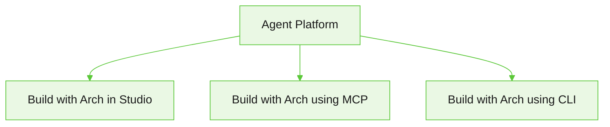

Sign up for Agent Platform, configure the LLM provider and Arch AI, invite team members to your workspace, and start building your AI project.

## Access the platform

Agent Platform is available in multiple regions. You can sign up for free to access the platform. For our US-Central Cloud, use <a href="https://agents.kore.ai/" target="_blank" rel="noopener noreferrer">https://agents.kore.ai/</a>. For all regions, see the region-specific URLs.

<Note>Sign up is currently enabled only for approved domains. To request access for your domain, contact your Kore.ai partner or [contact support](https://support.kore.ai/).</Note>

### Region-specific URLs and allowlist of IPs

The platform sends requests to a fixed set of egress IP addresses. If your systems use IP restrictions, add the region-specific egress IPs below to your allowlist to permit platform traffic.
  
<Accordion title="List of region-specific URLs and allowlist of IPs"> 
| Region               | Region-specific URL                                         | Egress IPs                                                      |
|:---------------------|:------------------------------------------------------------|:----------------------------------------------------------------|
| USA-Central          | [agents.kore.ai](https://agents.kore.ai)                    | • 172.173.109.141 <br /> • 172.212.188.206 <br /> • 20.9.69.249 <br /> • 20.12.238.143 <br /> • 104.43.208.181 <br /> • 52.173.108.174 <br /> • 172.202.57.107 <br /> • 135.119.76.33 <br /> • 130.131.217.68 |
| USA-Swift            | [us-swift-agents.kore.ai](https://us-swift-agents.kore.ai)  | • 44.216.129.184 <br /> • 54.225.127.87 <br /> • 34.201.194.187 |
| United Kingdom       | [uk-agents.kore.ai](https://uk-agents.kore.ai)              | • 20.90.75.123                                                  |
| United Kingdom-Prime | [uk-prime-agents.kore.ai](https://uk-prime-agents.kore.ai)  | • 3.9.151.173                                                   |
| Germany              | [de-agents.kore.ai](https://de-agents.kore.ai)              | • 3.65.5.141                                                    |
| Germany-Prime        | [de-prime-agents.kore.ai](https://de-prime-agents.kore.ai)  | • 20.79.56.64                                                   |
| Japan                | [jp-agents.kore.ai](https://jp-agents.kore.ai)              | • 20.48.103.185                                                 |
| Japan-Prime          | [jp-prime-agents.kore.ai](https://jp-prime-agents.kore.ai) | • 18.180.133.211                                                |
| Australia            | [au-agents.kore.ai](https://au-agents.kore.ai)              | • 52.187.236.188                                                |
| Singapore            | [sg-agents.kore.ai](https://sg-agents.kore.ai)              | • 4.194.44.63                                                   |
| United Arab Emirates | [uae-agents.kore.ai](https://uae-agents.kore.ai)            | • 20.74.173.252 <br /> • 20.74.153.122                          |
| Kingdom of Saudi Arabia | [ksa-agents.kore.ai](https://ksa-agents.kore.ai)         | 8.228.193.152                                                 |
| India                | [ind-agents.kore.ai](https://ind-agents.kore.ai)            | • 135.235.170.165                                               |
</Accordion>

### Set up your account, workspace, and initial configuration

1. Sign in to the platform at <a href="https://agents.kore.ai/" target="_blank" rel="noopener noreferrer">https://agents.kore.ai/</a> and create a workspace as part of the onboarding flow.
2. Invite team members to your workspace: click the **Admin/Gear** icon at the top, click **Invite members**, enter the member's email address, select a role, and click **Send invite**.
3. Configure the LLM provider and Arch AI:
   1. Register provider credentials and configure at least one supported model. See [Configure LLM](/agent-platform/administration/ai-configuration#llm-providers).
   2. Configure the model and credentials Arch uses to generate agent specifications and drive chat-based orchestration. See [Configure Arch](/agent-platform/administration/ai-configuration#arch).

Once your account and configuration are set up, you are ready to build your first AI project.

---

## Ways to build on the platform

The platform offers three easy ways to build a project with Arch:



| Approach                                                | What it is   | Best for |
|:--------------------------------------------------------|:-------------|:---------|
| [Studio](#build-with-arch-in-studio) | Describe or upload your business requirements. Arch interviews you, generates a blueprint and project artifacts, then opens the project in Studio for review. | Teams that want to accelerate development through AI-assisted authoring. |
| [MCP](/agent-platform/mcp-server) | Build and manage projects from your development environment, using supported AI assistants and tools through the Model Context Protocol (MCP). | Developers who prefer working from their IDE or AI-assisted coding tools. |
| [CLI](/agent-platform/cli)        | Create, test, and manage agents and projects from the terminal, and automate validation, evaluation, and deployment in CI workflows. | Developers and teams who prefer automating build, test, and deployment pipelines. |


## Build with Arch in Studio

Arch designs, builds, evaluates, and optimizes AI projects from your business requirements. Describe your requirements in natural language, or upload supporting documents, and Arch generates the project architecture and artifacts, such as agents, workflows, and prompts. Arch then runs an initial evaluation and provides a working foundation that you can customize and deploy.

### Create a project with Arch

Sign in to the platform and select **Start with Arch** on the **Projects** page.

Arch creates your project in three phases: Interview, Blueprint, and Build.

<Steps>
  <Step title="Interview">
  Describe the project you want to build. 

  * Describe your requirements in natural language.
  * Upload a Standard Operating Procedure (SOP).
  * Upload design documents or reference documents.

  Arch analyzes your input and asks follow-up questions until it has enough information to generate a complete project blueprint. Depending on your requirements, it may ask about your business processes, communication channels, integrations, and other implementation details.

  <Tip>
  You can upload an SOP, design document, or requirements specification instead of describing your project from scratch. Arch uses the uploaded content to generate more accurate project requirements.
  </Tip>

  **Example**

  Suppose you want to build a customer support agent for an online retailer. You might describe your requirements as:

  ```text
  Create a customer support agent that helps customers track orders, initiate returns, answer product questions, and escalate complex issues to a human agent.
  ```

  Arch analyzes your request and interviews you to refine the requirements before generating the project blueprint. Arch may ask follow-up questions such as:

  | Arch asks                                               | You respond                                                 |
  |---------------------------------------------------------|-------------------------------------------------------------|
  | What channels should the agent support?                 | Web chat and WhatsApp.                                      |
  | Which business systems should the agent integrate with? | Our order management system and CRM.                        |
  | Should the agent escalate certain requests?             | Yes. Escalate refund approvals over $500 to a human agent.  |
  | Does the agent require access to a knowledge base?      | Yes. Use our product catalogue and return policy documents. |

  
  </Step>

  <Step title="Blueprint">

  After gathering your requirements, Arch generates a blueprint that represents the proposed project architecture.

  Review the blueprint and either accept it or request changes. Arch updates the blueprint based on your feedback until it accurately reflects your requirements.

  **Example**

  Based on the customer support requirements, Arch generates a blueprint containing a Customer Support Agent, an Order Management workflow, the required integrations, and relationships between the customer-facing and escalation agents.

  

  <Tip>
  Spend time reviewing the blueprint before proceeding. Changes made at this stage are incorporated into the generated project, reducing the need for manual updates later.
  </Tip>
  </Step>

  <Step title="Build">

  After you approve the blueprint, Arch assembles the generated artifacts into a working project scaffold and opens the project in Studio. 

  Depending on your requirements, Arch generates the necessary project artifacts, which can include:

  * Agents
  * Workflows
  * Tools
  * Prompts
  * Knowledge configuration

  **Example**

  For the customer support project, Arch creates the customer support agent, the required workflows, prompts, tools, and knowledge configuration, and assembles them into a working project in Studio.

  

  </Step>
</Steps>

### Review the project setup

After Arch generates your project, it opens the project in Studio and displays the **Project setup** panel. Review the project status and resolve any issues with the help of Arch before customizing your project.


The panel includes the following sections:

| Section                   | Description                                                                        |
|---------------------------|------------------------------------------------------------------------------------|
| **Lifecycle**             | Shows the current stage of the project setup and continuous improvement lifecycle. |
| **Build and validation details** | Displays the status of each stage, including project scaffold creation, compile repair, draft review, runtime evaluation, and promotion readiness. |
| **Recommended next step** | Highlights validation issues and recommends the next actions before continuing.    |

### Review the initial evaluation

Arch generates an evaluation suite and runs an initial evaluation of the project. The evaluation uses generated scenarios and personas to simulate conversations and identify potential issues.

* Review the identified issues and recommendations.
* Update your agents, workflows, prompts, or tools as needed.
* Rerun the evaluation to verify the improvements.
* Repeat this process until the project meets your quality requirements.

**Example**

The initial evaluation may identify that the agent correctly answers product questions but doesn't escalate high-value refund requests as specified. Update the workflow or prompts, then rerun the evaluation to verify the improvement.

<Note>For more information about evaluation suites and results, see [Evaluations](/agent-platform/evals). For more information about iterative optimization, see [Optimize with Arch AI](/agent-platform/optimize).</Note>

### Customize your project

After reviewing the validation and evaluation results, customize the generated project to meet your business requirements.

Depending on your project, you can:

* Use **Auto Tune** to apply recommended improvements to your project.
* Review and update the generated agents, workflows, tools, and prompts. 
* Replace placeholder or mock tools with production integrations.
* Configure authentication and connection settings.
* Configure knowledge sources and other project settings.
* Test the project and verify that it meets your business requirements before deployment.

<Note>Depending on your project requirements, Arch may generate placeholder tools or sample configurations. Replace these with your production systems before deploying your project.</Note>

### Next steps

Learn how to customize and deploy your project:

* [Agents](/agent-platform/create-agents) – Review and customize the generated agents.
* [Workflows](/agent-platform/workflows) – Modify the generated workflows and orchestration logic.
* [Tools](/agent-platform/tools-overview) – Configure production tools and integrations.
* [Knowledge](/agent-platform/knowledge) – Configure and manage knowledge sources.
* [Evaluations](/agent-platform/evals) – Run additional evaluations to validate project quality.
* [Optimize with Arch AI](/agent-platform/optimize) – Improve your project using recommendations based on evaluation results.
* [Deployment](/agent-platform/deployment) – Deploy your project to the target environment.
