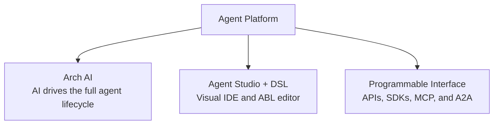
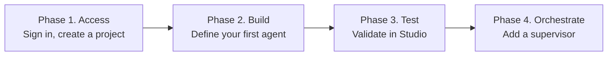

Build and deploy your first AI agent without installing anything. All you need is a browser and an account.

## Prerequisites

- Latest web browser (Google Chrome, Mozilla Firefox, Apple Safari, or Microsoft Edge).
- An Agent Platform account - [sign up free at agents.kore.ai](https://agents.kore.ai).

## Platform Access and Allowlist of IPs

The platform sends requests to a fixed set of IP addresses. If your organization applies IP restrictions, then add the following IPs to your allowlist to permit the platform traffic.

The platform is available on our US Cloud at [https://agent-platform.kore.ai](https://agent-platform.kore.ai) and at the following region-specific URLs.

| Region               | URL                                               | IPs                                    |
|:---------------------|:--------------------------------------------------|:---------------------------------------|
| USA                  | [agents.kore.ai](https://agents.kore.ai/)         | • 172.173.109.141 <br /> • 172.212.188.206 <br /> • 172.202.57.107 <br /> • 20.9.69.249 <br /> • 20.12.238.143 <br /> • 52.173.108.174 <br /> • 104.43.208.181 <br /> • 130.131.217.68 <br /> • 135.119.76.33 |
| Germany              | [de-agents.kore.ai](https://de-agents.kore.ai/)   | • 3.65.5.141                           |
| Japan                | [jp-agents.kore.ai](https://jp-agents.kore.ai/)   | • 18.180.133.211                       |
| United Arab Emirates | [uae-agents.kore.ai](https://uae-agents.kore.ai/) | • 20.74.153.122 <br /> • 20.74.173.252 |
| EU (London)          | [uk-agents.kore.ai](https://uk-agents.kore.ai/)   | • 3.9.151.173                          |
| India                | [ind-agents.kore.ai](https://ind-agents.kore.ai/) | • 135.235.170.165                      |

## Ways to Build on the Platform

The platform supports three paths depending on your team's skills and workflow:



| Approach | What It Is | Best For |
|---|---|---|
| **Arch AI** | A built-in multi-agent system that generates blueprints, authors ABL, runs tests, and continuously optimizes. | Teams who want AI to drive the full agent lifecycle. |
| **Agent Studio + DSL** | A browser-based IDE with a visual form editor and Monaco-based ABL code editor that stay in two-way sync. | Builders who prefer visual configuration or direct ABL authoring with full control. |
| **Programmable Interface** | REST APIs, MCP, SDK, Lambda, and A2A integrations to build, deploy, and manage agents from code. | Developers integrating agents into CI/CD pipelines or external systems. |

## Setup Guide

Set up your first multi-agent system in four phases:



### Phase 1: Access Studio

**Sign up and log in**

Access the platform login page and create your account. After verifying your email, you land in **Studio** - the browser-based IDE where you build, test, and manage your agents.

**Create your first project**

Click **New Project** from the Studio dashboard. Give it a name like "My First Agents" and select a workspace. Projects organize your agents, supervisors, tools, and knowledge sources in one place.

### Phase 2: Build your First Agent

Inside your project, click **New Agent**. Open the ABL editor and paste this definition:

```yaml
AGENT: Support_Assistant

EXECUTION:
  model: claude-sonnet-4-5-20250929

GOAL: |
  Help customers with product questions. Be concise
  and friendly. If you do not know the answer, say so.

PERSONA: |
  Helpful product support assistant. Answers questions
  clearly and concisely.

LIMITATIONS:
  - "Cannot process payments or refunds"
  - "Cannot access customer account information"

TOOLS:
  search_knowledge(query: string) -> {results: object[], totalCount: number}
    description: "Search the product knowledge base"

INSTRUCTIONS: |
  1. Understand the customer's question
  2. Search the knowledge base for relevant information
  3. Provide a clear, sourced answer
  4. If unsure, offer to connect with a human agent
```

This definition creates an agent that:

- Uses an LLM to understand customer questions.
- Searches a knowledge base for answers.
- Responds with sourced information.
- Has clear boundaries on what it can and cannot do.

Click **Save** to validate your definition. Studio parses ABL in real time and flags syntax issues inline.

### Phase 3: Test your Agent

Open the **Test** panel on the right side of Studio and send a message:

```
What is your return policy?
```

Your agent processes the message, searches for relevant knowledge, and responds. The trace viewer below the chat shows the full execution - LLM calls, tool invocations, and reasoning steps.

Send a few more messages to see the agent handle different questions, maintain context across turns, and respect its defined limitations.

### Phase 4: Add a Supervisor

Create a new **Supervisor** in your project and paste this definition:

```yaml
SUPERVISOR: Product_Supervisor

EXECUTION:
  model: claude-sonnet-4-5-20250929

GOAL: |
  Route customer queries to the right specialist agent.

HANDOFF:
  - TO: Support_Assistant
    WHEN: user asks about products, features, or general help
    PASS: query

  - TO: Billing_Agent
    WHEN: user asks about invoices, payments, or subscriptions
    PASS: query
```

The supervisor evaluates each incoming message and routes it to the right agent, passing conversation context along. Test it the same way - open the **Test** panel and send messages that should route to different agents.

## What Have You Built

In a few minutes, you created:

- An **agent** that understands natural language, retrieves knowledge, and enforces boundaries.
- A **supervisor** that routes messages to the right specialist.
- **Observable traces** for every execution step, visible right in Studio.

## Next Step

- [Your first agent tutorial](/agent-platform/create-agents) - Build a complete agent with tools, knowledge, and guardrails.

<Tip>Check out the **Template Gallery** in Studio for ready-made agent definitions across industries - airlines, retail, banking, telecom, travel, and more.</Tip>

{/* AG: add template gallery screenshot? */}
