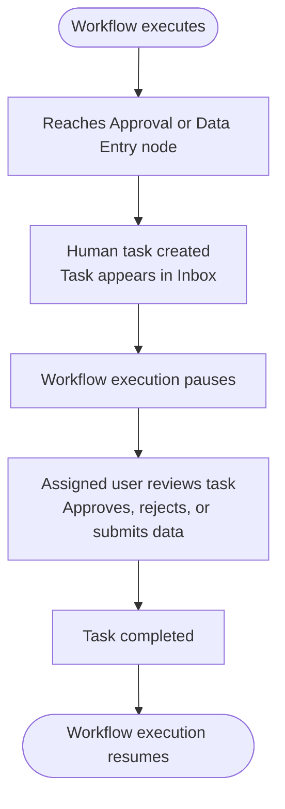

Pause workflow or agent execution at critical decision points and wait for a human to review, approve, or provide input before continuing. 

Use human approval workflows when execution must pause until a user:

* Approves a request
* Reviews workflow data
* Provides structured input
* Completes a business validation step

Human approval workflows support:

* Approval tasks
* Data Entry tasks
* Workflow-based approvals
* Multi-step approval chains

<Note>Human-in-the-loop workflows support durable execution. The platform preserves workflow state while waiting for user action, allowing execution to resume from the paused step after the task is completed.</Note>


### How human-in-the-loop workflows work

When a workflow reaches an Approval or Data Entry node, execution pauses until an assigned user completes the task.



### Workflow-based approvals

Use workflow-based approvals for multi-step approval processes, for example:

* Manager approval followed by VP approval
* Compliance review followed by security approval
* Sequential business validation workflows

The approval workflow executes in the following sequence:

1. Create a workflow with approval steps.
2. Each approval step creates a human task.
3. The workflow orchestrates the sequence.

For detailed information about Inbox tasks, task management, and workflow execution behavior, see [Inbox](/agent-platform/inbox).


## ABL configuration and Human Task APIs

The following sections describe ABL configuration patterns and the Human Task APIs used in human-approval workflows.

### Define form fields for data collection

When structured human input is required, define form fields in the Data Entry task definition.

Example:

```yaml
HUMAN_TASK:
  type: data_entry
  title: "Complete customer verification"
  priority: high

  fields:
    - name: id_verified
      type: boolean
      label: "ID verified?"
      required: true

    - name: id_type
      type: select
      label: "ID type"
      options:
        - passport
        - drivers_license
        - national_id
      required: true

    - name: notes
      type: textarea
      label: "Verification notes"
      required: false

  context:
    customerId: "cust_123"
    requestedAmount: 50000
```

Supported field types include:

* text
* number
* boolean
* select
* textarea
* date

### Human Task APIs

Human Task APIs allow applications and workflows to programmatically manage approval and Data Entry tasks. 

Use Human Task APIs to:

* View tasks
* Claim tasks
* Resolve tasks
* Assign tasks


#### **View pending tasks**

```bash
GET /api/projects/:projectId/human-tasks?status=pending
```

#### **Claim a task**

```bash
POST /api/projects/:projectId/human-tasks/:taskId/claim
Content-Type: application/json

{
  "userId": "your-user-id"
}
```

#### **Resolve a task**

After resolution, workflow or agent execution resumes with the human decision available in the execution context. 

```bash
POST /api/projects/:projectId/human-tasks/:taskId/resolve
Content-Type: application/json

{
  "respondedBy": "user-id",
  "decision": "approved",
  "fields": {
    "override_reason": "Manager verified customer identity",
    "approved_amount": 15000
  },
  "notes": "Customer provided additional documentation"
}
```

#### **Assign a task**

Assign a task to a specific user:

```bash
POST /api/projects/:projectId/human-tasks/:taskId/assign
Content-Type: application/json

{
  "assignedTo": "manager-user-id"
}
```

Assign a task to a team:

```yaml
assignedToTeam: "finance-approvers"
```

---


## Troubleshooting

| Issue | Resolution |
| --- | --- |
| Escalation never triggers | Verify trigger conditions reference valid runtime variables |
| Human task not appearing in the Inbox | Verify task assignment and user permissions |
| Workflow not resuming after task completion | Verify `on_human_complete` handlers and task resolution |
| Required field validation errors | Ensure all required fields are provided |
| Task expired before resolution | Increase task timeout duration or escalation coverage |