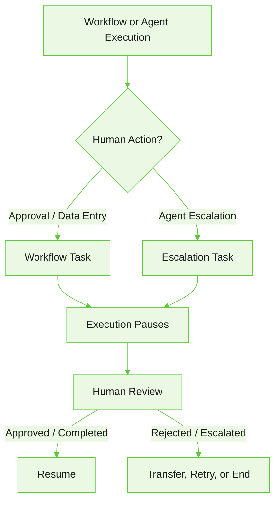

Inbox provides a centralized interface for managing human tasks generated by workflows and agents. These tasks allow workflows and agents to pause execution and wait for user input before continuing. This allows workflows to combine automated orchestration with manual user actions. Escalation tasks are typically used for user-requested human assistance, high-risk operations, system failures or repeated routing failures.

Use Inbox to:

* Review workflow and agent tasks
* Claim unassigned tasks
* Complete approval requests
* Submit the required input for Data Entry tasks

## How Inbox tasks are created

Inbox tasks are created when workflows or agents require human participation during execution.

Tasks can be generated from:

- Human-in-the-loop workflow nodes (Approval nodes or Data Entry nodes)
- Agent escalations triggered through `ESCALATE`

{/*
**Workflow Tasks**

When workflow execution reaches a human-in-the-loop node:

- A task is created in the Inbox
- Workflow execution pauses until the assigned user completes the task
- The assigned user reviews or completes the task
- Workflow execution resumes after the task is completed

This allows workflows to combine automated orchestration with manual user actions.

**Agent Escalation Tasks**

Inbox tasks are also created when an agent triggers an escalation using `ESCALATE`.

When an escalation condition is met:

- A task is created in the Inbox for a human agent.
- Agent execution is suspended.
- The human agent reviews and resolves the issue.
- The configured post-completion action resumes, transfers, or completes execution.

Escalation tasks are typically used for user-requested human assistance, high-risk operations, system failures or repeated routing failures. 
*/}

## Access Inbox

Go to your project and select **Operate** > **Inbox**. 

The Inbox page displays human-in-the-loop tasks and agent escalations assigned to you or available to claim for you.

## Claim tasks

Inbox supports both assigned and unassigned human tasks. Tasks can be assigned either to everyone or to specific users.

When a task is assigned to Everyone:

* The task appears as unclaimed in the Inbox.
* Users must claim the task before acting on it.

Inbox displays a **Claim Task** action for unclaimed tasks.

After a task is claimed, the Inbox displays the Claimed user and the Claim timestamp.

This allows teams to manage shared operational queues while ensuring a single user completes the task.

## Complete Data Entry tasks

Data Entry tasks collect user input during workflow execution. Data Entry forms are rendered directly inside the inbox.

When structured user input is required, configure form fields in the Data Entry task definition. See *Agent Collaboration and Handoff*.

To complete a Data Entry task:

1. Open the task in the Inbox.
2. Enter the required values.
3. Click **Submit Data.**

After submission, workflow execution resumes using the submitted values.

<Note>Tasks configured with timeouts display a countdown timer in the Inbox while waiting for user action.</Note>

## Complete Approval tasks

Approval tasks allow users to review workflow requests before workflow execution continues.

Approval tasks display:

* Approval subject
* Approval message
* Associated workflow information

Users can claim and review approval tasks directly from the Inbox.

Approval responses are returned to the workflow execution context and used in downstream workflow execution.

## Workflow execution and task progression

Human-in-the-loop tasks are synchronized with workflow execution. 

When workflow execution reaches an Approval or Data Entry node, a task is created in the Inbox. Workflow execution resumes after the task is completed. 

If workflow execution reaches another human-in-the-loop node, a new task is created in the inbox.

<Note>Human-in-the-loop workflows support durable execution. The platform preserves workflow state while waiting for user action, allowing workflow execution to resume from the paused step after the task is completed.</Note>

In the Flow builder, the workflow execution panel displays the current execution state, such as *Waiting for human response.* Execution details are updated as tasks are completed and workflow execution progresses to downstream steps.

After the required human-in-the-loop tasks are completed, workflow execution resumes and progresses to downstream workflow steps.

For more information about human-in-the-loop workflows and approvals, see [Human-in-the-loop Workflows](/agent-platform/human-in-the-loop).
