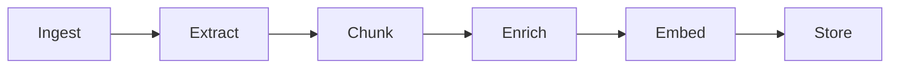

A Knowledge base is a managed collection of documents and data sources that an agent can search during conversations. Knowledge bases in the Agent Platform serve as the primary retrieval layer for enterprise content, enabling agents to query and access information across heterogeneous data sources. Content can be ingested via file uploads, web crawling, and external connectors, and is indexed to support vector, keyword, and structured retrieval. At query time, the platform applies enterprise search and RAG pipelines to automatically contextualize agent requests—resolving intent, enriching queries, and retrieving relevant chunks. This retrieved context is then made available to agents and tools, allowing them to perform grounded reasoning, execute workflows, and generate accurate, context-aware responses.

## How knowledge bases work

A knowledge base processes content through an ingestion pipeline (index-time) and serves it via a retrieval pipeline (query-time).

### Ingestion process

The ingestion pipeline transforms raw content into retrieval-ready chunks with embeddings and metadata.

1. **Ingestion**: Registers and tracks content for processing. For uploaded files, the platform checks for duplicates using content hashing, files that have already been indexed with unchanged content are skipped. For connected data sources, the platform discovers and tracks all documents within the source.

1. **Extraction**: The extraction stage pulls content from your source files. Depending on the content format, different extraction strategies are used.

  | Format                | Extraction approach                                                  |
  | --------------------- | -------------------------------------------------------------------- |
  | Plain text, Markdown  | Used as-is                                                           |
  | HTML                  | Tags stripped, structure preserved where meaningful                  |
  | PDF                   | Text extracted from pages (layout-aware extraction for complex PDFs) |
  | DOCX / Office formats | Document content extracted from the file structure                   |
  | JSON                  | Values extracted and concatenated with structural context            |

    The extraction stage also captures document metadata (titles, headings, page numbers) that's used later for enrichment and search result context.

1. **Chunking** - The chunking stage splits text into smaller segments that can be individually embedded and retrieved. The chunking strategy you choose directly affects search quality — it determines how coherent and complete each retrievable unit of content is. The platform supports three chunking strategies:

  | Strategy       | How it splits                                                     | Best for                                                       |
  | -------------- | ----------------------------------------------------------------- | -------------------------------------------------------------- |
  | Fixed-size     | Token windows of a configurable size with overlap between chunks  | Predictable, uniform content where consistency matters         |
  | Semantic       | Natural boundaries such as paragraphs, sections, and topic shifts | Narrative or long-form content where coherence is important    |
  | Sliding window | Overlapping windows that slide across the full text               | Content where context continuity across boundaries is critical |

    <Note> Chunk overlap ensures that context at chunk boundaries is not lost. A concept that spans two paragraphs will appear in both chunks when overlap is configured. Always configure overlap when your content spans section boundaries. </Note>

1. **Enrich**: The enrichment stage adds metadata to each chunk, improving search quality and enabling filtering. The following enrichments are applied:

  | Enrichment                 | What it adds                                                         |
  | -------------------------- | -------------------------------------------------------------------- |
  | Entity detection           | Identifies emails, URLs, dates, and monetary values within the chunk |
  | Summary generation         | Creates a brief summary of the chunk's content                       |
  | Language detection         | Identifies the language of the content                               |
  | Knowledge graph extraction | Extracts entities and relationships to build a knowledge graph. This feature is available on request.      |

    Enrichment metadata is stored alongside each chunk and can be used to filter and rank search results at query time.

1. **Embedding Generation**: The embedding stage converts each text chunk into a vector representation that captures its semantic meaning. These vectors enable semantic search — finding content that's conceptually related to a query even when the exact words differ.

1. **Store**: The final stage writes the processed chunks to the vector database for fast retrieval. Each stored chunk includes:

   - The original text content
   - The vector embedding
   - Enrichment metadata
   - Source information — document ID, source ID, and page number
   - Permission metadata for access control

  After a chunk is stored, it's immediately available for search.

### Retrieval process

When an agent needs information from a knowledge base, the platform executes a search query and returns the most relevant chunks as context for the agent to compose a response. The search pipeline runs in the following sequence:

1. The agent sends the query to the runtime.
2. Runtime embeds the query text into a vector representation.
3. Hybrid search runs - semantic and keyword search execute simultaneously.
4. Results from both strategies are merged.
5. Merged results are re-ranked by relevance.
6. Permission filters are applied to the re-ranked results.
7. Filtered, ranked chunks are returned to the agent as context.
8. The agent uses the context to compose a response.

#### Key concepts

1. **Hybrid Search**: The platform uses hybrid search by default, combining two complementary strategies to maximize retrieval quality.

   **Semantic Search**

   Semantic search finds chunks whose vector embeddings are most similar to the query embedding. This helps retrieve conceptually relevant content even when the user's phrasing does not directly match the source text.

   Example:
   A query for "How do I get my money back?" can match a chunk about "Refund policy and procedures" even though none of the query words appear in the chunk heading.

   Use semantic search when users are likely to phrase queries in natural language that differs from the terminology used in the source content.

   **Keyword Search**

   Keyword search finds chunks containing the exact terms in the query. This helps retrieve content with specific names, product codes, technical terms, or identifiers that semantic search might miss due to low vector similarity.

   Use keyword search when the content contains precise terms — such as model numbers, error codes, or proper nouns — that must match exactly.

   **Hybrid Search**

   Hybrid search merges and re-ranks results from semantic and keyword search to produce a single ranked list of the most relevant chunks.

2. **Re-Ranking**

    After the initial search, results are re-ranked to improve relevance ordering. Re-ranking evaluates the merged result set and adjusts the order based on relevance signals beyond initial similarity scores.

3. **Permission Aware Search**

  Search results are filtered based on the requesting user's permissions before they're returned to the agent. If your knowledge base is connected to a data source with access controls, such as SharePoint or other enterprise connectors, only documents the user has permission to see are included in the results.

  <Note> Permission filtering happens after re-ranking. The agent only receives chunks the requesting user is authorized to access, regardless of their relevance score. This means result counts may vary between users querying the same knowledge base with the same query. </Note>

## Adding knowledge base

Knowledge bases are created and managed at the project level and are available to all agents within that project. Every knowledge base in the project is automatically exposed as a tool that any agent can attach to and use.

To create a knowledge base:

- Navigate to **Knowledge Bases** in the left sidebar.
- Click **+ New Knowledge Base**.
- Enter a name and description.

  - Name: used to identify the knowledge base across the project.
  - Description: helps agents identify when to use this knowledge base as a tool. Write this clearly and specifically.

- Click **Create**.

The knowledge base is created with default configurations applied. You can review and update these configurations at any time from the knowledge base dashboard.

### Adding data sources

A knowledge base can ingest content from multiple source types simultaneously. Each source is managed independently, and you can add, sync, and remove sources without affecting others.

When you add a data source to the knowledge base, the platform immediately begins processing it in the background. You don't have to perform any other steps to trigger ingestion or indexing.

To add a data source, follow these steps:

- Go to the **Sources** and select **+ Add Data Source**.
- Select the source connector and select **Connect**.
- Provide configuration details for the source.

#### File uploads

Upload files directly from your local system. The intelligence pipeline immediately processes the uploaded files. If a source file changes, re-upload it.

- Supported file types: PDF, DOCX, TXT, CSV, MD, XLSX, JSON, HTML.
- Maximum file size: 100 MB per file
- Maximum batch size: 40 files per upload.

<Note>If the source file changes, you need to re-upload it.</Note>

**Metadata Fields**

While uploading a file, you can tag the upload with file metadata:

* **Essential Fields** - the most commonly used fields like Author, Category, Tags, Department.
* **More Fields** - a list of additional fields covering document metadata such as Title, Content Summary, Language.
* **Advanced (custom JSON)** — add custom fields not covered by the standard list, as JSON, for example, `{"custom_string_1": "value", "custom_number_1": 42}`.

<Note>Fields filled in during upload become searchable. Only filled fields create vocabulary entries for natural language queries — empty fields are not indexed.</Note>

Click **Upload** to start ingestion. The uploaded content is automatically indexed after the ingestion completes. 

#### Web crawl

Crawl and index web pages from any public or authenticated website.

Navigate to **Sources** > **Add Source** > **Web Crawler** to manage web sources.

- Provide the domain URL.
- Enter auth details, if required. 
- Select Discovery method. 
  - Crawl Full Sitemap: Discovers the sitemap and retrieves the list of URLs to be crawled.
  - Guided Discovery: Guide the system to identify pages based on a given URL pattern.
  - Direct URLs: Directly provide URLs to crawl.
- From the list of the discovered URLs, select the URls to crawl. 
- Configure the web crawl settings.
- Start Crawl.

**Web Crawl Settings**

**How much should we crawl?** : Choose how many pages to crawl in a single run.

**Crawl Strategy**

- **Rendering** controls how pages are processed before content is extracted. **Standard** option fetches the raw HTTP response only. It's the fastest option, but doesn't capture content that's rendered client-side (e.g. React/Vue apps, JS-loaded sections). Best for static HTML sites. **Full rendering** loads the page in a headless browser and executes JavaScript before extracting content, capturing dynamic content like expandable sections, tabs, and client-rendered text. Slower and more resource-intensive, but necessary for JavaScript-heavy sites. **Auto** allows the system to automatically choose per page whether a lightweight HTTP fetch or full browser rendering is needed, based on page characteristics.
- **Learned patterns** determines whether the crawler reuses extraction patterns from previous crawl runs. Set to **Keep** by default, which reuses known page layouts and skips the AI layout detection step — making repeat crawls faster. Select **Reset** after a site redesign or template change so the crawler re-learns the new structure from scratch.
- **Crawl Speed** controls the delay between page requests. Default value is 200 ms. Faster speeds can trigger rate limits on external sites.

**Limits**

- **Max pages** caps the number of pages fetched in a batch. The default is 1,000 per batch.
- **Max depth** controls how many link-hops from the seed URL the crawler will follow. Default: 5, Range: 1-20.
- **robots.txt** honors crawler directives in robots.txt.

**Content Processing**

- **Extraction quality** controls how aggressively the crawler cleans and filters page content during extraction. Default value is **Balanced**.
  
  | Option | Description |
  | --- | --- |
  | Thorough | Keeps more content from each page. |
  | Balanced | Default quality and completeness for most sites. |
  | Minimal | Aggressively strips noise. |
  | Custom | Fine-tune quality gate and content preservation thresholds manually. |

  **Custom thresholds**

  | Field | Description |
  | --- | --- |
  | Quality gate | Minimum quality score required to accept extracted content, on a 0–1 scale (default 0.5). Lower values are more permissive — more content is accepted even if extraction confidence is lower. |
  | Content preservation | How much of the original content to keep when cleaning, on a 0–1 scale (default 0.3). Lower values clean more aggressively, stripping more content. |

- **Duplicate content** - Controls how pages with identical content at different URLs are handled. Options: **Deduplicate** (default) or **Keep all**.
* **Cookie consent** - Rejects or closes cookie popups before extraction; never accepts tracking. Options: **Auto-dismiss** (default) or **Ignore**.

**Extraction Preview** shows samples of what will be extracted from each section using the current configuration before the full crawl runs. 

#### Connectors

Pre-built integrations for third-party applications. Navigate to **Sources** > **Add Source** to configure integrations.

**Connector Setup Workflow**

For each connector,

1. Authentication — Provide OAuth credentials, API keys, or tokens to enable connection with the third party application. 
2. Ingestion — Select content types and apply filters.
3. Field Mapping — Align source fields with the inbuilt schema. Map custom fields, if required.
4. Permissions — Configure security settings to enable authorized access to information from the third-party applications. 

**List of Supported Connectors**

| Connector                                                                  | Description                                                                |
|----------------------------------------------------------------------------|----------------------------------------------------------------------------|
| [SharePoint Connector](/agent-platform/connectors/sharepoint)              | Enables ingestion from SharePoint sites.                                   |
| [Google Drive Connector](/agent-platform/connectors/googledrive)           | Enables ingestion from Google Drive, including My Drive and Shared Drives. |
| [Confluence Cloud Connector](/agent-platform/connectors/confluence)        | Enables ingestion from Confluence Cloud spaces and pages.                  |
| [ServiceNow Connector](/agent-platform/connectors/servicenow)              | Enables ingestion from ServiceNow tables and records.                      |
| [Secure File Transfer Protocol Connector](/agent-platform/connectors/sftp) | Enables ingestion from SFTP server.                                        |
| [Custom Connector](/agent-platform/connectors/custom-connector)            | Enables ingestion from any data source that exposes HTTP endpoints.        |

### View ingested content

To view the ingested content, follow these steps:

1. Go to the **Documents** page.
1. The ingested documents are listed. Click on any document to view the extracted content and the related metadata. Following details of the document are shown.

  - Metadata - Provides general information about the document like type, language, size, page count.
  - Extraction Quality - Provides metrics that help evaluate the quality of content extraction.

      | Metric                 | Description                                                        |
      | ---------------------- | ------------------------------------------------------------------ |
      | Overall                | Overall extraction quality score.                                  |
      | Noise Reduction        | Effectiveness of removing irrelevant content.                      |
      | Content Preservation   | Degree to which original content is retained.                      |
      | Structure Preservation | Accuracy of preserving headings, sections, and document structure. |
      | Metadata Extraction    | Quality of metadata extraction from the source document.           |

  - Extraction Report - Shows the extraction configuration used for the document. Use Re-extract to rerun document extraction if extraction settings have changed, metadata needs to be regenerated or extraction quality needs improvement.
  - Content Analysis - Displays attributes identified during content processing like detected language.
  - Processing Pipeline - Series of steps through which the document is processed. Also indicates the current status of each step. A document is fully available for retrieval only after all processing stages are successfully completed.
  - Source Info - Details of the source of the document.
  - Raw Metadata - Document metadata in JSON format.

1. You can reprocess a given document or delete it.

### View extracted chunks

1. Navigate to **Chunks** page.
1. Click on a document to see the chunks extracted from the document.
1. See token distribution across chunks from the document.

### Configure content processing pipeline

By default, the platform creates a default pipeline for processing of the ingested content automatically to make it searchable.

The default pipeline consists of the following stages. You can reconfigure any stage as required. Alternatively, you can add a new flow to the pipeline for custom configurations.

**Extraction**: Extracts raw text and structure from ingested files and connected sources. The extraction strategy varies by file type, for example, tables in spreadsheets are extracted differently from paragraphs in a PDF. Configure extraction settings to control how the platform interprets your content structure.

**Chunking**: Splits extracted content into smaller segments for indexing. Chunk size and overlap affect search quality; smaller chunks return more precise results while larger chunks retain more surrounding context. Configure the chunking strategy based on the nature of your content and how users are likely to query it.

**Content Intelligence**: Enriches chunks with additional metadata, such as topic tags, summaries, or classifications, to improve search relevance. Configure what enrichment is applied to your content at this stage.

**Visual Analysis**: Processes visual content in ingested files, such as images, diagrams, and charts, and extracts text or descriptions for inclusion in the index. Enable this stage when your content contains visual elements that carry meaningful information.

**Embedding Fields**: Defines which fields from the extracted and enriched content are included in the embedding. Controlling embedding fields lets you tune what the vector search considers when matching a query to a chunk.

**Embedding**: Converts the selected fields into vector representations using the configured embedding model. The choice of embedding model affects the quality of semantic search results. Configure the model here based on your language and domain requirements.

**Opensearch**: At this stage, the processed and embedded chunks are written to the index using their embeddings. You can run test queries to see what is currently indexed and verify search quality as content is added.

<Note>The pipeline runs in sequence. A change to an upstream stage, such as chunking, affects all downstream stages. Re-indexing is required when pipeline configuration changes are saved.</Note>

#### Adding a Pipeline Stage

Click **+** at any connection point in the pipeline canvas to insert a new stage. There are two categories of stages that can be added to a pipeline. Add a stage and select it for configuration.

**Pipeline Stages** — content-processing stages that run as part of the core ingestion flow.

| Stage | Description |
| --- | --- |
| Chunking | Splits content into smaller chunks. |
| Content Intelligence | Adds summarization, question synthesis, and document-level intelligence. |
| Visual Analysis | Analyzes images, tables, charts, and screenshots using a multimodal LLM. |
| Enrichment | Enriches chunks with LLM-generated metadata. |

**Utility Stages** — general-purpose stages you can insert anywhere in the pipeline for custom processing logic.

| Stage | Description |
| --- | --- |
| Field Mapping | Maps and transforms fields using conditional rules. |
| API Call | Calls an external HTTP API during processing. |
| LLM | Enriches data with a large language model call. |
| Custom Script | Runs sandboxed JavaScript to transform content and metadata. |

##### Field Mapping

Configure one or more rules to map or transform fields during processing. Each rule is independently set to one of two modes, so a single stage can mix Visual and CEL rules as needed.

- **Visual mode** — Build a rule using an IF/THEN structure: IF a selected field meets a condition (equals, and so on) against a value, THEN set a target field to a new value. The source (`Select field...`) and target (`Select target field...`) dropdowns list the indexed fields available from your source documents.
- **CEL mode** — Write a CEL expression that evaluates directly to the target value, e.g. `document.source_type == 'pdf' ? 'document' : 'other'`.

Click **Add Rule** to add additional rules — each can independently use Visual or CEL mode; rules run in order.

##### API Call

Calls an external HTTP endpoint during processing.

| Field | Description |
| --- | --- |
| Provider | The API provider type. Select **Custom API** to call any external HTTP endpoint. |
| Endpoint URL | The URL the platform sends requests to, e.g. `https://api.example.com/extract`. |
| HTTP Method | The HTTP method used for the request, e.g. POST. |
| Pipeline Mode | Controls how the API response is applied to the pipeline. **Replacement** replaces the stage output with the API response. **Transformer** modifies data in place. **Source** provides input. |
| Output Type | The expected format of the API response. It can be `Text`, `Pages`, `Chunks`, `Document` and `Enriched Chunks`.|
| Entry Point | Determines when the API is called during document processing. |

- **Auth & Headers** — Configure authentication (e.g. API key, bearer token, basic auth) and custom request headers sent with each call.
- **Behavior** — Configure request behavior such as timeout duration, retry attempts, and error handling.
- **Test** — Send a test request using sample data to validate the results of the .

##### LLM

Enriches content with a large language model call.

| Field | Description |
| --- | --- |
| Model | The model used to run the prompt, e.g. Auto-select fast model. |
| Prompt Template | The prompt sent to the model. Click any available field chip (Title, Content Summary, Source Type, Source URL, Created Date, Modified Date, Author, Language, Status, Category, Description, Tags, Priority, Assignee, Department, Project) to insert its value into the template. |
| Output | Where the model's response is written, e.g. **Save to metadata**. |
| Output Field | The target field the output is saved to. |
| Advanced | Additional configuration options (collapsed by default). |

##### Custom Script

Runs sandboxed JavaScript to transform document content and metadata.

<Note> Custom Script runs for document files (PDF, DOCX, text, HTML, web pages). It does not run for JSON, CSV, or Excel uploads. Use a structured-ingestion path for JSON, CSV, or Excel content formats.</Note>

| Field | Description |
| --- | --- |
| Run at Phase | When the script runs during processing, e.g. **After Extraction (whole document text)** — runs once per document, after extraction, with `content` set to the full extracted text (markdown for PDF/DOCX). Best place to clean or normalize whole-document text. |
| Transform Script | A `transform(content, metadata)` function to make changes to the input. Use `return { content?, metadata? }` to update content or metadata or both. The script runs once per chunk/document; you can add your own helper functions and call them from `transform()`. |

Content changes made by the script are embedded and searchable. Metadata changes are stored on the chunk/document but are not searchable (canonical) fields yet. Provide sample content and **Run on sample** to test the script behavior.

Each Utility Stage also supports an optional **Execution Condition** — a CEL expression that, when set, limits the stage to run only if the expression evaluates to `true`. Click **Apply** to save a stage's configuration, or **Reset** to discard changes.

### Field Intelligence

Manage indexed fields and how agents can use them in search.

**Summary** — Dashboard of field health: active field count, indexed records, connected sources, open warnings, and quick links to review fields/capabilities.
**Fields** — Full inventory of mapped fields, each showing its data type, storage field name, and which search capabilities (Answer, Semantic, Filter, Sort, Aggregate) are enabled on it. 
**Capabilities** — Review and assign fields to each search capability (Answer, Semantic, Filter, Sort, Aggregate).
**Agent View** — Read-only view of what's exposed to agents: coverage %, a confidence breakdown per capability, and the field labels/keys agents can discover.

### Configure vocabulary

Vocabulary lets you define aliases for terms that appear in your knowledge base content. When a user queries using an alias, the platform expands the query at runtime to include both the alias and the canonical term — improving search coverage without requiring the user to know the exact terminology used in the source documents.

Configure vocabulary when:

- Your source documents use formal or technical terminology that users are unlikely to search for exactly.
- Your content uses abbreviations or acronyms that users may spell out — or vice versa.
- Different teams or user groups use different terms for the same concept.
- Search queries consistently miss relevant content despite the content existing in the knowledge base.

**Add Vocabulary**

To add a vocabulary entry, click Add Entry on the Vocabulary page and provide the following details.

| Field           | Description                                                                                                                                                              |
| --------------- | ------------------------------------------------------------------------------------------------------------------------------------------------------------------------ |
| Term            | The canonical term as it appears in the document. This is the authoritative form the platform uses for matching. Example: priority, status, assignee                     |
| Aliases         | Alternative terms a user might search for, entered as comma-separated values. Maximum 10 aliases per term. Example: pri, urgency, importance                             |
| Description     | A brief explanation of what the term represents. Used for internal reference.                                                                                            |
| Field Reference | The schema field this term is associated with. Select from the fields detected during schema extraction. Scopes the vocabulary mapping to a specific field in the index. |
| Capabilities    | Define how the term and its aliases are used in the results.                                                                                                             |
| Display With    | Specify additional fields to show alongside this term in the results.                                                                                                    |

### Configure AI

This section controls the models and LLM-powered features used for document ingestion, enrichment, and search in the given project.

**Tenant Models**: Manage the LLM providers and models available for this workspace. Click Configure Models to add or update model configurations. See Models for details.

#### Embedding models

Embedding models convert documents into vectors for semantic search. The active model applies to all document ingestion and retrieval in this workspace. BGE-M3 is the default embedding model.

<Note>Changing the embedding model requires re-ingestion. All documents will be re-processed and re-embedded. This operation may take time and incur costs depending on your provider.</Note>

#### Enrichment features

LLM-powered features that run during ingestion to generate summaries, questions, field mappings, and vocabulary. Each feature can be enabled or disabled independently and uses a configurable model. Click Change on any feature to switch its model.

- **Progressive Summarization**: Generates 2–3 sentence summaries per chunk using context from previous chunks. Improves retrieval quality for long documents.
- **Question Synthesis**: Generates 3–5 answerable questions per chunk. Improves retrieval accuracy by matching user queries to pre-generated questions.
- **Field Mapping Suggestions**: Suggests field mappings from the connector schema to the canonical schema during source configuration.
- **Domain Vocabulary Generation**: Enriches domain vocabulary with aliases, descriptions, and capabilities to improve search relevance for domain-specific terms.
- **Knowledge Graph Extraction**: Extracts entities and relationships to build a knowledge graph. This feature can be enabled upon request.

#### Advanced features

Higher-cost features for visual and multimodal content analysis. Each feature uses a balanced-tier model and can be enabled or disabled independently.

- **Vision Analysis**: Analyzes page screenshots and images to understand visual content. Useful for documents that contain charts, diagrams, or image-heavy pages.
- **Multimodal Deep Analysis**: Performs deep analysis of images, tables, and charts with data extraction. Use this for documents where structured visual content needs to be indexed.

#### Query pipeline LLM

Controls the LLM used at query time to understand and process queries.

**Query Intelligence**: When enabled, it automatically assigns the best available model for vocabulary resolution, query classification, filters, aggregations, structured queries, and enhanced search accuracy.

<Note>Query Intelligence applies to direct search queries only. It is not used when searching through Agent and Tools.</Note>

### Knowledge Graph

Knowledge Graph classifies documents against a configurable taxonomy, extracts entities from your content, and links them into a searchable graph, in addition to the standard chunk-based search index.

Standard knowledge base search retrieves chunks based on text similarity, treating each chunk largely as an independent unit. Knowledge Graph adds structure on top of this. It organizes content into a taxonomy (such as , domain → category → product → attribute) and connects related entities across documents, so the platform understands not just *what text matches a query*, but *how concepts relate to each other*.

This is useful when:

* Your content naturally maps to a structured taxonomy — such as a product catalog, service categories, or a domain with defined categories and attributes.
* You want to answer relationship-aware queries, such as "what products fall under Pharmacy" or "what attributes does this product have" — questions that depend on structure, not just text similarity.
* The same entity (a product, term, or concept) appears across multiple documents, and you want it recognized and linked as a single connected entity rather than treated as separate, unrelated mentions.
* You want to filter or facet search results by category, product, or attribute, rather than relying purely on keyword or semantic match.

### Setting Up the Knowledge Graph

Setting up Knowledge Graph involves:

1. Picking an industry domain (or letting AI generate one).
2. Building a taxonomy of products and attributes for that domain.
3. Automatically classifying every document against the taxonomy.
4. Extracting entities from content and linking them into the graph.

- Navigate to **Knowledge Graph** in the left sidebar of the knowledge base.
- Click **Select your domain**.
- Configure **Taxonomy**: Configuring the taxonomy defines the schema that the Knowledge Graph will classify the content against.

  | Field | Description |
  | --- | --- |
  | Domain | The industry domain the taxonomy is based on. |
  | Generate Profile with AI | Automatically generates a taxonomy profile using AI, based on the website provided.|
  | Organization Name | Optional. Your organization's name, used to help AI generate a more relevant taxonomy profile. |
  | Which products do you offer? | Optional. Select the products/services relevant to your organization. Available options are grouped by category (e.g., Clinical Care, Health Insurance, Pharmacy, Diagnostics for a Healthcare domain) and vary by the selected domain. Click **Show Advanced** for additional options. |

- Click **Set Up Taxonomy** to save the configuration and create the taxonomy.

Once a taxonomy is configured, click **Run Enrichment** to classify documents and extract entities against the taxonomy, building the knowledge graph. Re-run enrichment after taxonomy changes or when new content has been added to the knowledge base.

- **Graph View** - Visualizes the knowledge graph as a network of connected nodes.
-  **Statistics** — Summary metrics about the documents as per the taxonomy.
- **Attributes** — Lists the attributes defined in the taxonomy and their occurrences in the indexed content. 

### Search and test

The Search and Test tab lets you validate the knowledge base configuration by running queries against indexed content before connecting it to an agent. It shows exactly how the knowledge base will respond to a query, including which chunks are returned, how they are ranked, and how each stage of the search pipeline performed.

**Query Settings**

Enter a query in the Query field and configure the following settings before running a search:

**Query Type** controls how the search matches the query to indexed content. Three options are available:

 - Hybrid - combines semantic search and keyword search. Returns results that are both conceptually relevant and lexically matched. Recommended for most use cases.
 - Semantic - finds conceptually relevant content based on meaning, even when the exact words don't appear in the source.
 - Keyword - finds exact or near-exact matches. Best for structured content where precise term matching is important.

**Top K** defines the maximum number of chunks returned per query. Set this based on how much context the agent needs to compose an accurate response. A higher value returns more context but increases token consumption when the agent processes the results.

{/* Removed in 1.5.0
**Resolve Mode** controls how results are resolved and ranked when multiple chunks from the same or different sources are returned. Three modes are available:

  | Mode | Description |
  | --- | --- |
  | Exact | Matches query terms exactly against indexed content. |
  | Alias | Resolves query terms through configured vocabulary aliases, matching both the alias and its canonical term. Default. |
  | Fuzzy | Matches query terms approximately, tolerating minor variations such as typos or partial matches. |
*/}

{/* Removed in 1.3.0
**Preprocessing**, when enabled, applies transformations to the query before execution, including spell correction, synonym expansion, and entity recognition. Enable this when your users are likely to use natural language queries with varied phrasing or common misspellings.
*/}

**Run a Test Query**

Click Search to execute the query. The platform returns:

- Search retrieval time - total time taken and the time per search engine.
- Results - ranked list of matching chunks showing relevance score, source file, content preview, and metadata fields.
- Resolution Chain Debug, a step-by-step breakdown of how the query was processed.

The **Diagnostics** panel on the right provides a real-time view of the knowledge base's health across three areas:

- Data and Indexing - Shows the current state of indexed content, document count, chunk count, and the last indexed timestamp.
- Enrichment - Shows the configuration status of vocabulary and field mappings.
- Pipeline Health - Shows the embedding model in use, the current pipeline status, and whether any index errors have occurred.

The **Query** History section shows recent queries run against the knowledge base, along with the number of results returned, query type, and time taken.

### Additional settings

Manage knowledge base configuration, view indexing details, configure citation behavior, access API information, and perform administrative actions such as rebuilding or deleting the knowledge base.

- General - Basic information about the knowledge base.
- Index Configuration - Displays the retrieval and indexing settings used by the knowledge base.
- Citations - Controls how source references appear in search results and AI-generated responses. When enabled, response includes references to the content used to generate the answer.

    | Option                  | Description                                                                                                                                                            |
    |-------------------------|------------------------------------------------------------------------------------------------------------------------------------------------------------------------|
    | **Direct links**        | Provides direct access to the source document when a citation is selected.                                                                                             |
    | **Time-limited links**  | Generates temporary links that expire after a configured period. This helps control access to source content. Provide link expiry time in hours.                       |
    | **Click-limited links** | Generates links that can only be accessed a limited number of times before they become invalid. Provide the maximum time and maximum number of clicks for link expiry. |
    | **No links**            | Displays citations without providing clickable links to the source document.                                                                                           |

    <Note> Available link behavior options may depend on the source type.</Note>

- API & SDK - Provides programmatic access information for the knowledge base.
- Rebuild Index - Reprocesses all documents and rebuilds the search index. Time taken to rebuild index depends on the content volume and knowledge base size.
- Delete Knowledge Base - Permanently deletes the knowledge base and all associated data.

## Use knowledge base as a tool in agents

Every knowledge base in the project automatically has a corresponding knowledge tool. Agents access the knowledge base content by attaching this tool. Once attached, the agent can invoke it at runtime to search the knowledge base and retrieve relevant content.

To attach a knowledge tool from the agent configuration:

1. Navigate to the agent and open the **Tools** section.
2. Click **Attach Tool**.
3. From the list of available tools, locate the knowledge tool for your knowledge base — knowledge tools are listed alongside all other project tools.
4. Select the tool to attach it to the agent.

**Attach a Knowledge Tool via DSL**

To attach a knowledge tool using the DSL editor, follow these steps:

1. Navigate to **Knowledge Tools** at the project level.
2. Open the knowledge tool that corresponds to your knowledge base.
3. Copy the DSL definition shown on the tool page.
4. Open the agent's DSL editor by clicking **DSL** at the top of the agent page.
5. Paste the copied DSL into the **Tools** section of the agent definition.
6. Compile and save the changes.
