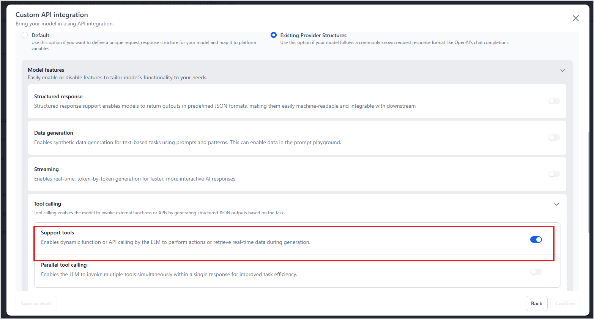

# Supported AI Models on Agent Platform

The Platform offers flexible orchestration and runtime support for a wide range of AI Models across leading providers. Whether you're building real-time assistants, multi-agent systems, or background workflows, you can choose from Platform-hosted, open-source, externally integrated, or third-party models to meet your needs. Some advanced capabilities—like real-time voice interaction—are available only with specific models.

## Supported AI Models for Agentic Apps and Agents

### External Models

Agentic Apps supports Agent and Supervisor orchestration with the most widely used models from providers such as OpenAI, Azure OpenAI, Anthropic, and Google.

<table>
  <tr>
   <td>Model Provider
   </td>
   <td>Model Variant
   </td>
  </tr>
  <tr>
   <td>OpenAI</td>
   <td>
  <ul>
    <li>gpt-5.2-2025-12-11</li>
    <li>gpt-5.2</li>
    <li>gpt-5.2-chat-latest</li>
    <li>gpt-5.1-2025-11-13</li>
    <li>gpt-5.1</li>
    <li>gpt-5.1-chat-latest</li>
    <li>gpt-realtime-mini-2025-10-06</li>
    <li>gpt-audio-mini-2025-10-06</li>
    <li>gpt-5-2025-08-07</li>
    <li>gpt-5-mini-2025-08-07</li>
    <li>gpt-5-nano-2025-08-07</li>
    <li>gpt-audio-2025-08-28</li>
    <li>gpt-realtime-2025-08-28</li>
    <li>gpt-5</li>
    <li>gpt-5-mini</li>
    <li>gpt-5-nano</li>
    <li>gpt-5-chat-latest</li>
    <li>gpt-4o-audio-preview-2025-06-03</li>
    <li>gpt-4o-realtime-preview-2025-06-03</li>
    <li>gpt-4.5-preview-2025-02-27</li>
    <li>o3-2025-04-16</li>
    <li>o4-mini-2025-04-16</li>
    <li>gpt-4.1-2025-04-14</li>
    <li>gpt-4.1-mini-2025-04-14</li>
    <li>gpt-4.1-nano-2025-04-14</li>
    <li>gpt-4o-search-preview-2025-03-11</li>
    <li>o3-mini-2025-01-31</li>
    <li>gpt-4o-realtime-preview-2024-12-17</li>
    <li>gpt-4o-mini-audio-preview-2024-12-17</li>
    <li>gpt-4o-audio-preview-2024-12-17</li>
    <li>o1-2024-12-17</li>
    <li>gpt-4o-2024-11-20</li>
    <li>gpt-4o-2024-08-06</li>
    <li>gpt-4o-mini-2024-07-18</li>
    <li>gpt-4o-2024-05-13</li>
    <li>gpt-4-turbo-2024-04-09</li>
    <li>gpt-4-1106-preview</li>
    <li>gpt-4-0125-preview</li>
    <li>gpt-4-turbo-preview</li>
    <li>gpt-4-0613</li>
    <li>gpt-4o</li>
    <li>gpt-4o-mini</li>
    <li>gpt-4</li>
    <li>gpt-4o-realtime-preview</li>
    <li>gpt-4o-mini-realtime-preview</li>
    <li>gpt-4o-search-preview</li>
    <li>gpt-4.1</li>
    <li>gpt-4.1-mini</li>
    <li>gpt-4.1-nano</li>
    <li>gpt-4-turbo</li>
    <li>gpt-3.5-turbo-1106</li>
    <li>gpt-3.5-turbo-0125</li>
    <li>gpt-3.5-turbo</li>
    <li>gpt-4o-mini-transcribe</li>
    <li>gpt-4o-mini-audio-preview</li>
    <li>gpt-4o-audio-preview</li>
    <li>gpt-4o-realtime-preview</li>
    <li>gpt-audio-mini</li>
    <li>gpt-audio</li>
    <li>gpt-image-1-mini</li>
    <li>gpt-image-1</li>
    <li>gpt-realtime-mini</li>
    <li>gpt-realtime</li>
    <li>o4-mini</li>
    <li>o3</li>
    <li>o1</li>
      </ul>
   </td>
  </tr>
  <tr>
   <td>Azure OpenAI
   </td>
   <td>
   <ul>
    <li>GPT-3.5-Turbo</li>
    <li>GPT-4</li>
    <li>GPT-4o</li>
    <li>GPT-4o-Mini</li>
    <li>GPT-4.1</li>
    <li>GPT-4.1-Nano</li>
    <li>GPT-4.1-Mini</li>
    <li>O1</li>
    <li>O1-Mini</li>
    <li>O3-Mini</li>
    <li>GPT-5</li>
    <li>GPT-5-Mini</li>
    <li>GPT-5-Nano</li>
    <li>GPT-5-Chat</li>
  </ul>
   </td>
  </tr>
  <tr>
   <td>Anthropic</td>
   <td>
    <ul>
    <li>claude-3-5-sonnet</li>
    <li>claude-3-haiku</li>
    <li>claude-3-sonnet</li>
    <li>claude-3-opus</li>
    <li>claude-3-7-sonnet-20250219</li>
    <li>claude-3-5-sonnet-20241022</li>
    <li>claude-sonnet-4-20250514</li>
    <li>claude-sonnet-4-5-20250929</li>
    <li>claude-3-5-haiku-20241022</li>
    <li>claude-haiku-4-5-20251001</li>
    <li>claude-opus-4-20250514</li>
    <li>claude-opus-4-1-20250805</li>
    <li>claude-opus-4-5-20251101</li>
  </ul>
   </td>
  </tr>
 
  <tr>
   <td>Google
   </td>
   <td>
   <ul>
    <li>gemini-2.5-flash-native-audio-preview-12-2025</li>
    <li>gemini-2.5-flash-native-audio-preview-09-2025</li>
    <li>gemini-2.5-flash-preview-09-2025</li>
    <li>gemini-2.5-flash-lite-preview-09-2025</li>
    <li>gemini-3-pro-preview</li>
    <li>gemini-3-pro-image-preview</li>
    <li>gemini-3-flash-preview</li>
    <li>gemini-2.5-flash-preview-05-20</li>
    <li>gemini-2.5-flash</li>
    <li>gemini-2.5-pro</li>
    <li>gemini-2.5-flash-lite</li>
    <li>gemini-2.5-flash-image</li>
    <li>gemini-2.0-flash</li>
    <li>gemini-2.0-flash-lite</li>
    <li>gemini-1.5-flash-latest</li>
    <li>gemini-1.5-pro</li>
    <li>gemini-1.0-pro</li>
  </ul>
   </td>
  </tr>
</table>

### Open-Source Models

Agentic Apps support open source models from providers such as Meta, Mistral, and XiaomiMiMo.

<table>

  </tr>
<td><strong>Model Provider</strong>
   </td>
   <td><strong>Model Variant</strong>
   </td>
  <tr>
</tr>
  <tr>
   <td><strong>Meta-llama</strong>
   </td>
   <td>
<ul>

<li>meta-llama/Meta-Llama-3.1-8B-Instruct</li>

<li>meta-llama/Llama-3.2-1B-Instruct</li>

<li>meta-llama/Llama-3.2-3B-Instruct</li>

</ul>
   </td>
  </tr>
  </tr>
  <tr>
   <td><strong>Mistralai</strong>
   </td>
   <td>
<ul>

<li>mistralai/Mistral-7B-Instruct-v0.3</li>

<li>mistralai/Mistral-Nemo-Instruct-2407</li>

</ul>
   </td>
  </tr>
  <tr>
   <td><strong>Xiaomimimo</strong>
   </td>
   <td>
   <ul><li>XiaomiMiMo/MiMo-VL-7B-RL</li></ul>
   </td>
   </tr>
</table>

### Models with Real-Time Voice Support

While Agent and Supervisor Orchestration is supported for most commonly used LLMs, Real-Time Voice is currently available only with selected models that offer advanced voice capabilities.

<table>
  <tr>
   <td>Model Provider
   </td>
   <td>Model Variant
   </td>
  </tr>
  <tr>
   <td >OpenAI
   </td>
   <td >
    <ul>
    <li>open ai-gpt-4o-realtime-preview</li>
    <li>open ai-gpt-4o-mini-realtime-preview</li>
    </ul>
   </td>
  </tr>
    <tr>
   <td >Google Gemini
   </td>
   <td >
    <ul>
    <li>gemini-live-2.5-flash-preview</li>
    <li>gemini-2.0-flash-live-001</li>
    </ul>
   </td>
  </tr>
</table>

### Custom Model Support in Agentic Apps

Agentic Apps support integration with custom third-party models through API integration.

To use a custom model in Agentic Apps, the following requirements must be met:

* Tool Calling Support
* Compatible API Structure

#### Tool Calling Support(Mandatory)

The model must inherently support Tool Calling functionality. Models that do not support Tool Calling cannot be used in Agentic Apps. 

If the model supports Tool Calling, ensure that the feature is explicitly enabled during model configuration. 
[Learn how to enable model features](external-models/add-an-external-model-using-api-integration.md#option-b-existing-model-provider-structures).  

#### Compatible API Structure

The request and response structure must follow the API reference of either Anthropic (Messages) or OpenAI (Chat Completions). 

For detailed steps, see [Add an External Model Using API Integration](external-models/add-an-external-model-using-api-integration.md).

## Supported Open-Source Models

The Platform currently supports over thirty open-source models and provides them as a service. Platform-hosted models can be optimized prior to deployment, making them ideal for private environments or specialized applications.

The supported models and their variants are given below:

<table>

  </tr>
<td><strong>Model Provider</strong>
   </td>
   <td><strong>Model Variant</strong>
   </td
  <tr>
</tr>
   <td><strong>Amazon</strong>
   </td>
   <td>
   <ul>

<li>amazon/MistralLite</li>

</ul>
</td>
  </tr>
  <tr>
   <td><strong>Argilla</strong>
   </td>
   <td>
<ul>

<li>argilla/notus-7b-v1</li>

<li>argilla/notux-8x7b-v1</li>
</ul>
   </td>
  </tr>
  <tr>
   <td><strong>DeepSeek</strong>
   </td>
   <td>
<ul>
<li>deepseek-ai/DeepSeek-R1-Distill-Llama-8B</li>
<li>deepseek-ai/DeepSeek-R1-Distill-Qwen-1.5B</li>
<li>deepseek-ai/DeepSeek-R1-Distill-Qwen-14B</li>
<li>deepseek-ai/DeepSeek-R1-Distill-Qwen-7B</li>
</ul>
   </td>
  </tr>

  <tr>
   <td><strong>Eleutherai</strong>
   </td>
   <td>
<ul>

<li>EleutherAI/gpt-j-6b</li>

<li>EleutherAI/gpt-neo-1.3B</li>

<li>EleutherAI/gpt-neo-125m</li>

<li>EleutherAI/gpt-neo-2.7B</li>

<li>EleutherAI/gpt-neox-20b</li>
</ul>
   </td>
  </tr>
  <tr>
   <td><strong>Facebook</strong>
   </td>
   <td>
<ul>

<li>facebook/opt-1.3b</li>

<li>facebook/opt-2.7b</li>

<li>facebook/opt-350m</li>

<li>facebook/opt-6.7b</li>
</ul>
   </td>
  </tr>
  <tr>
   <td><strong>Google</strong>
   </td>
   <td>
<ul>

<li>google/flan-t5-base</li>

<li>google/flan-t5-large</li>

<li>google/flan-t5-small</li>

<li>google/flan-t5-xl</li>

<li>google/flan-t5-xxl</li>

<li>google/gemma-2-27b-it</li>

<li>google/gemma-2-9b-it</li>

<li>google/gemma-2b</li>

<li>google/gemma-2b-it</li>

<li>google/gemma-3-12b-it</li>

<li>google/gemma-7b</li>

<li>google/gemma-7b-it</li>
</ul>
   </td>
  </tr>
  <tr>
   <td><strong>Helsinki-nlp</strong>
   </td>
   <td>
   <ul>
<li>Helsinki-NLP/opus-mt-es-en</li>

</ul>
</td>
  </tr>
  <tr>
   <td><strong>Huggingfaceh4</strong>
   </td>
   <td>
<ul>

<li>HuggingFaceH4/zephyr-7b-alpha</li>

<li>HuggingFaceH4/zephyr-7b-beta</li>
</ul>
   </td>
  </tr>
  <tr>
   <td><strong>Meta-llama</strong>
   </td>
   <td>
<ul>

<li>meta-llama/Llama-2-13b-hf</li>

<li>meta-llama/Llama-2-7b-hf</li>

<li>meta-llama/Llama-3.2-1B</li>

<li>meta-llama/Llama-3.2-1B-Instruct</li>

<li>meta-llama/Llama-3.2-3B</li>

<li>meta-llama/Llama-3.2-3B-Instruct</li>

<li>meta-llama/Llama-3.2-11B-Vision-Instruct</li>

<li>meta-llama/Llama-Guard-4-12B</li>

<li>meta-llama/Meta-Llama-3-8B</li>

<li>meta-llama/Meta-Llama-3-8B-Instruct</li>

<li>meta-llama/Meta-Llama-3.1-8B</li>

<li>meta-llama/Meta-Llama-3.1-8B-Instruct</li>
</ul>
   </td>
  </tr>
  <tr>
   <td><strong>Microsoft</strong>
   </td>
   <td>
<ul>

<li>microsoft/phi-1</li>

<li>microsoft/phi-1_5</li>

<li>microsoft/phi-2</li>

<li>microsoft/Phi-3-medium-128k-instruct</li>

<li>microsoft/Phi-3-medium-4k-instruct</li>

<li>microsoft/Phi-3-mini-128k-instruct</li>

<li>microsoft/Phi-3-mini-4k-instruct</li>
</ul>
   </td>
  </tr>
  <tr>
   <td><strong>Mistralai</strong>
   </td>
   <td>
<ul>

<li>mistralai/Mistral-7B-Instruct-v0.1</li>

<li>mistralai/Mistral-7B-Instruct-v0.2</li>

<li>mistralai/Mistral-7B-Instruct-v0.3</li>

<li>mistralai/Mistral-7B-v0.1</li>

<li>mistralai/Mistral-Nemo-Instruct-2407</li>

<li>mistralai/Mixtral-8x7B-Instruct-v0.1</li>

<li>mistralai/Mixtral-8x7B-v0.1</li>
</ul>
   </td>
  </tr>
  <tr>
   <td><strong>OpenAI</strong>
   </td>
   <td>
   <ul>
<li>GPT2</li>
</ul>
   </td>
  </tr>
  <tr>
   <td><strong>OpenAI Community</strong>
   </td>
   <td>
<ul>

<li>openai-community/gpt2-large</li>

<li>openai-community/gpt2-medium</li>

<li>openai-community/gpt2-xl</li>
</ul>
   </td>
  </tr>
    <tr>
   <td><strong>Stable Diffusion</strong>
   </td>
   <td>
<ul>

<li>stabilityai/stable-diffusion-xl-base-1.0</li>

<li>stabilityai/stable-diffusion-2-1</li>

<li>stable-diffusion-v1-5/stable-diffusion-v1-5</li>  

(Available only in the text-to-image node, No Prompt Studio support.)

</ul>
   </td>
  </tr>
  <tr>
   <td><strong>T5</strong>
   </td>
   <td>
<ul>

<li>t5-base</li>

<li>t5-large</li>

<li>t5-small</li>
</ul>
   </td>
  </tr>
  <tr>
   <td><strong>Tiiuae</strong>
   </td>
   <td>
<ul>

<li>tiiuae/falcon-40b</li>

<li>tiiuae/falcon-40b-instruct</li>

<li>tiiuae/falcon-7b</li>

<li>tiiuae/falcon-7b-instruct</li>

<li>tiiuae/falcon-rw-1b</li>

</ul>
   </td>
  </tr>
  <tr>
   <td><strong>Xiaomimimo</strong>
   </td>
   <td>
   <ul><li>XiaomiMiMo/MiMo-VL-7B-RL</li></ul>
   </td>
   </tr>
</table>

### Supported Models for Structured Output

Platform-hosted open-source models can produce structured JSON responses, making outputs consistent and easy to parse.

* Structured output support depends on the optimization technique used: No optimization or vLLM.
* Models optimized with CT2, fine-tuned models, Hugging Face imports, and locally imported models are not supported.

The following table lists the models that support structured JSON output:

| Model Name                             | vLLM | No Optimization |
|----------------------------------------|------|----------------|
| amazon/MistralLite                     | ❌   | ✅             |
| argilla/notus-7b-v1                    | ❌   | ✅             |
| EleutherAI/gpt-j-6b                    | ❌   | ✅             |
| facebook/opt-1.3b                      | ✅   | ✅             |
| facebook/opt-2.7b                      | ✅   | ✅             |
| facebook/opt-350m                      | ✅   | ✅             |
| facebook/opt-6.7b                      | ✅   | ✅             |
| google/gemma-2b                        | ❌   | ✅             |
| google/gemma-2b-it                     | ❌   | ✅             |
| google/gemma-7b                        | ❌   | ✅             |
| google/gemma-7b-it                     | ❌   | ✅             |
| HuggingFaceH4/zephyr-7b-alpha          | ❌   | ✅             |
| HuggingFaceH4/zephyr-7b-beta           | ❌   | ✅             |
| meta-llama/Llama-2-7b-chat-hf          | ❌   | ❌             |
| meta-llama/Llama-2-7b-hf               | ❌   | ✅             |
| meta-llama/Llama-3.2-1B                | ✅   | ❌             |
| meta-llama/Llama-3.2-1B-Instruct       | ✅   | ❌             |
| meta-llama/Llama-3.2-3B                | ✅   | ❌             |
| meta-llama/Llama-3.2-3B-Instruct       | ✅   | ❌             |
| meta-llama/Meta-Llama-3-8B             | ✅   | ✅             |
| meta-llama/Meta-Llama-3-8B-Instruct    | ❌   | ✅             |
| meta-llama/Meta-Llama-3.1-8B           | ✅   | ✅             |
| meta-llama/Meta-Llama-3.1-8B-Instruct  | ❌   | ✅             |
| microsoft/Phi-3-medium-128k-instruct   | ❌   | ✅             |
| microsoft/Phi-3-medium-4k-instruct     | ❌   | ✅             |
| microsoft/Phi-3-mini-128k-instruct     | ✅   | ✅             |
| microsoft/Phi-3-mini-4k-instruct       | ❌   | ✅             |
| microsoft/phi-1                        | ❌   | ✅             |
| microsoft/phi-1_5                      | ❌   | ✅             |
| microsoft/phi-2                        | ✅   | ✅             |
| mistralai/Mistral-7B-Instruct-v0.1     | ❌   | ✅             |
| mistralai/Mistral-7B-Instruct-v0.2     | ❌   | ✅             |
| mistralai/Mistral-7B-Instruct-v0.3     | ✅   | ✅             |
| mistralai/Mistral-7B-v0.1              | ❌   | ✅             |
| openai-community/gpt2-large            | ❌   | ✅             |
| openai-community/gpt2-medium           | ❌   | ✅             |
| openai-community/gpt2-xl               | ❌   | ✅             |
| tiiuae/falcon-7b                       | ❌   | ✅             |
| tiiuae/falcon-7b-instruct              | ❌   | ✅             |
| tiiuae/falcon-rw-1b                    | ✅   | ✅             |

## Supported External Models for Easy Integration

With Easy Integration, you can quickly connect to external model providers, such as OpenAI, Anthropic, Google, Cohere, and Amazon Bedrock. No infrastructure setup is needed—just authenticate and start deploying models within flows, tools, or agents.

Here is the list of all the external models supported in the Platform:

<table>
  <tr>
   <td><strong>Model Provider</strong>
   </td>
   <td><strong>Model Variant</strong>
   </td>
  </tr>
  <tr>
   <td>Anthropic
   </td>
   <td>
<ul>

<li>claude-3-5-sonnet-20240620</li>

<li>claude-3-haiku-20240307</li>

<li>claude-3-opus-20240229</li>

<li>claude-3-sonnet-20240229</li>

<li>claude-2.1</li>

<li>claude-2.0</li>

<li>claude-3-7-sonnet-20250219</li>

<li>claude-3-5-sonnet-20241022</li>

<li>claude-3-5-haiku-20241022</li>

<li>claude-sonnet-4-20250514</li>

<li>claude-opus-4-20250514</li>

<li>claude-opus-4-1-20250805</li>

<li>claude-opus-4-5-20251101</li>

<li>claude-haiku-4-5-20251001</li>

<li>claude-sonnet-4-5-20250929</li>

<li>Claude Sonnet Vision (Available only for the Image-to-text node, No Prompt Studio support.)</li>
</ul>
   </td>
  </tr>
  <tr>
   <td>Azure Open AI
   </td>
   <td>
<ul>

<li>GPT-4</li>

<li>GPT-3.5-Turbo</li>
<li>GPT-4o-Mini</li>
<li>GPT-4o</li>
<li>GPT-4.1</li>
<li>GPT-4.1-mini</li>
<li>GPT-4.1-nano</li>
<li>GPT-4.5-preview</li>
<li>O1-Mini</li>
<li>O1</li>
<li>O3-Mini</li>
<li>GPT-5</li>
<li>GPT-5-Mini</li>
<li>GPT-5-Nano</li>
<li>GPT-5-Chat</li>
</ul>
   </td>
  </tr>
  <tr>
   <td>Cohere
   </td>
   <td>
<ul>

<li>command-light-nightly</li>

<li>command-light</li>

<li>command</li>

<li>command-nightly</li>
</ul>
   </td>
  </tr>
  <tr>
   <td>Google
   </td>
   <td>
<ul>

<li>gemini-2.5-flash-native-audio-preview-12-2025</li>
<li>gemini-2.5-flash-native-audio-preview-09-2025</li>
<li>gemini-2.5-flash-preview-09-2025</li>
<li>gemini-2.5-flash-lite-preview-09-2025</li>
<li>gemini-3-pro-preview</li>
<li>gemini-3-pro-image-preview</li>
<li>gemini-3-flash-preview</li>
<li>gemini-2.5-flash-preview-05-20</li>
<li>gemini-2.5-Pro</li>
<li>gemini-2.5-flash</li>
<li>gemini-2.5-flash-lite</li>
<li>gemini-2.5-flash-image</li>
<li>gemini-2.0-flash</li>
<li>gemini-2.0-flashlite</li>
<li>gemini-1.5-flash-latest</li>
<li>gemini-1.5-pro</li>
<li>gemini-1.0-pro</li>
</ul>
   </td>
  </tr>
  <tr>
   <td>Open AI</td>
   <td>
<ul>

<li>gpt-5.2-2025-12-11</li>
<li>gpt-5.2</li>
<li>gpt-5.2-chat-latest</li>
<li>gpt-5.1-2025-11-13</li>
<li>gpt-5.1</li>
<li>gpt-5.1-chat-latest</li>
<li>gpt-5-2025-08-07</li>
<li>gpt-5-nano-2025-08-07</li>
<li>gpt-5-mini-2025-08-07</li>
<li>gpt-5</li>
<li>gpt-5-nano</li>
<li>gpt-5-mini</li>
<li>gpt-5-chat-latest</li>
<li>gpt-4.5-preview-2025-02-27</li>
<li>gpt-4.1-2025-04-14</li>
<li>gpt-4.1-mini-2025-04-14</li>
<li>gpt-4.1-nano-2025-04-14</li>
<li>gpt-realtime-mini-2025-10-06</li>
<li>gpt-audio-mini-2025-10-06</li>
<li>gpt-audio-2025-08-28</li>
<li>gpt-realtime-2025-08-28</li>
<li>gpt-4o-audio-preview-2025-06-03</li>
<li>gpt-4o-realtime-preview-2025-06-03</li>
<li>o3-2025-04-16</li>
<li>o4-mini-2025-04-16</li>
<li>gpt-4o-search-preview-2025-03-11</li>
<li>o3-mini-2025-01-31</li>
<li>gpt-4o-realtime-preview-2024-12-17</li>
<li>gpt-4o-mini-audio-preview-2024-12-17</li>
<li>gpt-4o-audio-preview-2024-12-17</li>
<li>o1-2024-12-17</li>
<li>gpt-4o-2024-11-20</li>
<li>gpt-4o-2024-08-06</li>
<li>gpt-4o-mini-2024-07-18</li>
<li>gpt-4o-2024-05-13</li>
<li>gpt-4-turbo-2024-04-09</li>
<li>gpt-4-1106-preview</li>
<li>gpt-4-0125-preview</li>
<li>gpt-4-turbo-preview</li>
<li>gpt-4-0613</li>
<li>gpt-4o</li>
<li>gpt-4o-mini</li>
<li>gpt-4</li>
<li>gpt-4o-realtime-preview</li>
<li>gpt-4o-mini-realtime-preview</li>
<li>gpt-4o-search-preview</li>
<li>gpt-4.1</li>
<li>gpt-4.1-mini</li>
<li>gpt-4.1-nano</li>
<li>gpt-4-turbo</li>
<li>gpt-3.5-turbo-0125</li>
<li>gpt-3.5-turbo-1106</li>
<li>gpt-3.5-turbo</li>
<li>gpt-4o-mini-transcribe</li>
<li>gpt-4o-mini-audio-preview</li>
<li>gpt-4o-audio-preview</li>
<li>gpt-4o-realtime-preview</li>
<li>gpt-audio-mini</li>
<li>gpt-audio</li>
<li>gpt-image-1-mini</li>
<li>gpt-image-1</li>
<li>gpt-realtime-mini</li>
<li>gpt-realtime</li>
<li>o4-mini</li>
<li>o3</li>
<li>o1-mini</li>
<li>o1-preview</li>
<li>o1</li>
<li>whisper-1</li>
<li>whisper (Available only for the Audio-to-text node, No Prompt Studio support.)</li>
<li>dall-e-3</li>
<li>dall-e-2</li>
<li>text-embedding-3-large</li>
<li>text-embedding-3-small</li>
<li>text-embedding-ada-002</li>
</ul>
   </td>
  </tr>
</table>
