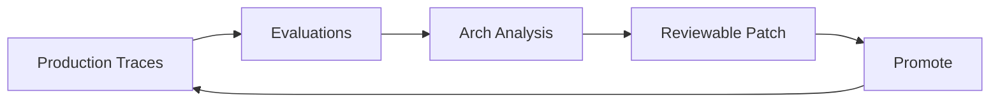

After your agents go live, Arch AI reads production traces, runs evaluations, and proposes improvements as reviewable patches — continuously, without manual triage. Each iteration raises the quality floor across every agent in the project.

**Prerequisites**: Agents are deployed to production and generating production traces.

## Evaluations

Evaluations are automated tests that continuously check if an AI agent is correct, safe, and on-policy — not just at launch. They replace vague impressions with objective, measurable scores.

| Eval Type | What It Covers |
| --- | --- |
| **Correctness and Policy Suites** | Resolution accuracy, false-escalation rate, PII handling, grounded-answer policy, and compliance assertions — all in one harness. |
| **Regression Gates** | A model swap, prompt change, workflow update, or ABL refinement is blocked unless it beats the baseline on the evals that matter. |
| **Blueprint-Generated Cases** | Arch drafts eval cases from the ABL, workflows, knowledge sources, and support documentation so the suite grows with the agent. |

Evals make every downstream decision measurable instead of anecdotal — improvement becomes provable. For multi-domain deployments, each domain can define its own bar for "better." The platform enforces the promotion gate uniformly across all domains.

## The Reinforcement Loop

Deployment is not the end of the pipeline — it is the start of a continuous cycle. Production evidence feeds evaluations, Arch analysis, reviewable patches, and promotion gates. The platform harness stays constant while models, tools, and workflows improve underneath.

Each stage produces a defined output that feeds the next:

| Stage | What Flows In | What Flows Out |
| --- | --- | --- |
| **Production Traces** | Live agent sessions | Conversation, handoff, workflow, tool, guard, and retrieval events. |
| **Evaluations** | Trace events | Quality, safety, accuracy, cost, latency, and compliance scores. |
| **Arch Analysis** | Eval results | Root-cause hypothesis and proposed improvement lever. |
| **Reviewable Patch** | Arch analysis | ABL, workflow, tool, prompt, policy, or eval diff. |
| **Promote** | Approved patch | Deployment behind gates, canary, or rollback. |

Each approved patch is deployed to production, generating new traces that feed the next iteration.

### How the Loop Closes

When Arch AI detects a degradation, a coverage gap, or a routing inefficiency, it:

1. Reads trace events directly from the platform runtime — no separate session or manual trigger required.
2. Forms a root-cause hypothesis from the trace evidence.
3. Proposes a change as a reviewable diff: ABL, prompt, tool binding, policy, or eval.
4. Submits the patch for compiler validation before a developer reviews the diff.

Developers must approve every change. The compiler validates the structure of each proposal before it reaches review, so broken references and incomplete policies are caught before promotion.

### Design Principles

The reinforcement loop is designed around three characteristics that make continuous improvement sustainable at scale.

| Loop Characteristic | Description |
| --- | --- |
| **Autonomous analysis** | Arch turns signal into concrete improvement proposals. Humans set the bar and retain approval — the analysis loop runs without manual triage. |
| **Customer-gated** | Every evaluation and promotion gate is domain-specific. You define what "better" means; the platform enforces the same process for every change. |
| **Compounding** | Each run enriches the evaluation suite. Each evaluation sharpens the next optimization. Each patch strengthens the reusable artifact. |

## Arch AI in the Project Sidebar

Arch AI lives in the project sidebar — available throughout the agent lifecycle, not just during authoring. From the sidebar, you can monitor project health, act on recommendations, and trigger workflows without context-switching.

| Feature | What It Does |
| --- | --- |
| **Project Health** | Runs continuous status checks and flags specific warnings when anomalies are detected. |
| **Suggested Workflows** | Surfaces contextual next steps — Add Agent, Debug Issue, Improve, Review Topology — based on current project state. |
| **Quick Actions** | One-click access to Explore project, Health check, and Review integrations. |
| **Auto Recommendations** | Proposes concrete fixes grounded in your actual project, such as missing session memory on a stateful agent. |
| **Contextual Help** | Grounds every suggestion in your project — not generic guidance. |
