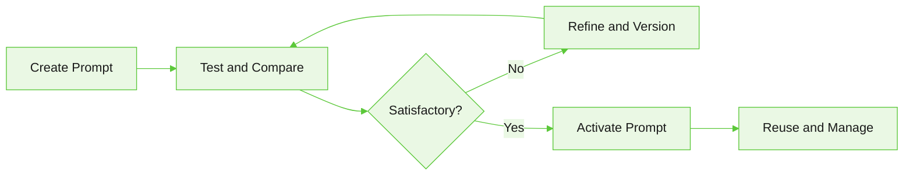

It's a central place to create, manage, and reuse prompt templates across your agents and workflows — with version tracking, response testing, and reference lookup built in.

Navigation: select a project, then go to **Resources** > **Prompt Library**.

## Prompt lifecycle

A typical prompt lifecycle in Prompt Library:

| Stage | Description |
|-------|-------------|
| Create Prompt | Create a reusable prompt template and define its instructions and content. |
| Test and Compare | Test the prompt across one or more models and compare responses, token usage, and response times. |
| Refine and Version | Update the prompt based on test results and save new versions as needed. |
| Activate Prompt | Promote a validated version to active status for production use. |
| Reuse and Manage | Reuse the prompt across the project and manage it through version history and references. |

## Create and manage prompts

The Prompt Library page lists all prompts in the selected project. For each prompt, you can:

* Define prompt instructions and content.
* Add tags for categorization.
* Save prompts as drafts.
* Promote validated prompts to the active version.

## Manage prompt versions

Each prompt supports multiple versions. Use the **Versions** tab to:

* View all available versions.
* Track revisions over time.
* Compare changes between versions.
* Promote a selected version to active status.

### Prompt states

| State | Description |
|-------|-------------|
| Draft | A work-in-progress version used for editing and testing. |
| Active | The published version available for production use. |

## Test and compare prompts

Use **Test & Compare** to evaluate prompt behavior across multiple language models before deployment. You can:

* Select a prompt version.
* Choose models for comparison.
* Provide a test user message.
* Upload an optional context file.
* Run the prompt against selected models simultaneously.

Results appear side by side with response metrics including response time and token usage.

### Use context during testing

You can upload files to include additional context during a test run. The uploaded content is available during prompt execution, letting you evaluate how the prompt handles real-world, project-specific information.

## View prompt references

The **References** tab shows where a prompt is used within the project. Use it to:

* Understand prompt dependencies.
* Assess the impact of changes before modifying an active prompt.
* Identify agents and workflows that rely on the prompt.

## Best practices

* Use descriptive names that clearly indicate a prompt's purpose.
* Add tags to improve organization and searchability.
* Save changes as drafts while iterating.
* Test prompts across multiple models before promoting to active status.
* Review references before modifying active prompts.
* Use version history to track prompt evolution and preserve previous revisions.

---
