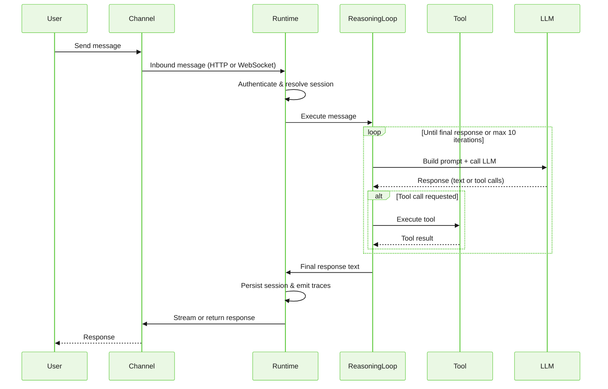
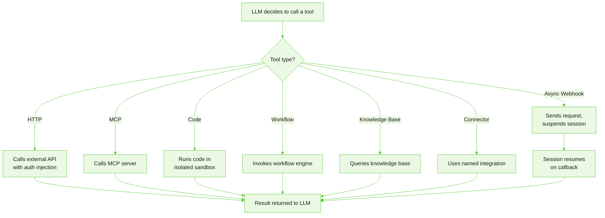
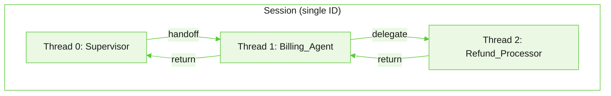

The Runtime is the execution engine of Agent Platform. It receives messages from users and systems, executes agent logic, invokes tools, manages conversation state, and returns responses. Every agent interaction — regardless of channel or deployment environment — passes through the Runtime.

## How a message executes

When a user sends a message, the Runtime processes it through a structured pipeline before returning a response.

The cycle repeats until the agent produces a final text response or reaches the iteration limit. The default is **10 tool call iterations per turn**, configurable in the agent's execution settings.

---

## Channels

The Runtime accepts messages from the following channels:

**Realtime** (WebSocket or persistent connection):

| Channel | Description |
|---|---|
| Web Chat | Browser-based chat widget |
| SDK | JavaScript/mobile SDK over WebSocket |
| API | Direct REST API call |
| Voice | Generic voice, Twilio, LiveKit, and real-time voice pipeline |
| A2A | Agent-to-Agent protocol for cross-service agent calls |

**Async / webhook** (inbound event, outbound REST):

| Channel | Description |
|---|---|
| WhatsApp | Meta Cloud, Gupshup, Infobip, Netcore |
| Slack | Slack app |
| Microsoft Teams | MS Teams bot |
| Messenger | Meta Messenger |
| Instagram | Instagram Direct |
| Telegram | Telegram bot |
| SMS | Twilio SMS |
| Email | Inbound email |
| Zendesk | Zendesk ticket and chat |
| Genesys | Genesys Cloud contact center |
| HTTP Async | Generic webhook-based integration |

Channel connections are configured per project in Studio under **Settings → Connections**. Each connection maps a channel to its authentication credentials, routing rules, and channel-specific options.

---

## Tool execution

Tools extend agent capabilities. When the LLM requests a tool call, the Runtime dispatches it to the appropriate executor and returns the result to the reasoning loop.

| Tool type | What it does |
|---|---|
| HTTP | Calls an external REST or GraphQL API with optional auth injection |
| MCP | Connects to a Model Context Protocol server; tools are discovered from the server's capability manifest |
| Code | Executes JavaScript or Python in an isolated sandbox |
| Connector | Uses a named integration (Salesforce, Jira, and others) with credential injection |
| Workflow | Invokes a registered workflow; supports both synchronous and long-running async execution |
| Knowledge Base | Queries a SearchAI knowledge base and returns ranked results |
| Async Webhook | Sends a request to an external system and suspends the session until a callback is received |

### Execution pipeline

When a tool executes, the Runtime processes it in sequence:

1. **Resolves the tool binding** from the deployment configuration.
2. **Validates inputs** against declared parameter types before the call.
3. **Makes the external call** with the appropriate authentication.
4. **Processes the result** — available in conversation context for reasoning agents, or as session variables for agents with steps.
5. **Handles errors** using `ON_ERROR` handlers: retry logic, fallback responses, or escalation triggers.

Tool execution also enforces timeouts, categorizes errors, and retries automatically on transient failures. For setup and configuration, see [Tools Overview](/agent-platform/tools-overview).

---

## Session management

Each conversation is represented as a session. A session stores the conversation history, variables, agent state, and execution metadata.

### Session lifecycle

| State | Description |
|---|---|
| Active | Processing a request |
| Idle | Waiting for the next user message |
| Completed | Conversation ended normally |
| Failed | Terminated due to a runtime error |
| Abandoned | Ended due to user inactivity |
| Escalated | Transferred to a human agent |
| Archived | Retained for historical reference |

Sessions time out after **24 hours** of inactivity. Conversation history is retained for **90 days**.

### Conversation window and compaction

The Runtime maintains a sliding window over the conversation history to control how much context is sent to the LLM on each turn. The default window is **40 messages**.

When the window fills, the Runtime can compact older turns into a summary rather than discarding them. This preserves context from earlier in long conversations without increasing token usage. Compaction is disabled by default and can be enabled in **Runtime Config** in Studio.

| Setting | Default | Description |
|---|---|---|
| Conversation window | 40 messages | Maximum messages sent to the LLM per turn |
| Compaction | Disabled | When enabled, summarizes older turns as the window fills |
| Compaction threshold | 80% | How full the window must be before compaction triggers |

### Concurrency

The Runtime uses a configurable strategy to handle multiple messages arriving within the same session:

| Strategy | Behavior | When to use |
|---|---|---|
| **Serial** (default) | Messages are queued and processed one at a time, in order. | Most conversational agents — ensures each message has full context from the previous one. |
| **Preemptive** | A new message cancels in-progress execution and starts fresh. | Real-time interfaces where the user may correct themselves mid-response. |
| **Parallel** | Multiple messages process simultaneously. | Batch operations where messages are independent. |

---

## Multi-agent orchestration

The Runtime executes multi-agent topologies defined in ABL. When routing rules match, the Runtime transitions the active thread to the target agent, forwards context, and manages the return path.

| Pattern | What happens at runtime |
|---|---|
| Supervisor | Receives every message; evaluates HANDOFF rules top-to-bottom; routes to first match |
| Handoff | Transfers conversation to the target agent; optionally returns control when `RETURN: true` |
| Delegate | Sends a task to a sub-agent; blocks the parent until the sub-agent completes or times out |
| Fan-out | Dispatches multiple agents in parallel; merges results when all complete |
| Escalation | Transfers the conversation to a human agent via a connected agent desktop |

### Thread hierarchy

When a supervisor hands off to a specialist, the Runtime creates a **thread** within the existing session — not a new session. Threads form a stack: handoffs push new threads, completions pop back to the parent. The user experiences one continuous conversation regardless of how many agents participate.

Each thread maintains its own conversation history and gathered variables, but can read data from parent threads.

For configuration, syntax reference, and examples, see [Multi-Agent Orchestration](/agent-platform/orchestrate).

---

## Observability

Every execution path emits structured trace events. Traces are accessible from the Sessions page in Studio.

| Event type | What it captures |
|---|---|
| `llm_call` | LLM invocation — model used, token count, latency |
| `tool_call` | Tool invocation request with input parameters |
| `tool_result` | Tool execution result or error |
| `decision` | Routing or flow decision outcome |
| `handoff` | Agent-to-agent transfer |
| `state_change` | Session variable update |
| `guardrail_eval` | Guardrail policy evaluation result |
| `error` | Runtime or execution error |

Each session also captures summary metrics: total messages, runtime cost, token consumption, response latency, tool latency, and model usage breakdown.

For details on navigating sessions and traces in Studio, see [Sessions and Runtime Diagnostics](/agent-platform/analytics-insights/analytics-explorer#session-explorer).

---

{/* AG: Hiding rate limits temporarily

## Rate limits

The Runtime enforces per-tenant rate limits on a rolling 1-minute window. For default values, see [the platform rate limits](/agent-platform/rate-limits).

When a limit is exceeded, the Runtime returns HTTP `429`. See [rate limit headers](/agent-platform/rate-limits#rate-limit-headers). Contact your account team to adjust limits for your plan.

---

*/}

## Limits reference

| Limit                          | Value        |
|--------------------------------|--------------|
| Request body size              | 1 MB         |
| WebSocket message size         | 512 KB       |
| Tool iterations per turn       | 10 (default) |
| Conversation window            | 40 messages  |
| Session TTL (inactivity)       | 24 hours     |
| Conversation history retention | 90 days      |

---

## Troubleshooting

**Agent stops responding mid-conversation**

Open the session in Studio and check the Traces tab. Look for an `error` event or a `tool_result` with a non-200 status. Tool failures that aren't handled by an `ON_FAILURE` block can cause the reasoning loop to stall.

**Earlier context is missing in long conversations**

Once the conversation window fills (40 messages by default), older messages are no longer sent to the LLM. Enable compaction in **Runtime Config** to preserve earlier context as a summary rather than dropping it.

**Tool calls return unexpected results**

Check the `tool_call` and `tool_result` trace events in Studio for the exact request sent and response received. Verify that the tool's auth profile and endpoint are correct in **Settings → Connections**.

**HTTP 429 — Too Many Requests**

The `Retry-After` header tells you how many seconds to wait before retrying. If you hit limits consistently during evaluation, check whether multiple concurrent test sessions are sharing the same tenant quota.

**Agents route to the wrong specialist**

HANDOFF rules evaluate top-to-bottom and the first match wins. Check rule ordering in the Supervisor — overly broad conditions placed above specific ones will capture requests before the intended rule is reached. See [Orchestration Troubleshooting](/agent-platform/orchestrate#troubleshooting-guide).

---

{{related}}

- [Multi-Agent Orchestration](/agent-platform/orchestrate)
- [Tools Overview](/agent-platform/tools-overview)
- [Memory and State](/agent-platform/memory-and-state)
- [Safety and Guardrails](/agent-platform/safety-and-guardrails)
