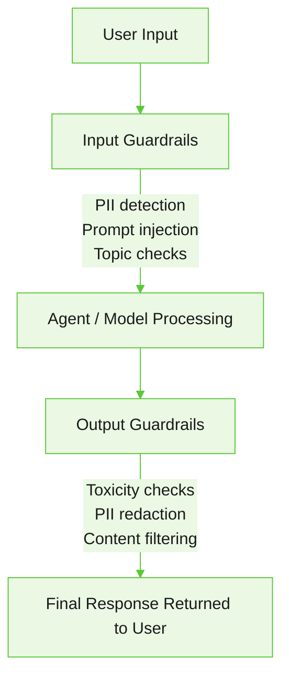

Configure enforcement layers, guardrail policies, providers, and input/output safety rules to protect agents from misuse and ensure compliance.

The platform uses three enforcement layers to control agent behavior and protect against misuse, sensitive data exposure, and policy violations.

| Enforcement layer | Description | Example |
|-------------------|-------------|---------|
| [Guardrails](#input-guardrails) | Safety and quality checks applied to agent input and output content. | Blocking abusive language or redacting sensitive information from responses. |
| [Limitations](/agent-platform/create-agents#define-identity-and-persona) | Reasoning-based guidance enforced through the model. Defines how the agent should behave, what it should avoid, and the scope it should operate within. | Instructing an agent to avoid financial advice or remain within a support domain. |
| [Constraints](/agent-platform/concepts#constraints-and-guardrails) | Runtime business-rule validations that prevent execution when required conditions aren't met. | Requiring a customer ID before allowing an order lookup or payment action. |

## Constraints vs. guardrails

Constraints and guardrails operate at different layers of agent execution:

| Feature | Constraints | Guardrails |
|---------|------------|------------|
| Purpose | Enforce business rules. | Enforce safety and content policies. |
| Scope | Agent logic and tool execution. | LLM input and output content. |
| Evaluation | Runtime data and conditions. | Message and response content. |
| Typical usage | Eligibility checks, required inputs. | Content moderation, PII detection. |

---

## Guardrails

Guardrails evaluate agent inputs and outputs against configurable safety categories. Depending on configuration, they can block content, warn users, redact sensitive information, escalate interactions, request rephrasing, or automatically sanitize responses.

The following shows a typical runtime flow:




---

### Guardrail configuration levels

Guardrails can be configured at two levels:

| Scope | Purpose | Where managed | Typical usage |
|-------|---------|---------------|---------------|
| Project guardrails | Centralized governance and reusable safety policies across agents. | **Govern > Guardrails** | Enterprise-wide safety enforcement. |
| Agent guardrails | Agent-specific runtime safety checks. | **Agent > Guardrails** | Localized rules for individual agents. |

Project-level policies apply in addition to agent-specific guardrails.

**Use project guardrails when you want:**
- Consistent governance across multiple agents.
- Shared moderation providers.
- Organization-wide safety controls.
- Centralized runtime management.

**Use agent guardrails when:**
- Safety rules are specific to one agent.
- Runtime behavior must be customized locally.
- Shared project-level governance isn't required.

---

## Guardrail policies

Policies are reusable governance containers that define runtime safety behavior across agents and projects. Each policy contains one or more rules. Each rule defines what to evaluate, where to evaluate it, which provider to use, and what action to take when triggered.

Rules can support input and output evaluation, streaming responses, pattern matching, model-based moderation, and LLM-based classification.

Go to **Govern > Guardrails > Policies**.

<Note>Only one policy can be active per project at a time. Activating a new policy automatically deactivates the previously active one.</Note>

### Policy scopes

**Project-level scope** — Apply the policy to all agents in the project:

```yaml
{
  "scopeType": "project"
}
```

**Agent-level scope** — Apply the policy only to a specific agent:

```yaml
{
  "scopeType": "agent",
  "agentDefId": "agent-definition-id"
}
```

### Create a guardrail policy

1. Go to **Govern > Guardrails**.
2. On the **Policies** tab, click **Create policy**.
3. Enter a policy name and description.
4. Select whether the policy applies to all agents in the project or only to a specific agent.
5. Configure the required rules and runtime settings.
6. Click **Save**.

#### Rules

| Field | Description |
|-------|-------------|
| Applies To | Where the rule is evaluated: Input, Output, or Both. |
| Action | What happens when the rule is triggered: Block, Warn, Redact, Escalate, Fix, Reask, or Filter. |
| Provider | The provider used for guardrail evaluation. |
| Category | The safety or content category evaluated by the rule. |
| Severity Threshold | The numeric threshold that triggers the configured action. Enter a value from 0.01 to 1.0, or use Low, Medium, or High as a shortcut. |
| Action Message | The message shown or logged when the rule is triggered. |

#### Runtime settings

| Setting | Description |
|---------|-------------|
| Fail Mode | Controls whether execution continues or is blocked if guardrail evaluation fails. **Fail-open** allows execution to continue if evaluation fails or times out. **Fail-closed** blocks execution when evaluation can't complete. Use fail-closed for high-security or compliance-sensitive applications. |
| Local Timeout | How long the platform waits for local guardrail evaluation. |
| Model Timeout | How long the platform waits for model-based provider evaluation. |
| LLM Timeout | How long the platform waits for LLM-based evaluation. |
| Streaming Evaluation | Enables guardrail evaluation while responses are streamed. |
| Chunk Interval | Whether streamed responses are evaluated by sentence, token, or chunk size. |
| Early Termination | Stops evaluation on the first guardrail trigger. |

---

## Guardrail providers

Providers are the evaluation engines used to classify or inspect content during runtime. They can detect unsafe content, identify PII, classify toxicity, evaluate prompt injection attempts, and perform model-based moderation.

### Select guardrail providers

Project authors can select which workspace-configured guardrail providers the project can use. Providers that are not selected are not used by the project, even if they are configured at the workspace level.

Ask your workspace administrator to add and configure a guardrail provider in the Admin Console before you select it for the project. For more information on configuring guardrail providers, see [Guardrail providers](/agent-platform/administration/ai-configuration#guardrail-providers).


---

## Input guardrails

Input guardrails evaluate user messages before they reach the LLM. Use them to detect unsafe content, identify prompt injection attempts, protect sensitive information, and enforce topic or policy restrictions.

Use `kind: input` to evaluate user messages before they reach the LLM:

```yaml
GUARDRAILS:
  profanity_filter:
    kind: input
    action: block
```

Input guardrails support:
- Pattern-based detection.
- Provider-based moderation.
- LLM-based classification.
- Severity-based actions.
- Runtime priority ordering.


---

## Output guardrails

Output guardrails evaluate generated responses before they're returned to the user. Use them to prevent unsafe responses, redact sensitive information, apply moderation checks, and inspect streaming output during generation.

Use `kind: output` to evaluate generated responses:

```yaml
GUARDRAILS:
  pii_output_prevention:
    kind: output
    action: block
```

Use `kind: both` to apply the same rule to both input and output:

```yaml
GUARDRAILS:
  phone_number_check:
    kind: both
    action: warn
```

Enable streaming evaluation for responses while content is still being generated:

```yaml
GUARDRAILS:
  streaming_safety:
    kind: output
    streaming: true
```

Output guardrails support:
- PII detection and redaction.
- Toxicity scoring.
- Streaming response evaluation.
- Bidirectional guardrails.
- Automatic response cleanup and fix strategies.

---

## DSL and UI mapping

The platform maintains a one-to-one mapping between the UI configuration and the DSL/ABL definition. This lets you:
- Configure guardrails visually.
- Manage guardrails as code.
- Version and compare configuration changes.
- Switch between UI and DSL-based editing workflows.

When you add a guardrail rule in the UI, the platform generates the corresponding `GUARDRAILS:` block in the DSL/ABL. Updating the `GUARDRAILS:` block directly in the DSL/ABL updates the same rule in the UI.


---

## Best practices

- Use project guardrails for centralized governance; use agent guardrails for localized runtime behavior.
- Start with `warn` before enabling `block` to understand impact before enforcement.
- Test regex patterns carefully to reduce false positives.
- Enable streaming guardrails for high-risk applications.
- Use fail-closed behavior for compliance-sensitive workloads.
- Separate business constraints from safety guardrails.
- Use providers with caching and budget controls for large-scale deployments.

---
