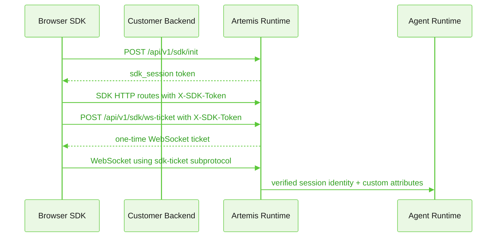

<Badge icon="arrow-left" color="gray">[Back to SDK Overview](/agent-platform/sdk#authentication-and-verified-identity)</Badge>

The Agent Platform SDK is a TypeScript/JavaScript library for embedding agent chat and voice interactions in web applications. It supports vanilla JavaScript, React hooks, and a web component for drop-in integration. For the full SDK reference, see the [SDK Overview](/agent-platform/sdk).

This guide explains how to configure Artemis SDK authentication end to end across Studio, the browser SDK, your backend, and deployment and runtime settings.

<Important>Before you set up E2E auth, [install the Agent Platform SDK](/agent-platform/sdk#install-web-sdk).</Important>

## Scenario selection

| Scenario                                                                           | Browser credential                                        | Customer backend responsibility                                                                                                                                               | Runtime responsibility                                                                                                                                                                  | When to use                                                                                                                                   |
| ---------------------------------------------------------------------------------- | --------------------------------------------------------- | ----------------------------------------------------------------------------------------------------------------------------------------------------------------------------- | --------------------------------------------------------------------------------------------------------------------------------------------------------------------------------------- | --------------------------------------------------------------------------------------------------------------------------------------------- |
| [Public anonymous SDK](#scenario-1-public-anonymous-sdk)                           | Public SDK API key                                        | None for auth. The app may pass non-sensitive public `userContext`.                                                                                                           | Verifies public key, channel, origin, and issues SDK session tokens.                                                                                                                    | Anonymous or low-assurance website chat where no sensitive data or verified customer identity is required.                                    |
| [Runtime-signed Hosted Exchange](#scenario-2-runtime-signed-hosted-exchange)       | Short-lived `bootstrapToken` returned by customer backend | Authenticates the customer, gathers secure attributes, calls Runtime `POST /api/v1/sdk/customer-sessions` with the channel server secret.                                     | Mints the hosted bootstrap artifact and SDK session token. Applies `sdkTokenEnvelopePolicy`.                                                                                            | Customers accept a server-to-server Runtime call and want Artemis to own signing/encryption.                                                  |
| [Customer-issued shared-secret JWE](#scenario-3-customer-issued-shared-secret-jwe) | Short-lived compact JWE returned by customer backend      | Authenticates the customer, builds claims, encrypts with the channel JWE shared secret, and returns JWE to the browser.                                                       | Decrypts and validates the customer-issued JWE, enforces replay, scope, age, and channel config, then issues SDK session token.                                                         | Flow where the customer backend must keep sensitive-data encryption local and avoid the `/customer-sessions` API call.                        |
| [Customer-issued public-key JWE](#scenario-4-customer-issued-public-key-jwe)       | Short-lived compact JWE returned by customer backend      | Authenticates the customer, signs the payload with the customer private key, encrypts the signed payload with the Runtime channel public key, and returns JWE to the browser. | Decrypts with Runtime private key, verifies customer signature with the configured customer public key, enforces replay, scope, age, and channel config, then issues SDK session token. | Preferred no-API-call flow when security review requires no shared encryption secret on the customer side and explicit issuer authentication. |

Public-key customer JWE has two layers:

- The outer JWE gives confidentiality to Runtime using `RSA-OAEP-256` and `A256GCM`.
- The inner JWS gives issuer authentication using the customer signing private key and Runtime-configured customer signing public key.

Don't treat public-key encryption alone as issuer authentication.

## Shared runtime flow after bootstrap

All four scenarios converge after browser initialization:



## Permission and origin resolution

Public API key permissions are stored as coarse `chat` and `voice` booleans.
Runtime expands them to SDK permissions:

| Public key permission | Runtime SDK permissions                                                                            |
| --------------------- | -------------------------------------------------------------------------------------------------- |
| `chat=true`           | `session:send_message`, `session:read`, `attachment:read`, `attachment:write`, `attachment:delete` |
| `voice=true`          | `session:voice`, `session:read`                                                                    |

Runtime-signed Hosted Exchange tokens derive permissions from the channel's active public API key. The `/api/v1/sdk/customer-sessions` request body doesn't accept `permissions`.

Customer-issued JWE payloads may include a narrower `permissions` array. Runtime normalizes the requested values, adds `session:read` for interactive or attachment grants, intersects the requested set with the channel's active public API key permissions, and rejects the token if the effective set is empty.

Allowed customer-issued permission values:

- `session:send_message`
- `session:voice`
- `session:read`
- `attachment:read`
- `attachment:write`
- `attachment:delete`

Origin enforcement happens after Runtime resolves the channel:

- Public-key SDK init checks the public API key origins and, if present, legacy channel-config origins.
- Hosted Exchange bootstrap init checks both the channel-config origins and the bound public API key origins after the bootstrap token is verified.
- Empty or unset allowed-origin lists behave as unrestricted in code. Production channels should always configure explicit HTTPS origins.

## Shared Studio prerequisites

1. Create or select the project that owns the SDK channel.
2. Create or select the deployment the SDK channel should route to.
3. Create or select a public SDK API key for the project.
4. Set allowed origins on the public API key or managed channel key.

   - Include the exact browser origins that will host the SDK.
   - Don't rely on wildcard origins for production flows.

5. Create an SDK channel and bind it to the deployment or environment.
6. Keep the channel active only after customer backend and browser changes are
   deployed.

The Studio channel auth mode decides the setup path:

- `anonymous` for public anonymous SDK.
- `hosted_exchange` for Runtime-signed, customer-issued shared-secret JWE, and customer-issued public-key JWE.

## Shared deployment prerequisites

Runtime must have:

- `JWT_SECRET`, `AUTH_SDK_BOOTSTRAP_SIGNING_SECRET`, and `AUTH_SDK_SESSION_SIGNING_SECRET` configured consistently across Runtime pods.
- `ENCRYPTION_MASTER_KEY` configured when Hosted Exchange token envelope JWE is required or preferred.
- `AUTH_SDK_JWE_ENABLED` unset or `true` when JWE issuance/verification should be available.
- `REDIS_URL` configured for distributed SDK session state, WebSocket tickets, replay protection, and rotation locks.
- MongoDB available for SDK channel, public key, and customer JWE key metadata.
- HTTPS between browser, customer backend, and Runtime.

Before enabling strict Hosted Exchange JWE, verify capability:

```bash
curl \
  -H "Authorization: Bearer <studio-user-token>" \
  "https://<runtime-host>/api/projects/<projectId>/sdk-jwe-capability"
```

Expected ready response:

```json
{
  "success": true,
  "supported": true,
  "canIssueBootstrap": true,
  "canIssueSession": true,
  "canVerify": true,
  "maxEncryptedBootstrapBytes": 4096,
  "maxEncryptedSessionBytes": 4096
}
```

If `jwe_required` is configured and capability is not ready, Runtime must fail
closed instead of returning signed Hosted Exchange tokens.

## Scenario 1: Public anonymous SDK

### Studio setup

1. Open the project deployment channel settings in Studio.
2. Create or edit an SDK channel.
3. Set SDK auth mode to `anonymous`.
4. Bind the channel to the target deployment or environment.
5. Configure allowed origins for the browser site.
6. Save the channel.
7. Copy the public SDK API key and channel identifier or channel name.

Do not configure `sdkTokenEnvelopePolicy` or `customerIssuedJwe` on anonymous
channels. Runtime rejects those settings unless `auth.mode=hosted_exchange`.

### Customer server changes

No customer server auth endpoint is required.

The server that renders the website may provide public configuration values such
as:

- Runtime endpoint
- Project ID
- Public SDK API key
- Channel ID or channel name
- Deployment slug, when the channel uses deployment-slug selection

Do not put channel server secrets, customer JWE secrets, Runtime private keys, or
customer signing private keys in browser-rendered HTML or JavaScript.

### Browser SDK changes

Core SDK:

```ts
import { AgentSDK } from '@koreai/artemis-web-sdk';

const sdk = new AgentSDK({
  endpoint: 'https://runtime.example.com',
  projectId: 'project_123',
  apiKey: 'pk_public_sdk_key',
  channelId: 'channel_123',
  clientSessionIdentifier: true,
  userContext: {
    userId: 'anonymous-browser-id',
    customAttributes: {
      page: 'support',
    },
  },
});

await sdk.connect();
```

Public-key variants:

```ts expandable=true
// Channel name instead of channel ID.
new AgentSDK({
  endpoint: 'https://runtime.example.com',
  projectId: 'project_123',
  apiKey: 'pk_public_sdk_key',
  channelName: 'web',
});

// Deployment slug selection for public-key embeds.
new AgentSDK({
  endpoint: 'https://runtime.example.com',
  projectId: 'project_123',
  apiKey: 'pk_public_sdk_key',
  channelId: 'channel_123',
  deploymentSlug: 'support-production',
});

// Unified URL mode. Public-key configs can omit projectId when the URL path
// carries project/environment/agent context; bootstrap-token configs cannot.
new AgentSDK({
  endpoint: 'https://runtime.example.com',
  apiKey: 'pk_public_sdk_key',
  wsPath: '/api/v1/project/support/production/agent/support-agent/ws',
});
```

React:

```tsx
import { AgentProvider, ChatWidget } from '@koreai/artemis-web-sdk/react';

export function SupportChat() {
  return (
    <AgentProvider
      endpoint="https://runtime.example.com"
      projectId="project_123"
      apiKey="pk_public_sdk_key"
      channelId="channel_123"
      clientSessionIdentifier
    >
      <ChatWidget />
    </AgentProvider>
  );
}
```

Custom element:

```html
<agent-widget
  endpoint="https://runtime.example.com"
  project-id="project_123"
  api-key="pk_public_sdk_key"
  channel-id="channel_123"
  client-session-identifier="true"
  mode="unified"
></agent-widget>
```

### Validation

1. Load the browser site from an allowed origin.
2. Confirm `/api/v1/sdk/init` uses `X-Public-Key`.
3. Confirm the request body does not include `bootstrapToken`.
4. Send a chat message.
5. Confirm `/api/v1/sdk/ws-ticket` succeeds before WebSocket connect.
6. Disable the channel or remove the origin and confirm new sessions fail.

## Scenario 2: Runtime-signed hosted exchange

This path adds a customer backend endpoint, but lets Runtime mint the bootstrap artifact. The browser never sees the Hosted Exchange channel server secret.

### Studio setup

1. Open the project deployment channel settings in Studio.
2. Create or edit an SDK channel.
3. Set SDK auth mode to `hosted_exchange`.
4. Configure allowed origins.
5. Select `sdkTokenEnvelopePolicy`:

   - `signed` for signed-token compatibility.
   - `jwe_preferred` for rollout where JWE is used when Runtime capability is ready.
   - `jwe_required` after the capability endpoint shows Runtime can issue and verify JWE.

6. Save the channel.
7. Copy the Hosted Exchange server secret when Studio reveals it.
8. Store the server secret only in the customer backend secret manager.

### Customer server changes

Add a backend endpoint that authenticates the customer in the customer's system, then calls Runtime.

```ts expandable=true
import express from 'express';

const router = express.Router();

const runtimeBaseUrl = process.env.ARTEMIS_RUNTIME_BASE_URL!;
const tenantId = process.env.ARTEMIS_TENANT_ID!;
const projectId = process.env.ARTEMIS_PROJECT_ID!;
const channelId = process.env.ARTEMIS_SDK_CHANNEL_ID!;
const channelSecret = process.env.ARTEMIS_SDK_CHANNEL_SECRET!;

router.post('/api/artemis/bootstrap', requireCustomerSession, async (req, res, next) => {
  try {
    const runtimeResponse = await fetch(`${runtimeBaseUrl}/api/v1/sdk/customer-sessions`, {
      method: 'POST',
      headers: {
        'content-type': 'application/json',
        'x-sdk-channel-secret': channelSecret,
      },
      body: JSON.stringify({
        tenantId,
        projectId,
        channelId,
        verifiedUserId: req.customer.id,
        customAttributes: {
          plan: req.customer.plan,
          region: req.customer.region,
        },
      }),
    });

    const body = (await runtimeResponse.json()) as {
      bootstrapToken?: string;
      expiresIn?: number;
      error?: { code?: string; message?: string };
    };

    if (!runtimeResponse.ok || !body.bootstrapToken) {
      res.status(502).json({ error: 'Unable to start Artemis SDK session' });
      return;
    }

    res.json({
      bootstrapToken: body.bootstrapToken,
      expiresIn: body.expiresIn,
    });
  } catch (error) {
    next(error);
  }
});
```

Request body rules:

- Send exactly one of `channelId` or `channelName`.
- Do not send `permissions`; Runtime derives the effective SDK permissions from
  the channel's active public API key.
- Keep `customAttributes` within the SDK user context size limits. Runtime
  returns `SDK_TOKEN_TOO_LARGE` when normalized custom attributes exceed the
  token budget.

`channelName` variant:

```ts
body: JSON.stringify({
  tenantId,
  projectId,
  channelName: 'web',
  verifiedUserId: req.customer.id,
  customAttributes: {
    plan: req.customer.plan,
  },
});
```

Successful Runtime response:

```json
{
  "bootstrapToken": "<single-use-runtime-issued-token>",
  "tokenEnvelope": "signed",
  "expiresIn": 300,
  "tenantId": "tenant_123",
  "projectId": "project_123",
  "channelId": "channel_123"
}
```

When `sdkTokenEnvelopePolicy` resolves to JWE, `tokenEnvelope` is `"jwe"` and
`bootstrapToken` is a 5-segment compact JWE.

Recommended customer backend controls:

- Authenticate the website user before minting a bootstrap token.
- Collect sensitive data and secure custom attributes server-side only.
- Keep `verifiedUserId` stable for the customer identity.
- Keep the endpoint same-origin or protected by customer auth cookies.
- Do not return the channel server secret to the browser.
- Do not log `bootstrapToken`, sensitive data, or secure custom attributes.

### Browser SDK changes

Use a `bootstrapTokenProvider` so each new init gets a new short-lived token:

```ts expandable=true
import { AgentSDK } from '@koreai/artemis-web-sdk';

const sdk = new AgentSDK({
  endpoint: 'https://runtime.example.com',
  projectId: 'project_123',
  bootstrapTokenProvider: async () => {
    const response = await fetch('/api/artemis/bootstrap', {
      method: 'POST',
      credentials: 'include',
    });

    if (!response.ok) {
      throw new Error('Unable to start chat');
    }

    const body = (await response.json()) as { bootstrapToken: string };
    return body.bootstrapToken;
  },
});

await sdk.connect();
```

**React**

```tsx expandable=true
import { AgentProvider, ChatWidget } from '@koreai/artemis-web-sdk/react';

async function getBootstrapToken() {
  const response = await fetch('/api/artemis/bootstrap', {
    method: 'POST',
    credentials: 'include',
  });
  const body = (await response.json()) as { bootstrapToken: string };
  return body.bootstrapToken;
}

export function SupportChat() {
  return (
    <AgentProvider
      endpoint="https://runtime.example.com"
      projectId="project_123"
      bootstrapTokenProvider={getBootstrapToken}
    >
      <ChatWidget />
    </AgentProvider>
  );
}
```

**Custom element**

```html expandable=true
<script type="module">
  const widget = document.createElement('agent-widget');
  widget.setAttribute('endpoint', 'https://runtime.example.com');
  widget.setAttribute('project-id', 'project_123');
  widget.setAttribute('mode', 'unified');
  widget.bootstrapTokenProvider = async () => {
    const response = await fetch('/api/artemis/bootstrap', {
      method: 'POST',
      credentials: 'include',
    });
    const body = await response.json();
    return body.bootstrapToken;
  };
  document.body.append(widget);
</script>
```

Set the `bootstrapTokenProvider` property before appending the custom element.
The widget reads SDK config during its connection/bootstrap lifecycle.

### Validation

1. Customer backend calls `POST /api/v1/sdk/customer-sessions`.
2. Browser calls `/api/v1/sdk/init` with `bootstrapToken` and without
   `X-Public-Key`.
3. Runtime returns an SDK session token.
4. If `sdkTokenEnvelopePolicy=jwe_required`, confirm returned Hosted Exchange
   bootstrap/session material is JWE or the flow fails closed.
5. Replay the same bootstrap token and confirm Runtime rejects it.
6. Confirm SDK refresh and WebSocket ticket flows succeed.

## Scenario 3: Customer-issued shared-secret JWE

This flow requires no new Artemis API call: the customer backend pulls secure
data, encrypts the customer bootstrap payload, and the browser passes the compact
JWE to the SDK.

Shared-secret mode authenticates the issuer by possession of the scoped channel
secret and authenticates ciphertext integrity through `A256GCM`. It does not use
a separate asymmetric customer signature.

### Studio setup

1. Open the SDK channel in Studio.
2. Set SDK auth mode to `hosted_exchange`.
3. Enable customer-issued JWE.
4. Set key mode to `shared_secret`.
5. Set `maxAgeSeconds` between `60` and `900`. Prefer `300`.
6. Choose whether to keep Runtime-issued Hosted Exchange bootstrap enabled:
   - `acceptRuntimeIssued=true` allows the Runtime-signed `/customer-sessions`
     flow to continue during migration.
   - `acceptRuntimeIssued=false` limits this channel to customer-issued JWE.
7. Save the channel.
8. Rotate the customer-issued JWE secret.
9. Copy the one-time shared secret and `keyId`.
10. Store the shared secret only in the customer backend secret manager.

Customer-issued JWE config shape:

```json
{
  "customerIssuedJwe": {
    "enabled": true,
    "maxAgeSeconds": 300,
    "acceptRuntimeIssued": true,
    "keyMode": "shared_secret"
  }
}
```

### Customer server changes

Install a JOSE implementation using the command `npm install jose`.

Mint the compact JWE server-side:

```ts expandable=true
import { CompactEncrypt } from 'jose';
import { randomUUID } from 'node:crypto';

const tenantId = process.env.ARTEMIS_TENANT_ID!;
const projectId = process.env.ARTEMIS_PROJECT_ID!;
const channelId = process.env.ARTEMIS_SDK_CHANNEL_ID!;
const customerJweKeyId = process.env.ARTEMIS_CUSTOMER_JWE_KEY_ID!;
const customerJweSharedSecret = process.env.ARTEMIS_CUSTOMER_JWE_SHARED_SECRET!;

function decodeSharedSecret(secret: string): Uint8Array {
  const bytes = Buffer.from(secret, 'base64url');
  if (bytes.byteLength !== 32) {
    throw new Error('Invalid Artemis customer JWE shared secret');
  }
  return new Uint8Array(bytes);
}

export async function mintSharedSecretBootstrapToken(customer: {
  id: string;
  plan: string;
  region: string;
}): Promise<string> {
  const now = Math.floor(Date.now() / 1000);
  const payload = {
    type: 'customer',
    tenantId,
    projectId,
    channelId,
    verifiedUserId: customer.id,
    permissions: ['session:send_message', 'session:read'],
    iat: now,
    exp: now + 300,
    jti: randomUUID(),
    customAttributes: {
      plan: customer.plan,
      region: customer.region,
    },
  };

  return new CompactEncrypt(new TextEncoder().encode(JSON.stringify(payload)))
    .setProtectedHeader({
      alg: 'dir',
      enc: 'A256GCM',
      kid: customerJweKeyId,
      typ: 'abl-sdk-customer-bootstrap+jwe',
      cty: 'application/json',
      epv: 1,
      tid: tenantId,
      pid: projectId,
      cid: channelId,
    })
    .encrypt(decodeSharedSecret(customerJweSharedSecret));
}
```

Expose it through a customer backend endpoint:

```ts
router.post('/api/artemis/bootstrap', requireCustomerSession, async (req, res, next) => {
  try {
    const bootstrapToken = await mintSharedSecretBootstrapToken({
      id: req.customer.id,
      plan: req.customer.plan,
      region: req.customer.region,
    });

    res.json({ bootstrapToken, expiresIn: 300 });
  } catch (error) {
    next(error);
  }
});
```

Required JWE header fields:

```json
{
  "alg": "dir",
  "enc": "A256GCM",
  "kid": "<active customer JWE key id>",
  "typ": "abl-sdk-customer-bootstrap+jwe",
  "cty": "application/json",
  "epv": 1,
  "tid": "<tenantId>",
  "pid": "<projectId>",
  "cid": "<channelId>"
}
```

Required payload fields:

```json
{
  "type": "customer",
  "tenantId": "tenant_123",
  "projectId": "project_123",
  "channelId": "channel_123",
  "verifiedUserId": "customer-user-123",
  "permissions": ["session:send_message", "session:read"],
  "iat": 1782380000,
  "exp": 1782380300,
  "jti": "customer-generated-uuid",
  "customAttributes": {
    "plan": "gold"
  }
}
```

Runtime rejects unsupported top-level claims. Put secure custom data in
`customAttributes`, not `secureCustomData`.

Customer-issued permission templates:

```ts
const CHAT_ONLY = ['session:send_message', 'session:read'] as const;

const CHAT_WITH_ATTACHMENTS = [
  'session:send_message',
  'session:read',
  'attachment:read',
  'attachment:write',
] as const;

const VOICE_ONLY = ['session:voice', 'session:read'] as const;

const READ_ONLY = ['session:read'] as const;
```

Runtime intersects these requested permissions with the channel's bound public
API key permissions. For example, requesting `session:voice` on a channel whose
public key has `voice=false` produces no voice grant. If the intersection is
empty, `/api/v1/sdk/init` returns a Hosted Exchange permissions error.

### Browser SDK changes

Use the same Hosted Exchange browser configuration as Runtime-signed bootstrap:

```ts
const sdk = new AgentSDK({
  endpoint: 'https://runtime.example.com',
  projectId: 'project_123',
  bootstrapTokenProvider: async () => {
    const response = await fetch('/api/artemis/bootstrap', {
      method: 'POST',
      credentials: 'include',
    });
    const body = (await response.json()) as { bootstrapToken: string };
    return body.bootstrapToken;
  },
});
```

Do not pass `apiKey`, `channelId`, `channelName`, `deploymentSlug`,
`userContext`, or `clientSessionIdentifier` in this SDK config.

### Validation

1. Browser calls the customer backend bootstrap endpoint.
2. Customer backend does not call `/api/v1/sdk/customer-sessions`.
3. Browser passes the compact JWE to `/api/v1/sdk/init` as `bootstrapToken`.
4. Runtime accepts the first use.
5. Runtime rejects replay of the same `jti`.
6. Runtime rejects expired tokens and tokens where `exp - iat` exceeds channel
   `maxAgeSeconds`.
7. Runtime rejects tokens with mismatched `tenantId`, `projectId`, `channelId`,
   `tid`, `pid`, or `cid`.
8. Rotate the shared secret and confirm:
   - In-flight tokens minted before rotation still work until expiry.
   - Newly minted tokens using the old secret fail.

## Scenario 4: Customer-issued public-key JWE

This is the preferred no-new-Artemis-API-call option for higher-assurance
flows. The customer backend signs the payload, encrypts it to Runtime, and the
browser passes only the resulting compact JWE.

### Key ownership

| Key material                        | Owner                       | Stored where                                                       | Purpose                                                     |
| ----------------------------------- | --------------------------- | ------------------------------------------------------------------ | ----------------------------------------------------------- |
| Customer signing private key        | Customer                    | Customer backend secret manager or HSM                             | Signs the inner JWS. Never leaves the customer environment. |
| Customer signing public key         | Customer and Studio/Runtime | Studio channel `customerIssuedJwe.customerSigningPublicKey` config | Runtime verifies issuer authenticity.                       |
| Runtime channel private decrypt key | Runtime                     | Runtime key store / database protected by platform encryption      | Decrypts outer JWE. Never leaves Runtime.                   |
| Runtime channel public encrypt key  | Runtime and customer        | Studio shows safe key metadata after customer JWE key rotation     | Customer encrypts outer JWE for Runtime.                    |

### Studio setup

1. Generate a customer signing key pair in the customer environment.
2. Copy only the customer signing public key.
3. Open the SDK channel in Studio.
4. Set SDK auth mode to `hosted_exchange`.
5. Enable customer-issued JWE.
6. Set key mode to `public_key`.
7. Paste the PEM-encoded customer signing public key.
8. Set `maxAgeSeconds` between `60` and `900`. Prefer `300`.
9. Choose whether `acceptRuntimeIssued` should remain enabled for migration.
10. Save the channel.
11. Rotate the customer-issued JWE key.
12. Copy the Runtime channel public encryption key and `keyId`.
13. Store the Runtime public encryption key and `keyId` in customer backend configuration.

Example customer signing key generation:

```bash
openssl genpkey \
  -algorithm RSA \
  -pkeyopt rsa_keygen_bits:3072 \
  -out customer-signing-private.pem

openssl rsa \
  -in customer-signing-private.pem \
  -pubout \
  -out customer-signing-public.pem
```

Upload `customer-signing-public.pem` to Studio. Store `customer-signing-private.pem` only in the customer backend secret manager or HSM. The TypeScript example below expects the private key in PKCS#8 PEM format and the public key in SPKI PEM format.

Customer-issued public-key JWE config shape:

```json
{
  "customerIssuedJwe": {
    "enabled": true,
    "maxAgeSeconds": 300,
    "acceptRuntimeIssued": true,
    "keyMode": "public_key",
    "customerSigningPublicKey": "-----BEGIN PUBLIC KEY-----\n...\n-----END PUBLIC KEY-----"
  }
}
```

### Customer server changes

Install a JOSE implementation using the command `npm install jose`.

Mint the signed-then-encrypted bootstrap token:

```ts expandable=true
import { CompactEncrypt, CompactSign, importPKCS8, importSPKI } from 'jose';
import { randomUUID } from 'node:crypto';

const tenantId = process.env.ARTEMIS_TENANT_ID!;
const projectId = process.env.ARTEMIS_PROJECT_ID!;
const channelId = process.env.ARTEMIS_SDK_CHANNEL_ID!;
const customerJweKeyId = process.env.ARTEMIS_CUSTOMER_JWE_KEY_ID!;
const runtimeEncryptionPublicKey = process.env.ARTEMIS_CUSTOMER_JWE_RUNTIME_PUBLIC_KEY!;
const customerSigningPrivateKey = process.env.ARTEMIS_CUSTOMER_SIGNING_PRIVATE_KEY!;

export async function mintPublicKeyBootstrapToken(customer: {
  id: string;
  plan: string;
  region: string;
}): Promise<string> {
  const now = Math.floor(Date.now() / 1000);
  const payload = {
    type: 'customer',
    tenantId,
    projectId,
    channelId,
    verifiedUserId: customer.id,
    permissions: ['session:send_message', 'session:read'],
    iat: now,
    exp: now + 300,
    jti: randomUUID(),
    customAttributes: {
      plan: customer.plan,
      region: customer.region,
    },
  };

  const signingKey = await importPKCS8(customerSigningPrivateKey, 'RS256');
  const innerJws = await new CompactSign(new TextEncoder().encode(JSON.stringify(payload)))
    .setProtectedHeader({
      alg: 'RS256',
      typ: 'abl-sdk-customer-bootstrap+jws',
    })
    .sign(signingKey);

  const encryptionKey = await importSPKI(runtimeEncryptionPublicKey, 'RSA-OAEP-256');
  return new CompactEncrypt(new TextEncoder().encode(innerJws))
    .setProtectedHeader({
      alg: 'RSA-OAEP-256',
      enc: 'A256GCM',
      kid: customerJweKeyId,
      typ: 'abl-sdk-customer-bootstrap+jwe',
      cty: 'application/jose',
      epv: 1,
      tid: tenantId,
      pid: projectId,
      cid: channelId,
    })
    .encrypt(encryptionKey);
}
```

Expose it through a customer backend endpoint:

```ts
router.post('/api/artemis/bootstrap', requireCustomerSession, async (req, res, next) => {
  try {
    const bootstrapToken = await mintPublicKeyBootstrapToken({
      id: req.customer.id,
      plan: req.customer.plan,
      region: req.customer.region,
    });

    res.json({ bootstrapToken, expiresIn: 300 });
  } catch (error) {
    next(error);
  }
});
```

Required outer JWE header fields:

```json
{
  "alg": "RSA-OAEP-256",
  "enc": "A256GCM",
  "kid": "<active customer JWE key id>",
  "typ": "abl-sdk-customer-bootstrap+jwe",
  "cty": "application/jose",
  "epv": 1,
  "tid": "<tenantId>",
  "pid": "<projectId>",
  "cid": "<channelId>"
}
```

Required inner JWS header fields:

```json
{
  "alg": "RS256",
  "typ": "abl-sdk-customer-bootstrap+jws"
}
```

The inner JWS payload uses the same claim shape as shared-secret mode.

### Browser SDK changes

Use the same Hosted Exchange browser configuration:

```ts
const sdk = new AgentSDK({
  endpoint: 'https://runtime.example.com',
  projectId: 'project_123',
  bootstrapTokenProvider: async () => {
    const response = await fetch('/api/artemis/bootstrap', {
      method: 'POST',
      credentials: 'include',
    });
    const body = (await response.json()) as { bootstrapToken: string };
    return body.bootstrapToken;
  },
});
```

### Validation

1. Customer backend does not call `/api/v1/sdk/customer-sessions`.
2. Browser passes compact JWE to `/api/v1/sdk/init` as `bootstrapToken`.
3. Runtime decrypts the JWE and verifies the inner JWS.
4. Runtime rejects an unsigned plaintext payload in public-key mode.
5. Runtime rejects wrong `cty` values such as `application/json` in public-key
   mode.
6. Runtime rejects tokens signed by an unconfigured customer private key.
7. Runtime rejects replay, scope drift, expired tokens, overlong tokens, and
   disabled-channel tokens.
8. Rotate the Runtime channel public encryption key and confirm:
   - In-flight tokens minted before rotation still work until expiry.
   - Newly minted tokens using the retired key fail.

## Studio operations checklist

For public anonymous SDK:

1. SDK channel auth mode is `anonymous`.
2. Allowed origins include the browser site.
3. Public API key is active and scoped to the project.
4. Channel is active and bound to the expected deployment/environment.

For Runtime-signed Hosted Exchange:

1. SDK channel auth mode is `hosted_exchange`.
2. Server secret exists and is stored by the customer backend.
3. `sdkTokenEnvelopePolicy` is selected intentionally.
4. Runtime capability is ready before selecting `jwe_required`.
5. Customer-issued JWE may remain disabled.

For customer-issued shared-secret JWE:

1. SDK channel auth mode is `hosted_exchange`.
2. `customerIssuedJwe.enabled=true`.
3. `customerIssuedJwe.keyMode=shared_secret`.
4. `customerIssuedJwe.maxAgeSeconds` matches the customer backend token TTL.
5. Secret has been rotated and copied once to the customer backend.
6. `acceptRuntimeIssued` matches the migration plan.

For customer-issued public-key JWE:

1. SDK channel auth mode is `hosted_exchange`.
2. `customerIssuedJwe.enabled=true`.
3. `customerIssuedJwe.keyMode=public_key`.
4. Customer signing public key is configured.
5. Runtime public encryption key has been rotated and copied to the customer
   backend.
6. `customerIssuedJwe.maxAgeSeconds` matches the customer backend token TTL.
7. `acceptRuntimeIssued` matches the migration plan.

## Studio API automation payloads

Use these shapes when automating setup through Studio instead of clicking through
the channel configuration UI.

Create a Hosted Exchange channel:

```http
POST /api/runtime/sdk-channels?projectId=project_123
Content-Type: application/json
```

```json
{
  "name": "web",
  "channelType": "web",
  "publicApiKeyId": "public_key_record_id",
  "allowedOrigins": ["https://app.example.com"],
  "environment": "production",
  "auth": {
    "mode": "hosted_exchange",
    "rotateServerSecret": true
  },
  "config": {
    "sdkTokenEnvelopePolicy": "jwe_preferred"
  }
}
```

Enable customer-issued public-key JWE on an existing channel:

```http
PATCH /api/runtime/sdk-channels/channel_123
Content-Type: application/json
```

```json
{
  "auth": {
    "mode": "hosted_exchange",
    "rotateCustomerIssuedJweSecret": true
  },
  "config": {
    "sdkTokenEnvelopePolicy": "jwe_preferred",
    "customerIssuedJwe": {
      "enabled": true,
      "maxAgeSeconds": 300,
      "acceptRuntimeIssued": true,
      "keyMode": "public_key",
      "customerSigningPublicKey": "-----BEGIN PUBLIC KEY-----\n...\n-----END PUBLIC KEY-----"
    }
  }
}
```

Enable customer-issued shared-secret JWE:

```json
{
  "auth": {
    "mode": "hosted_exchange",
    "rotateCustomerIssuedJweSecret": true
  },
  "config": {
    "sdkTokenEnvelopePolicy": "jwe_preferred",
    "customerIssuedJwe": {
      "enabled": true,
      "maxAgeSeconds": 300,
      "acceptRuntimeIssued": true,
      "keyMode": "shared_secret"
    }
  }
}
```

Rotation response material:

```json
{
  "success": true,
  "channel": { "...": "..." },
  "customerIssuedJweSecret": {
    "keyId": "customer_jwe_key_id",
    "keyMode": "public_key",
    "alg": "RSA-OAEP-256",
    "enc": "A256GCM",
    "secretPrefix": "public-key-fingerprint",
    "publicKey": "-----BEGIN PUBLIC KEY-----\n...\n-----END PUBLIC KEY-----",
    "publicKeyFingerprint": "fingerprint",
    "status": "active",
    "rotatedAt": "2026-06-26T00:00:00.000Z"
  }
}
```

For shared-secret mode, `customerIssuedJweSecret.secret` is returned once in the
same response. Store it immediately in the customer backend secret manager. It
will not be available from later safe metadata reads.

## Customer backend checklist

All Hosted Exchange customer backend endpoints should:

1. Require the customer application's own authenticated session.
2. Derive `verifiedUserId` server-side.
3. Fetch sensitive or secure attributes server-side.
4. Put secure attributes under `customAttributes`.
5. Generate unique `jti` values.
6. Use short TTLs. Prefer 5 minutes or less.
7. Avoid logging bootstrap tokens, secure attributes, sensitive data, server
   secrets, or private keys.
8. Return only `{ "bootstrapToken": "..." }` and optional non-sensitive expiry
   metadata to the browser.
9. Rate limit token minting per customer session.
10. Alert on repeated invalid token minting, Runtime 401s, and replay failures.

Required customer backend material by scenario:

| Scenario                          | Required customer backend material                                                             |
| --------------------------------- | ---------------------------------------------------------------------------------------------- |
| Public anonymous SDK              | None for SDK auth.                                                                             |
| Runtime-signed Hosted Exchange    | Hosted Exchange channel server secret.                                                         |
| Customer-issued shared-secret JWE | Customer JWE `keyId` and shared secret.                                                        |
| Customer-issued public-key JWE    | Customer signing private key, Runtime channel public encryption key, and customer JWE `keyId`. |

## Browser SDK checklist

For public anonymous SDK:

- Use `apiKey`.
- Optional: `channelId`, `channelName`, `deploymentSlug`, `userContext`,
  `clientSessionIdentifier`.

For all Hosted Exchange scenarios:

- Use `bootstrapTokenProvider` when possible.
- Do not combine Hosted Exchange bootstrap config with `apiKey`.
- Do not pass browser `userContext`; put verified data in the backend token.
- Do not pass `channelId`, `channelName`, or `deploymentSlug`; Runtime resolves
  those from the bootstrap token.
- `projectId` is still required for bootstrap-token configs.
- `sessionMetadata` is allowed, but it is not identity. Use it for safe browser
  context such as locale, timezone, or UI context.
- Make the bootstrap provider call same-origin or protected by customer auth.
- Handle bootstrap failure as an auth/session startup failure, not as a bot
  error.

## Manual runtime probes

Use these probes after Studio and customer backend setup. Replace placeholders
with environment-specific values and do not paste real secrets into tickets,
logs, or shared terminals.

Public anonymous SDK init:

```bash
curl -sS -X POST "$RUNTIME_BASE_URL/api/v1/sdk/init" \
  -H "Content-Type: application/json" \
  -H "Origin: https://app.example.com" \
  -H "X-Public-Key: $PUBLIC_SDK_KEY" \
  -d '{
    "channelId": "channel_123",
    "userContext": {
      "userId": "anonymous-browser-id",
      "customAttributes": { "page": "support" }
    }
  }'
```

Runtime-signed Hosted Exchange bootstrap mint:

```bash
curl -sS -X POST "$RUNTIME_BASE_URL/api/v1/sdk/customer-sessions" \
  -H "Content-Type: application/json" \
  -H "X-SDK-Channel-Secret: $SDK_CHANNEL_SECRET" \
  -d '{
    "tenantId": "tenant_123",
    "projectId": "project_123",
    "channelId": "channel_123",
    "verifiedUserId": "customer-user-123",
    "customAttributes": { "plan": "gold" }
  }'
```

Hosted Exchange bootstrap exchange, for Runtime-signed and customer-issued JWE:

```bash
curl -sS -X POST "$RUNTIME_BASE_URL/api/v1/sdk/init" \
  -H "Content-Type: application/json" \
  -H "Origin: https://app.example.com" \
  -d '{
    "bootstrapToken": "<single-use-bootstrap-token>"
  }'
```

WebSocket ticket mint from the SDK session token returned by init:

```bash
curl -sS -X POST "$RUNTIME_BASE_URL/api/v1/sdk/ws-ticket" \
  -H "Content-Type: application/json" \
  -H "X-SDK-Token: <sdk-session-token>" \
  -d '{}'
```

Negative probes worth running:

| Probe                                                                     | Expected result                                                      |
| ------------------------------------------------------------------------- | -------------------------------------------------------------------- |
| Send both `X-Public-Key` and `bootstrapToken` to `/api/v1/sdk/init`.      | `400 INVALID_BOOTSTRAP_REQUEST`                                      |
| Send a Hosted Exchange bootstrap token with `channelId` in the init body. | `400 INVALID_BOOTSTRAP_REQUEST`                                      |
| Send customer bootstrap token with browser `userContext`.                 | `400 INVALID_BOOTSTRAP_REQUEST`                                      |
| Replay the same customer bootstrap token.                                 | `401 Bootstrap token already used` or invalid/expired token response |
| Use an origin outside the channel/public key allowlist.                   | `403 Origin not allowed`                                             |
| Use public-key customer JWE with `cty=application/json`.                  | `401 Invalid or expired bootstrap token`                             |
| Use shared-secret customer JWE with `cty=application/jose`.               | `401 Invalid or expired bootstrap token`                             |

## Deployment checklist

Runtime:

1. Configure `JWT_SECRET`.
2. Configure `AUTH_SDK_BOOTSTRAP_SIGNING_SECRET`.
3. Configure `AUTH_SDK_SESSION_SIGNING_SECRET`.
4. Configure `ENCRYPTION_MASTER_KEY` for JWE envelope support.
5. Keep `AUTH_SDK_JWE_ENABLED` unset or `true` for JWE rollout.
6. Configure `REDIS_URL` for tickets, replay protection, and distributed state.
7. Expose Runtime over HTTPS.
8. Verify `/api/projects/:projectId/sdk-jwe-capability` before enforcing JWE.
9. Deploy all Runtime pods with the same auth and encryption settings.

Studio:

1. Studio must reach Runtime for channel mutation APIs and JWE capability
   preflight.
2. Studio users need channel permissions to create/update SDK channel auth
   settings.
3. Treat one-time revealed secrets as unrecoverable; rotate if they are missed
   or exposed.

Customer backend:

1. Store Runtime endpoint, tenant ID, project ID, and channel ID as deploy
   config.
2. Store scenario-specific secrets in a secret manager or HSM.
3. Rotate secrets through Studio first, then update customer backend config.
4. Deploy customer backend before switching the browser SDK to Hosted Exchange
   bootstrap.
5. Use HTTPS and secure cookies for the browser-to-customer bootstrap endpoint.

Browser app:

1. Serve an SDK bundle version that supports `bootstrapTokenProvider` and
   WebSocket `sdk-ticket`.
2. Set Runtime endpoint and project ID per environment.
3. Keep Hosted Exchange bootstrap calls credentialed when the customer session
   uses cookies.
4. Do not persist bootstrap tokens in local storage.

## End-to-end cutover plan

1. Create or update the SDK channel in Studio.
2. Set allowed origins and deployment binding.
3. For Hosted Exchange, configure channel auth mode and token/JWE settings.
4. Deploy Runtime with required auth, Redis, and encryption configuration.
5. Verify Runtime JWE capability if `jwe_preferred` or `jwe_required` is used.
6. Deploy the customer backend bootstrap endpoint.
7. Validate the backend endpoint with a real customer session.
8. Deploy browser SDK changes.
9. Start with an internal or allowlisted origin.
10. Exercise init, refresh, chat send, attachment if used, WebSocket ticket, and
    WebSocket connect.
11. Check Runtime logs and audit events for invalid token, replay, origin, or
    scope failures.
12. For migration channels, keep `acceptRuntimeIssued=true` until all browser
    and customer backend clients are using customer-issued JWE.
13. When ready, set `acceptRuntimeIssued=false` for customer-issued-only
    channels, or set `sdkTokenEnvelopePolicy=jwe_required` for Runtime-issued
    Hosted Exchange channels.

## Expanded scenario coverage matrix

Use this matrix for implementation review, QA planning, and customer security
approval. A complete rollout should cover the positive path and at least the
listed negative path for each scenario in the target environment.

| Scenario                                     | Positive path                                                                                                                         | Negative/security path                                                                                                   | Layers covered                                                                 |
| -------------------------------------------- | ------------------------------------------------------------------------------------------------------------------------------------- | ------------------------------------------------------------------------------------------------------------------------ | ------------------------------------------------------------------------------ |
| Public anonymous chat                        | Browser initializes with `apiKey`, `channelId` or `channelName`, sends chat, mints WebSocket ticket, connects with `sdk-ticket`.      | Remove origin from allowed origins or disable public API key and confirm new init fails.                                 | Studio, public API key, Runtime init, SDK, WebSocket ticket                    |
| Public anonymous voice                       | Public API key has `voice=true`; browser initializes and starts voice flow.                                                           | Set `voice=false` or disable voice widget capability and confirm voice permission is absent or voice flow is denied.     | Studio key permissions, Runtime permissions, SDK voice                         |
| Public anonymous attachment                  | Public API key has `chat=true`; chat flow uploads/uses attachment where product flow allows it.                                       | Request attachment behavior when chat permission is disabled and confirm attachment permissions are not granted.         | Public key permissions, SDK HTTP routes, Runtime auth                          |
| Runtime-signed Hosted Exchange signed        | Customer backend calls `/customer-sessions`; browser exchanges returned token through `/sdk/init`; refresh and ws-ticket succeed.     | Send wrong `X-SDK-Channel-Secret` or omit both `channelId` and `channelName`; Runtime rejects.                           | Customer backend, Runtime `/customer-sessions`, Runtime init, SDK              |
| Runtime-signed Hosted Exchange JWE preferred | Channel uses `sdkTokenEnvelopePolicy=jwe_preferred`; capability ready returns `tokenEnvelope=jwe`.                                    | Test capability-unready lower environment and confirm policy degrades only when configured as preferred.                 | Studio policy, Runtime JWE capability, token envelope                          |
| Runtime-signed Hosted Exchange JWE required  | Channel uses `sdkTokenEnvelopePolicy=jwe_required`; capability ready returns JWE bootstrap/session tokens.                            | Capability unavailable fails closed with `SDK_JWE_UNAVAILABLE`; signed token should not be accepted.                     | Deployment config, Runtime capability, token envelope policy                   |
| Customer-issued shared-secret JWE            | Customer backend encrypts JSON payload with `alg=dir`, `enc=A256GCM`, `cty=application/json`; Runtime accepts first use.              | Wrong shared secret, wrong `cty`, replayed `jti`, expired token, or scope mismatch all fail.                             | Studio customer JWE config, customer backend JOSE, Runtime verifier, SDK       |
| Customer-issued public-key JWE               | Customer backend signs inner JWS with customer private key, encrypts outer JWE to Runtime public key, and Runtime verifies signature. | Unsigned payload, wrong customer signing key, wrong `cty`, wrong `kid`, or stale Runtime public key fails.               | Customer signing keys, Runtime encryption key, Studio config, Runtime verifier |
| Customer-issued migration                    | `acceptRuntimeIssued=true` allows both Runtime-signed and customer-issued bootstrap during rollout.                                   | Set `acceptRuntimeIssued=false` and confirm Runtime-issued `/customer-sessions` tokens no longer bootstrap that channel. | Studio config, migration controls, Runtime bootstrap resolver                  |
| Key rotation                                 | Rotate Hosted Exchange server secret or customer JWE material and update customer backend configuration.                              | Tokens minted before rotation work only until normal expiry; newly minted tokens with retired material fail.             | Studio rotation, secret management, Runtime key store                          |
| Permissions narrowing                        | Customer-issued token requests a subset such as read-only or voice-only. Runtime intersects with public key permissions.              | Request permissions not allowed by the public key and confirm denied or narrowed effective permissions.                  | Customer backend claims, public key permissions, Runtime permissions           |
| Session metadata                             | Browser sends safe `sessionMetadata` such as locale/timezone and widget text resolves as expected.                                    | Oversized `sessionMetadata` fails validation; secrets in metadata are not persisted durably by design.                   | SDK, Runtime schemas, widget config/localization                               |

Minimum evidence for each selected production scenario:

1. Studio screenshot or API response showing channel auth mode, token envelope
   policy, customer JWE mode, and active key metadata.
2. Customer backend request/response trace with secrets and sensitive data
   redacted.
3. Runtime init response showing `channelId`, `permissions`, `tokenEnvelope`
   when present, and `expiresIn`.
4. SDK browser trace showing no channel secret, customer JWE secret, Runtime
   private key, or customer signing private key is present client-side.
5. WebSocket ticket response and successful WebSocket connection using
   `sdk-ticket`.
6. Negative-path evidence for replay, origin, expiry, and key-mode mismatch for
   customer-issued JWE scenarios.

## Troubleshooting

| Symptom                                                        | Likely cause                                                                                                                   | Fix                                                                                     |
| -------------------------------------------------------------- | ------------------------------------------------------------------------------------------------------------------------------ | --------------------------------------------------------------------------------------- |
| `SDK config must provide exactly one bootstrap credential`     | Browser config includes both `apiKey` and `bootstrapToken` or neither.                                                         | Use `apiKey` for public anonymous, or `bootstrapTokenProvider` for Hosted Exchange.     |
| Runtime rejects bootstrap with public-key-only fields          | Hosted Exchange SDK config includes `channelId`, `channelName`, `deploymentSlug`, `userContext`, or `clientSessionIdentifier`. | Remove those fields from Hosted Exchange browser config.                                |
| `config.customerIssuedJwe requires auth.mode=hosted_exchange`  | Customer-issued JWE was configured on an anonymous channel.                                                                    | Switch channel auth mode to Hosted Exchange first.                                      |
| `customerSigningPublicKey is required when keyMode=public_key` | Public-key mode enabled without the customer signing public key.                                                               | Generate customer signing keys and paste the PEM public key in Studio.                  |
| `customer_issued_jwe_content_type_mismatch`                    | Shared-secret/public-key mode used the wrong outer `cty`.                                                                      | Use `application/json` for shared secret and `application/jose` for public key.         |
| `customer_issued_jwe_key_mode_mismatch`                        | Channel key mode changed but customer backend still uses old key material.                                                     | Rotate key material for the active mode and update customer backend config.             |
| Replay failures                                                | Customer backend reused a `jti` or browser retried a static bootstrap token.                                                   | Generate a fresh token for every init and prefer `bootstrapTokenProvider`.              |
| Expired or overlong token failures                             | `exp`, `iat`, or TTL exceeds channel `maxAgeSeconds`.                                                                          | Keep clocks in sync and use TTL at or below the channel setting.                        |
| CORS failure                                                   | Browser origin not allowed for the channel/public API key.                                                                     | Add exact HTTPS origin in Studio.                                                       |
| WebSocket fails after init succeeds                            | Browser bundle is old or Redis/ticket store is unavailable.                                                                    | Use SDK with `sdk-ticket` support and verify Redis Runtime config.                      |
| `jwe_required` fails closed                                    | Runtime JWE capability is unavailable.                                                                                         | Verify `ENCRYPTION_MASTER_KEY`, `AUTH_SDK_JWE_ENABLED`, and capability route readiness. |

---
