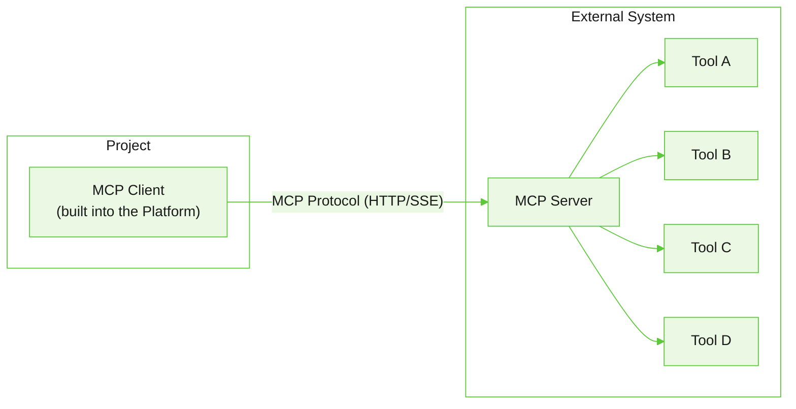
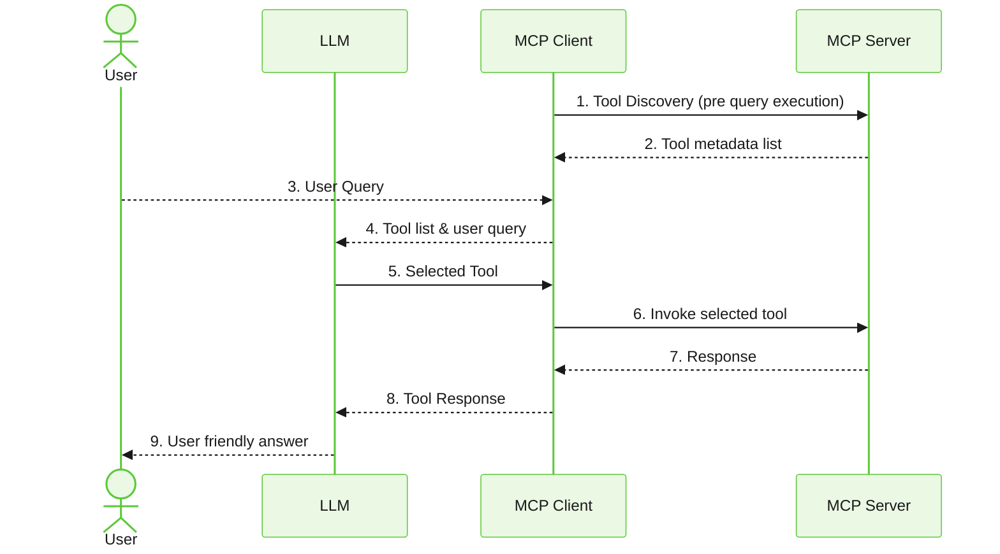

{/* AG: Link back to MCP server details article. */}

Connect agents to external tools and services using the Model Context Protocol.

MCP (Model Context Protocol) is an open standard that lets AI agents interact with external tools and services through a single, consistent interface. Instead of building a custom integration for each tool, agents connect to MCP servers and access all the tools they expose through one standardized protocol. [Learn More](https://modelcontextprotocol.io/docs/getting-started/intro).

**Without MCP:** Connecting to multiple external services requires a separate integration with custom logic for each one.

**With MCP:** The agent communicates with all services through a single interface, dramatically reducing development complexity.

## When to use

MCP is particularly suited for tools hosted on external servers, shared toolsets across teams, and cases where you want clear separation between tool logic and agent logic. 

| Use case             | Why MCP works                            |
|----------------------|------------------------------------------|
| CRM integration      | Connect to the CRM provider's MCP server |
| Enterprise tools     | Share tools across multiple apps         |
| Third-party services | Use pre-built MCP tool providers         |
| Microservices        | Each service exposes tools via MCP       |

## How MCP works

MCP uses a client-server architecture with three components:

| Component        | Role                                                                     |
|------------------|--------------------------------------------------------------------------|
| **MCP Server**   | Hosts and exposes tools to clients                                       |
| **MCP Client**   | The Platform, discovers available tools and invokes them                  |
| **MCP Protocol** | Standardized communication layer (HTTP or SSE) between client and server |




### Interaction workflow

1. **Tool Discovery** - Agent Platform MCP client connects to the MCP server and retrieves the list of available tools.
2. **Intent Detection** - The LLM receives the user query and the tool list, then identifies the appropriate tool.
3. **Tool Invocation** - The client sends a structured request with the tool name and required parameters.
4. **Execution** - The server runs the tool and returns results to the client.
5. **Response Generation** - The agent uses the tool output to formulate a natural language response.



### Example

```text
User: "What's the weather in Dubai today?"

1. MCP Client connects to the MCP server and discovers available tools during configuration.
2. Agent identifies need for weather data and selects: `getWeatherForecast`.
3. Invokes with: { "location": "Dubai" }
4. Server returns: "36°C, Partly cloudy, Wind: 15 km/h"
5. Agent responds: "The weather in Dubai today is partly cloudy
   with a temperature of 36°C and light winds."
```


## Configure MCP server

Navigate to **Tools** > **MCP Servers**, provide the following and **Register Server**.

| Field | Description |
|---|---|
| Server name | A unique, meaningful name for the MCP server |
| Transport | The transport protocol — SSE (Server-Sent Events) or Streamable HTTP.<br /><br />**SSE (Server-Sent Events)**: Streaming responses for real-time updates using server sent events.<br/><br />**Streamable HTTP**: Unified HTTP transport to handle bidirectional streaming interactions between clients and servers over a single endpoint. |
| Server URL | The endpoint URL of the MCP server |
| Authentication | Expand the Authentication section to configure secure access. Enable **Use Auth Profile** to use a predefined profile. Supported methods:<br /><br />- API Key<br />- OAuth<br />- Bearer Token<br />- Basic Authentication |
| Environment variables | Use the Environment Variables section to define key-value pairs required by the MCP server at runtime. Click **Add** to configure them. |


Do the following after successfully registering an MCP server: 

- Configure connection settings.
- Test server connectivity.
- View discovered tools.
- Import tools into the platform.

### Configure connection settings

| Field                       | Description                                                                                                                                                                                                            |
| --------------------------- | ---------------------------------------------------------------------------------------------------------------------------------------------------------------------------------------------------------------------- |
| **Transport**               | Select the transport protocol used to communicate with the MCP server.  |
| **Server URL**              | The endpoint URL of the MCP server that the platform connects to for tool discovery and execution.                                                                                                                     |
| **Connection Timeout (ms)** | Specifies how long the platform waits to establish a connection to the MCP server before timing out.                                                                                                                   |
| **Request Timeout (ms)**    | Specifies the maximum time to wait for a response after a request is sent to the MCP server. Requests exceeding this duration fail with a timeout.                                                                     |
| **Rate limit**              | Specifies the maximum number of requests per minute that can be sent to the MCP server. This limit is enforced at the MCP server level and is **shared across all tools** exposed by the server. Leave this field empty to allow **unlimited requests**. |
| **Auto Reconnect**          | Automatically attempts to re-establish the connection if communication with the MCP server is interrupted.                                                                                                             |
| **Max Reconnect Attempts**  | Specifies the maximum number of reconnection attempts before the platform stops trying to reconnect to the MCP server.                                                                                                 |
| **Authentication**          | Select the authentication profile used to securely connect to the MCP server. Authentication profiles store credentials separately from the server configuration.                                                      |
| **Custom Headers**          | Adds HTTP headers that are included with every request sent to the MCP server. Header values can be resolved dynamically at runtime.                                                                                   |
| **Parameters**              | Define input parameters that are shared across tools hosted by the MCP server. Parameters can be parsed from incoming requests or added manually to establish the tool's input contract.                               |
| **UCP mode**                | Enables Universal Commerce Protocol (UCP) mode for the MCP server. When enabled, the platform injects the UCP agent metadata into every request and returns the complete UCP response payload.                |
| **Agent profile URI**       | Specifies the URI of the agent profile used for UCP discovery and interoperability. Applicable only when UCP mode is enabled.                                                                                          |
| **Idempotent tools**        | Select the tools that can safely be retried. The platform assigns a unique idempotency key to each invocation to help downstream services identify and safely process retry requests.                                  |
| **Environment Variables**   | Configure encrypted environment variables that are securely injected into MCP requests at runtime. These variables are not exposed in the server configuration.                                                        |
| **Priority**                | Defines the execution priority of the MCP server relative to other configured servers. Higher-priority servers can be preferred during tool selection, depending on the runtime configuration.                         |
| **Tags**                    | Add tags to categorize and organize MCP servers. Tags can help filter and identify servers within the project.                                                                                                         |

## Test connection

Click **Test** to verify server connectivity and validate the current configuration. This confirms server reachability, authentication validity, transport configuration, and request handling.

## Discover and import tools

After registering a server, the platform automatically discovers the tools it exposes. You can then:

- Click **Import** next to a specific tool to add it individually
- Click **Import All** to add all discovered tools at once

Once imported, tools can be attached to one or more agents.

## View and test tools

Click on a tool to view its description, metadata, input and output parameters and to test the tool. Go to the Testing and Run Test. Provide sample values for input fields and verify the response. 

## Refresh MCP server 

Use the **Refresh** icon to rediscover tools from the server. Do this when new tools are added, existing tools are updated, or tool metadata changes. Tool definitions are fetched at configuration time and aren't automatically synced. 

{/* Yet to verify if this feature is implemented.

- If all agent-linked tools are still available, the update is applied automatically without affecting the agent configuration.
- If any agent-linked tools are no longer available, the platform displays a warning message listing the removed/updated tools. 

*/}

## Attach MCP tools to an agent

Go to the selected agent, then navigate to **Tools** > **Attach Tool**. Select tools from the list. MCP tool names are prefixed with the MCP server name when attached to an agent.

You can also attach tools via the ABL file using the `/mcp-tool` insert command:

```yaml
TOOLS:
  get_weather(location: string) -> {temp: number, conditions: string}
    type: mcp
    server: "weather-service"
    tool: "get_current_weather"
    description: "Get current weather for a destination"
```

where, 
    - server - MCP server name
    - tool - Tool name on the MCP server
