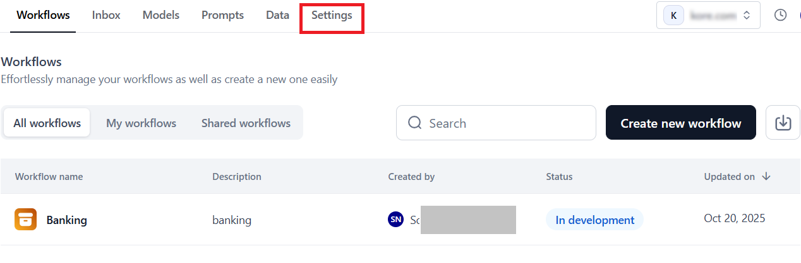

# Integration with Third-party Services

The **Integrations** feature connects your AI for Process account to third-party services, streamlining access to external workflows and automating workflows. Once connected, you can use these integrations from the workflow canvas to build high-quality AI applications. [Learn more](../../workflows/workflow-builder/types-of-nodes/integration-node.md){:target="_blank"} about the **Integration** node.

The AI for Process supports 120+ integrations with different authorization types. To enable secure access, create a connection using third-party authentication to verify users. The main authentication methods are:

* **API**: Authenticate by passing a token (usually in headers or query parameters). Used for API Key or Access Token integrations.
* **OAuth2**: Uses the OAuth2 industry-standard authorization framework to grant limited access to resources on a service without sharing passwords. The auth method uses the following concepts:
    * **Access Token**: A temporary token that the app uses to access the user’s resources.
    * **Scopes**: Specific permissions attached to the token. For example, a token may have a 'read email' scope, which allows an app to access your email data, or a 'write files' scope, which allows it to upload or edit files.
    * **Expires**: Tokens often have a time limit to increase security, meaning they become invalid after a set time period.
    * **Refresh Token**: Allows the app to obtain a new access token when the old one expires. No need to log in again.
* **Bearer**: Use a bearer token in the request header, usually within an OAuth2 workflow, to access protected resources. The server validates the token before granting access.
* **Basic Auth**: Authenticate using username and password in the request header. Credentials are sent with each request. Supported for ServiceNow, Freshdesk, Snowflake, Amplitude, and Mixpanel integrations.

Note

<ul><li>Other authentication methods for certain integrations include: <b>Basic</b>, <b>Basic with JWT</b>, <b>OAuth1</b>, and <b>custom authentication</b> defined by the service provider.</li>
<li>Some providers may support <b>multiple authentication methods</b>, allowing flexibility based on your integration needs.</li></ul>

## Access Integrations

To access the feature, follow the steps below:

1. Log in → In AI for Process Modules top menu → Click **Settings**.
   

2. On the left navigation menu → Click **Integrations**.
    
## Key Features

The features supported on the **Integrations** page include:

* **All Integrations and Connected Tabs**
  
    Click the **All Integrations** tab to see available integrations grouped by category. You can add a connection to these integrations using a supported authentication method, such as API, OAuth2, Bearer Token, or Basic Auth. AI-based integrations you can connect to include [AWS S3 Bucket](../integrations/integrate-with-s3-bucket.md){:target="_blank"}, [Weight & Biases](../integrations/integrate-with-wandb.md){:target="_blank"}, and [Hugging Face](../integrations/enable-hugging-face.md){:target="_blank"}. The category you select filters which integrations are shown in this list.

     Once you configure and connect to a third-party service, that integration appears in the **Connected** section and is no longer visible in the **All Integrations** list. If you delete the connection, the integration will return to the **All Integrations** list, allowing you to reconnect in the future.
     

* **Search Integration**: Enter the name in the **Search** field for full or partial matches.

* **Category Dropdown List**: The AI for Process supports multiple categories based on the purpose of the integration, such as AI and Machine Learning, Marketing and Social Media, E-commerce, and more. Select the relevant category or categories in the list and click **Apply** to view the corresponding integrations.

* **Authorization Dropdown List**: The available types for authentication methods are API, OAuth2, Bearer, and Basic Auth. Refer to the introduction of this article for more details. Select the required option(s) and click **Apply** to view the relevant integrations.

* **List View**: Click this icon to view the available integration options as a list with the following information:
    * **Connection Name**: The service provider’s name.
    * **Description**: A brief description of the purpose or type of integration.
    * **Type**: The authorization method.

* **Tile View**: This is the default view. Click this icon to view all the integrations as individual cards.

## Supported Integrations

The following third-party integrations are available on the AI for Process:

<table>
  <tr>
   <td><strong>INTEGRATION</strong>
   </td>
   <td><strong>DESCRIPTION</strong>
   </td>
   <td><strong>SUPPORTED ACTIONS</strong>
   </td>
   <td><strong>SUPPORTED AUTHORIZATION TYPE(S)</strong>
   </td>
  </tr>
  <tr>
   <td>Acculynx
   </td>
   <td>Using the AccuLynx API, data can be seamlessly exchanged between AccuLynx and other applications for greater efficiency and productivity.
   </td>
   <td> 8
   </td>
   <td> API
   </td>
  </tr>
  <tr>
   <td>Active_campaign
   </td>
   <td>ActiveCampaign provides APIs for marketing automation, customer relationship management (CRM), and email marketing.
   </td>
   <td> 7
   </td>
   <td> API
   </td>
  </tr>
  <tr>
   <td>Affinity
   </td>
   <td>CRM focused on relationship intelligence, with other workflows and systems. This allows for data synchronization, workflow automation, and the sharing of relationship insights across different platforms. 
   </td>
   <td>20
   </td>
   <td>API
   </td>
  </tr>
  <tr>
   <td>Agencyzoom
   </td>
   <td>AgencyZoom is for the P&C insurance agent that is looking to increase sales, boost retention, and analyze agency & producer performance.
   </td>
   <td> 99
   </td>
   <td>
<ul>

<li> API</li>

<li>BASIC WITH JWT</li>
</ul>
   </td>
  </tr>
  <tr>
   <td>Ahrefs
   </td>
   <td>Ahrefs is an SEO and marketing platform offering site audits, keyword research, content analysis, and competitive insights to improve search rankings and drive organic traffic.
   </td>
   <td> 40
   </td>
   <td> API
   </td>
  </tr>
  <tr>
   <td>Airtable
   </td>
   <td>Airtable is a low‒code platform that helps build next generation apps. Move beyond rigid workflows, and implement your critical data, and re-imagine workflows with AI.
   </td>
   <td> 17
   </td>
   <td>
<ul>

<li> OAUTH2</li>

<li>BEARER</li>

<li>API</li>
</ul>
   </td>
  </tr>
  <tr>
   <td>Amplitude
   </td>
   <td>Amplitude Inc. is an American publicly trading company that develops digital analytics software.
   </td>
   <td> 16
   </td>
   <td> BASIC
   </td>
  </tr>
  <tr>
   <td>Apaleo
   </td>
   <td>API-first property management platform empowering hotel & apartment groups to create the ultimate experience for guests & staff.
   </td>
   <td>29
   </td>
   <td>OAUTH2
   </td>
  </tr>
  <tr>
   <td>Apollo
   </td>
   <td>Apollo is a CRM workflow that allows you to manage your contacts, leads, and opportunities.
   </td>
   <td> 17
   </td>
   <td> API
   </td>
  </tr>
  <tr>
   <td>Asana
   </td>
   <td>workflow to help teams organize, track, and manage their work.
   </td>
   <td> 15
   </td>
   <td> OAUTH2
   </td>
  </tr>
  <tr>
   <td>Attio
   </td>
   <td>Attio is a fully customizable workspace for your team's relationships and workflows.
   </td>
   <td> 56
   </td>
   <td> OAUTH2
   </td>
  </tr>
  <tr>
   <td>AWS S3 Bucket
   </td>
   <td> Connect to your users' AWS S3 bucket set.
   </td>
   <td> 1
   </td>
   <td> API
   </td>
  </tr>
  <tr>
   <td>Bamboohr
   </td>
   <td>BambooHR is an American technology company that provides human resources software as a service.
   </td>
   <td> 159
   </td>
   <td> API
   </td>
  </tr>
  <tr>
   <td>Bill
   </td>
   <td>Integration with Bill.com API.
   </td>
   <td> 221
   </td>
   <td> BILLCOM AUTH
   </td>
  </tr>
  <tr>
   <td>Bitbucket
   </td>
   <td>Bitbucket is a Git-based code hosting and collaboration platform supporting private and public repositories, enabling teams to manage and review code through pull requests and integrations.
   </td>
   <td> 15
   </td>
   <td> OAUTH2
   </td>
  </tr>
  <tr>
   <td>Blackboard
   </td>
   <td>Anthology Adopt powered by Pendo allows institutions to gain insights on Blackboard Learn usage and take action through in-app messages, digital walkthrough guides, and tooltips.
   </td>
   <td> 314
   </td>
   <td> OAUTH2
   </td>
  </tr>
  <tr>
   <td>Bolna
   </td>
   <td>Create conversational voice agents using Bolna AI to enhance interactions, streamline operations, and automate support.
   </td>
   <td> 15
   </td>
   <td> API
   </td>
  </tr>
  <tr>
   <td>Borneo
   </td>
   <td>Borneo is a data security and privacy platform designed for sensitive data discovery and remediation.
   </td>
   <td> 154
   </td>
   <td>
<ul>

<li> API</li>

<li>OAUTH2</li>
</ul>
   </td>
  </tr>
  <tr>
   <td>Box
   </td>
   <td>Cloud content management and file sharing service for businesses.
   </td>
   <td> 273
   </td>
   <td> OAUTH2
   </td>
  </tr>
  <tr>
   <td>Brevo
   </td>
   <td>Brevo (formerly Sendinblue) delivers email marketing, SMS campaigns, and marketing automation solutions, empowering businesses to nurture leads, engage audiences, and drive conversions.
   </td>
   <td> 221
   </td>
   <td> API
   </td>
  </tr>
  <tr>
   <td>Browserbase_workflow
   </td>
   <td>A browsing app that gets a URL, reads its contents, and returns it.
   </td>
   <td> 1
   </td>
   <td> API
   </td>
  </tr>
  <tr>
   <td>Bugbug
   </td>
   <td>BugBug is a modern browser-based app for software testers, developers, or product managers in need of quick & reliable <em>test automation</em>.
   </td>
   <td> 4
   </td>
   <td> API
   </td>
  </tr>
  <tr>
   <td>Cal
   </td>
   <td>Cal simplifies meeting coordination by providing shareable booking pages, calendar syncing, and availability management to streamline the scheduling process.
   </td>
   <td> 142
   </td>
   <td>
<ul>

<li> API</li>

<li>CALCOM AUTH</li>
</ul>
   </td>
  </tr>
  <tr>
   <td>Calendly
   </td>
   <td>Calendly is an appointment scheduling workflow that automates meeting invitations, availability checks, and reminders, helping individuals and teams avoid email back-and-forth.
   </td>
   <td> 41
   </td>
   <td> OAUTH2
   </td>
  </tr>
  <tr>
   <td>Canva
   </td>
   <td>The Canvas API provides programmatic access to various learning management features of the Canvas platform, including courses, users, enrollments, grades, and more. It supports OAuth2 for secure authentication and authorization.
   </td>
   <td> 32
   </td>
   <td> OAUTH2
   </td>
  </tr>
  <tr>
   <td>Canvas
   </td>
   <td>A web-based learning management system, or LMS used by learning institutions, educators, and students to access and manage online course learning materials and communicate about skill development and learning achievement.
   </td>
   <td>79
   </td>
   <td>
<ul>

<li>OAUTH2</li>

<li>API</li>
</ul>
   </td>
  </tr>
  <tr>
   <td>Clickup
   </td>
   <td>ClickUp unifies tasks, docs, goals, and chat in a single platform, allowing teams to plan, organize, and collaborate across projects with customizable workflows.
   </td>
   <td> 126
   </td>
   <td>
<ul>

<li> OAUTH2</li>

<li>API</li>
</ul>
   </td>
  </tr>
  <tr>
   <td>codeinterpreter
   </td>
   <td>CodeInterpreter extends Python-based coding environments with integrated data analysis, enabling developers to run scripts, visualize results, and prototype solutions inside supported platform.
   </td>
   <td> 4
   </td>
   <td> API
   </td>
  </tr>
  <tr>
   <td>Coinbase
   </td>
   <td>Coinbase provides APIs for cryptocurrency trading and management.
   </td>
   <td> 6
   </td>
   <td> API
   </td>
  </tr>
  <tr>
   <td>Composio
   </td>
   <td>Composio enables AI Agents and LLMs to authenticate and integrate with various workflows via function calling.
   </td>
   <td> 12
   </td>
   <td> API
   </td>
  </tr>
  <tr>
   <td>Composio_search
   </td>
   <td>Composio Search is an all-in-one workflow for searching and scraping the web.
   </td>
   <td> 12
   </td>
   <td> API
   </td>
  </tr>
  <tr>
   <td>Confluence
   </td>
   <td>A workflow for team collaboration and knowledge management.
   </td>
   <td> 190
   </td>
   <td> OAUTH2
   </td>
  </tr>
  <tr>
   <td>Contentful
   </td>
   <td>Contentful provides a content platform with APIs for managing and delivering content to apps and websites.
   </td>
   <td> 3
   </td>
   <td>
<ul>

<li> OAUTH2</li>

<li>API</li>
</ul>
   </td>
  </tr>
  <tr>
   <td>Crustdata
   </td>
   <td>CrustData is an AI-powered data intelligence platform that provides real-time company and people data via APIs and webhooks, empowering B2B sales teams, AI SDRs, and investors to act on live signals.
   </td>
   <td> 14
   </td>
   <td> API
   </td>
  </tr>
  <tr>
   <td>Coda
   </td>
   <td>Collaborative workspace platform that transforms documents into powerful workflows for team productivity and project management
   </td>
   <td> 97
   </td>
   <td> API
   </td>
  </tr>
  <tr>
   <td>Dialpad
   </td>
   <td>Cloud-based communication platform used for business interactions, providing features like voice calls, video meetings, messaging, and collaboration. 
   </td>
   <td>192
   </td>
   <td>
<ul>

<li>OAUTH2</li>

<li>API</li>
</ul>
   </td>
  </tr>
  <tr>
   <td>Discord
   </td>
   <td>An instant messaging and VoIP social platform.
   </td>
   <td> 169
   </td>
   <td>
<ul>

<li>OAUTH2</li>

<li>BEARER</li>
</ul>
   </td>
  </tr>
  <tr>
   <td>Discordbot
   </td>
   <td>Discordbot refers to automated programs on Discord servers, performing tasks like moderation, music playback, and user engagement to enhance community interactions.
   </td>
   <td> 169
   </td>
   <td>
<ul>

<li>OAUTH2</li>

<li>BEARER</li>
</ul>
   </td>
  </tr>
  <tr>
   <td>Docusign
   </td>
   <td>DocuSign provides eSignature and digital agreement solutions, enabling businesses to send, sign, track, and manage documents electronically.
   </td>
   <td> 342
   </td>
   <td> OAUTH2
   </td>
  </tr>
  <tr>
   <td>Dropbox
   </td>
   <td>Dropbox is a file hosting service that offers cloud storage, file synchronization, personal cloud, and client software.
   </td>
   <td> 9
   </td>
   <td> OAUTH2
   </td>
  </tr>
  <tr>
   <td>Dynamics365
   </td>
   <td>Dynamics 365 from Microsoft combines CRM, ERP, and productivity apps to streamline sales, marketing, customer service, and operations in one integrated platform.
   </td>
   <td> 16
   </td>
   <td> OAUTH2
   </td>
  </tr>
  <tr>
   <td>Elevenlabs
   </td>
   <td>Create natural AI voices instantly in any language - perfect for video creators, developers, and businesses.
   </td>
   <td> 59
   </td>
   <td> API
   </td>
  </tr>
  <tr>
   <td>Entelligence
   </td>
   <td>Entelligence leverages artificial intelligence to provide insights, recommendations, and predictive analytics for businesses seeking data-driven decision-making capabilities.
   </td>
   <td> 2
   </td>
   <td> API
   </td>
  </tr>
  <tr>
   <td>Exa
   </td>
   <td>The Exa class extends the base workflow class to interact with the Exa Search service, offering actions like Search, Similarlink, and Answer. These actions enable querying, finding similar links, and generating answers from search results. Currently, no triggers are defined, but they can be added as needed to enhance functionality.
   </td>
   <td> 4
   </td>
   <td> API
   </td>
  </tr>
  <tr>
   <td>Excel
   </td>
   <td>Connect to Excel to create and manage spreadsheets.
   </td>
   <td> 25
   </td>
   <td> OAUTH2
   </td>
  </tr>
  <tr>
   <td>Figma
   </td>
   <td>A collaborative interface design workflow.
   </td>
   <td> 44
   </td>
   <td>
<ul>

<li>OAUTH2</li>

<li>API</li>
</ul>
   </td>
  </tr>
  <tr>
   <td>Firecrawl
   </td>
   <td>Firecrawl automates web crawling and data extraction, enabling organizations to gather content, index sites, and gain insights from online sources at scale.
   </td>
   <td> 7
   </td>
   <td> API
   </td>
  </tr>
  <tr>
   <td>Fireflies
   </td>
   <td>Fireflies.ai helps your team transcribe, summarize, search, and analyze voice conversations.
   </td>
   <td> 10
   </td>
   <td> API
   </td>
  </tr>
  <tr>
   <td>Flutterwave
   </td>
   <td>Flutterwave provides APIs for making and receiving payments in various currencies and countries.
   </td>
   <td> 2
   </td>
   <td> API
   </td>
  </tr>
  <tr>
   <td>Foursquare
   </td>
   <td>Search for places and place recommendations from the Foursquare Places database.
   </td>
   <td> 5
   </td>
   <td> API
   </td>
  </tr>
  <tr>
   <td>Freshdesk
   </td>
   <td>A customer support platform that provides help desk support with all the smart automation to get things done faster.
   </td>
   <td> 7
   </td>
   <td> BASIC
   </td>
  </tr>
  <tr>
   <td>Gmail
   </td>
   <td>Connect to Gmail to send and manage emails.
   </td>
   <td> 21
   </td>
   <td>
<ul>

<li> OAUTH2</li>

<li>BEARER</li>
</ul>
   </td>
  </tr>
  <tr>
   <td>Gong
   </td>
   <td>Gong is a platform for video meetings, call recording, and team collaboration.
   </td>
   <td> 54
   </td>
   <td> API
   </td>
  </tr>
  <tr>
   <td>Google_maps
   </td>
   <td>Google Maps is a web mapping platform and consumer application offering satellite imagery, aerial photography, street maps, 360° interactive panoramic views of streets, real-time traffic conditions, and route planning for traveling by foot, car, bike, air, and public transportation.
   </td>
   <td> 4
   </td>
   <td>
<ul>

<li> OAUTH2</li>

<li>API</li>
</ul>
   </td>
  </tr>
  <tr>
   <td>Googleads
   </td>
   <td>Connect to Google Ads to manage and create campaigns.
   </td>
   <td> 4
   </td>
   <td> OAUTH2
   </td>
  </tr>
  <tr>
   <td>Googlebigquery
   </td>
   <td>Connect to BigQuery to query BigData.
   </td>
   <td> 1
   </td>
   <td> GOOGLE SERVICE ACCOUNT
   </td>
  </tr>
  <tr>
   <td>Googlecalendar
   </td>
   <td>Google Calendar is a time-management and scheduling calendar service developed by Google.
   </td>
   <td> 12
   </td>
   <td>
<ul>

<li>OAUTH2</li>

<li>BEARER</li>
</ul>
   </td>
  </tr>
  <tr>
   <td>Googledocs
   </td>
   <td>Connect to Google Docs to perform various document-related actions.
   </td>
   <td> 5
   </td>
   <td>
<ul>

<li>OAUTH2</li>

<li>BEARER</li>
</ul>
   </td>
  </tr>
  <tr>
   <td>Googledrive
   </td>
   <td>Connect to Google Drive account.
   </td>
   <td> 10
   </td>
   <td>
<ul>

<li>OAUTH2</li>

<li>BEARER</li>
</ul>
   </td>
  </tr>
  <tr>
   <td>Googlemeet
   </td>
   <td>Google Meet is a video conferencing workflow developed by Google.
   </td>
   <td> 5
   </td>
   <td> OAUTH2
   </td>
  </tr>
  <tr>
   <td>Googlephotos
   </td>
   <td>Google Photos is a photo and video storage service that is part of the Google Drive office suite.
   </td>
   <td> 12
   </td>
   <td> OAUTH2
   </td>
  </tr>
  <tr>
   <td>Googlesheets
   </td>
   <td>Google Sheets is a web-based spreadsheet program that is part of the Google Drive office suite.
   </td>
   <td> 9
   </td>
   <td> OAUTH2
   </td>
  </tr>
  <tr>
   <td>Googlesuper
   </td>
   <td>Google Super App combines all Google services including Drive, Calendar, Gmail, Sheets, Analytics, Ads, and more, providing a unified platform for seamless integration and management of your digital life.
   </td>
   <td> 93
   </td>
   <td>
<ul>

<li>API </li>

<li>OAUTH2</li>

<li>BEARER</li>
</ul>
   </td>
  </tr>
  <tr>
   <td>Googletasks
   </td>
   <td>Google Tasks provides a simple to-do list and task management system integrated into Gmail and Google Calendar for quick and easy tracking.
   </td>
   <td> 11
   </td>
   <td> OAUTH2
   </td>
  </tr>
  <tr>
   <td>Gorgias
   </td>
   <td>Integration for Gorgias, focusing on e-commerce enhancements.
   </td>
   <td> 32
   </td>
   <td> OAUTH2
   </td>
  </tr>
  <tr>
   <td>Github
   </td>
   <td>GitHub is a code hosting platform for version control and collaboration, offering Git-based repository management, issue tracking, and continuous integration features.
   </td>
   <td> 908
   </td>
   <td> OAUTH2
   </td>
  </tr>
  <tr>
   <td>Hackernews
   </td>
   <td>Cybersecurity news platform, delivering real-time updates, threat intelligence, data breach reports, expert analysis, and more.
   </td>
   <td>6
   </td>
   <td>API
   </td>
  </tr>
  <tr>
   <td>Heygen
   </td>
   <td>HeyGen is an innovative video platform that harnesses the power of generative AI to streamline your video creation process.
   </td>
   <td> 35
   </td>
   <td> API
   </td>
  </tr>
  <tr>
   <td>Hubspot
   </td>
   <td>HubSpot is an inbound marketing, sales, and customer service platform integrating CRM, email automation, and analytics to facilitate lead nurturing and seamless customer experiences.
   </td>
   <td> 229
   </td>
   <td>
<ul>

<li>OAUTH2</li>

<li>BEARER</li>
</ul>
   </td>
  </tr>
  <tr>
   <td>Hugging Face
   </td>
   <td>Connect to your users' Hugging face setup.
   </td>
   <td> 1
   </td>
   <td> API
   </td>
  </tr>
  <tr>
   <td>Intercom
   </td>
   <td>A messaging platform that allows businesses to communicate with prospective and existing customers within their app, on their website, through social media, or via email.
   </td>
   <td> 43
   </td>
   <td> OAUTH2
   </td>
  </tr>
  <tr>
   <td>Jira
   </td>
   <td>Jira API workflow.
   </td>
   <td> 544
   </td>
   <td>
<ul>

<li> OAUTH2</li>

<li>API</li>
</ul>
   </td>
  </tr>
  <tr>
   <td>Junglescout
   </td>
   <td>Jungle Scout assists Amazon sellers with product research, sales estimates, and competitive insights to optimize inventory, pricing, and listing strategies.
   </td>
   <td> 6
   </td>
   <td> API
   </td>
  </tr>
  <tr>
   <td>Klaviyo
   </td>
   <td>Klaviyo is a data-driven email and SMS marketing platform that allows e-commerce brands to deliver targeted messages, track conversions, and scale customer relationships.
   </td>
   <td> 231
   </td>
   <td>
<ul>

<li> API</li>

<li>OAUTH2</li>
</ul>
   </td>
  </tr>
  <tr>
   <td>Kommo
   </td>
   <td>Kommo CRM (formerly amoCRM) integration workflow for managing customer relationships, sales pipelines, and business processes. This workflow enables the automation of various CRM operations.
   </td>
   <td> 15
   </td>
   <td> OAUTH2
   </td>
  </tr>
  <tr>
   <td>Linear
   </td>
   <td>Connect to Linear to create and manage issues, list projects, teams, and more.
   </td>
   <td> 15
   </td>
   <td>
<ul>

<li> OAUTH2</li>

<li>API</li>
</ul>
   </td>
  </tr>
  <tr>
   <td>Linkedin
   </td>
   <td>Connect to Linked to send and manage emails.
   </td>
   <td> 4
   </td>
   <td> OAUTH2
   </td>
  </tr>
  <tr>
   <td>Linkhut
   </td>
   <td>Linkhut is a platform that allows users to save, organize, and share links.
   </td>
   <td> 2
   </td>
   <td> OAUTH2
   </td>
  </tr>
  <tr>
   <td>Linkup
   </td>
   <td>Search the Web for Relevant Results (RAG Use Case).
   </td>
   <td> 1
   </td>
   <td> API
   </td>
  </tr>
  <tr>
   <td>Listennotes
   </td>
   <td>The best podcast search engine.
   </td>
   <td> 26
   </td>
   <td> API
   </td>
  </tr>
  <tr>
   <td>Lmnt
   </td>
   <td>LMNT is an API for text-to-speech and voice cloning.
   </td>
   <td> 7
   </td>
   <td> API
   </td>
  </tr>
  <tr>
   <td>Mailchimp
   </td>
   <td>Mailchimp is an email marketing and automation platform providing campaign templates, audience segmentation, and performance analytics to drive engagement and conversions.
   </td>
   <td> 271
   </td>
   <td> OAUTH2
   </td>
  </tr>
  <tr>
   <td>Mem0
   </td>
   <td>Mem0 assists with AI-driven note-taking, knowledge recall, and productivity workflows, allowing users to organize, search, and generate content from stored information.
   </td>
   <td> 43
   </td>
   <td> API
   </td>
  </tr>
  <tr>
   <td>Metaads
   </td>
   <td>Meta Ads Marketing API Integration This workflow provides access to Meta's Marketing API for managing ad campaigns, ad sets, ads, and custom audiences, as well as retrieving insights and analytics.
   </td>
   <td> 16
   </td>
   <td>
<ul>

<li> OAUTH2</li>

<li>API</li>
</ul>
   </td>
  </tr>
  <tr>
   <td>Microsoft_clarity
   </td>
   <td>Microsoft Clarity is a free, easy-to-use workflow that captures how real people use your site.

 
   </td>
   <td> 1
   </td>
   <td> BEARER
   </td>
  </tr>
  <tr>
   <td>Microsoft_teams
   </td>
   <td>Connect to Microsoft Teams to manage channels.
   </td>
   <td> 13
   </td>
   <td> OAUTH2
   </td>
  </tr>
  <tr>
   <td>Mixpanel
   </td>
   <td>Mixpanel is an analytics platform that helps companies measure user engagement and retention.

 
   </td>
   <td> 19
   </td>
   <td> BASIC
   </td>
  </tr>
  <tr>
   <td>Monday
   </td>
   <td>Monday is a cloud-based work operating system where teams create workflow apps in minutes to run their processes, projects, and everyday work.
   </td>
   <td> 21
   </td>
   <td> OAUTH2
   </td>
  </tr>
  <tr>
   <td>Neon
   </td>
   <td>Postgres, on a serverless platform designed to help you build reliable and scalable applications faster.
   </td>
   <td> 69
   </td>
   <td> API
   </td>
  </tr>
  <tr>
   <td>Notion
   </td>
   <td>Notion centralizes notes, docs, wikis, and tasks in a unified workspace, letting teams build custom workflows for collaboration and knowledge management.
   </td>
   <td> 23
   </td>
   <td>
<ul>

<li> OAUTH2</li>

<li>API</li>
</ul>
   </td>
  </tr>
  <tr>
   <td>One_drive
   </td>
   <td>OneDrive is Microsoft’s cloud storage solution enabling users to store, sync, and share files across devices, offering offline access, real-time collaboration, and enterprise-grade security.
   </td>
   <td> 7
   </td>
   <td> OAUTH2
   </td>
  </tr>
  <tr>
   <td>Onepage
   </td>
   <td>API for enriching user and company data, providing endpoints for token validation and generic search.
   </td>
   <td> 2
   </td>
   <td> API
   </td>
  </tr>
  <tr>
   <td>Open_sea
   </td>
   <td>OpenSea is the world's first and largest NFT marketplace for NFTs and crypto collectibles.
   </td>
   <td> 22
   </td>
   <td> API
   </td>
  </tr>
  <tr>
   <td>Outlook
   </td>
   <td>Outlook is Microsoft’s email and calendaring platform integrating contacts, tasks, and scheduling, enabling users to manage communications and events in a unified workspace.
   </td>
   <td> 22
   </td>
   <td> OAUTH2
   </td>
  </tr>
  <tr>
   <td>Pagerduty
   </td>
   <td>Integrate PagerDuty to manage incidents, schedules, and alerts directly from your application.
   </td>
   <td> 357
   </td>
   <td>
<ul>

<li> OAUTH2</li>

<li>API</li>
</ul>
   </td>
  </tr>
  <tr>
   <td>Perplexityai
   </td>
   <td>The Perplexity workflow interfaces with Perplexity AI's search service, offering advanced natural language processing for sophisticated searches. The PerplexityAISearch action allows for: - Query execution with AI models tailored to various search tasks. - Search customization through parameters affecting content generation. - Domain filtering to enhance search precision. - Real-time response streaming for dynamic applications. This action is highly configurable for a tailored search experience, suitable for a wide range of AI-driven applications.
   </td>
   <td> 1
   </td>
   <td> API
   </td>
  </tr>
  <tr>
   <td>Peopledatalabs
   </td>
   <td>PeopleDataLabs provides B2B data enrichment and identity resolution, empowering organizations to build enriched user profiles and validate customer information.
   </td>
   <td> 14
   </td>
   <td> API
   </td>
  </tr>
  <tr>
   <td>Pipedrive
   </td>
   <td>Pipedrive is a sales management workflow built around pipeline visualization, lead tracking, activity reminders, and automation to keep deals progressing.
   </td>
   <td> 275
   </td>
   <td>
<ul>

<li> OAUTH2</li>

<li>BEARER</li>
</ul>
   </td>
  </tr>
  <tr>
   <td>Placekey
   </td>
   <td>Placekey provides APIs for generating unique identifiers for physical places, enabling easy data matching and entity resolution.
   </td>
   <td> 2
   </td>
   <td> API
   </td>
  </tr>
  <tr>
   <td>PostHog
   </td>
   <td>PostHog is an open-source product analytics platform tracking user interactions and behaviors to help teams refine features, improve funnels, and reduce churn.
   </td>
   <td> 358
   </td>
   <td> API
   </td>
  </tr>
  <tr>
   <td>Quickbooks
   </td>
   <td>Quickbooks is a cloud-based accounting software that helps you manage your finances, track your income and expenses, and get insights into your business.
   </td>
   <td> 13
   </td>
   <td> OAUTH2
   </td>
  </tr>
  <tr>
   <td>Ramp
   </td>
   <td>Ramp is a comprehensive finance platform designed to help you manage your finances, track your income and expenses, and get insights into your business. The Ramp API provides developers with the workflows to interact with the platform programmatically.
   </td>
   <td> 8
   </td>
   <td> OAUTH2
   </td>
  </tr>
  <tr>
   <td>Recallai
   </td>
   <td>Recall.ai provides a single API for meeting bots on every platform like Zoom, Google Meet, Microsoft Teams and more.
   </td>
   <td> 8
   </td>
   <td> API
   </td>
  </tr>
  <tr>
   <td>Reddit
   </td>
   <td>Connect to Reddit to post and comment.
   </td>
   <td> 9
   </td>
   <td> OAUTH2
   </td>
  </tr>
  <tr>
   <td>Resend
   </td>
   <td>Connect to Resend to send emails.
   </td>
   <td> 18
   </td>
   <td> API
   </td>
  </tr>
  <tr>
   <td>Retellai
   </td>
   <td>RetellAI captures calls and transcripts, enabling businesses to analyze conversations, extract insights, and enhance customer interactions in one centralized platform.
   </td>
   <td> 10
   </td>
   <td> API
   </td>
  </tr>
  <tr>
   <td>Rocketlane
   </td>
   <td>Rocketlane specializes in customer onboarding and project delivery, providing shared workspaces, milestones, and status tracking to streamline implementations.
   </td>
   <td> 6
   </td>
   <td> API
   </td>
  </tr>
  <tr>
   <td>Salesforce
   </td>
   <td>Salesforce is a leading CRM platform integrating sales, service, marketing, and analytics to build customer relationships and drive business growth.
   </td>
   <td> 32
   </td>
   <td> OAUTH2
   </td>
  </tr>
  <tr>
   <td>Search AI
   </td>
   <td>Connect to your users' SearchAssist setup.
   </td>
   <td> 1
   </td>
   <td> API
   </td>
  </tr>
  <tr>
   <td>Semanticscholar
   </td>
   <td>Semantic Scholar is an AI-powered academic search engine that helps researchers discover and understand scientific literature.
   </td>
   <td> 14
   </td>
   <td> API
   </td>
  </tr>
  <tr>
   <td>Semrush
   </td>
   <td>Semrush is a popular SEO workflow suite that specializes in keyword research, competitor analysis, and Google Ad campaign optimization.
   </td>
   <td> 36
   </td>
   <td> API
   </td>
  </tr>
  <tr>
   <td>Sendgrid
   </td>
   <td>SendGrid is a cloud-based email delivery platform providing transactional and marketing email services, with APIs for integration, analytics, and scalability.
   </td>
   <td> 375
   </td>
   <td> API
   </td>
  </tr>
  <tr>
   <td>Sentry
   </td>
   <td>Integrate Sentry to manage your error tracking and monitoring.
   </td>
   <td> 178
   </td>
   <td> BEARER
   </td>
  </tr>
  <tr>
   <td>Serpapi
   </td>
   <td>SerpApi provides a real-time API for structured search engine results, allowing developers to scrape, parse, and analyze SERP data for SEO and research.
   </td>
   <td> 10
   </td>
   <td> API
   </td>
  </tr>
  <tr>
   <td>Servicenow
   </td>
   <td>Servicenow provides IT Service Management Transform service management to boost productivity and maximize ROI.
   </td>
   <td> 5
   </td>
   <td> BASIC
   </td>
  </tr>
  <tr>
   <td>Share_point
   </td>
   <td>SharePoint is a Microsoft platform for document management and intranets, enabling teams to collaborate, store, and organize content securely and effectively.
   </td>
   <td> 6
   </td>
   <td> OAUTH2
   </td>
  </tr>
  <tr>
   <td>Shortcut
   </td>
   <td>Shortcut aligns product development work with company objectives so teams can execute with a shared purpose.
   </td>
   <td> 122
   </td>
   <td> API
   </td>
  </tr>
  <tr>
   <td>Shopify
   </td>
   <td>A leading global commerce platform that allows anyone to sell online and in person.
   </td>
   <td> 26
   </td>
   <td>
<ul>

<li> API</li>

<li>OAUTH2</li>
</ul>
   </td>
  </tr>
  <tr>
   <td>Slack
   </td>
   <td>Slack is a channel-based messaging platform. With Slack, people can work together more effectively, connect all their software workflows and services, and find the information they need to do their best work — all within a secure, enterprise-grade environment.
   </td>
   <td> 174
   </td>
   <td>
<ul>

<li> OAUTH2</li>

<li>BEARER</li>
</ul>
   </td>
  </tr>
  <tr>
   <td>slackbot
   </td>
   <td>Slackbot automates responses and reminders within Slack, assisting with tasks like onboarding, FAQs, and notifications to streamline team productivity.
   </td>
   <td> 174
   </td>
   <td>
<ul>

<li>  OAUTH2</li>

<li>BEARER</li>
</ul>
   </td>
  </tr>
  <tr>
   <td>Snowflake
   </td>
   <td>Connect to Snowflake to run queries.
   </td>
   <td> 4
   </td>
   <td> BASIC
   </td>
  </tr>
  <tr>
   <td>Stripe
   </td>
   <td>Stripe is a payment processor that allows you to accept payments online.
   </td>
   <td> 19
   </td>
   <td> API
   </td>
  </tr>
  <tr>
   <td>Supabase
   </td>
   <td>Supabase is an open-source backend-as-a-service providing a Postgres database, authentication, storage, and real-time subscription APIs for building modern applications.
   </td>
   <td> 77
   </td>
   <td>
<ul>

<li> OAUTH2</li>

<li>API</li>
</ul>
   </td>
  </tr>
  <tr>
   <td>Tavily
   </td>
   <td>Tavily provides advanced search capabilities with various options including image inclusion, raw content, and domain filtering.
   </td>
   <td> 1
   </td>
   <td> API
   </td>
  </tr>
  <tr>
   <td>Textrazor
   </td>
   <td>TextRazor offers state-of-the-art natural language processing workflows, enabling advanced text analysis and understanding through their API.
   </td>
   <td> 1
   </td>
   <td> API
   </td>
  </tr>
  <tr>
   <td>Text_to_pdf
   </td>
   <td>Convert text to PDF file.
   </td>
   <td> 1
   </td>
   <td> API
   </td>
  </tr>
  <tr>
   <td>Tinyurl
   </td>
   <td>TinyURL provides APIs for shortening long URLs into compact, branded links and tracking link analytics.
   </td>
   <td> 1
   </td>
   <td> API
   </td>
  </tr>
  <tr>
   <td>Todoist
   </td>
   <td>Todoist is a productivity app that helps manage tasks and projects.
   </td>
   <td> 4
   </td>
   <td> OAUTH2
   </td>
  </tr>
  <tr>
   <td>Trello
   </td>
   <td>A web-based, kanban-style, list-making application.
   </td>
   <td> 323
   </td>
   <td>
<ul>

<li>OAUTH</li>

<li>BEARER</li>
</ul>
   </td>
  </tr>
  <tr>
   <td>Twitter
   </td>
   <td>Twitter, Inc. was an American social media company based in San Francisco, California, which operated and was named for its flagship social media network before its rebranding as X.
   </td>
   <td> 72
   </td>
   <td> OAUTH2
   </td>
  </tr>
  <tr>
   <td>Twitter_media
   </td>
   <td>Twitter Media focuses on multimedia workflows and features within Twitter, allowing brands to leverage rich content for marketing campaigns
   </td>
   <td> 1
   </td>
   <td> OAUTH
   </td>
  </tr>
  <tr>
   <td>Typefully
   </td>
   <td>Integrate Typefully to streamline and manage your AI-powered content creation.
   </td>
   <td> 5
   </td>
   <td> API
   </td>
  </tr>
  <tr>
   <td>Weathermap
   </td>
   <td>WeatherMap provides visual weather data, forecasts, and mappings, helping users understand climate patterns or track severe weather conditions.
   </td>
   <td> 1
   </td>
   <td> API
   </td>
  </tr>
  <tr>
   <td>Weight & Biases
   </td>
   <td>Connect to your users' Weights & Biases setup.
   </td>
   <td> 1
   </td>
   <td> API
   </td>
  </tr>
  <tr>
   <td>Whatsapp
   </td>
   <td>Enables interaction with customers through the WhatsApp Business API for messaging and automation.
   </td>
   <td> 5
   </td>
   <td> API
   </td>
  </tr>
  <tr>
   <td>Workiom
   </td>
   <td>Workiom provides APIs for automating workflows, integrating with various workflows, and building custom applications.
   </td>
   <td> 3
   </td>
   <td> API
   </td>
  </tr>
  <tr>
   <td>Yousearch
   </td>
   <td>YouSearch is a search engine or search workflow that enables users to find relevant information, possibly with enhanced filtering or privacy-focused features.
   </td>
   <td> 1
   </td>
   <td> API
   </td>
  </tr>
  <tr>
   <td>Youtube
   </td>
   <td>Youtube actions to interact with the app.
   </td>
   <td> 11
   </td>
   <td> OAUTH2
   </td>
  </tr>
  <tr>
   <td>Zenrows
   </td>
   <td>Connect to ZenRows to effortlessly scrape and extract web data, process it, and manage it using the powerful ZenRows API.
   </td>
   <td> 1
   </td>
   <td> API
   </td>
  </tr>
  <tr>
   <td>Zendesk
   </td>
   <td>Zendesk is a customer service and sales platform that helps businesses manage customer communication and support.
   </td>
   <td> 11
   </td>
   <td> OAUTH2
   </td>
  </tr>
  <tr>
   <td>Zoom
   </td>
   <td>Zoom is a video conferencing and online meeting platform featuring breakout rooms, screen sharing, and integrations with various enterprise workflows.
   </td>
   <td> 172
   </td>
   <td> OAUTH2
   </td>
  </tr>
  <tr>
   <td>Zoominfo
   </td>
   <td>ZoomInfo is a multi-platform operating system that revenue teams use to deliver business growth.
   </td>
   <td> 14
   </td>
   <td> BASIC WITH JWT
   </td>
  </tr>
  <tr>
   <td>Zoho
   </td>
   <td>Zoho actions to interact with their CRM.
   </td>
   <td> 6
   </td>
   <td> OAUTH2
   </td>
  </tr>
</table>

## Add a Connection to Set Up Integration

To add a connection and configure an integration, follow the steps below:

Note

You can also add a connection directly from the <b>Integration node</b> on the Workflow canvas. [Learn more](../../workflows/workflow-builder/types-of-nodes/integration-node.md){:target="_blank"}.

1. [Access](../integrations/about-integrations.md#access-integrations){:target="_blank"} **Integrations**.
2. The next steps depend on whether you are setting up a connection for the first time or want to use an existing connection.
    **Case 1**: For a first-time connection, follow these steps:
    
    * (Optional) In the **All Integrations** tab, select the **Category** and **Authorization** from the respective lists to filter the integration options.
    * Click the required integration from the [available options](./about-integrations.md#supported-integrations){:target="_blank"}.

     **Case 2**: To select an existing/connected provider, click the **Connected** tab, and click the required provider.

3. Click **Add Connection** on the next page or the integrations listing page.

4. The Configuration window is displayed, where you must enter the following information:
    * **Connection Name**: A unique name to identify the integration.
    * **Authorization Details** 
        * Configure the required authorization details in this section to securely connect to the workflow and access external services. A provider may support more than one auth type. In this case, you must select the authentication type you want to set up for the integration, such as *OAuth2*, *Bearer Token*, *Basic Auth*, or *API*.

        

        
Note

        
You are allowed to select only one auth type for a connection.

        

        * The **Pre-authorize the integration** option is auto-selected, indicating that you must provide authentication credentials to interact with the workflow or service. You can select the preferred authentication method, such as *OAuth2*, *Bearer*, or *Basic Auth*, from the available options to configure the credentials. 

        * Based on the selected authorization method, the relevant configuration fields automatically appear under each corresponding authorization type.

        **OAuth2**

        * Provide the connection name and select the configured **Auth Profile** in the **Custom** for authentication by the integration. [Learn more](../security-and-control/authorization-profile.md#add-authorization-profile){:target="_blank"} about adding an auth profile to your account.
        * **Custom auth**: Allows you to use a tailored authentication process, set up in the AI for Process, to connect to a service. This is an alternative to using any standard authentication flows like API or OAuth2 provided by the service.
        * Once an Auth Profile is selected, all its credentials are fetched and automatically populate the corresponding fields such as **Redirect URL**, **Scopes**, **Base URL**, and more.
        * No need to re-authenticate unless the authorization profile is deleted from your account.
        * Connecting to a provider with a deleted auth profile results in an error.
        * Deleted auth profiles no longer display in the **Custom** window during configuration
        * Click **Authorize** to test the integration for the selected Auth profile.
        

        **Bearer Token**

        * When you select this auth type, you must enter the bearer token along with related information such as the *Base URL*, *API Key*, *Bot Token*, or other relevant credentials.
        * The required fields depend on the bearer authentication framework supported by the selected service provider.
        * Retrieve these values from the provider’s Admin console > **Settings** section.
        * Click **Test** to validate the connection. A success message is displayed once the connection is set up.
        

        **API**

        * When you select this type, you must enter the **API Key** or **Access Token** for the service provider. 
        * Additional field inputs may be required based on the specific parameters needed to configure the provider.
        * Retrieve these values from the Admin console > **Settings** of your provider’s site.
        * Click **Test** to validate the connection.  A success message is displayed once the connection is set up.
        

      

      
Note

      
For other Authentication types, such as OAuth1, retrieve the required values from the admin console of your account on the provider’s site to configure the integration.

      

      **Basic Auth**

      * When you select this auth type, you must provide the required configuration values. For example, an **Amplitude** project requires an *API key* and *API secret*.
      * Retrieve these values from the Admin console > **Settings** of your provider’s site.
      * Click **Test** to validate the connection. A success message is displayed once the connection is set up.

         

<ol start="5"><li>Click <b>Save</b> after successfully testing the connection.</li>

Note

The <b>Save</b> button will not appear until all required inputs have been provided.

</ol>

A success message appears after setup.

You will be redirected to the following page, where all the connections for the provider are listed.

### Manage Connection Errors

* During or after setting up a connection, errors may occur due to invalid credentials when [adding a connection](../../settings/integrations/about-integrations.md#add-a-connection-to-set-up-integration){:target="_blank"}. 

* **View the error**
    * Navigate to the **Connected** section.
    * Select the connection.
    * Click the **Play** icon to test the connection.
    * Hover over the **warning sign**, which will display the reason for the issue.
    

    You can also click **Edit**, go to the configuration window, and click **Test** to view the error.
      
    

* **Resolve the error**
    * Use the **Edit** functionality to provide the correct credentials in the configuration window.
    * Click **Test** to validate the connection.
    * Click **Save**.

## Manage Connected Integrations

You can view, edit, delete, and perform additional actions with connected integrations to your account in the **Connected** section.

### View Summary

Once you click the integration in the **Connected** section, the list of configured connections is displayed with the following information:

* **Connection Name**: The unique name provided during the connection setup.
* **Added By**: The name of the admin/account user who added the connection.
* **Authorization Details**: *Pre-authorize* is displayed.
* **Integration Type**: API, OAuth2, Bearer, Basic Auth, etc., based on the type used.
* **Added on**: The date when the connection was added.
* **Action**: Allows you to test the connection or enable/disable it.

  

### Edit Integration

To edit the configuration for a connection, follow the steps below:

Note

You cannot modify the connection name.

1. [Access](../integrations/about-integrations.md#access-integrations){:target="_blank"} **Integrations** → Click **Connected** → Select a connection.
2. For the connection, click the **Ellipses** icon → Select **Edit**.

3. In the configuration window, modify the required fields in the **Authorization Details** section.
4. (Optional) Click **Test** to validate the connection.
5. Click **Save**.
     
     

A success message is displayed once the connection is updated.

### Delete Integration

To delete an integration, follow the steps below:

1. [Access](../integrations/about-integrations.md#access-integrations){:target="_blank"} **Integrations** → Click **Connected** → Select a connection.
2. Click the **Ellipses** icon → Select **Delete**.
   

3. Click **Delete**.

  

  
Caution

  
This action is irreversible and will remove all associations of the connection from the AI for Process.

  

  A success message appears, and the connection is removed from the system.

### Test Connection

To test a configured connection, follow the steps below:

1. [Access](../integrations/about-integrations.md#access-integrations){:target="_blank"} **Integrations** → Click **Connected** → Select a connection.
2. Click **Play** for the connection.
   

The connection is validated in the background, and any errors are highlighted with a **warning** icon. [Learn more](../integrations/about-integrations.md#manage-connection-errors){:target="_blank"} about managing errors.

If there are no errors, a success message is displayed when the connection is established.

### Enable or Disable Connection

Enabling a connection makes it available for **user authentication** with the service provider. It also becomes accessible for use in the **Integration node** on the workflow canvas. 

Use the toggle switch to enable (default setting) or disable the connection as needed.
