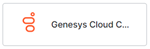

# Enable Digital Channels

By default, your AI Agent isn't available to users unless you define one or more channels through which it can communicate. So, after creating an AI Agent, you can add delivery channels that end-users can use to access and interact with it when deployed. For example, you can enable your assistant for use in the Kore.ai Messaging application, or allow interaction with your AI Agent through an email address or a _Twilio_ SMS account. You can also enable your AI Agent in third-party applications such as _Facebook_ or _Slack_. This topic describes how to add one or more delivery channels to your AI Agent.

You can add channels to your AI Agent from the **Flows & Channels > Channels > Digital > All** section. Channels supported by the Platform are categorized based upon their functionality and usage.

## Enable a Channel

To enable one or more channels for your AI Agent, follow the below steps:

1. Open the assistant for which you want to add the channels.
2. Go to **Flows & Channels** > **Channels** > **Digital** > **All**.
3. Click the channel you want to add. This opens the instructions page to install the channel.
4. Click **Next** or the **Configuration** tab to open the configuration page for the channel.

    <Note>    After adding the channel, the app needs to be published for approval and the Admin needs to approve the app (with new channels). The new channel is not available to users until the Admin explicitly approves that channel for your assistant.</Note>
## Editing, Testing,  Disabling or Deleting Channels

To **edit a channel** configuration, go to **Flows & Channels** > **Channels** > **Digital** > **Configured** list, the channel, make your changes and save.

To **test**, **disable or delete the channel**, go to **Flows & Channels** > **Channels** > **Digital** > **Configured** list, hover over the channel and click more option in the top right corner. The Test, Disable, or Delete as required and follow the instructions.

<Warning>Deletion is permanent and cannot be undone. You will be asked to confirm your choice, so make sure this is exactly what you want to do.</Warning>
<Note>The channel edits will only take effect within your live assistant after publishing the In Development version of the AI Agent with the channel enabled. For more information, see Publishing your AI Agent.</Note>

## Available Channels

Below is a list of all channels you can connect to via the Kore.ai XO Platform:

Click the icon of the channel you want to add, and then configure the channel to work with your Kore.ai assistant. The page with Instructions and Configuration settings slides out.

### Enterprise Channels

|[Amazon Connect Chat](./add-amazon-connect-chat-channel.md)

| [Cisco Jabber](./add-cisco-jabber-channel.md)

  | [Cisco Webex Teams
(formerly  Cisco Spark)](./add-cisco-channel.md)
 | [Google Assistant](./add-google-assistant-channel.md)

 |
|:---:|:---:|:---:|:---:|
|[**Genesys Cloud
CX Messaging**](./add-genesys-chat-channel.md)
 | [**Hangouts Chat**](./add-google-chat.md)

 | [**Kore.ai**](./add-kore-channel.md)

 | [**Live Person**](./add-live-person-channel.md)

|
|[**Mattermost**](./add-mattermost-channel.md)

| [**Microsoft Teams & Copilot**](./add-microsoft-teams-channel.md)
 | [**Naver Works**](./add-naver-works-channel.md)

 | [**Nice inContact**](./add-nice-incontact-channel.md)

 |
|[**RCS Business Messaging**](./add-google-rcs-channel.md)

| [**RingCentral Glip**](./add-ringcentral-glip-channel.md)

 | [**RingCentral Engage**](./add-ringcentral-engage-channel.md)

 | [**Sinch**](./add-sinch-channel.md)

|
| [**Slack**](./add-slack-channel.md)

| [**Unblu**](./add-unblu-channel.md)

 | [**WhatsApp Business Messaging**](./add-whatsapp-business-channel.md)

|[**Workplace By Facebook**](./add-workplace-by-facebook-channel.md)

 |
|[**Yammer**](./add-microsoft-yammer-channel.md)

| [**Zoom Contact Center**](./add-zoom-contact-center-channel.md)

|

### Social Channels

|[Facebook
Messenger](./add-facebook-messenger-channel.md)
 |[Instagram](./add-instagram-channel.md)

 |[Line](./add-line-messenger-channel.md)

   |[Twitter](./add-twitter-channel.md)

|
|:----:|:----:|:----:|:----:|
|[**Telegram**](./add-telegram-channel.md)

  |[**WeChat**](./add-wechat-channel.md)

  |

### Other Channels

|[Email](./add-email-channel.md)
|[SMS](./add-sms-channel.md)
| [Sunshine Conversations](./add-sunshine-conversations-channel.md)

 | [Syniverse](./add-syniverse-channel.md)

|
|:---:|:---:|:---:|:---:|
|[**Twilio SMS**](./add-twilio-sms-channel.md)
 |[**Web/MobileClient**](./add-web-mobile-client.md)
 |[**Webhook**](./add-webhook-channel.md)
 |[**Widget SDK**](./add-widget-sdk-channel.md)
 |