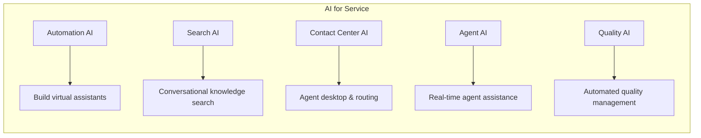

Set up AI for Service and deploy your first virtual assistant.

## Prerequisites

- Kore.ai account with AI for Service access
- Admin permissions for initial setup
- (Optional) Channel credentials for deployment

## Platform Overview

AI for Service provides a unified platform for customer experience automation:



## Quick Start: Virtual Assistant

### Step 1: Create a Virtual Assistant

1. Navigate to **Automation AI** → **Virtual Assistants**
2. Click **Create Virtual Assistant**
3. Configure basics:
   - Name and description
   - Default language
   - Target use case (Customer Support, HR, IT, etc.)

### Step 2: Define Intents

Intents represent what users want to accomplish:

```yaml
Intent: Check Order Status
Description: User wants to know the status of their order
Training utterances:
  - "Where is my order?"
  - "Track my package"
  - "What's the status of order #12345?"
  - "When will my order arrive?"
```

### Step 3: Build Dialog Flows

Create conversation flows for each intent:

```
[User: Check Order Status]
        │
        ▼
[Collect Order Number]
        │
        ▼
[Call Order API]
        │
        ▼
[Deliver Status Response]
```

### Step 4: Add Entity Extraction

Extract key information from user messages:

| Entity | Type | Examples |
|--------|------|----------|
| **OrderNumber** | Regex | #12345, ORD-98765 |
| **Email** | Built-in | user@example.com |
| **Date** | Built-in | tomorrow, next Monday |

### Step 5: Connect Integrations

Add backend integrations:

1. Go to **Integrations** → **Actions**
2. Select an integration (Salesforce, Zendesk, custom API)
3. Configure authentication
4. Map entities to API parameters

### Step 6: Test and Deploy

1. Use the **Test** panel to simulate conversations
2. Iterate on training and flows
3. Deploy to channels (Web, Voice, Messaging)
4. Monitor performance in Analytics

## Quick Start: Search AI

### Step 1: Create Search AI Application

1. Navigate to **Search AI**
2. Click **Create Application**
3. Name your search application

### Step 2: Connect Content Sources

Add data sources for search:

| Source Type | Examples |
|-------------|----------|
| **Documents** | PDF, Word, Excel |
| **Knowledge bases** | Confluence, SharePoint |
| **Websites** | Help center, product pages |
| **Databases** | Structured data |

### Step 3: Configure Retrieval

Set up search and answer generation:

```yaml
Retrieval Settings:
  chunk_size: 500
  top_k: 5
  similarity_threshold: 0.7

Answer Generation:
  model: gpt-4
  citation_style: inline
  max_length: 300
```

### Step 4: Test and Integrate

1. Test queries in the **Workbench**
2. Integrate via API or embed in virtual assistant

## Quick Start: Contact Center

### Step 1: Configure Contact Center

1. Navigate to **Contact Center AI**
2. Complete initial setup:
   - Business hours
   - Default routing rules
   - Agent capacity settings

### Step 2: Set Up Queues

Create queues for different inquiry types:

```yaml
Queue: Sales
Routing: Round-robin
Skills required: sales, product-knowledge
Hours: Mon-Fri 9am-6pm

Queue: Support
Routing: Skill-based
Skills required: technical-support
Hours: 24/7
```

### Step 3: Add Agents

1. Go to **User Management** → **Agents**
2. Add agents with profiles:
   - Skills and proficiencies
   - Queue assignments
   - Capacity settings

### Step 4: Configure Channels

Connect voice and digital channels:

| Channel | Setup |
|---------|-------|
| **Voice** | Configure phone numbers, IVR |
| **Web Chat** | Embed widget, customize UI |
| **WhatsApp** | Connect WhatsApp Business API |
| **Email** | Configure email routing |

## Next Steps

| Goal | Resources |
|------|-----------|
| Build complex dialogs | [Flows & Dialogs](/ai-for-service/flows) |
| Deploy to voice | [Channels](/ai-for-service/channels) |
| Connect CRM | [Integrations](/ai-for-service/integrations) |
| Set up agent assist | [Agent AI](/ai-for-service/agent-ai) |
| Enable quality management | [Quality AI](/ai-for-service/quality) |
