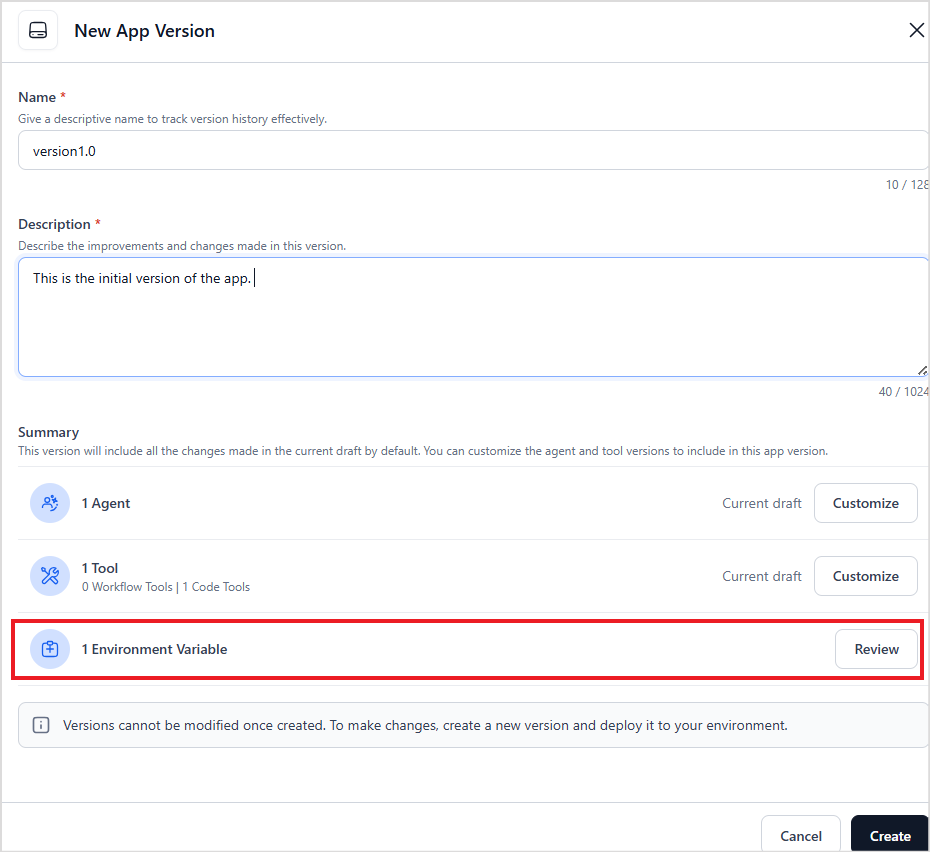
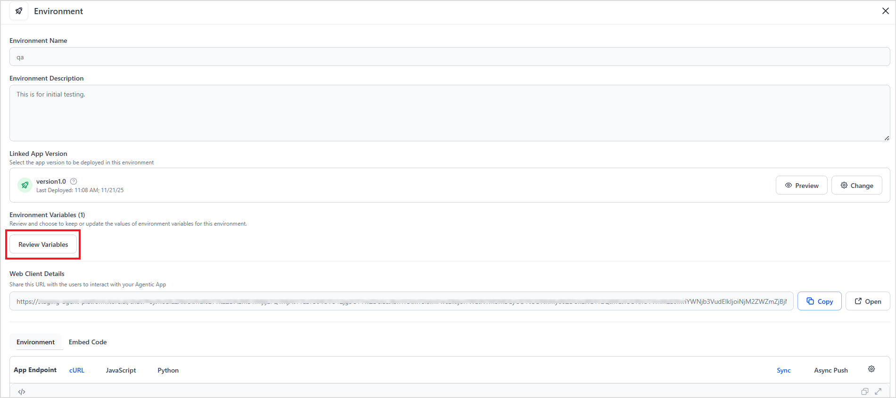

# Environment Variables

Environment variables are configuration values, such as API keys, endpoint URLs, tokens, or reusable text, that applications can reference dynamically at runtime. Instead of embedding these values directly in code or logic, environment variables allow you to define them once and securely reuse them across different parts of the application. They help store data that varies across deployments.

Key Benefits

* Centralize and reuse values across the app instead of hard-coding them.
* Secure sensitive data by storing values in an encrypted form.
* Customize values for each environment during deployment.

*Environment variables are accessible to both code tools and workflow tools.*

## View Environment Variables

Environment variables are accessible and scoped to an app. Go to the Variables page under Settings to view the available variables for an app. 


## Create an Environment Variable

* Go to Settings > Variables.
* Click +New Variable.
* Enter the details of the variable.
    * Variable Name: Enter a unique identifier for the variable.
    * Description: Add a short explanation of what the variable is used for.
    * Default Value: Provide a default value for the variable. This value is used unless overridden during deployment.
    * Encryption: Enable or disable encryption. When enabled, the variable is encrypted and is hidden in the UI.
    * Namespace: A logical unit or collection for grouping variables. They can be used to define the context in which specific variables are defined and can be accessed. Select an existing namespace or create a new one to group related variables.
* Click Create to save the variable.


## Edit an Existing Variable

1. In the Variables list, open the options menu for the variable you want to modify.
2. Select Edit.
3. Update the name, description, default value, encryption setting, or namespace as needed.
4. Click Save to apply the changes.

Any updates to this variable automatically propagate across modules that reference it.


## Delete an Existing Variable

Deleting a variable removes it from the app permanently, and references to the variable won't be resolved. Note that if a variable is associated with a namespace, it cannot be deleted unless the namespace is deleted.

1. Open the options menu of the variable to be deleted.
2. Click Delete.
3. Confirm the deletion. 

## Namespaces

A *namespace* is a logical grouping used to organize environment variables. Namespaces help keep variables cleanly separated, prevent naming collisions, and allow different modules to use variables with the same name independently.


### Key Benefits

* Organization: Group-related variables such as those used for authentication, deployment configuration, or third-party integrations.
* Conflict Prevention: Avoid clashes when multiple modules need variables with identical names (for example, `API_KEY`, `BOT_ID`).
* Scoped Access: By grouping variables within a namespace, only those relevant to a specific task or tool are accessible.

Use the Manage Namespaces option on the Variables page or when creating/editing a variable to view, create, or update namespaces.


### Create and Manage a Namespace

1. Click on Manage Namespaces and select +Create Namespace.
2. Provide the following details for the namespace and click Create. 
    1. Name - Unique identifier for the namespace. 
    2. Description - A brief description of the purpose of the namespace. 

To update or delete the namespace, go to *Options* and select the appropriate action. Click the Preview option to view the environment variables associated with the namespace, along with the modules mapped to it.  

!!!note
    
    A namespace cannot be deleted if it is currently associated with a tool. Additionally, all variables within the namespace must be removed before the namespace can be deleted.


## Accessing Environment Variables 

* Environment Variables are accessible to both *Code Tools* and *Workflow Tools*.  
* To access variables in a tool, the variables must be associated with a namespace. 

To use the variable in a tool, follow these steps.

1. Go to the specific tool. Click the options, then select *Manage Namespaces*. 
2. Associate the namespace to which the variable belongs and click *Save*. This makes all the variables within the namespace accessible to the tool. 

3. Within the script, use the following format to access the variable. 

    ```
     env.<variable-name>
    ```
    Note that env is a reserved keyword. 

4. To use the variable in other fields, use the following format. 

    ```
    {{env.<variable-name>}}
    ```


## Lifecycle of an Environment variable

Environment variables are defined at the app level and can take different values depending on the environment where the app is deployed. The following section describes how environment variables are created, managed, and updated throughout the application lifecycle.

1. When an environment variable is created within an app:
    * A default value can be assigned at creation time.
    * This default value is automatically applied when new versions and environments are created.

        For instance, if a tool requires an authorization key that differs for each deployment, create an environment variable such as *authKey* and reference it within the tool. Assign a default value when creating the variable.

2. When a new version of the app is created:
    * All existing environment variables defined for the app are carried forward.
    * You can *review* the list of variables and their default values before proceeding.

3. When creating a deployment environment from an app version, 
    * The environment initially uses the default values of all variables.
    * To override these defaults, click Review Variables. 
    * Enter new values for the variables as needed and save the changes. This allows each environment to maintain its own configuration without modifying the app logic. 

4. When deploying an updated app version in an existing environment, there are two options for variable values. 
    * Use the default values of the variables.
    * Choose to apply new or custom values for the variables during deployment. 


## API Support for Updating Values of the Variables

The Platform provides APIs to update environment variable values dynamically at runtime. Contact Support Team to get access to the API.
