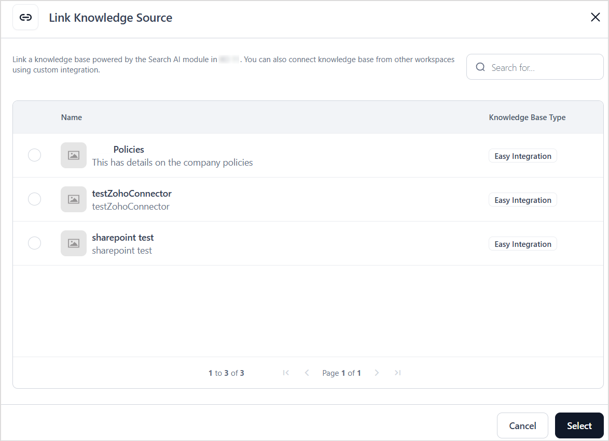
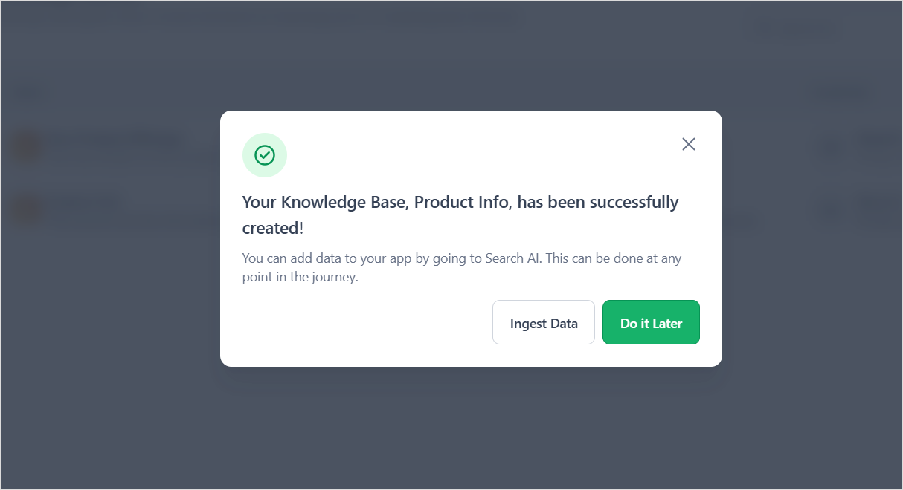
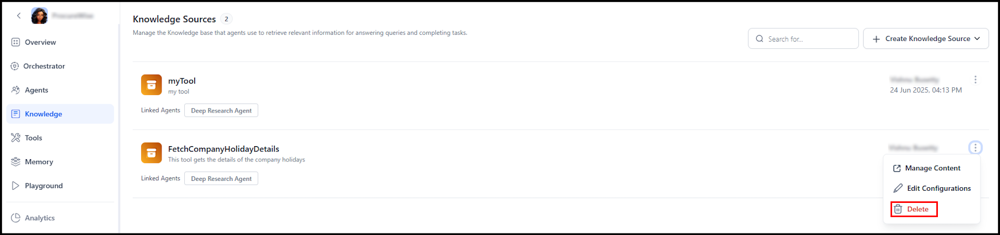

# Managing Knowledge Tools

A Knowledge Tool connects your Agentic application to a **Search AI application(AI for Service)** within the **same workspace.** This integration enables the agent to retrieve accurate, context-aware responses by leveraging indexed content.

To manage these tools, go to the *Knowledge* page of your Agentic App. This page offers a structured view of all knowledge bases connected to the app, providing clear visibility into their total count, associated agents, and easy access from one central location.


## Create a Knowledge Tool

You can either create a new Search AI application from the Agentic application or link an existing Search AI application.

To add a new knowledge tool to the application, select one of the following options from the **Create Knowledge Base** drop-down at the top of the page.

* **Create from existing sources** - Associate the Agentic application with an existing Search AI application. If the associated application has indexed content , it becomes readily accessible for use in the Agentic app.
* **Create from scratch** - This allows you to create a new Search AI application from scratch. This involves creating a new Search AI application, setting up indexing configurations, and adding content sources to the application for ingestion. Learn More.

### Create from existing sources

This is used when linking the Agentic application to an existing Search AI app.

**Prerequisites**

* An existing Search AI application must be available in the same workspace.

**Steps**

* Provide the configuration details of the Knowledge Tool.

  * **Knowledge Base Name** - Unique name used to identify the knowledge tool in the Agentic application. 
  * **Description** - A brief summary of the type of content included. This helps the agents understand when to use this knowledge base to retrieve information.
  * **Knowledge Sources** - Click *Link Knowledge Source* to view all the Search AI applications in the same workspace as that of the Agentic App which are accessible. 

* Select the appropriate application and click Select. After selecting the application, set the following retrieval configurations.
  * **Use Knowledge Base to respond with** - This field indicates the type of content to be fetched from the Search AI application.
    * **Chunks** - Returns only the top chunks relevant to the user query.
    * **Answer** - Returns the answer generated by Search AI in response to the user query.
    * If you select both chunks and answer, the response from Search AI contains the generated answer as well as the set of relevant chunks used for generating the answer.
  * **Meta Filters (Optional)** - This field is used to configure how information is retrieved from the knowledge base. Use this field to set additional filters on the content in Search AI. For instance, to use only the content in webpages ingested in Search AI, set filter as shown below.

    ```json
    [
            {
            "condition": "AND",
            "rules": [
                {
                "fieldName": "sourceType",
                "fieldValue": [
                    "web"
                ],
                "operator": "contains"
                }]
            }]

    ```

* Click Create to complete the integration. 

You can update content or modify configurations at any time by navigating to the associated Search AI application.

### Create from Scratch

On the **Knowledge** page, select Create from Scratch from the dropdown menu and enter the following details. [Knowledge](images/create-scratch.png "Knowledge")

* **Knowledge Base Name** - Unique name used to identify the knowledge tool in the Agentic application.
* **Description** - A brief summary of the type of content included. This helps the agents understand when to use this knowledge base to retrieve information.

Click **Create**. This action creates a new Search AI application within the same workspace, using the **Knowledge Base Name** as the application name.

**Next Steps** : Navigate to Search AI and take the following actions.

* [Set extraction strategies.](https://docs.kore.ai/xo/searchai/content-extraction/etl/) 
* [Ingest Content.](https://docs.kore.ai/xo/searchai/content-sources/introduction/)
* [Set Retrieval Strategies.](https://docs.kore.ai/xo/searchai/retrieval/)
* [Configure answer generation.](https://docs.kore.ai/xo/searchai/answer-generation/)

[Learn More.](https://docs.kore.ai/xo/searchai/about-search-ai/)

## Test the Knowledge Base

Before finalizing the tool, you can test its functionality directly within the Agentic App to ensure it works as expected. Click **Test your knowledge base**, and provide the required input parameters. View the generated sample response to verify the correct execution of the tool.

The response includes both the script output and detailed logs. These logs provide visibility into the underlying SearchAI operations and can be used to troubleshoot errors, analyze performance, and refine query behavior. Users can update the configurations on the left-hand side, selecting chunks, answers, or both, and the responses are generated accordingly based on these choices.


## Delete the Knowledge Base

To remove the knowledge tool from the Agentic app, go to the Knowledge page and delete the knowledge tool. This removes the integration from the given Agentic app. The integration can still be found on the Search AI page and can be associated with any Agentic app.



## Manage Content in Search AI

To update the content in the search AI application or edit any configurations, use the **Manage Content** option to navigate to the corresponding Search AI app. [Learn More](https://docs.kore.ai/xo/searchai/content-sources/introduction/).
