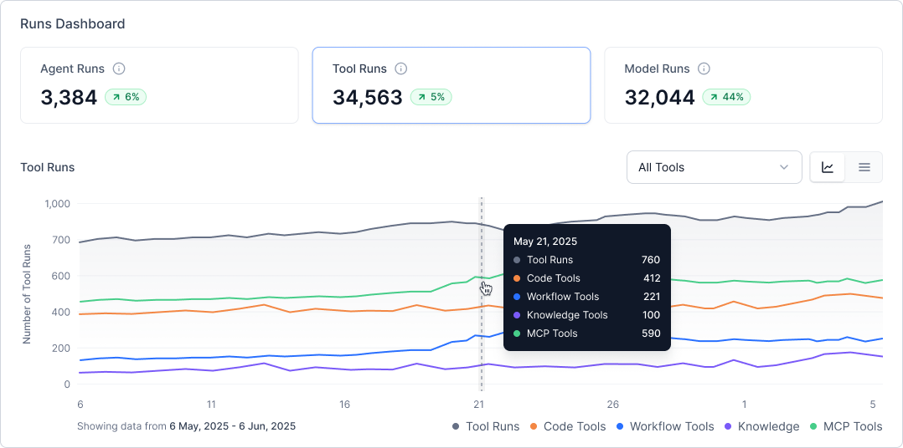

# App Usage Analytics Dashboard

The Analytics Dashboard provides real-time insights into app usage with comprehensive visibility into user engagement, performance metrics, and resource utilization for agents, tools, and models.

The dashboard organizes analytics into two primary categories:

* **Session-level insights**: User activity and engagement metrics.
* **Run-level insights**: Execution performance and resource consumption.

## Key Features

* Real-time data updates.
* Customizable timeframe and environment filters.
* Trend analysis with historical comparisons.
* Interactive visualizations with detailed drill-down capabilities.
* The default view displays the current draft environment.

## Navigation and Controls

Customize the analytics view by using the dashboard's filtering options and interactive controls.

* **Time Frame Selection**: Choose from pre-defined ranges or set custom dates to analyze specific periods.
* **Environment Filter**: Select specific environments for targeted analysis (defaults to current draft).
* **Environment Filter Label**: Displays a visible label for the Environment filter to improve discoverability.
* **View Modes**: Toggle between interactive charts for trend analysis and detailed tables for granular inspection.
* **Drill-down Navigation**: Click any metric card or data point to access expanded insights and detailed breakdowns.
* **Export Options**: Download data for offline analysis and custom reporting.

## Key Metrics and Components

### Session Metrics

The dashboard's top section, displays four key performance indicators, each featuring:

* Current value with real-time updates
* Percentage change from the previous period
* Visual trend indicators
* Interactive time-series charts

#### Users

Tracks unique active users within the selected timeframe, displaying:

* Total user count
* Period-over-period comparison
* Daily or hourly activity breakdown

#### Sessions

Monitors total session volume, including:

* Session count and trends
* Historical performance comparison
* Time-based distribution chart

#### Messages

Measures communication volume between users and the system:

* Total input and output message counts
* Comparative trend analysis
* Hourly and daily volume breakdowns

#### Tokens

Tracks token consumption across Agent and Supervisor components:

* Total tokens consumed
* Usage comparison with previous periods
* Time-based consumption patterns

### Run Analytics

The Runs section provides detailed execution metrics across three component categories, available in both chart and tabular formats.

#### Agent Runs

Monitors agent execution performance with:

* Total execution count and trends
* Performance metrics over time
* Detailed agent-level data: Agent name, Number of runs, Average response time, and Token consumption

#### Tool Runs

Analyzes tool utilization across all agents:

* Execution counts with trend indicators
* Breakdown by tool type: Workflow, Code, MCP (Model Context Protocol), and Knowledge
* Tool-specific metrics: Tool name, Run frequency, Average response time, and Tool category

#### Model Runs

Tracks model API calls from Agents and Supervisors:

* Total model invocations
* Performance trends over time
* Model-level details: Model name, Execution count, Average response time, and Token usage

