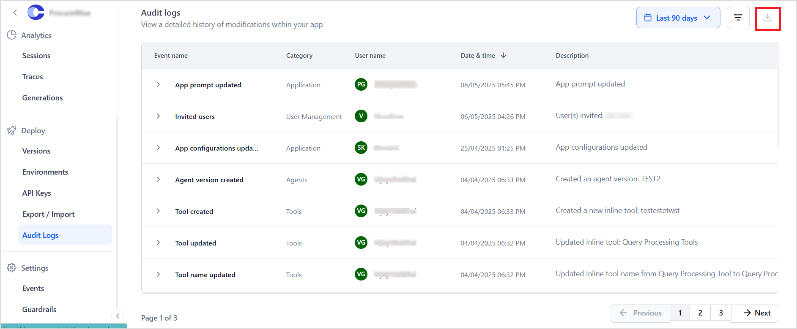

# Track User Activity with Audit Logs

Audit logs provide a comprehensive record of all changes made across the account by different users. These logs are essential for tracking user activity, ensuring compliance, and pinpointing any unauthorized modifications, which enhances the overall security and accountability within the system.

Each log entry includes the following to provide actionable insights on account and tool-level activities:

* Event name and category.
* The user who performed the action.
* Date and time of the event.
* Detailed description of the action.

To export the audit logs, follow the steps below:

* Go to the Audit Logs page and click the Export icon next to the Filter By icon. The logs for the given timeframe are downloaded in a csv file.

