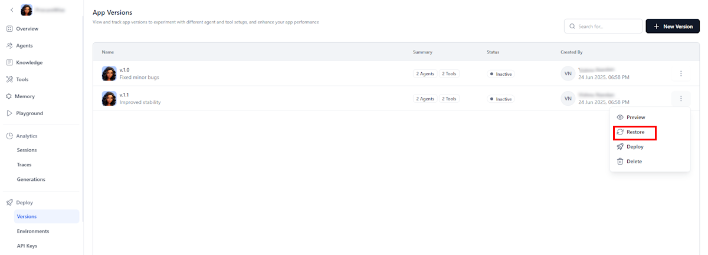
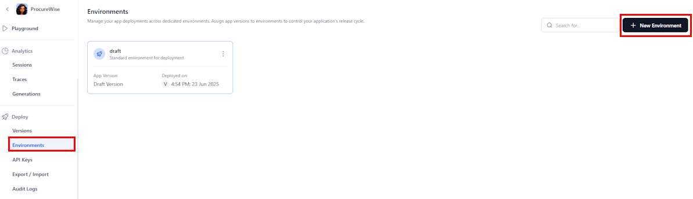

# App Deployment

App deployment is the process of moving an application version from development to live environments in a controlled and repeatable manner. It ensures that tested and stable versions of the app are accessible to users in the appropriate environments, such as development, staging, or production.

**Deployment Lifecycle**

Versioning, environments, and the deployment process are critical to managing application releases. This process typically involves the following steps:

1. **Creating an Application Version** - Building and packaging the application code into a deployable version. Versioning is the practice of assigning unique names or numbers to each iteration of an application.
1. **Creating an Environment** - Environments help isolate configurations, ensuring that updates and tests don't impact end users while maintaining separate app configurations across the various stages of development.
1. **Deploying App to an Environment** - Releasing a selected version to a chosen environment. 
1. **Accessing the deployed app** via a unique URL or API for integration or user interaction.

   

!!! note
 
    Only authorized users can access version control and environment management features. Refer to [this](../settings/sharing-permissions.md) for more information on access permissions and the roles required to make these changes.

## App Versioning

The app versioning system ensures version consistency, stable releases, and streamlined deployment across environments, managing the entire app lifecycle, including associated AI agents and tools. By default, an app is in draft version.

### Key Benefits

**Enhanced Stability and Consistency**

* Immutable Releases: Once deployed, versions remain unchanged, guaranteeing stability and preventing inconsistencies.
* Controlled Deployments: Implement updates and new features smoothly without disrupting services through well-defined procedures.
* Dependency Protection: Tools linked to active versions can't be deleted, safeguarding the integrity of existing deployments.
* Environment Isolation: Deploy different application versions to separate environments for varied testing and production needs.

**Streamlined Management and Tracking**

* Coordinated Agent Management: Maintain system stability by synchronizing multiple AI agents.
* Version Alignment: Easily track which agent versions are associated with specific application versions.
* Selective Versioning: Use the precise versions of agents and tools required for each application.

**Improved Development and Deployment Processes**

* Draft Testing: Test versions in a draft environment before finalizing them for optimal performance.
* Rollback Support: Revert to previous versions in a draft state if necessary, while retaining the complete version history.
* Pre-Deployment Validation: Automatically verify agents, tools, and configurations before creating a new version.

**Security and Control**

Role-Based Access: Limit version control actions to authorized personnel, enhancing security and governance.

### Create an App Version

To create a new app version, follow the steps listed below.

1. Go to the Versions page and click + New Version.
  
2. Enter the Name and Description for the application version. Select appropriate versions of the agents and the tools to be included in the app. Click Create.
  
3. Once the version is created, preview the version to review its configuration and functionality and then Deploy the version.  
  

### Deploy the App Version

If you already have an environment, you can deploy the application. 
Select the app version and environment from the dropdown, then click **Proceed**. 

### Restore to a Version

Restoring a version reverts the current draft to a previously saved state. This action **overwrites the entire draft**, including all configurations, tools, and agent settings, with those from the selected version. If the restored version contains MCP server configurations, they're also automatically applied to the draft, ensuring consistency with the selected version.

Use this feature to revert to a known working state after experimentation, undo recent changes that introduced errors, or to compare previous configurations by restoring and reviewing.

!!! note
 
    Restoring a version replaces the current draft and cannot be undone. To preserve your current work, consider saving it as a new version before restoring another.

### Delete a Version

Delete an app version to remove it permanently. Before deletion, it performs dependency checks to ensure no linked agents or tools are removed.  
   

## Environment Configuration and Management

The Environments feature enables users to configure separate deployment environments for different needs. The Platform supports multiple environments. Each environment has its own isolated configuration, allowing you to configure it without affecting the app logic.

By default, a draft environment exists for deployment and testing. 

### Key Benefits

* **Integrated Draft Development:** The default "draft" environment is typically used for initial development and testing.

* **Targeted Version Control:** Deploy specific app versions to designated environments

* **Dedicated Endpoints:** Each environment provides a unique URL for testing or integration.

* **Deployment History:** View detailed logs of all deployments across environments.

### Create an Environment

1. Go to the **Environments** page.

2. Click **+ New Environment**.  
   

3. Enter the **Name**, **Description**, and select the **App Version**.

4. Click the **Preview** icon to review version details.

5. Click **Create**.  
   

Once created, the Environments page is displayed, listing the draft and the created environments.

**Manage an Environment**

Click the environment to see its details and manage it:

* **Linked App Version:** To switch app versions, click **Change**, select the desired version from the list, and then click **Deploy**.
* **Web Client Details:** View the URL generated by the Platform to start interacting with the app.
* **cURL script:** Use the curl script to interact with the app through the code. Construct your API requests in accordance with the given specifications.
* **Delete Environment:** This function handles the removal of an environment with user confirmation, ensuring associated configurations are cleaned up, endpoints are deactivated, and resources are released. Audit logs and usage statistics are preserved for future reference.  

   
