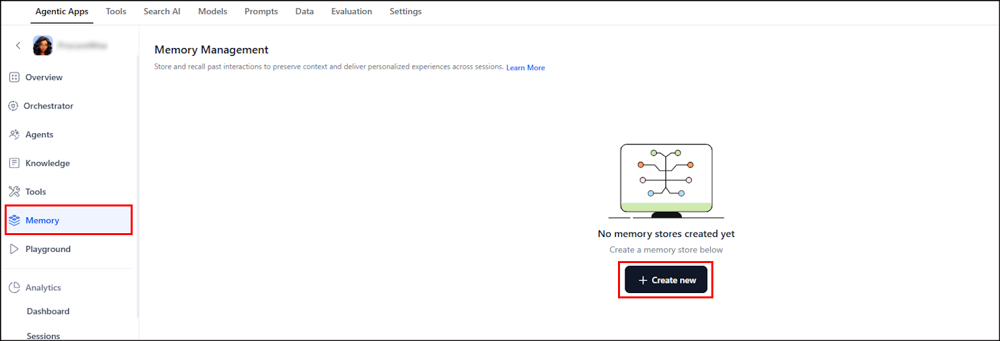
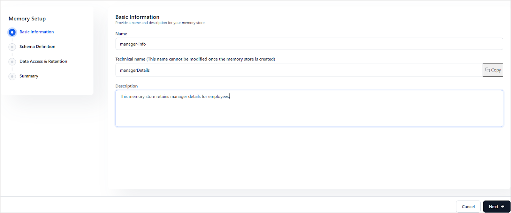

# Memory Stores in Agentic Apps

Memory stores in Agentic Apps enable agents to retain, access, and manipulate information during a session or across multiple sessions or interactions. They're essential for building intelligent, personalized, and context-aware experiences by maintaining data during agent workflow executions.

Agentic Apps support two main types of memory:

* **Session Meta Memory**: Default temporary memory for contextual data within a session. This is a default read-only system memory and can't be directly updated by users. 
* **Custom Memory Stores**: Persistent, user-defined stores that can be read and written to using code tools. The lifetime of the memory store varies as per the access type assigned to the store during creation. 

## Creating Memory Stores

To create a new memory store, go to the Memory page in the app and click on **Create new**.  





To set up Memory store, provide the following details. 

**Basic Information**

**Name**: Provide a user-friendly name for the store. Once a store is created, this name can be updated but it does't change the technical name of the store. 

**Technical Name**: Provide a unique name for the store. This name **can't be modified** once the memory store is created. Note that this name should't have any special characters or spaces. This is the name that's used within prompts and code tools to refer to the memory store. 

**Description**: Provide a brief summary describing the intended usage or purpose of this memory store.



**Schema Definition**

Define the structure of the data to be stored in the memory store. The schema provides a clear and consistent way to describe the expected format of data, ensuring that only valid and properly structured information is written to memory. The schema is defined using the[ JSON Schema specification](https://json-schema.org/). Refer to the official documentation for more details. Some of the important top-level keywords include:

* type: data type of the field - object, array, string, number, boolean, or null.
* description: brief description of the field.
* properties: used to declare the subfields of a field of object type. 
* required: array of mandatory fields.

Example: Defining an object

The schema must have the following:

* Type: object
* Use properties to declare keys of the object. For each key, specify the type and description. For instance, to define a memory store, *employee_details*, that stores the employee details like first name, last name, and language, use a schema as shown below. 
  
```
{
  "type": "object", //type of object
  "properties": {  //keys of the object 
    "emp_ID": {          
    "type": "number"
    },
    "firstName": {
      "type": "string"
    },
    "lastName": {
      "type": "string"
    },
    "preflanguage": {
      "type": "string"
    }
  }
  "required": [ "emp_ID", "firstname"] //mandatory fields of an object
}
```

**Require strict adherence**: Check this option to enforce that the updates to memory exactly match the schema defined for the memory store. If there is any mismatch, the updates fail. 

**Data Access and Retention**

This section is used to control data access and retention. 

**Access Type**: This field specifies the visibility and scope of the data in the memory store. It can take one of the following values:

* **User-specific**: Data is scoped to individual users. This data is available across the sessions and is specific to the user.
* **Application-wide**: Data is scoped to the app level. This data is available to all users throughout the application, irrespective of the sessions. 
* **Session-level**: Data is only available within the same session. 

**Retention Policy**: This field specifies how long the data is retained, irrespective of the access type value. This can be set to **session-level,** in which case it's retained only for the duration of a session. Alternatively, you can specify the time( 1 day, 1 week, or 1 month) for which the data must be retained before automatically removing it from the memory store. 

!!!note
    Set appropriate retention periods based on specific usage of the data to balance performance, cost, and compliance.


<table>
  <tr>
   <td><strong>Access Type</strong>
   </td>
   <td><strong>Scope</strong>
   </td>
   <td><strong>Identifiers</strong>
   </td>
   <td><strong>Use Case Example</strong>
   </td>
  </tr>
  <tr>
   <td><strong>User-specific</strong>
   </td>
   <td>Data tied to individual users
   </td>
   <td>AppId and UserId
   </td>
   <td>Store employee language preference for each user
   </td>
  </tr>
  <tr>
   <td><strong>Application-wide</strong>
   </td>
   <td>Shared across the application
   </td>
   <td>AppId
   </td>
   <td>Store announcement message to be displayed to all employees upon login.
   </td>
  </tr>
  <tr>
   <td><strong>Session-level</strong>
   </td>
   <td>Valid only during the active session
   </td>
   <td>AppId and SessionId
   </td>
   <td>Store intermediate steps in a multi-turn dialog
   </td>
  </tr>
</table>


Review and Save the configuration to create the memory store. 


## Accessing Memory Stores from Prompts

To access the content in the memory stores from the prompts, use the following format:

```{{memory.<store-name>.<field-name>}}```

Where, store-name: technical name of the store 
Field-name: name of the field as defined in the schema of the memory store. 


## Accessing Memory Stores from Code Tools

Agentic Apps provide Memory Stores to persist data across interactions. These stores can be *read from within prompts, workflow tools, and code tools*, but can be *updated or deleted via code tools or workflow tools*.

* A Memory store can be *referenced in tools using its technical name only.*
* *sessionMeta* can't be manipulated via code tools. 

### Supported Languages

Memory operations can be performed using JavaScript or Python in code tools.


* In JavaScript, memory methods are *async* and return a *Promise*. Use them with *await* keyword. 
* In Python, methods are *synchronous* and return values directly. 


### Reading from Memory Store

Use the following format to access a memory store in the code tools and retrieve either the complete record or specific fields using **projections**. 

```
memory.get_content(<store_name>,<projections>)
```

**Parameters:**

* store_name(string): The technical name of the memory store.
* projections(optional): JSON object specifying the fields to retrieve. If omitted, the entire record is returned.

**Javascript Examples**:

  1. To fetch the complete employee record from the store defined above, use the following 
    ```
    await memory.get_content("employee_details")
    ```
    
  2. To fetch the first name of the employee from the store, use:
    ```
    await memory.get_content("employee",{"firstname":1})
    ```
  Here, `{"firstname": 1}` is a **projection object**, indicating that only the `firstname` field should be included in the result.

  3. To fetch both first name and location (subset of the complete record), use:
    ```
    await memory.get_content("employee", {"name": 1, "location": 1})
    ```

### Writing to Memory Store

Use the following format to create or update a record in the memory store. This method:

* Creates a new record if none exists.
* Updates the existing record if one is found (based on sessionID, userId, or applicationId, depending on the store’s access type).
  ```json
  memory.set_content(<store_name>,<data_object>)
  ```

**Parameters:**

* store_name(string): the technical name of the store. 
* data_object:  A JSON object representing the fields to write or update in the memory store.

!!!note

    * Records are stored based on the memory store’s access context: **session**, **user**, or **application**.
    * Fields not included in the update are retained as-is.

**Javascript Examples**

  1. To update the name in a record. Based on the access type of the memory store, if the corresponding record doesn't already exist, the following method will create a new record and set the firstname as John. 
        ``` 
        await memory.set_content("employee",{"firstname":"John"})
        ```
        If, however, a record exists but the firstname is different, this method will overwrite the first name in the same record.

  2. To update multiple fields, specify the fields to be updated in the data_object. 
          ```
          await memory.set_content("employee", {
            "firstname": "John",
            "preflanguage": "English"
          })
          ```

### Deleting Content from Memory Store

To delete a record from the memory store, use the following format. Depending on the access type of the store, the following method will delete the record corresponding to the session, user, or application. 

```
memory.delete_content(<store_name>)
```

**Parameters**

* store_name: the technical name of the memory store from which content is to be deleted.

**Javascript Example**

To delete the employee details from the store. 


```
await memory.delete_content("employee")
```

## Accessing Memory Stores from Workflow Tools

Agent Memory can be read, updated, or deleted using the **Function Node** within Workflow Tools. The Function Node supports custom scripts in JavaScript or Python to support dynamic workflows and advanced use cases programmatically.

When working with memory stores, use the technical name of the memory store to ensure proper identification.

For detailed instructions on how to access memory from workflow tools and examples, refer to [this](../tools/tool-flows/types-of-nodes/function-node.md). 

## Session Meta Memory

The `sessionMeta`memory store is the **default memory store** used in Agentic Apps for handling metadata and session-specific information. It's typically used to:


* Store **temporary session data.**
* Maintain **contextual metadata**

**Schema**

This memory store follows the following schema:


```
{
  "type": "object",
  "properties": {
    "metadata": {
      "type": "object"
    },
    "sessionInfo": {
      "type": "object"
    }
  }
}
```


The **metadata** field is used to maintain any contextual metadata information. ***Developers can update this field only via the APIs or while accessing the platform through AI for Service or AI for Work.***

The **sessionInfo** is a system-populated object that contains metadata about the current session. It includes the following fields:

* sessionId - Unique identifier for the session.
* appId - Identifier of the application where the session is running.
* sessionReference - Reference string for tracking the session.
* userReference - Reference string associated with the user in the session.
* userId - Unique identifier for the user.
* runId - Identifier for the specific execution run within the session.
* timestamp - The date and time when the session information was recorded.

**Scope and Identification**

The scope of this memory store is limited to a **session**. The content in this memory store is identified using **appId** and **sessionId**. 

**Accessing sessionMeta**

To access the sessionMeta from agent and orchestrator prompts, use the following format:


```
{{memory.sessionMeta.<field-name>}}
```


For example, you can add the user name to the prompt as follows if the metadata has the name of the employee. 

The name of the employee is {{memory.sessionMeta.metadata.empName}}

Note: This is a read-only memory store and can't be updated via tools. However, you can update the metadata field in sessionMeta via APIs. Refer to [this to learn more](../../apis/agentic-apps/execute.md).
