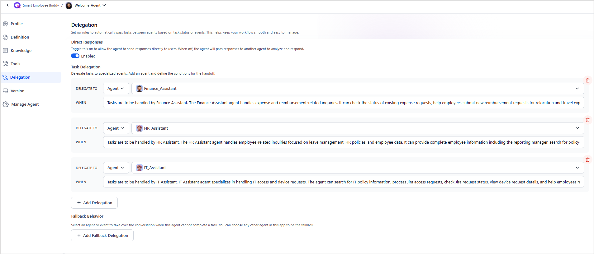

# Create a New Agent from Scratch

To add a new agent to an app, go to the Agents page or the Overview page of the app and click +New Agent or +Create Agent.  Select Create from Scratch.

Provide appropriate details for each field as described below.

## Agent Profile

Agent profile consists of the following fields:

**Name**: Choose a unique name that reflects your agent's core function and persona. It's good to have a name that's intuitive and indicative of its role. 

!!!abstract "Examples"

    * Credit Card Assistant for an agent that handles all queries related to credit cards.
    * Leave Manager for an agent that manages all requests related to employee leaves in an organization.
    * Order Manager for an agent that manages all the user requests related to order status, returns, and refunds. 

---
**Description**: Specify your AI agent's primary objectives and key responsibilities. The description should clearly define the agent's role in the application and differentiate it from other agents. The application orchestrator uses this description to select the most suitable agent for a specific task.

!!!abstract "Examples"

    * Credit Card Assistant: An agent that handles all queries related to credit cards.
    * Leave Manager: An agent that manages all requests related to employee leaves in an organization.
    * Order Manager: Manages all the user requests related to order status, returns, and refunds. 

---

**Avatar**: Select an avatar for the agent. This image represents the agent in the user interface and is primarily used for visual identification. Choose from the available list of logos, avatars, and icons.
---

**AI Model**: Select the AI model and connection that the agent will use to perform its tasks. The model helps an Agent in the following:

* Understanding and Processing User Input into structured data
* Selecting the most appropriate action for the task
* Tool calling 
* Transforming results from agents into natural and contextual responses for the users.

For more information, see [Managing External Models](../models/external-models/managing-external-models.md){:target="_blank"}.

!!!tip
    When choosing a model for your agent, consider its specific use case. For example, if the agent is designed for code generation, opt for a model that specializes in coding skills.

Click the *settings* icon to change the Model Generation Parameters.

---

**Context Window Limit**: Specifies the maximum number of messages the agent retains in its conversation context. When the limit is reached, older messages are automatically removed to maintain an optimal context size. The default value of this field is 50. It can a maximum value of 200 and a minimum of 25.

---

## Agent Definition

The agent definition describes the role of the agent and the tasks it can perform. It serves as a guideline for setting objectives and defining functionalities. Clearly establishing what the agent can do and how it should operate ensures that its goals are effectively aligned. 
An agent operates based on a set of directives or rules that dictate how it should behave, respond to inputs, and complete tasks effectively, all in line with the application's overall goals. These instructions also help define the agent's boundaries and provide specifications for how it should interact with users. They serve as a guide to ensure the agent operates within its scope, delivering accurate and consistent results.

!!!abstract "Examples"

    * Leave Manager: You are an AI-powered Leave Management Assistant designed to streamline the leave application process and provide employees with up-to-date leave balances. 
        * Your key responsibilities include:
            * Facilitating Leave Applications: Guide employees through the process of applying for leave, ensuring the correct leave type and duration are selected.
            * Providing Leave Balances: Offer accurate and real-time updates on remaining leave entitlements.
            * Cancelling Leave requests: Help users cancel their leave requests.
        * Behavioral Guidelines: Understanding user inputs
            * When a user asks for their leave balance, respond with the available balance without requiring the leave type unless necessary.
    * Credit Card Assistant: You are an AI-powered Credit card assistant that assists users with credit card-related inquiries and transactions efficiently and accurately. 
        * Your responsibilities include:
            * Credit Card Approval Status: Provide updates on the status of credit card applications.
            * Outstanding Balance Inquiry: Provide details on the outstanding bills and information on recent transactions.
            * Bill Payments: Facilitate secure payment of outstanding credit card bills.
        * Behavioral Guidelines: Setting the tone of the conversation.
            * Respond in a professional and empathetic tone when handling refund-related queries.
    * Order Manager: You are an AI agent responsible for enabling users to access real-time order updates and manage their orders independently. 
        * Key responsibilities are:
            * Order Status Inquiry: Provide updates on the order status.
            * Return Management: Verify the eligibility of return, guide users on the return process, initiate returns, and provide information on return policies.
            * Refund Enquiry: Provide the status of the refund and address refund-related queries.
        * Output Guidelines: 
            * Always get a confirmation from the user before performing any transactions. 

### Agent Definition Editor

The Agent Definition editor provides a structured workspace to define an agent’s role, responsibilities, and response guidelines. In addition to rich text formatting, the editor supports dynamic insertion of variables, tools, memory, and other agents, enabling precise control over agent behavior. 

For example, you can reference a memory field such as `{{memory.sessionMeta.metadata.FLAG}}` to conditionally guide execution based on runtime context.

The editor also offers AI-assisted authoring to help generate, refine, and organize agent definitions. Using AI guidance, you can quickly create clear, well-structured instructions, improve consistency, and ensure agent behavior remains aligned with application objectives. This helps reduce manual efforts and setup time.

## Knowledge

The platform provides powerful search functionality across diverse content sources using the *Search AI* application, which supports Retrieval-Augmented Generation (RAG)-based search across enterprise knowledge bases, document repositories, FAQs, and external systems. This advanced RAG-driven integration empowers autonomous agents to deliver accurate, context-aware, and timely responses by leveraging relevant information from connected knowledge sources.

You can link to one or more Search AI applications in the same workspace and account and access them as Knowledge Tools for the agent to answer user queries. Each Search AI app can be integrated with multiple content sources. 

[Learn more](./knowledge/overview.md){:target="_blank"} about Knowledge integration with agents. 

---
## Tools

*Tools* are foundational components that empower agents to perform purposeful actions. They serve as the functional extensions of an agent’s intelligence, enabling it to interact with third-party applications, retrieve information, perform logic-based operations, and trigger workflows across complex environments.

In an Agentic architecture, *Actions* represent the discrete tasks an agent can execute. These actions are made possible by *Tools*, which encapsulate the domain-specific logic and capabilities needed to accomplish specific objectives. Tools serve as the operational foundation of actions, providing the necessary interfaces and execution that translate an agent’s intent into meaningful outcomes.

Powered by the tool invocation capabilities of large language models (LLMs), agents can dynamically identify and invoke the most relevant tools at runtime, ensuring flexibility, scalability, and precision in task execution.

!!!abstract "Examples"

    * Tools for a Leave Managing Agent might include:	
        * Get leave balance tool that invokes an external API to get leave details.
        * Leave application tool that gathers necessary information and applies leaves in the backend system.  
    * Tools for a Credit Card Assistant might include:
        * Retrieve outstanding amount - Fetches the due amount 
        * Fetch credit limit - Fetches the maximum credit limit for the user 
        * Initiate bill payment - Initiates bill payment process
        * Find recent transactions - Present last *n* transactions that might include retrieving data from a database. 

There are *three types of tools* that agents can use.

1. **Workflow Tools**: Workflow Tools provide a visual, no-code interface for designing and orchestrating agent actions with ease. Built for clarity and control, these tools allow users to define multi-step workflows using an intuitive graphical builder, making them ideal for standardized, repeatable processes. Supporting both synchronous and asynchronous execution modes, Workflow Tools enable rapid development and reliable execution of tasks without writing code. They're best suited for scenarios where business logic is consistent, well-defined, and benefits from visual traceability.

    !!!abstract "Examples"

    * Weather API: Retrieves live weather updates.
    * Stock Market Tool: Fetches real-time stock prices.
    * Database Query Tool: Accesses structured data from a company’s database.
    
    For more information, see [Workflow Tools](https://docs.kore.ai/agent-platform/ai-agents/tools/workflow-tools/).

2. **Code Tools**: Code Tools are designed for flexibility and depth, enabling agents to execute custom code for highly tailored operations. These tools are ideal for handling complex or dynamic logic that can't be captured through pre-defined workflows. Supporting synchronous execution, Code Tools empower developers to implement advanced algorithms, perform conditional processing, and integrate with intricate systems. They're the preferred choice when precision engineering and extensibility are required to meet unique business needs. With **code tools**, you can write and execute business logic using *JavaScript or Python* code, allowing seamless integration and automation of complex workflows. \

    For more information, see [Code Tools](https://docs.kore.ai/agent-platform/ai-agents/tools/code-tools/).

3. **MCP Tools**: MCP Tools connect agents to remote functions hosted on Model Context Protocol (MCP) servers. These tools serve as reusable logic or integration blocks, such as scripts, webhooks, or service connections, which are created and maintained outside the platform. Following a client-server discovery model, agents can dynamically invoke third-party or proprietary services in real time without embedding logic directly into workflows or code. Once connected, MCP Tools can be selected, configured, versioned, and managed independently, allowing modular and scalable integration across environments. Because they're centrally managed, these tools support versioning, cross-feature reuse, and simplified development—ideal for scaling integrations across multiple agents. They're best suited for seamless integration with external APIs, proprietary platforms, or shared tool sets across teams or organizations.

    For more information, see [MCP Tools](https://docs.kore.ai/agent-platform/ai-agents/tools/mcp-tools/).

### Adding a Tool to Agent

You can enhance an agent's capabilities by creating a new tool or importing an existing one from the tool library.

* **New tools** are custom-built within the context of a specific app and aren't shared across other apps.
* **Imported tools** act as templates from the library. Once imported, they can be customized within the app to suit specific requirements without affecting the original version in the library.

To add a new tool, click *New Tool* and choose the desired tool type - *Workflow Tool*, *Code Tool* or *MCP Tool*.

For a **Workflow Tool**, enter the tool's *name* and *description*, then click *Create*. The tool will be added to your app. Next, go to the *Agent's Tools* page, select the newly created tool, and open it to define its workflow. You can now design the logic and flow for this tool. [Learn More.](tools/configure-a-tool.md)

To create a **Code tool**, click on Code Tool and configure the details of the tool. Refer [to this page](tools/create-a-code-tool.md){:target="_blank"} for details on creating a new code tool, along with an example. 

Similarly, to add a new MCP server and use MCP Tool, click on MCP Server and provide the configuration details. [Learn More about MCP Server Configuration](tools/configure-mcp-server.md){:target="_blank"}.

The Tools Assignment page provides a structured view of the available tools, showing their types, statuses, and the total number of tools in the app.

**Key highlights**

* Displays total count categorized under Workflow, Code, and MCP.
* Displays the Workflow tool status as Draft or Deployed.
* Provide empty-state CTAs: Import and New Tool for Workflow tools, New Tool for Code tools, New Tool and Connect to MCP Server for MCP tools.
* MCP tools are grouped by their parent MCP server. Each server provides a search bar to help you find tools within it.

### Import a Tool

You can easily **import an existing workflow tool** into your Agentic app to accelerate development and reuse existing tools. When a tool is imported:

* A **new instance** of the tool is created, specifically scoped to the app.
* This instance of the tool is independent of the original, and can be customized without affecting the source tool or its use in other apps.
* You can use it as-is if it already meets your needs, or modify it to align with your app’s specific use cases.

Tools can be imported via:

* **File**: Import tools that have been exported previously or shared in file formats(JSON format).
* **Library**: Use existing tools from the shared repository of reusable tools existing in the platform.
* **Marketplace**: Access a tool from a catalog of publicly shared tools.

To make changes, simply select the tool and open it to **modify the flow** as needed.

Use [this example as a reference or starting point](./../ai-agents/agent-creation-example.md){:target="_blank"} when building your own agent.

### Testing a Tool

Testing allows you to verify the behavior and output of a tool before using it in production workflows.

To test a tool:

* Navigate to the Tools page of the application.
* Select the tool you want to test to open its details view.
* Use the Test interface on the tool details page to run the tool and review its behavior and responses.

For step-by-step instructions and example, refer to [this](test-a-workflow-tool.md){:target="_blank"}.

## Delegation

Delegation is available only in Agentic applications that use the *Adaptive Network orchestration pattern*.

In this pattern, each agent includes a dedicated Delegation section where you define routing rules to enable smooth handoffs and uninterrupted workflows between agents.

Configure the delegation rules for all the agents in the app: 

1. **Direct Responses**: Toggle Direct Responses to control how the current agent interacts with users
    * Enabled: The agent can send responses directly to the user.
    * Disabled: The agent passes responses to another agent for analysis and reply.
2. **Task Delegation**: Configure rules for handing off tasks to specialized agents
    * Click *Add Delegation*. 
    * From the *Delegate To* list, select the agent you want to route tasks to.
    * Define the condition under which the handoff should occur. 
    
Add all the delegation rules in this section that the given agent can use for routing. 
    
**Example**:  The following agent can delegate tasks to three specialized agents—Finance Assistant, HR Assistant, and IT Assistant, depending on the nature of the task. Routing occurs dynamically based on request intent, context, or configured conditions.

<!-----

Conversion time: 1.146 seconds.

Using this Markdown file:

1. Paste this output into your source file.
2. See the notes and action items below regarding this conversion run.
3. Check the rendered output (headings, lists, code blocks, tables) for proper
   formatting and use a linkchecker before you publish this page.

Conversion notes:

* Docs™ to Markdown version 2.0β2
* Mon Feb 09 2026 23:10:37 GMT-0800 (Pacific Standard Time)
* Source doc: Create an Agent From Scratch
* This is a partial selection. Check to make sure intra-doc links work.
----->

### Event-based Delegation: 

If a delegation rule is triggered by an *event*, subsequent handling follows the configuration of that event. For example, if an agent handoff event is configured to escalate to a human agent via AI for Service, the delegation triggers the agent handoff process.

### Passing Information Between Agents

When the control passes from one agent to another in Adaptive Network delegation, the application saves the data, including the context info, summary, and pending tasks, to the `sessionMeta` memory under the `delegationContext` field. The next agent can use this field to get the required information.

Additionally, agents can use *custom memory stores* to save information as needed. This ensures that task-specific data is easily shared during handoffs.
