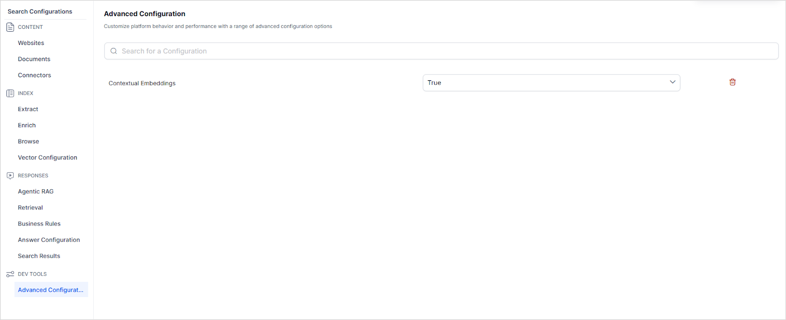

# Contextual Embeddings

In Search AI, after ingestion, the documents are broken into smaller chunks to enable efficient semantic retrieval. However, this process often strips the chunks of their broader context, potentially leading to a **chunk isolation problem**, where the meaning of a chunk is ambiguous or incomplete when analyzed independently. As a result, search results and answers may be less relevant or misaligned with the user’s intent.

The Contextual Embedding System addresses this challenge by adding additional contextual data at the beginning of each chunk, ensuring that context is preserved and answer generation performance is significantly improved.

## Benefits

* More relevant search results through context-aware embeddings.
* Better understanding of content relationships within documents.
* Improved semantic matching between search queries and retrieved chunks.

## Prerequisites

* LLM Integration with either Open AI or Azure Open AI

## Implementation 

With the help of LLM, contextual information is generated for each page in the ingested document. This summary is added to the beginning of each chunk generated from the contents on the given page. 

To view the contextual content added to the chunks, go to the chunk viewer and see the details of a chunk. Additional information is added as a prefix to the chunk. 

## Enabling Contextual Information in Chunks

Go to *Advanced Configuration* and set *Contextual Embeddings* to True. 

!!!note 
    * If documents are ingested after enabling contextual embeddings, contextual information is automatically added to the generated chunks during the ingestion process. 
    * If content was already ingested before enabling contextual embeddings, you must retrain the application to update the existing chunks with contextual information.

## Limitations

* Supported LLMs: Only supports OpenAI and Azure OpenAI.
* Recommended Models: Use models with larger context windows (example, gpt-4o) to ensure all generated chunks benefit from the contextual enhancements. Avoid smaller context models like GPT-3.5.
* Connector Support: Supported for documents ingested via connectors in the following formats: PDF, HTML, and Markdown.
* Unsupported Connectors: This feature doesn't apply to connectors that fetch structured dat,a such as:
    * JSON Connector
    * Jira Connector