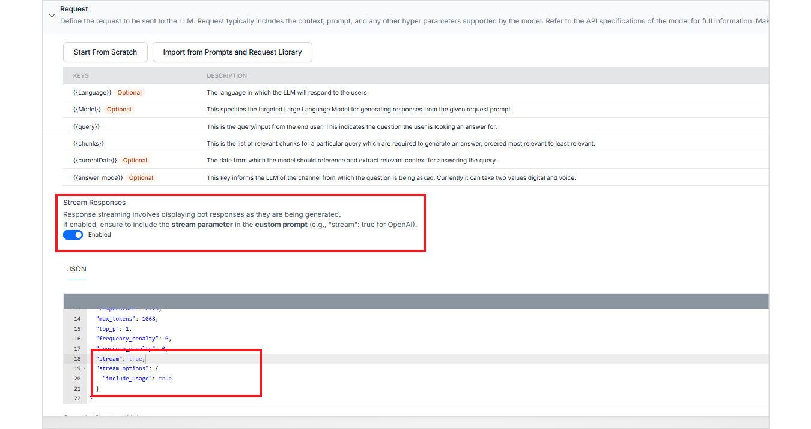

# Answer Streaming

Answer Streaming allows Search AI to return generative responses incrementally, token by token, instead of waiting for the full answer to be generated. This creates a faster, more interactive experience by reducing perceived latency, especially for longer answers.

Search AI supports real-time response streaming for conversations on Web/Mobile SDK Channels.

## Supported Models

Streaming is supported for OpenAI models using default prompts that are streaming-enabled. For Azure OpenAI models, streaming is supported only when custom prompts are used. Streaming is not supported for other model providers.


## Enabling Streaming

Streaming is enabled through prompt configuration.


### Default Prompts

For OpenAI models, streaming-enabled prompts are available by default. Selecting one of these prompts automatically enables response streaming.


### Custom Prompts

When using custom prompts, both of the following steps are required:

* Include the streaming option in the prompt as shown below:
 ```
    "stream": true,
    "stream_options": {
        "include_usage": true
  }
```
*  Turn on the Streaming toggle in the UI.




Both steps are required for streaming to take effect.


## Important Note

When streaming is enabled, Search API responses are not returned. Streaming is supported only through compatible SDK-based and channel integrations, where responses can be rendered progressively.
