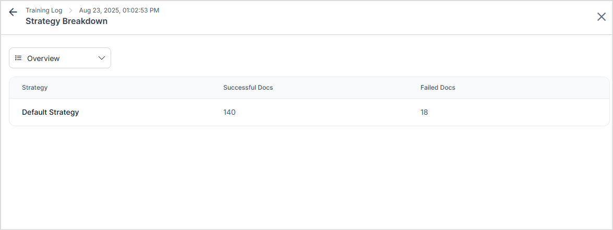
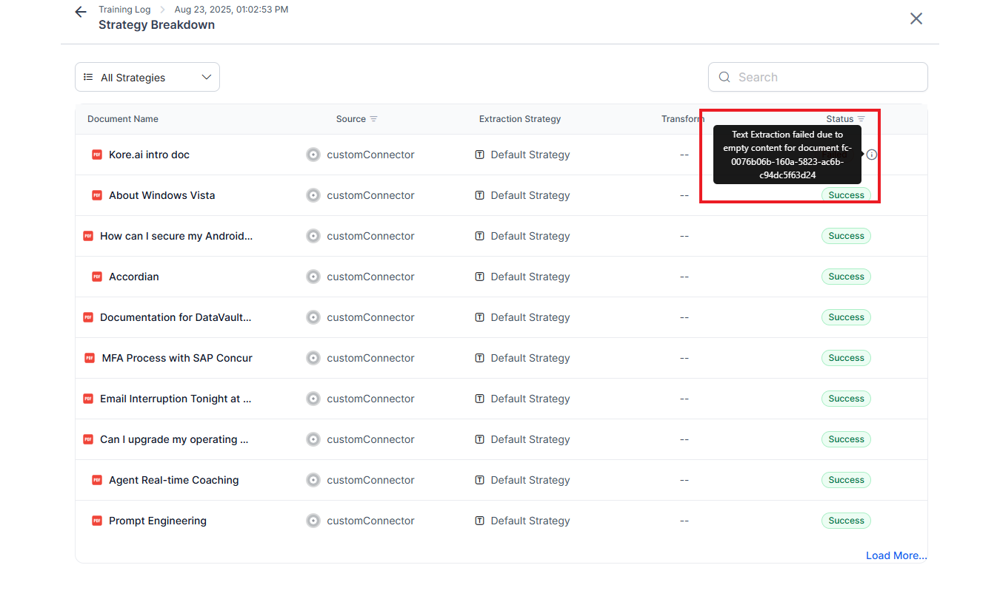

# Application Training 

Training the application is a crucial part of the process of preparing ingested content for search. Training the application involves applying design-time configurations, extracting chunks from the ingested content, and then generating embeddings from them to enable semantic search. Training is required each time content or configuration changes within the application. 

Training can be triggered in two ways:

* Automatically  - The system triggers training automatically when changes are detected. 
* Manually - via the "Train" action in the app

Two types of training can be performed on the content depending on the scope of changes:

* Full Training - Complete training of the app, irrespective of the changes. 
* Incremental Training - Training is done only for a limited set of content based on the type of changes made. 

## Automatic Training

The application automatically trains itself whenever new content is ingested into the application, in the form of file uploads, web crawls, or content from connectors. When auto training is initiated, it is indicated by a banner at the top of the application interface. 

* **Initial Ingestion**: If the content source is configured for the first time, such as setting up a web crawler for a web domain, the training is initiated automatically, and all ingested content is used to train the application. 
* **Incremental Updates**:  Whenever an update to the existing content source is identified, such as through the recrawling of a configured web source or resync with an existing connector, auto-training is initiated for only the updates in the content (i.e., additions, deletions, or modifications).

## Manual Training

Manual training can be used to force the application to retrain in specific scenarios. To perform a manual sync, use the **Train** button on the **[Extract ](https://platform.kore.ai/builder/app/extract)** or **[Vector Configuration](https://platform.kore.ai/builder/app/vectorconfiguration)** page. Upon initiating a manual train operation, the application identifies the configuration changes and the impacted content, and then initiates retraining of the impacted content only. 

Depending upon the configuration changes, a full or incremental training is initiated. The changes made as part of incremental training depends on the type of changes made:

* If the change is made **before the extraction stage** (e.g., connector configuration, schema, or extraction strategy), the system reprocesses all documents from the extraction and chunking stages onward.
* If the change is made **after the extraction stage** (e.g., during enrichment or embedding configuration), the system skips re-chunking and makes the required changes only in the processing pipeline thereafter. (enrichment and vector generation)

For instance, if a new extraction strategy is introduced for a particular document, the application is trained only for that document without affecting the chunks related to other content.  If, however, the embedding model is updated or embedding fields are modified, new embeddings are generated for all the content. 

Manual Training is required in the following scenarios. 

1. **Config Updates**: When design time config changes are made to the application, like changes in the extraction strategies or changes in vector configuration, a manual Train is required.
2. **Content Deletion**: When content is manually deleted, such as removing a file or a content source, manual training ensures the changes are reflected.

By leveraging both automatic and manual training mechanisms, the SearchAI application can be used to generate answers from the most up-to-date content.

*Note*:

* Training generates chunks from the ingested content. Hence, any manual edits made to the chunks will be overwritten during the application's training process if the application is retrained for the corresponding content. For instance, if manual edits are made to both chunks from document X and document Y and document X gets updated, training will overwrite the chunks only for document X. Hence, the edits in chunks from document Y will not be impacted.
* Currently, there is a known issue where manually resynchronizing a connector may not automatically initiate training, requiring manual triggering.

## View Training Logs

The application provides detailed training logs that provide document-level visibility into the training lifecycle, including insights into errors and failures. This makes it easier to monitor the progress effectively and identify and address issues promptly.

To view the logs, 

* Navigate to the Extract page.
* Click the drop-down with the Train option. 
* Click on View Training Logs. 

* The training logs provide insights into the type of training triggered, time of trigger, number of successful and unsuccessful docs, and the overall status of training.  If the training fails for any of the docs, the training is marked as failed.

Click on an individual training record to view the overview of the training process. It shows the total number of successful or failed docs as part of the training, grouped by extraction strategies.  

Select an **extraction strategy** from the drop-down menu to view the details for that strategy. The panel displays the individual pages extracted under the selected strategy, along with the following information for each page:

* Source – The origin of the page.
* Strategy – The extraction method applied.
* Status – The current training status of the page.

If training fails for a page, its status is marked as Failed. Additional failure details can be viewed by hovering over the info icon.

