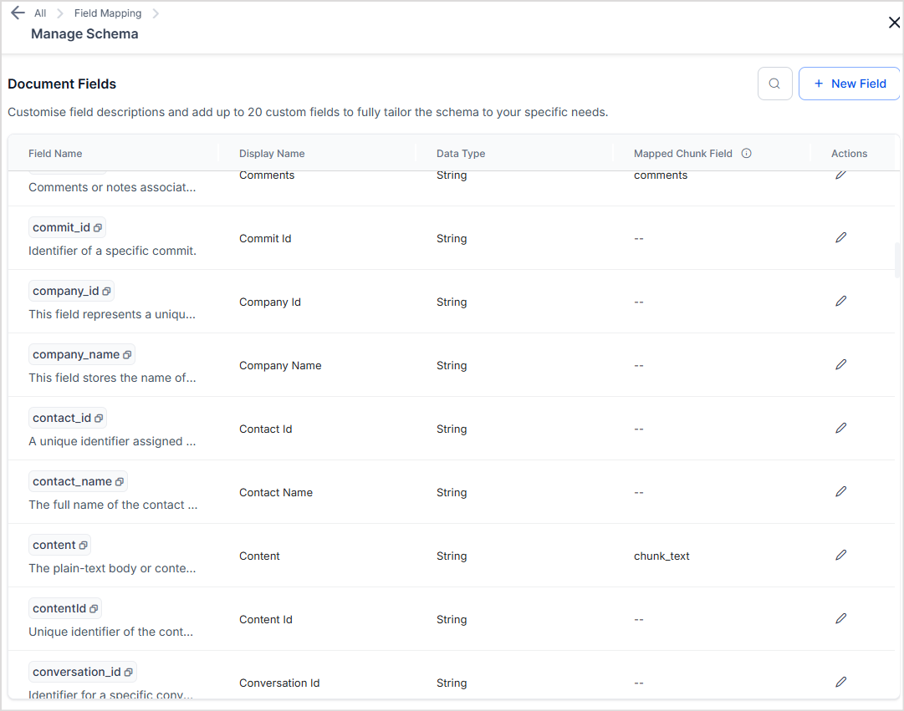
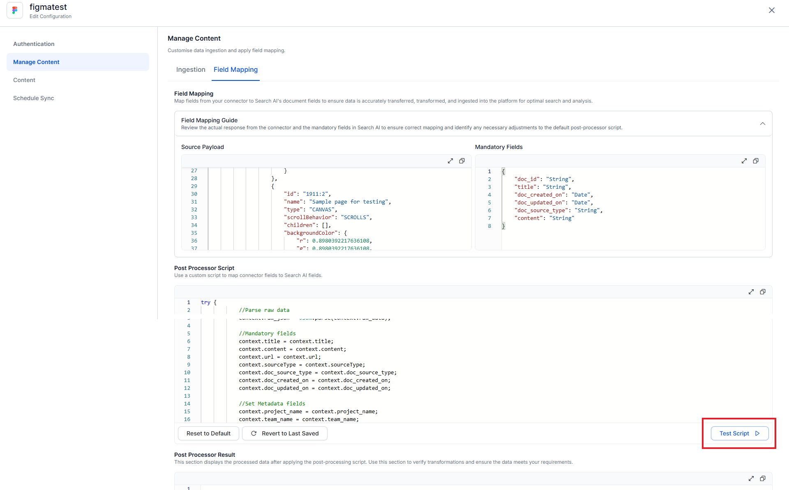
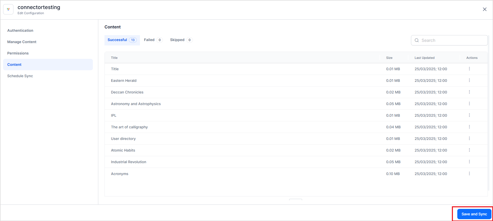
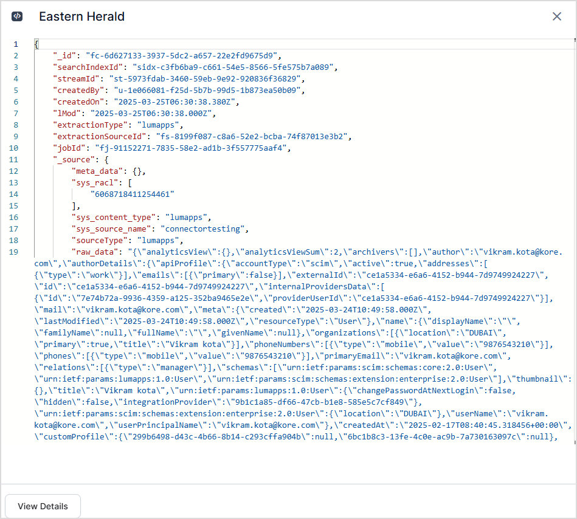
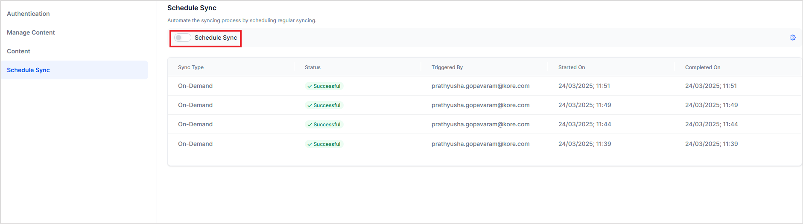
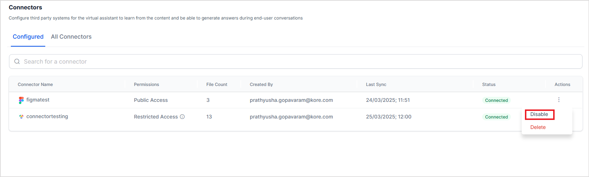
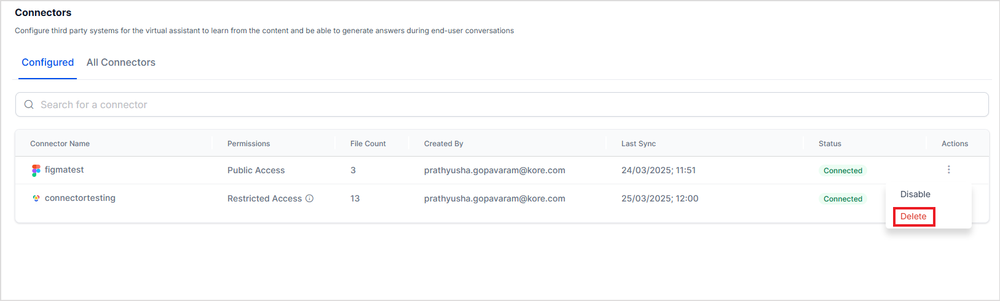

# Connectors

Connectors enable seamless content ingestion from a wide range of external sources, including third-party repositories like ServiceNow, Microsoft SharePoint, Atlassian’s Confluence, IBM Domino, etc,  allowing users to search across diverse data repositories from a unified interface.

Search AI provides in-built connectors to enable crawling specific third-party content management applications. Each connector is purpose-built to integrate with a specific platform, ensuring optimized data extraction and synchronization. The system supports configuring multiple connectors 
simultaneously, allowing the application to ingest and index data from several third-party sources in parallel.

By leveraging these connectors, organizations can deliver a unified and intelligent search experience.

## Understanding Connectors 

**Connectors** enable the application to integrate with third-party platforms by establishing a secure connection and facilitating seamless data ingestion through the APIs exposed by these applications. 

Once a connector is configured and authentication is completed:

* Data from the third-party application is ingested, indexed, and made available for search within Search AI.
* The **access privileges** of the content are maintained as per the privileges assigned to the user in the third-party repository. This ensures that only the files accessible to the user in the third-party application are visible to the user via Search AI as well. 

During each synchronization cycle, the connector performs **incremental updates**, retrieving only newly added or modified data based on change timestamps. Any content that has already been indexed and remains unchanged is skipped, ensuring efficient and optimized syncing.

Refer to the [Connector Directory](connectors/connector-directory.md) for the complete list of applications supported via connectors. For any specific integration requirements, please [contact us](https://kore.ai/contact-us/). 


## Authorization Support for Connectors

Search AI supports two types of authorization mechanisms. 

1. **Basic**: Basic Authorization involves sending a username and password with each request. These credentials are encoded and sent as a Base64-encoded string in the request header.
To use this type of authorization, provide your **username** and **password**. 

2. **OAuth 2.0**: The OAuth 2.0 framework allows third-party applications to access resources on behalf of a user without sharing the credentials. It involves the exchange of access tokens between the client application and the authorization server. 
To use this type of authorization mechanism, **register Search AI as an Inbound OAuth client in your application.**

OAuth 2.0 protocol defines several grant types for different use cases. Each grant type is designed to address specific authorization scenarios. 

Currently, SearchAI supports the following grant types:

1. **Client credentials Grant Type**: In this type, the client application(SearchAI, here) directly accesses the resources from the application. The client sends the client ID and client secret and gets an access token to access the resources directly. 
    For this type of authentication, provide the **client ID** and **client secret** generated after registering Search AI as an OAuth client application. 

2. **Authorization Code Grant Type**: In the type, the client application(SearchAI) accesses the resources on behalf of a user. Here’s how it works:
    * The client application (in this case, Search AI) initiates the OAuth flow by redirecting the user to the authorization server's authorization endpoint, where the user is prompted to log in to the authorization server.
    * If the login is successful, the authorization server redirects the user back to the client application's redirect URI, along with an authorization code.
    * Upon receiving the authorization code, the client application makes a POST request to the authorization server's token endpoint.
    * The authorization server verifies the authorization code, client credentials, and a redirect URI and responds with an access token and optionally a refresh token in the body of the response.
    * The client application can now use the access token to make authorized requests to the resources.
    * When an access token expires, the client application can use the refresh token to obtain the new token. 
    
    For this type of authentication, provide the **client credentials,** and on the consent screen, log in with your user credentials to access the resources.

3. **Password Grant Type**: This type of authorization allows the client application to exchange the user's credentials for an access token. Here’s how it works:
    * The client application authenticates itself to the authorization server by sending its client ID and client secret to the token endpoint.
    * The resource owner provides their credentials (username and password) directly to the client application. The client application sends a POST request to the authorization server's token endpoint, including the user's credentials.
    * If the user's credentials are valid and authorized to access the requested resources, the authorization server responds with an access token.
    * The client application can now use the access token to make authorized requests to the resource server on behalf of the user.

    For this type of authorization, provide the **client credentials** as well as **user credentials** with access to the required resources. 

## Managing Connectors

The Connectors are available under the Content Section. There are two tabs that list the configured connectors and the list of all supported connectors. On the UI, supported connectors are organized by the application type for easy navigation. Additionally, configured connectors are marked with a green indicator.


### Adding a content source using Connector

To set up a new connector, select the application connector from All Connectors and provide the configuration details. Choose it from the list of supported connectors and enter the configuration details. For comprehensive instructions on setting up connectors, refer to the [specific connector documentation](connectors/connector-directory.md).

**Setup Steps**

**Step 1: Authentication**: Provide the necessary authentication details (OAuth credentials, API keys, tokens, etc) to establish a connection with the external application. 

**Step 2: Manage Content**: Choose the type of content to be ingested. Apply filters as needed and optionally customize field mappings to align source fields with the Search AI schema. 

**Step 3: Permissions**: Select the permission level for the users to access content. 

**Step 4: Content**: Once synchronization is complete, view the ingested content in the application.

Initiate the first sync with the application. You can also configure a scheduler to enable automatic periodic synchronization.

**Step 5: Schedule Sync:** View the Sync log and optionally enable automatic periodic synchronization. 


### Authentication

The authentication varies depending on the third-party application with which the connection will be established. Refer to the specific connector for detailed instructions on authentication. 


## Managing Content

When configuring a connector, you can define the type of content to be ingested from the source application. By default, Search AI ingests all supported content types from the source. Most connectors support multiple content types, such as pages, articles, tasks, tickets, or documents, depending on the capabilities of the source system.

Refer to the specific connector documentation for a detailed list of supported content types (objects) for each integration.

### Unified Schema for Content Ingestion

All the data ingested into Search AI through connectors is stored using a Unified Schema. This schema provides a standardized structure for representing content, ensuring consistency across diverse data sources such as Google Drive, Salesforce, SharePoint, and others.

By default, content fields retrieved from external connectors are automatically mapped to the most relevant fields in the Unified Schema. This ensures that data from multiple systems follows a consistent format and can be processed and searched uniformly within Search AI. Use the Field Mapping section to update the mapping of fields in the third party application to that in Search AI for specific requirements.

In addition to the default fields, you can extend the Unified Schema by adding custom fields to meet specific business or integration requirements.

Learn more about the [Unified Schema and how to add custom fields to the schema here](connectors/unified-schema.md). 

### Selecting Content Type

Under the **Ingestion** section,

* Choose the content types you want to ingest. 
* For some connectors, you can apply **filters** to enable **selective ingestion**, for example, ingesting only content created within a specific timeframe, belonging to a particular category, or assigned to specific users.

Note: Filters are available only if supported by the specific connector.

### Field Mapping

Field Mapping allows you to align fields from the source application with [Search AI’s unified schema](connectors/unified-schema.md). This ensures that ingested data is accurately transferred, normalized, and indexed for optimal search and retrieval.

Use the Field Mapping section to map fields from the source (connector) to the corresponding Search AI fields. This ensures that content is accurately transferred, transformed, and indexed for optimal search and analysis.

**Source Payload:** Displays the raw response received from the source application and helps you identify available fields that can be mapped to Search AI fields.

**Mandatory Fields:** Lists the required fields that must be mapped for successful ingestion.

**Post-Processor Scripts**: You can further customize field mappings by writing post-processor scripts, which enable you to manipulate or transform fields dynamically during ingestion.

**Example**

If the source application stores the document creator as authorDetails.fullName, you can map it to Search AI's standard doc_created_by_name field using the following script:


```
context.doc_created_by_name = context?.raw_json?.authorDetails?.fullName;
```

**Manage Schema**: Use the Manage Schema option to view the application's schema fields and customize their descriptions. This helps users understand how and when to use this field. Learn more about [the default document fields here](connectors/unified-schema.md).



**New Field**: Define new custom fields to be ingested from the connector. custom fields (45 custom strings and 5 custom arrays). When creating a new field, define the following.
Field Name: The unique identifier for the field. It's used in scripts, APIs, and prompts. This has to be selected from the list of custom fields available(starting with cfs or cfa) and can't be edited after saving. 
Display Name: The name of the field visible in the UI.


Use the **Test Script** option to validate your transformation and verify the output after execution. Only after a successful test, the field mappings are updated. 



### Enabling RACL 

To enable or disable RACL in the supported connectors, go to the **Permissions** page and select one of the following.

* **Same users as in the source system (Restricted Access):** Automatically applies the same permissions from the source system, ensuring secure and seamless access to ingested content. If a scheduler is configured, permissions are updated at defined intervals to reflect changes in the source system.

* **Everyone(Public Access)**: Irrespective of the permissions in the third-party application, the ingested content is accessible to all SearchAI users. 

You can verify the permissions imported in the ingested content in the <code>sys_racl</code></strong>

field in the JSON view of the corresponding content.


For more information about RACL implementation in Search AI, see [RACL support](racl-support.md). 

## Permission Entities

This page displays the permission entities created during ingestion, based on the access information retrieved from the source system. Depending on the connector, a permission entity may represent a user group, user criterion, or any other access-control construct supported by the third-party application.

* Groups tab: Displays only those permission entities (groups) that the logged-in user belongs to or has access to in the source application.
* Users tab: Displays only the users who are part of the groups that the logged-in user is associated with.

Additionally, you can also view the users and permission entities who have access to a given document in the Content tab. Learn More. 

Currently, this feature is enabled only for the following connectors. 

* Google Drive
* Hubspot
* Jira
* Confluence Cloud
* Confluence Server
* BitBucket
* SharePoint
* Service Now
* Asana
* Guru
* JFrog
  

## Sync and Ingest Content

By default, when a connector is added, the content isn't ingested from the third-party application until a **Sync** operation is performed. You can either initiate a sync operation manually or schedule an automatic sync. 

Note that the files larger than 15MB are skipped during the ingestion process. Ensure your files are within the size limit for proper ingestion. To increase this limit, reach out to[ the support team](https://kore.ai/support/). 

To initiate a sync operation manually, click the **Save and Sync** button at any time. 




**Status of Ingested Content**

Upon initiating the synchronization operation, the ingestion of the content from the connector begins. You can monitor the progress of this operation by navigating to the **Schedule Sync** page. The ingested content is displayed under the **Content** page, which features three separate tabs based on the ingestion status of the content.

* Successful: This section lists content that has been successfully ingested.
* Failed: Here, you will find content that failed to ingest.
* Skipped: This section includes content that was bypassed during the ingestion process.

For both **failed** and **skipped** content, the application provides detailed logs that can be useful for troubleshooting. These logs include potential reasons for the failure and actionable steps to facilitate successful ingestion in the future. By reviewing these logs, users can gain insights into the issues encountered and take informed actions to resolve them, ensuring a smoother ingestion process moving forward.


Click on any of the content items to view the details of the ingested content. It provides an overview of the ingested content like file type, URL, preview of the content of the file, etc.

For each document, you can do the following.

* *View JSON* to see the details of the ingested content. The JSON view provides detailed information of the ingested content. The ingested content and its metadata are captured in standard fields in the Search AI application. For instance, the description or text of the ingested content is set in the content field, the access information is stored in the *sys_racl* field, sourceType suggests the source of the content, and the *meta_data* field captures the meta information of the ingested content. 

* *View Permissions* to see the list of users and groups who have access to the given document.  

**Stopping the Synchronization**

* If you manually stop synchronization using the *Stop Sync* option while the sync job is actively running, it will halt immediately. Any content that has already been ingested at the time of stopping will be available for search.
* If the sync job is queued when you select Stop Sync, the synchronization will be canceled and won't proceed.

**Schedule Sync**

You can also **schedule an automatic sync operation** for a future time. Automatic Sync ensures that the data stays up-to-date and also reduces the administrative overhead of performing manual sync regularly. 

The automatic sync can be scheduled as a one-time activity or to be performed at regular intervals. To schedule a sync operation, enable the **Schedule Sync** option and provide the date and time of the beginning of the event. 




To set up a recurring sync schedule, provide the synchronization frequency along with the date and time of the first sync operation. Once set, the scheduler automatically ingests content using the connector at regular intervals. 


To disable automatic synchronization at any time, use the **Schedule Sync** slider button. 

### Enabling/Disabling Connectors

After the connector is configured and the source is connected, you can enable or disable the connection temporarily. When a connector is disabled, sync operation is temporarily disabled. This may be useful for testing, particularly when there is more than one connector configured with your Search AIst application. 

!!!Note
    Disabling a connector doesn't delete the ingested content. It disables any future data synchronization operation with the third-party application. The sync is resumed based on the configuration after the connector is enabled again.

To enable or disable a connector, use the corresponding Action buttons.


### Removing the content source integrated using Connector 

To permanently remove a content source and corresponding connector from Search AI, go to the **Authorization tab** and click the **Remove Source** button. This will also **delete any data in Search AI indexed from the content source**.

